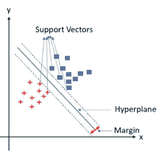
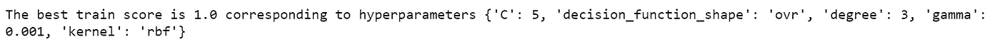
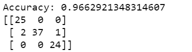
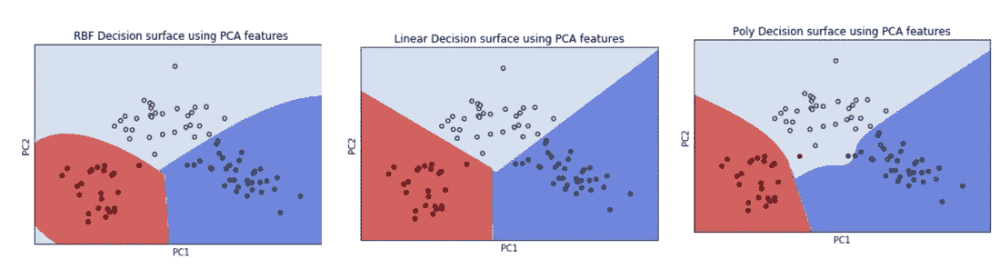

# 支持向量机综述

> 原文：<https://pub.towardsai.net/a-brief-overview-of-support-vector-machines-11ee4f77d819?source=collection_archive---------1----------------------->

## [机器学习](https://towardsai.net/p/category/machine-learning)

## 快速阅读支持向量机(SVM)及其在多类分类中的应用

你会学到的

*   什么是支持向量机？
*   SVM 的特点及其应用
*   不同 SVM 超参数的解释
*   多类分类的 Python 实现


作者图片

**SVM 算法是由弗拉迪米尔·n·瓦普尼克和阿列克谢耶维奇提出的。1963 年切尔沃嫩基斯**

> 支持向量机是一种监督机器学习算法，用于分类和回归。SVM 的目标是确定一个超平面，通过最大化两个类别的支持向量之间的间隔将数据点分成两个类别



作者图片

## 支持向量

**支持向量是数据集中最接近超平面**的数据点。移除支持向量将改变分隔两个类别的超平面，因为它们强烈影响超平面的位置和方向。支持向量是数据集的关键元素，因为 SVM 是基于它们构建的。

## 超平面和边缘

**超平面是以最佳方式将数据分成不同类别的决策边界**。选择超平面以最大化支持向量的余量。

## 支持向量机的特点

*   **SVM 既适用于回归，也适用于分类**
*   **它对边缘错误一侧的点的总距离进行惩罚，**特别是对于两个类的重叠数据点，从而限制边缘附近的错误分类
*   **SVM 可以处理高维数据**
*   **当类别之间有明确的界限时，SVM 运行良好**
*   **对异常值检测有效**
*   当样本数量少于数据集中的要素数量时，SVM 表现良好
*   **SVM 使用不同的内核，如线性、径向偏置函数、多项式或二次函数，扩展到线性和非线性可分离类**
*   它在大型数据集或数据集有更多噪声时效果不佳
*   支持向量机使用完整的数据集进行训练；因此训练是缓慢的；然而，预测更快

## SVM 的应用

SVM 用于**图像分类**

*   **面部表情分类**
*   **神经成像**
*   **识别植被类型**

SVM 也用于**归纳和直推模型的文本分类**

也在**生物信息学中用于蛋白质分类和癌症分类。**

## SVM 超参数

详细了解 [SVM 超参数](https://medium.datadriveninvestor.com/support-vector-machines-ae0ff2375479)

**正则化(C)** : s **指定允许的错误分类程度，并且**与边距成反比。更接近 0 的 C 值允许更多的错误分类，并且更高的 C 值将成功地对正确分离的训练数据点进行分类。

**内核:指定算法**中使用的内核类型，如线性、径向基函数(RBF)、多项式或 sigmoid。它将接受输入数据并将其转换成指定的内核。

**gamma:定义一个训练样本的影响达到多远；它是影响半径的倒数。当决定决策边界**时，较低的伽玛值将考虑远点，而较高的伽玛值将考虑近点。当内核是 rbf、poly 或 sigmoid 时适用。

**decision _ function _ shape:**通常用于多类分类。它有**两个值，“ovr”(一对静止)或“ovo”(一对一)**。**在“ovr”中，每个类都像二元分类器一样独立于所有其他类进行评估，而“ovo”采用一对类来训练分类器**。“ovo”总是被用作默认的多类策略。

## 使用支持向量分类器的多类分类

这里我们将使用葡萄酒数据集并运行支持向量分类器

加载葡萄酒数据集

```
**from sklearn import datasets
data_wine = datasets.load_wine()**
```

缩放输入数据并编码目标变量

```
**from sklearn.preprocessing import scale
X_scaled = scale(data_wine.data)**# Encoding our dependent variable:Quality column
**from sklearn.preprocessing import LabelEncoder
y_scaled = LabelEncoder()
y = y_scaled.fit_transform(data_wine.target)**
```

将数据拆分为定型数据集和测试数据集

```
**from sklearn.model_selection import train_test_split**# Split dataset into training set and test set
**X_train, X_test, y_train, y_test = train_test_split(X_scaled,y, test_size=0.5,random_state=0)**
```

通过混洗数据集将数据集分成 10 个连续的折叠。每个折叠将被用作一次验证，而剩余的 9 个折叠形成训练集

```
# creating a KFold object with 10 splits 
from sklearn.model_selection import KFold
folds = KFold(n_splits = 10, shuffle = True, random_state = 10)
```

使用 GridSearchCV 找到 SVC 超参数的最佳值:gamma、kernel、C、degree 和 decision_function_shape

```
**from sklearn import svm
from sklearn.metrics import confusion_matrix
from sklearn.model_selection import validation_curve, KFold, cross_val_score, GridSearchCV
clf = svm.SVC()
hyper_params = [ {'gamma': [1e-2, 1e-3, 1e-4],
                     'C': [2,5,10],
                  'decision_function_shape':['ovr', 'ovo'],
                  'degree':[3,5,10],
                  'kernel':['linear', 'rbf', 'poly'],
                 }]**
# set up GridSearchCV()
**model_gscv = GridSearchCV(estimator = clf, 
                        param_grid = hyper_params, 
                        scoring= 'accuracy', 
                        cv = folds, 
                        verbose = 1,
                        return_train_score=True)**# fit the model
**model_gscv.fit(X_train, y_train)**# printing the optimal accuracy score and hyperparameters
**best_score = model_gscv.best_score_
best_hyperparams = model_gscv.best_params_****print("The best train score is {0} corresponding to hyperparameters {1}".format(best_score, best_hyperparams))**
```



基于使用 GridSearchCV 方法确定的最佳超参数创建 SVC。拟合训练数据并在测试数据上运行准确性。

```
#Create a svm Classifier
**clf = svm.SVC(kernel='rbf',C=5,  decision_function_shape='ovr') # Linear Kernel**#Train the model using the training sets
**clf.fit(X_train, y_train)**#Predict the response for test dataset
**y_pred = clf.predict(X_test)**
#Import scikit-learn metrics module for accuracy calculation
**from sklearn import metrics**# Model Accuracy: how often is the classifier correct?
**print("Accuracy:",metrics.accuracy_score(y_test, y_pred))
print(metrics.confusion_matrix(y_true=y_test, y_pred=y_pred))**
```



为了可视化葡萄酒数据集上的超平面，我们首先使用 PCA 降低输入特征的维数。

```
**from sklearn.decomposition import PCA
pca_wine = PCA(n_components=2)
pca_wine_train = pca_wine.fit_transform(X_train)**
```

创建地块创建网格栅格和等高线的步骤

```
**import numpy as n
def make_meshgrid(x, y, h=.02):
    x_min, x_max = x.min() - 1, x.max() + 1
    y_min, y_max = y.min() - 1, y.max() + 1
    xx, yy = np.meshgrid(np.arange(x_min, x_max, h), np.arange(y_min, y_max, h))
    return xx, yy****def plot_contours(ax, clf, xx, yy, **params):
    Z = clf.predict(np.c_[xx.ravel(), yy.ravel()])
    Z = Z.reshape(xx.shape)
    out = ax.contourf(xx, yy, Z, **params)
    return out**
```

为简化的葡萄酒数据创建 SVC

```
#Create a svm Classifier
**clf_pca = svm.SVC(kernel='rbf',C=10,  decision_function_shape='ovr')** #Train the model using the training sets
**clf_pca.fit(pca_wine_train, y_train)**
```

使用 SVC 绘制数据点

```
fig, ax = plt.subplots()# title for the plots
**title = ('RBF SVC  on Wine dataset')**# Set-up grid for plotting.
**X0, X1 = pca_wine_train[:, 0], pca_wine_train[:, 1]
xx, yy = make_meshgrid(X0, X1)
plot_contours(ax, clf_pca, xx, yy, cmap=plt.cm.coolwarm, alpha=0.8)
ax.scatter(X0, X1, c=y_train, cmap=plt.cm.coolwarm, s=20, edgecolors='k' )
ax.set_ylabel('PC2')
ax.set_xlabel('PC1')
ax.set_xticks(())
ax.set_yticks(())
ax.set_title('Decision surface for Wine dataset using PCA reduced features')
plt.show()**
```



## 结论:

支持向量机是一种用于分类和回归的监督机器学习算法，它通过最大化两类支持向量之间的差值来识别超平面，以线性或非线性地将数据点分成两类。SVM 能很好地处理高维数据，对于离群点检测也很有效。

## 参考资料:

[](https://scikit-learn.org/stable/modules/svm.html#svm-kernels) [## 1.4.支持向量机-sci kit-学习 0.24.2 文档

### 支持向量机是一组用于分类、回归和分类的监督学习方法

scikit-learn.org](https://scikit-learn.org/stable/modules/svm.html#svm-kernels) 

[https://sci kit-learn . org/stable/modules/generated/sk learn . SVM . SVC . html](https://scikit-learn.org/stable/modules/generated/sklearn.svm.SVC.html)