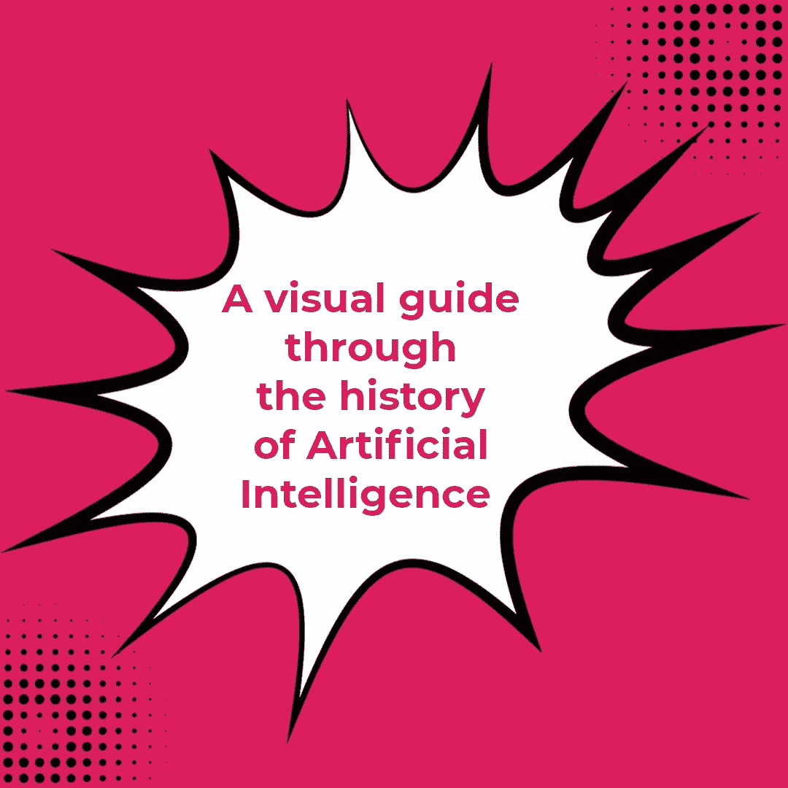
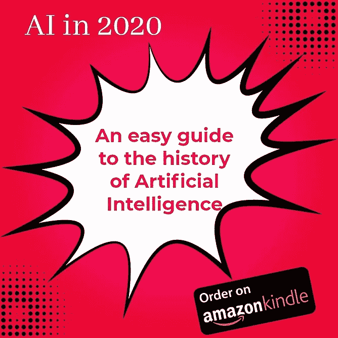
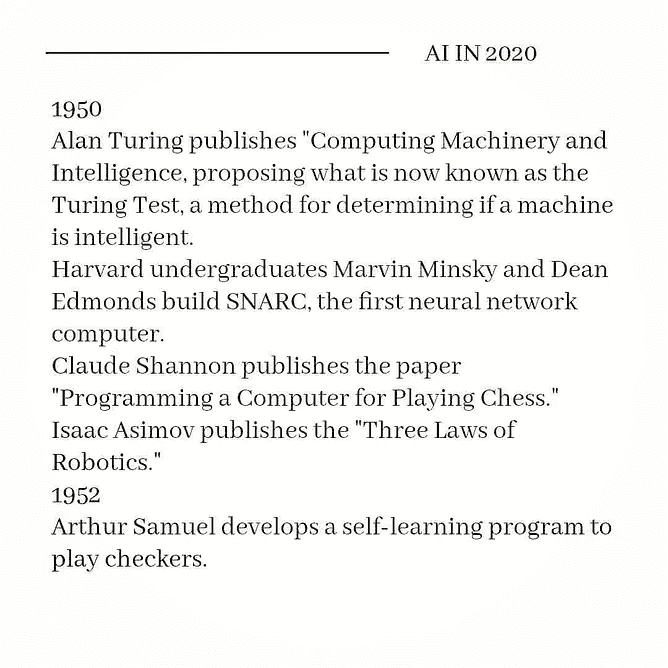
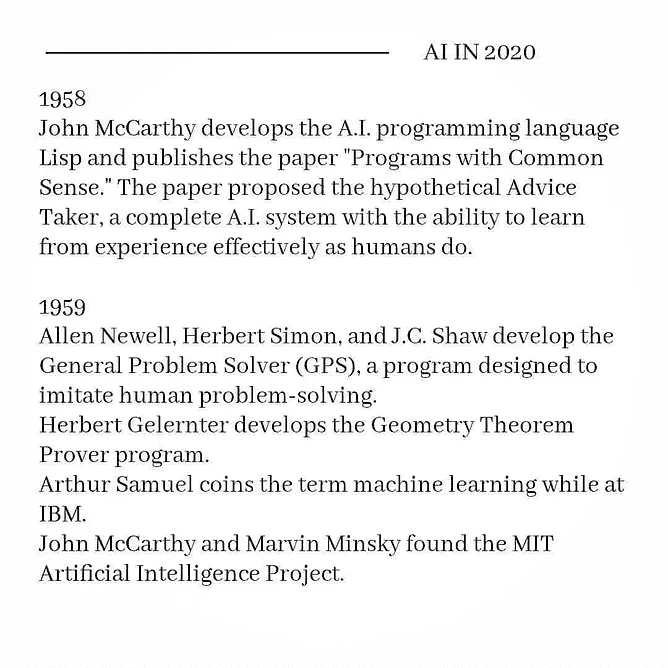
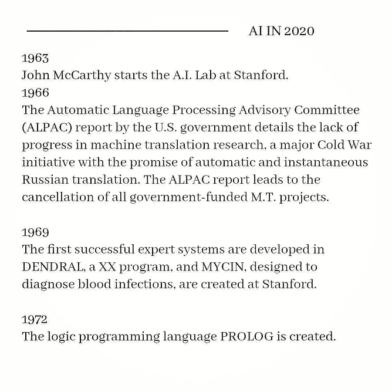
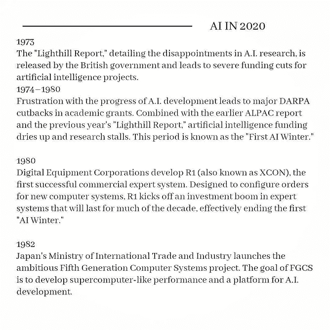
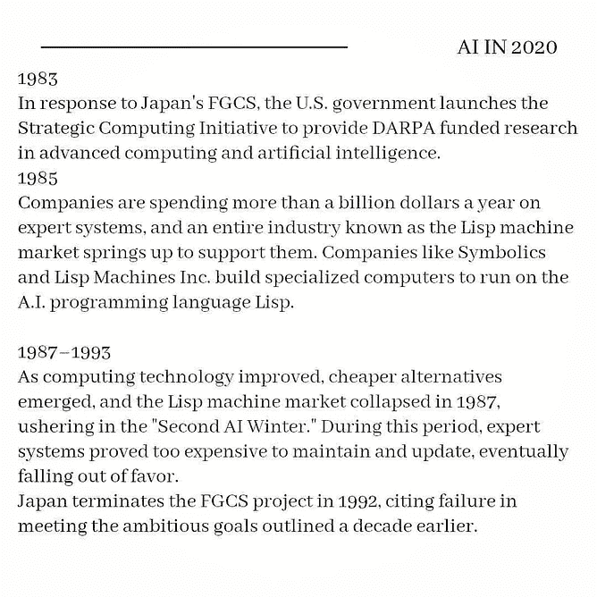
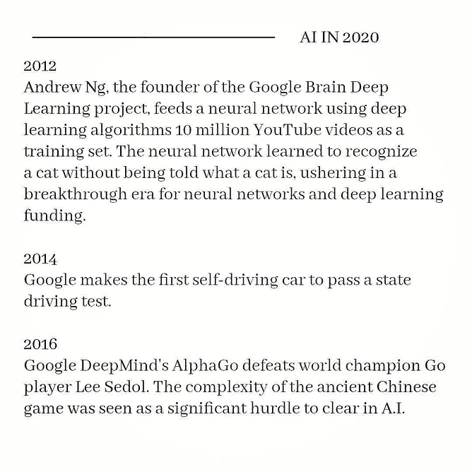
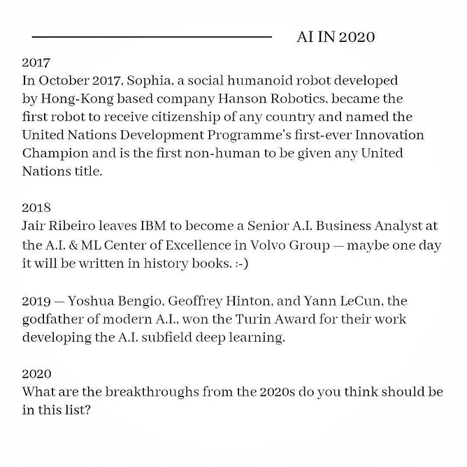

# 人工智能历史的(简要)视觉指南

> 原文：<https://pub.towardsai.net/a-brief-visual-guide-through-the-history-of-ai-c89f5e710516?source=collection_archive---------4----------------------->

来源:[我的 Instagram](https://www.instagram.com/beyond_the_ai/) 账号。

## [未来](https://towardsai.net/p/category/future)

## 人工智能突破 60 年的简短视觉之旅

当我们听说人工智能时，我们指的是我们在电影中看到的东西；它创造了一种感知，即人工智能是由机器人或来自另一个世界的东西驱动的。这种思维如今已经成型，适应新的应用，并在坚持人工智能的几个部门中成长。

平均而言，64 年前，人工智能起源于科学研究，没有想象它会有什么能力。

去年，我发表了一篇文章，快速回顾了自人工智能诞生以来一些最重要的事件和一些有趣的链接。

那篇名为“**人工智能历史简易指南”的文章在 Medium 上的浏览量和阅读量高得惊人。最近，我决定将它加入我的一本书，在亚马逊 Kindle 上出版，题为“[**2020 年的人工智能——人工智能的一年”。**](https://www.amazon.com/dp/B08RSJRNSN) “这是我收集的关于 AI 的最好的文章。**

**我最近决定通过一个简单而直接的视觉指南来重新定位这篇文章，介绍自 1943 年以来人工智能领域最重要的突破。我已经在我的 Instagram 账号上发布了。**

**当然，我想在这里与我的媒体朋友分享它，因为我认为它对许多正在发现人工智能的第一步以及了解一项技术而不是了解其历史的更好方法的人来说可能是有趣的？**

# **什么是人工智能？**

**人工智能的许多定义都基于流程改进和在各个领域采取行动的能力，包括卫生和教育以及农业，为企业及其合作者提供更高质量的生活。**

**虽然在许多情况下，人工智能最好被描述为一个以任务或结果为中心的实体，它调整自己的行为以满足其目标，但人工智能会根据它收到的数据不断重新编程。**

**人工智能可以被视为智能执行技术的总称，这是一种自适应技术，允许机器在变化或模糊的环境中完成任务。**

**在每天与人工智能一起学习、阅读、写作和工作之后，我的定义和贡献可能是这样的:**

> **“人工智能是一种模仿人类思维的技术，允许机器自主行动，并执行类似于人类智能的功能，如感知、学习、推理和行动的能力。”——贾伊尔·里贝罗。**

**在我名为“ [**的文章中，这些是你今天能读到的对人工智能最好的定义。**](https://medium.com/swlh/these-are-the-best-definitions-of-artificial-intelligence-you-can-read-today-7c53c0e38584) “我探索了人工智能的一些定义，从商业和现实世界的角度来看，我认为最准确和最相关的人工智能定义。**

# **艾的诞生**

**很久以前，人工智能历史上的几位主角，都有着同一个目标:创造一台能够像人一样思考和行动的机器。**

**艾伦·图灵就是其中之一，他发现了一种测试他的机器的方法。它的目的是进行评估，并确定机器是否可以在书面对话中冒充人类。这就是众所周知的图灵测试，它是人工智能历史上的一个分水岭。**

**人们认为，人工智能的历史始于第二次世界大战后，科学家艾伦·图灵和研究人员马文·明斯基、约翰·麦卡锡、艾伦·纽厄尔和赫伯特·a·图灵。**

**1956 年，人工智能被投入到人工智能研究领域的创建中。他们的目标是创造新事物，当他们在达特茅斯会议上正式提出开发智能机器的任务时，科学很快得到了认可。**

**经过多年的研究和开发，人工智能在 1964 年创造了世界上第一个聊天机器人，在历史上又向前迈出了重要的一步。伊莱扎的功能是在数据和算法的指导下自动进行对话，这些数据和算法基于模仿心理分析师的关键词。**

**人工智能能够通过开发创新的解决方案来创造机器，以寻求人类的神经能力。随着算法和数据驱动语言的使用，它得到了惊人的改进。**

************

**来源:[我的 Instagram](https://www.instagram.com/beyond_the_ai/) 账号。**

************

**来源:[我的 Instagram](https://www.instagram.com/beyond_the_ai/) 账号。**

************

**来源:[我的 Instagram](https://www.instagram.com/beyond_the_ai/) 账号。**

# **今日 AI**

**经过这么长时间，我们现在在人工智能方面取得了重大进展。我们生活在这样一个时代，在我们不知情的情况下，它已经根深蒂固地存在于我们的环境中——我们每天都在使用它并从中学习。**

**人工智能是我们日常任务、企业、流程优化和安全系统中的一个伟大盟友，并在健康和最显著的出勤方面得到认可。**

**苹果的 Siri 和微软的 Cortana 等个人助理就是这种参与我们日常生活的例子。我们通过智能手机和电脑直接交流。**

**人工智能无疑已经进步，允许算法以不同于人类的方式学习和思考。人工智能利用机器学习自行创建了应用程序。**

**通过访问算法并从这些算法开始，机器在没有人类干预的情况下发展，这也与深度学习有关，深度学习从大量数据开始，并生成人类的思想和语言。**

# **人工智能的未来**

**而未来呢？我希望人工智能将获得更大的市场空间，允许它开发新的理论和新兴的大型应用程序。**

**在机器学习、神经网络、深度学习、认知计算和自然语言过程的帮助下，这种进化可能会逐渐发生。**

**市场机会、新解决方案的出现，以及与人和培训的密切关系。**