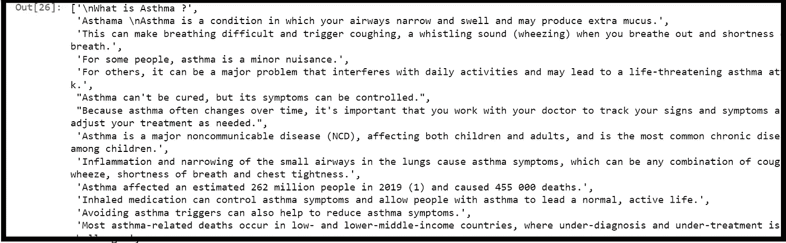
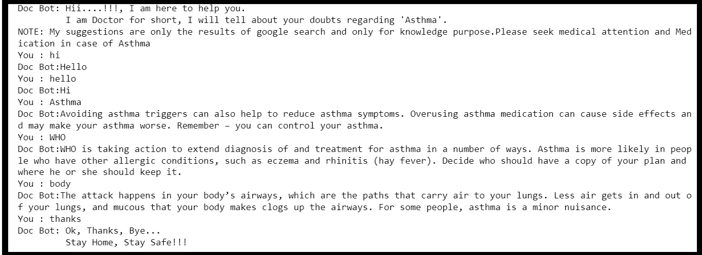

# 代码行数最少的聊天机器人

> 原文：<https://pub.towardsai.net/a-chatbot-with-the-least-number-of-lines-of-code-a42e3ba9d974?source=collection_archive---------1----------------------->

## 最简单的聊天机器人和自然语言处理


[亚历山大·奈特](https://unsplash.com/@agk42?utm_source=medium&utm_medium=referral)在 [Unsplash](https://unsplash.com?utm_source=medium&utm_medium=referral) 上拍照

自然语言处理包括使用自然语言创建有意义的句子和短语。文本实现，句子规划，文本规划都有涉及。规划文本包括在知识库中查找相关信息。规划一个句子包括选择必要的单词，创造有意义的短语，并建立句子的语气。将句子计划翻译成文本的过程称为文本实现。聊天机器人是一种试图用自然语言与人类用户对话的计算机程序。聊天机器人是自然语言处理(NLP)最大的应用之一。NLP 分为三个基本部分:

*   **自然语言生成(NLG)**
*   **自然语言理解(NLU)**
*   **自然语言交互(NLI)**

这个博客的目的是用很少的几行代码制作一个可行的聊天机器人。让我们开始建造吧。

**导入库:**

我假设您已经安装了 python 解释器。导入基本库，如 [pandas](https://pandas.pydata.org/) 和 [NumPy](https://numpy.org/) ，用于数据处理和数据操作。然后我用 [nltk【自然语言工具包】](https://www.nltk.org/)进行单词和句子数据操作。

```
import pandas as pd
import matplotlib.pyplot as plt
import numpy as np
import nltk
import random
import string
import warnings
warnings.filterwarnings('ignore')
```

让我们下载'[punkt](https://www.nltk.org/_modules/nltk/tokenize/punkt.html)' package。它利用无监督算法从文本中创建一个句子列表，以查找开始句子的单词、搭配和缩写。

```
nltk.download('punkt',quiet = True)
```

**聊天机器人数据集:**

我正在创建这个聊天机器人，完全致力于治疗哮喘。因为人们对哮喘可能有很多疑问，而专用机器人是解决疑问的最佳方式。这个可以当做医疗机器人。

对于这个特定的聊天机器人，数据集是一个文本文件，其中包含所有与哮喘相关的信息。我们可以在这里直接使用网络报废，但为了简单起见，我已经从政府和最值得信任的网站上收集了关于哮喘的数据，如下所述:

1.  [梅奥诊所](https://www.mayoclinic.org/diseases-conditions/asthma/symptoms-causes/syc-20369653#:~:text=Asthma%20is%20a%20condition%20in,asthma%20is%20a%20minor%20nuisance.)
2.  [世界卫生组织【世卫组织】](https://www.who.int/news-room/fact-sheets/detail/asthma)
3.  [疾病控制和预防中心【CDCP】](https://www.cdc.gov/asthma/faqs.htm)

虽然我只选择了 3 个网站，但是你可以尽可能多的选择，让与单词相关的预测更加准确。报废后，数据将存储在一个单独的文本文件中，供进一步处理。

```
with open("Asthma_data_1.txt",'r',encoding = 'utf8') as f:
    Data = f.read()
    print(Data)
```

因为预处理对于数据集来说非常重要，它可以使数据集更加纯净，并为模型的处理提供最先进的技术，从而获得更好的结果。自然语言处理允许我们做记号化和词条化。

**标记化**:将每个句子中的单词标记成它们的词根，这样它们将作为组块来处理。

**词汇化**:词汇化的工作原理和标记化一样，但是区别在于它转换成一个有意义的单词。这意味着将它们转换成更小的块，然后使它们成为有用或可理解的单词。所以我们在这里做记号化。我们可以直接从 nltk 导入 [sent_tokenize](https://www.nltk.org/api/nltk.tokenize.html) 。

```
# Tokenizing the data
from nltk import sent_tokenize
Data = sent_tokenize(Data)
Data
```



这就是你的数据被标记的方式

现在是时候开始第一次对话了。我们将指定一些日常生活中使用的单词来开始对话。就像问候一样。有很多地方可以改进下面的代码，比如添加尽可能多的问候语，然后用小写字母表示问候语，以便于处理。但现在，我只是指定几个词来展示演示。

```
# This function generates the greeting responce
Corpus = Data
def greeting_responce(Text):
    # Lowering the text
    Text = Text.lower()  

    # Bot greetings responce
    bot_greeings = ['Namaskar','Hi','Hey there','Namaskar','Hello',]

    # User greetings
    user_greetings = ['hi','hey','hello','ola','greetings','wassup','namaskar']

    for word in Text.split():
        if word in user_greetings:
            return random.choice(bot_greeings)
```

## 定义索引排序的函数

```
def index_sort(list_var):

    length = len(list_var)

    list_index = list(range(0,length))

    x = list_var
    for i in range(length):
        for j in range(length):
            if x[list_index[i]] > x[list_index[j]]:
                #Swap
                Temp = list_index[i]
                list_index[i] = list_index[j]
                list_index[j] = Temp

    return list_index
```

现在我们到了创建聊天机器人的最后阶段。这尤其是为了映射用户要求的单词和数据库中最相似的单词之间的相似性。我们在这里使用[余弦相似度](https://www.sciencedirect.com/topics/computer-science/cosine-similarity#:~:text=Cosine%20similarity%20measures%20the%20similarity,document%20similarity%20in%20text%20analysis.)。

```
#Create bot response
from sklearn.feature_extraction.text import CountVectorizer,TfidfVectorizer
from sklearn.metrics.pairwise import cosine_similaritydef bot_response(user_input):
    user_input=user_input.lower()
    Corpus.append(user_input)
    bot_response=''
    cm=TfidfVectorizer().fit_transform(Corpus)
    similarity_scores=cosine_similarity(cm[-1],cm)
    similarity_scores_list=similarity_scores.flatten()
    index=index_sort(similarity_scores_list)
    index=index[1:]

    response_flag=0

    j = 0
    for i in range(len(index)):
        if similarity_scores_list[index[i]]>0.0:
            bot_response=bot_response+''+ Corpus[index[i+1]] + ' ' + Corpus[index[i+2]] + ' ' + Corpus[index[i+3]]
            response_flag=1
            j=j+1
        if j > 2:
            break

        if response_flag==0:
             bot_response=bot_response+''+"I apologize I dont understand"

        Corpus.remove(user_input)
        return bot_response
```

**交互:**

现在最后一段代码是你可以开始和聊天机器人聊天的地方。你可以在聊天之前写一些基本的语句，让用户知道这个聊天机器人在做什么。

```
#Start the chat with Chatbot
print("Doc Bot: Hii....!!!, I am here to help you.")
print("         I am Doctor for short, I will tell about your doubts regarding 'Asthma'. ")
print("NOTE: My suggestions are only the results of google search and only for knowledge purpose.Please seek medical attention and Medication in case of Asthma")
exit_list=['exit','bye','see you later','quit','break','no','thanks','thanks alot']
while(True):
    user_input=input("You : ")
    if user_input.lower() in exit_list:
        print("Doc Bot: Ok, Thanks, Bye...") 
        print("         Stay Home, Stay Safe!!!")
        break
    elif user_input.lower() in ['ok','hmm','its ok']:
        print('Doc Bot: Can I tell you more about it')
    elif user_input.lower() in ['yes','ok']:
        print('Doc Bot:'+bot_response(user_input))
    else: 
     if greeting_responce(user_input) != None:
        print('Doc Bot:'+ greeting_responce(user_input))
     else:
        print("Doc Bot:"+bot_response(user_input))
```



聊天结果[作者图片]

Bot 能遇到的不认识的词种类繁多。这就是数据发挥重要作用的地方。医疗机器人在生产前经过非常严格的测试，因为它们提供了非常宝贵的信息，必须由适当的人来验证。下一个策略可以是使用 GUI 工具或托管网站来托管这个 bot。那完全是用户的选择。所以用最少的代码，我们创建了一个简单的聊天机器人。

**如何测试 bot？**

我遵循的测试方法是创建一个谷歌表单，并发送给你所有的亲人/同事/朋友。该表格将询问他们关于哮喘的疑问，以及你可以在机器人上测试的最奇怪的问题。回答后就能明白是否需要更多的数据了！这将是对机器人的真实测试。

## 如果你觉得这很有见地

如果你觉得这篇文章很有见地，请关注我的 [**Linkedin**](https://www.linkedin.com/in/chinmay-bhalerao-6b5284137/) 和 [**medium**](https://medium.com/@BH_Chinmay) 。你也可以 [**订阅**](https://medium.com/@BH_Chinmay) 在我发表文章的时候得到通知。让我们创建一个社区！感谢您的支持！