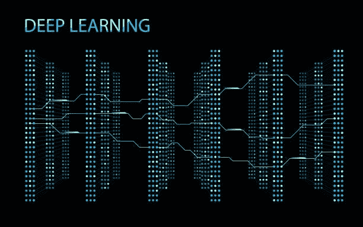

# 深度学习算法的备忘单:类型、应用和示例

> 原文：<https://pub.towardsai.net/a-cheat-sheet-to-deep-learning-algorithms-types-applications-and-examples-2619bfbb47fc?source=collection_archive---------1----------------------->

[**深度学习**](https://www.istockphoto.com/)

# 介绍

**深度学习**是机器学习的一个子集，涉及训练人工神经网络执行任务。神经网络的灵感来自人脑的结构和功能，由多层相互连接的“神经元”组成，可以处理和传输信息。

深度学习算法主要有三种类型:监督的、非监督的和半监督的。

# **有监督的深度学习**

**监督深度学习算法**用于根据一组输入特征预测目标变量。这些算法在带标签的数据集上训练，这意味着提供了输入数据和相应的输出标签。该算法通过最小化预测标签和实际标签之间的差异来学习将输入数据映射到输出标签。

受监督的深度学习算法的例子包括:

*   **卷积神经网络(CNN):**CNN 是一种特别适合图像分类任务的神经网络。它们的工作原理是将输入图像分成小块或“特征”并分别进行分析。
*   **递归神经网络(RNNs):** RNNs 是一种神经网络，用于处理时序数据或自然语言。它们有能力“记住”以前的输入数据，并使用它来通知后续数据的处理。

# 无监督深度学习

**无监督的深度学习算法**当我们有一个未被标记或分类的数据集时使用。这些算法用于发现数据中的模式和结构，并将相似的观察结果组合在一起。

无监督深度学习算法的例子包括:

*   **自动编码器:**自动编码器是一种神经网络，它被训练来从低维表示中重建输入数据。它们的工作原理是将输入数据编码到一个隐藏层中，然后将其解码回原始维度。
*   **生成对抗网络(GANs):** GANs 是一种神经网络，它被训练来生成与给定数据集相似的新数据。它们由两个网络组成:生成新数据的生成器网络和试图将生成的数据与真实数据区分开来的鉴别器网络。

# 半监督深度学习

当我们有一个部分标记或分类的数据集时，使用半监督深度学习算法。这些算法利用标记和未标记的数据来学习数据中的模式。

半监督深度学习算法的例子包括:

*   **自我监督学习:**自我监督学习是一种深度学习，涉及训练神经网络仅使用输入数据和“自我监督”信号来执行任务。例如，自我监督学习算法可能被训练为基于当前帧预测视频中的下一帧。
*   **迁移学习:**迁移学习是一种使用预先训练好的神经网络作为新任务起点的技术。预训练网络通常在用于类似任务的大数据集上训练，而新网络在用于目标任务的较小数据集上训练。这允许新的网络将从预先训练的网络学到的知识“转移”到新的任务。

# 选择正确的深度学习算法

在为特定问题选择深度学习算法时，考虑您正在处理的数据类型、任务的复杂性以及可用资源(例如，计算能力、时间、数据)非常重要。例如，如果您有一个大型数据集，并且任务相对简单，那么 CNN 等受监督的深度学习算法可能是一个不错的选择。另一方面，如果你有一个小数据集或任务更复杂，半监督或无监督的深度学习算法可能更适合。考虑数据集的具体特征也很重要，例如数据的大小和维度、要素的类型以及噪声或缺失值的级别。

一般来说，深度学习算法非常灵活，可以应用于广泛的问题，包括图像和视频识别，自然语言处理和语音识别。然而，它们确实需要大量的数据和计算资源，并且可能不是每个问题的最佳选择。

# 摘要

**深度学习是一种强大的人工智能工具，涉及训练神经网络进行学习，并根据数据做出决策。深度学习算法主要有三种:有监督的、无监督的、半监督的**。特定问题的正确算法将取决于数据的特征和任务的复杂性。 ***通过正确的方法，深度学习算法可以用于解决各种领域的广泛问题。***