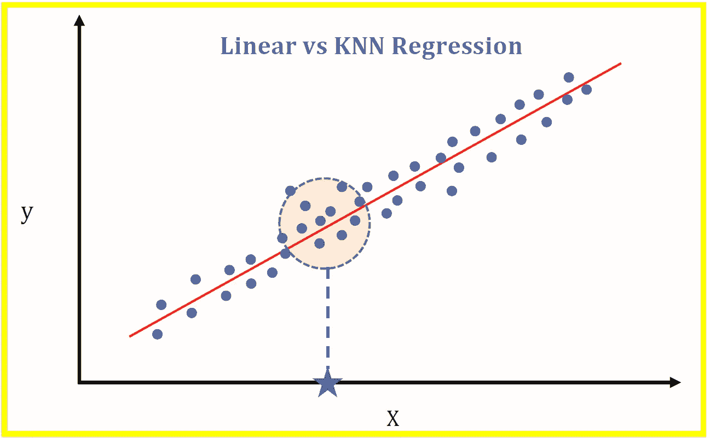
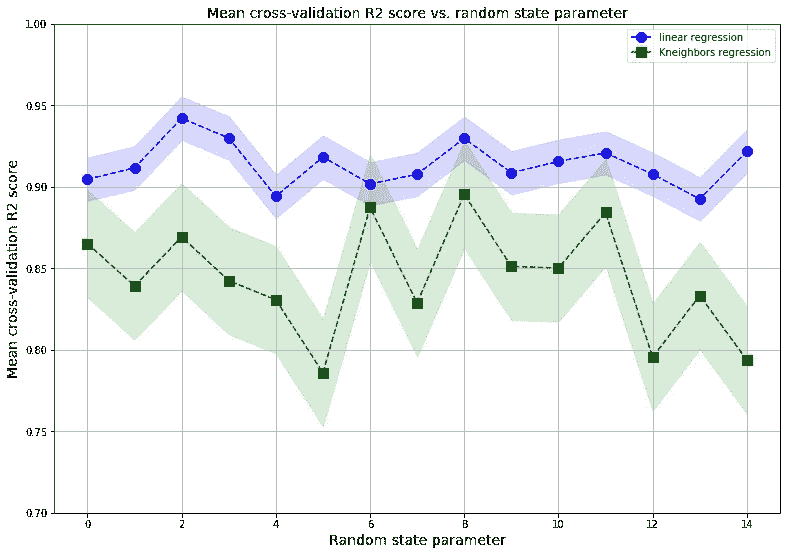

# 线性回归和 KNN 回归的比较研究

> 原文：<https://pub.towardsai.net/a-comparative-study-of-linear-and-knn-regression-a31955e6263d?source=collection_archive---------1----------------------->



Benjamin O. Tayo 的图片

## 机器学习

## 使用游轮数据集比较监督学习(连续目标)的两种最流行算法的预测能力

## [Vivek Chaudhary](https://medium.com/u/27ca1e213060?source=post_page-----a31955e6263d--------------------------------) 和 [Benjamin Obi Tayo 博士](https://medium.com/u/3a025d440e6b?source=post_page-----a31955e6263d--------------------------------)

# 一.导言

在本文中，我们报告了两种最流行的监督学习(连续目标)算法的预测能力的比较研究结果，即线性回归和 k-最近邻(KNN)回归。线性回归是一种参数模型，即数据集用于计算权重因子(回归参数)，权重因子必须应用于要素以预测目标变量(见上图)。KNN 回归是一种插值算法，它使用 k 近邻来估计目标变量。

与 KNN 回归相比，线性回归的优势在于线性回归易于解释，因为权重因子可以告诉我们哪些特征是主要的预测因素。KNN 回归的一个优点是它不需要特征和目标变量之间的任何相关性(线性关系),这是线性回归的一个要求。KNN 回归实现起来很慢，因为它依赖于计算所有矢量实例之间的距离，对于包含数百个要素和数千个观测值的大型数据集来说，这可能非常耗时。

# 二。数据集和模型选择

在我们的研究中，我们使用了游轮数据集[**cruise _ ship _ info . CSV**](https://github.com/bot13956/ML_Model_for_Predicting_Ships_Crew_Size)**。**在之前的文章中( [**特征选择和使用协方差矩阵图**](https://medium.com/towards-artificial-intelligence/feature-selection-and-dimensionality-reduction-using-covariance-matrix-plot-b4c7498abd07) 的维数减少)，显示了在数据集中的 6 个预测特征[' **年龄**'、**吨位**'、**乘客**'、**长度**'、**客舱**'、**乘客密度** ]中，如果我们假设重要特征具有相关性 那么目标变量“**乘员**”与 4 个预测变量:“**吨位**”、“**乘客**”、“**长度**、“**车厢**”强相关。

# 三。线性和 K 近邻回归的 Sklearn 实现

我们将使用 sklearn 进行建模。对于 KNN 回归，我们对参数 ***n_neighbors*** 的不同值进行了几次计算。我们发现 R2 分数相当稳定，不会随着 n_neighbors 的增加而波动太大。我们发现 n_neighbors = 3 比其他值略高，因此我们采用 n_neighbors = 3 进行计算。

**III A .导入必要的库**

```
import numpy as npimport pandas as pdimport matplotlib.pyplot as pltfrom sklearn.metrics import r2_scorefrom sklearn.model_selection import cross_val_scorefrom sklearn.model_selection import train_test_splitfrom sklearn.preprocessing import StandardScaler

from sklearn.linear_model import LinearRegressionfrom sklearn.neighbors import KNeighborsRegressorfrom sklearn.pipeline import Pipelinepipe_lr = Pipeline([('scl', StandardScaler()),
                    ('slr', LinearRegression())])knn_lr = KNeighborsRegressor(n_neighbors = 3)
```

## 读取数据集并选择预测值和目标变量

```
df=pd.read_csv("cruise_ship_info.csv")cols_selected = ['Tonnage', 'passengers', 'length', 'cabins','crew']X = df[cols_selected].iloc[:,0:4].values  

y = df[cols_selected]['crew'] sc_y = StandardScaler()train_score_lr = []train_score_knn =  []
```

## 三. c .模型建立和评估

```
n = 15for i in range(n): X_train, X_test, y_train, y_test = train_test_split( X, y,  
                                      test_size=0.3, random_state=i) y_train_std = sc_y.fit_transform(y_train[:, 
                                      np.newaxis]).flatten() train_score_lr = np.append(train_score_lr, 
                               np.mean(cross_val_score(pipe_lr, 
                               X_train, y_train_std, 
                               scoring ='r2' , cv = 10))) train_score_knn = np.append(train_score_knn, 
                                np.mean(cross_val_score(knn_lr, 
                                X_train, y_train_std, 
                                scoring ='r2' , cv = 10)))train_mean_lr = np.mean(train_score_lr)train_std_lr = np.std(train_score_lr)train_mean_knn = np.mean(train_score_knn)train_std_knn = np.std(train_score_knn)print('R2 train for lr: %.3f +/- %.3f' %
                             (train_mean_lr,train_std_lr))print('R2 train for knn_lr: %.3f +/- %.3f' % 
                             (train_mean_knn,train_std_knn))
```

这段代码的输出是:

```
R2 train for lr: 0.914 +/- 0.013R2 train for knn_lr: 0.843 +/- 0.033
```

我们清楚地看到，线性回归的总体 R2 分数优于 KNN 回归。

## III D .不同随机状态下平均交叉验证 R2 评分变化的可视化

```
plt.figure(figsize=(15,11))plt.plot(range(n),train_score_lr,color='blue', linestyle='dashed', 
         marker='o',markerfacecolor='blue', markersize=10, 
         label='linear regression')plt.fill_between(range(n),
                 train_score_lr + train_std_lr,
                 train_score_lr - train_std_lr,
                 alpha=0.15, color='blue')plt.plot(range(n),train_score_knn,color='green', linestyle='dashed', 
         marker='s',markerfacecolor='green', markersize=10, 
         label = 'Kneighbors regression')plt.fill_between(range(n),
                 train_score_knn + train_std_knn,
                 train_score_knn - train_std_knn,
                 alpha=0.15, color='green')plt.grid()plt.ylim(0.7,1)plt.title ('Mean cross-validation R2 score vs. random state 
            parameter', size = 14)plt.xlabel('Random state parameter', size = 14)plt.ylabel('Mean cross-validation R2 score', size = 14)plt.legend()plt.show()
```



图片由 [Vivek Chaudhary](https://medium.com/u/27ca1e213060?source=post_page-----a31955e6263d--------------------------------) 和 [Benjamin Obi Tayo 博士](https://medium.com/u/3a025d440e6b?source=post_page-----a31955e6263d--------------------------------)拍摄

该图显示了作为随机状态参数的函数绘制的平均交叉验证 R2 评分。浅蓝色和浅绿色阴影区域显示了计算的 R2 分数的 68%置信区间。我们看到，平均而言，线性回归的 R2 得分高于 KNN 回归，且方差较小。

# 四。总结和结论

总之，我们报告了使用游轮数据集对线性回归和 KNN 回归进行比较研究的结果。我们表明，对于给定的数据集，线性回归比 KNN 回归表现更好。在机器学习中，在选择最终模型之前比较几个模型总是好的。

本文的数据集和 Jupyter 笔记本可以从下面的 Github 资源库下载:[**https://github.com/bot13956/Linear_vs_KNN_Regression**](https://github.com/bot13956/Linear_vs_KNN_Regression)**。**

# 参考

1.  [使用协方差矩阵图进行特征选择和降维](https://medium.com/towards-artificial-intelligence/feature-selection-and-dimensionality-reduction-using-covariance-matrix-plot-b4c7498abd07)。
2.  拉什卡、塞巴斯蒂安和瓦希德·米尔贾利利**。** *Python 机器学习，第二版*。帕克特出版社，2017 年。
3.  Benjamin O. Tayo，*预测船只船员规模的机器学习模型*，[https://github . com/bot 13956/ML _ Model _ for _ Predicting _ Ships _ Crew _ Size](https://github.com/bot13956/ML_Model_for_Predicting_Ships_Crew_Size)。

由[向艾](https://towardsai.net/)发布