# 数据科学家置信区间、t 检验和 z 检验完全指南

> 原文：<https://pub.towardsai.net/a-complete-guide-to-confidence-interval-t-test-and-z-test-in-r-for-data-scientists-cd16dd2d0eec?source=collection_archive---------0----------------------->


莎拉·沃尔夫在 [Unsplash](https://unsplash.com?utm_source=medium&utm_medium=referral) 上拍摄的照片

## [数据科学](https://towardsai.net/p/category/data-science)

## 大量的实践练习

置信区间、t 检验和 z 检验是推断统计中非常流行和广泛使用的方法。它们之所以如此重要，是因为对于任何研究或数据分析，我们只能使用一个样本来得出关于一个大群体的结论。在这种情况下，这些推断统计方法帮助我们考虑误差，并使用较小的样本为较大的总体推断出更好的估计。

你可能认为一篇文章涵盖了很多内容。是的，实际上一天要消化的东西很多。但是正如标题中所提到的，本文将集中于使用 R 来构造置信区间和执行 t 检验，或 z 检验。

r 有一些非常丰富的库和强大的功能，可以在一行代码中同时给出置信区间、z 或 t 检验统计量、p 值。因此，我决定在这篇文章中讨论所有这些问题。

本文将从置信区间和假设检验的基本概念开始，然后我们将通过例子学习每个概念。

> **我们将介绍:**

1.  什么是置信区间和基本的手工计算

2.R 中一个样本均值的 z 检验

3.R 中一个样本均值的 t 检验

4.R 中两个样本均值的比较

5.R 中样本均值和置信区间的双边检验

6.R 中一个样本比例和置信区间的检验

7.R 中两样本比例和置信区间的检验

> 我先说一些基本的理论观点。如果你不完全理解，没关系。稍后，当我们完成例子并使用 R 时，就很容易了。但是理解理论上的想法很重要。

先说置信区间。

> **什么是置信区间？**

我们用一个例子来理解一下。假设一个购物中心想要估计工作日上午 9 点到晚上 12 点的顾客数量。我们正在谈论购物中心在工作日上午 9 点到晚上 12 点之间的平均顾客数量。他们将如何解决这个问题？

他们可以抽取大约 100 个工作日的样本，然后计算平均值。假设计算出的平均值是 42 人。**假设总体标准差为 15** 。

根据中心极限定理(CLT)，样本均值应该接近真实总体均值。这里的样本平均值是使用上述 100 个样本计算的平均值。这可能不是真实的人口平均数。如果我们取 1000 或 10000 个样本，这个样本均值可能是不同的。

如何从这个样本均值推断出真实的总体均值？

实际上，使用样本大小、样本均值和总体标准差推断出一个范围，并假设真实总体均值落在该区间内。这个区间称为置信区间。

在本例中，n ≥ 30(其中 n 是数据的数量)，样本均值假设为正态分布，总体均值(我们不知道)和标准差为:

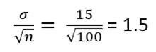

这里，sigma 是总体标准差。

这个 1.5 的标准差意味着 95%的样本均值将落在总体均值的 2 个标准差内(记住 68–95–99 规则)。这也意味着在 95%的时间里，总体均值将落在样本均值的 1.5 倍标准差之内。

置信区间的一般公式如下:

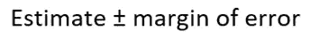

估计值是样本平均值(在上面的例子中，可以从 100 个工作日的样本中获得)

误差范围告诉您原始总体平均值可能与样本平均值相差多远，并使用以下公式计算:


其中 z 是临界值。对于每个置信水平，z-critical 的值是固定的。下面是最常用的置信度图表:

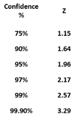

因此，置信区间的总公式变为:


回到我们上面的购物中心的例子，95%置信水平的置信区间的上限是:

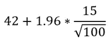

也就是 51.3，下限是:

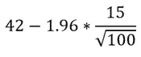

也就是 32.7。置信区间为 32.7 到 51.3。这意味着，我们有 95%的把握认为，工作日上午 9 点至晚上 12 点期间购物中心顾客人数的真实平均值将在 32 至 51 人之间。

这里我想给出置信区间的一个基本概念。在本文的后面，我们将看到如何在不同的实践例子中使用 R 函数来获得置信区间。

## 假设检验

假设检验是一个过程，检验或寻找证据的任何索赔有关的人口。

和以前一样，通过例子来理解它是一个好主意。假设我声称我可以在一个 40 英尺长的游泳池里连续游 10 圈。然后你让我给你看。但是我只跑了 4 圈就累了。有人会相信我的说法吗？

在假设检验中，我们试图从特定的主张中收集证据。如果一个关于总体的断言比真实值更罕见，我们拒绝这个断言。概率用于确定索赔的罕见程度。让我们通过一个例子来清楚地了解这个过程。

> **例一**

一位学校老师介绍了一种新的阅读方式。现在他想知道他的新方式是否有助于学生取得更好的成绩。要检查世界上是否所有的学生都适应新的阅读方式是不可能的。所以，他决定抽取 60 名学生作为样本。平均分数上升到 6.5 分。总体标准差是 11。假设我们想以 95%的置信度确定新的阅读技巧是否帮助学生提高了分数。

这里我们将遵循一个五步流程来执行假设检验。

我们将首先使用手动过程，然后使用超快速 R 函数。先来看看手动流程。

**第一步:**

陈述假设。零假设和备择假设需要在开头声明。在这个例子中，我们可以陈述零假设，因为在使用这些新的阅读技巧后分数没有变化。零假设可以表示为:

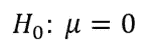

如果我们没有为零假设找到足够的证据，我们将拒绝零假设，并说替代假设是正确的。但是另一个假设是什么呢？在这里，老师想测试他引入的新技术是否有助于提高学生的分数。所以，另一个假设是，均值大于 0。

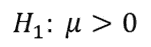

**第二步:**

选择适当的测试统计。在本例中，样本量为 60，我们知道总体标准差。当样本量大于 60 并且总体标准差已知时，z 统计量是合适的。

> 请记住，z 统计量不同于我们在置信区间中使用的 z 临界值。

与均值相关的检验统计量提供了在零假设下 x-bar(样本均值)与 mu(总体均值)的距离。z 统计的公式如下:

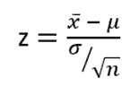

z 遵循均值为 0、标准差为 1 的正态分布。

**第三步:**

计算 z 统计量:

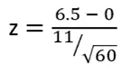

计算出 z 统计值为 4.58。我们可以根据 z 统计量计算 p 值。

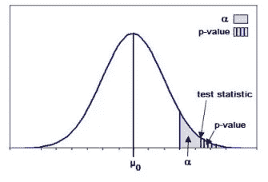

从上图可以看出，检验统计量是点，p 值是曲线下的面积。这个 p 值是我们观察到的检验统计的概率，或者是一个更极端的概率，假设零假设为真。

由于 z 统计量遵循标准正态分布，因此您可以使用 R 很容易地根据 z 统计量计算 p 值。如果你需要复习概率分布，请查看这篇文章(尤其是正态分布部分):

[](/a-complete-overview-of-the-probability-distributions-with-examples-r-implementation-511571b71cb0) [## 概率分布的完整概述，包括示例、实现

### 最流行和广泛使用的离散和连续概率分布

pub.towardsai.net](/a-complete-overview-of-the-probability-distributions-with-examples-r-implementation-511571b71cb0) 

z 统计:

```
1-pnorm(4.58)
```

输出:

```
2.32488e-06
```

**第四步:**

陈述决策规则

置信水平为 95%，因此显著性水平(α)为 5%或 0.05。如果α值小于 p 值，我们将拒绝零假设。否则，我们将无法拒绝零假设。

**第五步:**

得出结论。我们可以看到，p 值是 2.325e-06，非常小，比 alpha 值小很多。所以，我们可以说，我们有足够的证据来拒绝零假设。这意味着新的阅读技巧帮助学生提高了分数。

> 使用 R

如果您在 RStudio 中安装了“asbio”软件包，查找 z 统计数据和 p 值就非常简单。“asbio”库中有一个名为 one.sample.z 的函数，该函数获取零假设下的平均值、样本均值(x-bar)、总体标准差、样本大小(n)和替代假设。

```
one.sample.z(null.mu = 0, xbar = 6.5, sigma = 11, n = 60, alternative = 'greater')
```

输出:

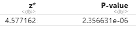

输出结果如下表所示。看，z 统计量和 p 值和我们之前计算的差不多。

> **例二**

一位科学家想测试大白鲨是否平均有 20 英尺长。他测量了 10 条大白鲨。样本平均值计算为 22.27，样本标准偏差为 3.19。他找到了在α=0.05 的显著性水平下大白鲨身长超过 20 英尺的证据了吗？

我们将遵循与示例 1 相同的 5 步程序。

**第一步:**

设置假设和 alpha 级别:

无效假设是白鲨的平均长度是 20 英尺。


如果我们找到足够的证据来否定这个无效假设，那么我们就可以说另一个假设是正确的。这种情况下的另一个假设是:

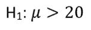

这意味着大白鲨的平均长度超过 20 英尺。

如例题所述，alpha 等级为 0.05。

**第二步:**

选择适当的测试统计。

在这个例子中，样本大小只有 10，我们有样本标准偏差。我们不知道总体标准差。

> 如果样本量小于 30，并且总体标准差未知，则合适的检验统计量是 t 统计量。

这是 t 统计量的公式:

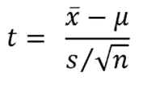

**第三步:**

计算检验统计量

虽然我们有上面的公式。但是我更喜欢使用 R，它只用一行代码就给出了 t 统计量和 p 值。

以下是保存在变量 x 中的白鲨长度:

```
x = c(21.8, 22.7, 17.3, 26.1, 26.4, 21.1, 19.8, 24.1, 18.3, 25.1)
```

使用 R 中的 t.test 函数，我们现在可以计算 t 统计量和 p 值:

```
t.test(x, mu = 20, alternative = "greater")
```

输出:

```
One Sample t-testdata:  x
t = 2.2523, df = 9, p-value = 0.02541
alternative hypothesis: true mean is greater than 20
95 percent confidence interval:
 20.42247      Inf
sample estimates:
mean of x 
    22.27
```

这里 t 统计量是 2.2523，p 值是 0.02541。自由度是 n-1。这里 n 是 10(样本量)。所以自由度是 9。

**第四步:**

陈述决策规则

如果 p 值小于或等于α(显著性水平)，则拒绝零假设。否则，不要拒绝零假设。

**第五步:**

得出结论

在本例中，p 值为 0.025，小于显著性水平α(0.1)。所以我们有足够的证据拒绝零假设。这意味着大白鲨的平均长度大于 20。

上面两个例子是关于一个样本均值的。下一个例子是比较两种方法。

在这个演示中，我们将使用 Kaggle 著名的心脏病数据集。请随意从该链接下载数据集，以便跟进:

[](https://github.com/rashida048/Datasets/blob/master/Heart.csv) [## rashida 048/数据集

### 在 GitHub 上创建一个帐户，为 rashida048/Datasets 开发做出贡献。

github.com](https://github.com/rashida048/Datasets/blob/master/Heart.csv) 

> **例 3**

使用心脏病数据集中的信息，找出男性人群的胆固醇水平是否在 0.05 的显著性水平上低于女性人群的胆固醇水平。

**第一步:**

设置假设和阿尔法水平

让我们先假设男性和女性的平均胆固醇水平是相同的。无效假设是:

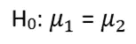

这里，mu1 是男性人口的平均胆固醇，mu2 是女性人口的平均胆固醇。

根据上述问题陈述，替代假设可以设定为男性人口的平均胆固醇低于女性人口的平均胆固醇。

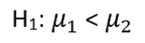

显著性水平α为 0.05。

**第二步:**

选择适当的测试统计

在统计学中，使用 t 统计量来比较两个平均值是非常常见的:

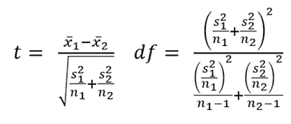

自由度的公式可能看起来很吓人。但是不用担心，我们会从 r 中的 t.test 函数得到 t 统计量和自由度。

**第三步:**

计算 t 统计量和 p 值。

首先在 RStudio 中导入心脏数据集。

```
h = read.csv('Heart.csv')
```

我们将数据集保存在变量“h”中。在数据集中,“性别”值 1 表示男性人口，0 表示女性人口。现在，使用 t.test 函数:

```
t.test(h$Chol[h$Sex=='1'], h$Chol[h$Sex=='0'],
       alternative = 'less' , conf.level = 0.95)
```

输出:

```
Welch Two Sample t-testdata:  h$Chol[h$Sex == "1"] and h$Chol[h$Sex == "0"]
t = -3.0643, df = 136.37, p-value = 0.001315
alternative hypothesis: true difference in means is less than 0
95 percent confidence interval:
      -Inf -10.17916
sample estimates:
mean of x mean of y 
 239.6019  261.7526
```

根据上面的输出，t 统计量为-3.0643，p 值为 0.001315。

用 z 测试你会得到几乎相似的结果。库“BSDA”有这个函数 z.test。下面是如何使用它:

```
z.test(h$Chol[h$Sex=='1'], h$Chol[h$Sex=='0'], alternative = "less", mu = 0, sigma.x = sd(h$Chol[h$Sex=='1']), sigma.y = sd(h$Chol[h$Sex=='0']), conf.level = 0.95)
```

输出:

```
Two-sample z-Testdata:  h$Chol[h$Sex == "1"] and h$Chol[h$Sex == "0"]
z = -3.0643, p-value = 0.001091
alternative hypothesis: true difference in means is less than 0
95 percent confidence interval:
        NA -10.26048
sample estimates:
mean of x mean of y 
 239.6019  261.7526
```

看，我们得到了和以前一样的检验统计量和非常接近的 p 值。

z.test 函数中传递的所有参数都是不言自明的。将 mu 设置为 0 可能会有点混乱。它是零，因为我们的零假设是男性和女性的平均胆固醇水平相等。这意味着两个平均值之差为零。在两个平均值比较的情况下，mu 参数取平均值的差。

**第四步:**

决策规则

如果 p 值小于α，我们将拒绝零假设，否则，我们将不拒绝零假设。

**第五步:**

得出结论

由于 p 值小于α水平，我们有足够的证据来拒绝零假设。所以，男性的胆固醇水平低于女性。

在我的下一个例子中，我不会经历 5 个步骤，因为这有点重复。本例将展示如何进行双边均值 z 检验，并使用 r 计算置信区间。

> **例 4**

使用来自心脏数据集的数据，检查胆固醇水平的总体均值是否为 245，并围绕总体的平均胆固醇水平构建一个置信区间。使用 0.05 的显著性水平。

**解决方案**

当我们检查胆固醇水平是否为 245 时，无效假设为:

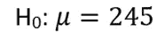

在问题这里，没有提到小于或大于。我们只会检查平均胆固醇水平是否为 245。所以，另一个假设应该是:

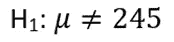

我们将使用 z 检验，如示例 3 所示。这将在一行简单的代码中为我们提供 z 统计量、p 值和置信区间。

因为我们在这里不比较两个平均值，所以我们在这里只传递一个数据，第二个数据将被设置为零。“alternative”参数需要设置为“双边”,因为我们在这里不检查大于或小于。平均值可以更大或更小。所以，它是双面的。

```
z.test(h$Chol, NULL, alternative = "two.sided",
       mu = 245, sigma.x = sd(h$Chol), sigma.y = NULL, conf.level = 0.95)
```

输出:

```
One-sample z-Testdata:  h$Chol
z = 0.56919, p-value = 0.5692
alternative hypothesis: true mean is not equal to 245
95 percent confidence interval:
 240.8631 252.5230
sample estimates:
mean of x 
 246.6931
```

看，p 值是 0.5692，不小于或等于显著性水平 0.05。所以，我们没有足够的证据来拒绝零假设。所以人口的平均胆固醇水平是 245。

根据上面的输出，置信区间是 240.86 到 252.52。因此，我们有 95%的把握认为，原始人群意味着胆固醇水平将在 240.86 至 252.52 之间下降。

> 通常使用 z.test 或 t.test 函数来寻找 r 中的置信区间。但是请记住，如果您使用这些函数来寻找置信区间，则“替代”参数必须始终设置为“双侧”。

## 比例测试

在前面所有的例子中，我们只讨论了手段的问题。在接下来的两个例子中，我们将研究人口比例。

比例检验的概念与手段检验没有太大的不同。它测试一个较大群体的人口比例与样本比例的差距。假设我们要测试 10 岁以下上过游泳课的孩子的比例。我们不能去问世界上所有的孩子，他们是否在不到 10 岁的时候上过游泳课。因此，我们将抽取 100、1000、5000 个样本，或者是我们能够承受的数目，并从这些样本中推断出大量人口的信息。

> 只有当样本量足够大时，比例检验才有效。一个常见的经验法则是 n*p0 和 n*(1-p0)都必须大于 10，其中 p0 是感兴趣的人口比例。

z 统计的公式为:

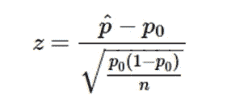

在这个公式中，p-hat 是声称的人口比例，p0 是在零假设下的人口比例。n 是样本量。

置信区间的等式为:

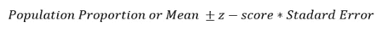

标准误差计算如下:

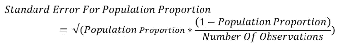

我想简单地展示所有的公式，但是正如我在开始提到的，这篇文章将集中在 r 上。

> **例 5:**

当地医疗保健提供商声称，29 至 77 岁的人口中有 50%患有某种类型的心脏病。根据这个心脏数据集，大约 46%的 29 至 77 岁人口患有心脏病。我们决定计算特定年龄组患心脏病人口比例的 90%置信区间。此外，测试该特定年龄组患心脏病的人口比例是否为 50%。

**解决方案**

首先设置假设和 alpha 级别

问题陈述里已经提到了置信区间是 90%。所以阿尔法值是 0.1。

无效假设是:

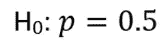

另一个假设是:

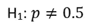

我们将使用 prop.test 函数，它将为我们提供检验统计量、p 值和置信区间等所有信息。

> 供您参考，在数据集中，样本人群的年龄范围是 29 到 77 岁。

要使用 prop.test 函数，我们需要知道心脏数据集中的数据总数，以及有多少人患有心脏病。

```
nrow(h)
```

输出

```
303
```

所以，我们总共有 303 个数据。

```
nrow(h[h$AHD == 'Yes',])
```

输出:

```
139
```

在数据集中，303 人中有 139 人患有心脏病。

```
prop.test(139, 303, p=0.50, alternative = "two.sided",
          conf.level = 0.9)
```

输出:

```
1-sample proportions test with continuity correctiondata:  139 out of 303, null probability 0.5
X-squared = 1.901, df = 1, p-value = 0.168
alternative hypothesis: true p is not equal to 0.5
90 percent confidence interval:
 0.4106097 0.5076377
sample estimates:
        p 
0.4587459
```

仔细查看输出。这里我们得到了 X 平方作为检验统计量，实际上是卡方。如果对卡方统计量求平方根，这就是 z 统计量。p 值为 0.168，大于 alpha 值。我们没有足够的证据来否定无效假设。这意味着 29 岁至 77 岁年龄段患心脏病的人口比例为 50%，显著性水平为 0.1。

上面的输出显示置信区间是 0.41 到 0.51。

**如果我们想比较两个比例呢？**

> **例 6:**

在同一个数据集中，让我们检查患有心脏病的男性和女性的人口比例在 29 岁到 77 岁之间是否相同。假设显著性水平为 0.1。

**解决方案**

无效假设是男性和女性患心脏病的比例相同。

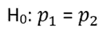

另一个假设应该是在特定年龄范围内患心脏病的男性和女性的人口比例不相同:

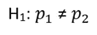

我们可以使用和之前完全一样的函数。唯一的变化是，我们需要将患有心脏病的男性人数和患有心脏病的女性人数都作为第一个参数传递。在第二个参数中，我们需要使用男性总数和女性总数。

我们可以使用 R 中的一个表函数获得所有信息:

```
table(h$Sex, h$AHD)
```

输出:

```
 No Yes
0  72  25
1  92 114
```

现在，我们可以使用 prop.test 函数:

```
prop.test(c(114, 25), c(206, 97), alternative = "two.sided",
          conf.level = 0.9, correct =FALSE)
```

输出:

```
2-sample test for equality of proportions without continuity correctiondata:  c(114, 25) out of c(92 + 114, 72 + 25)
X-squared = 23.218, df = 1, p-value = 1.446e-06
alternative hypothesis: two.sided
95 percent confidence interval:
 0.1852803 0.4060519
sample estimates:
   prop 1    prop 2 
0.5533981 0.2577320
```

从输出中可以看出，p 值小于 alpha 值 0.1。所以我们有足够的证据拒绝零假设。这意味着男性和女性患心脏病的比例是不同的。

置信区间为 0.19 和 0.41。这意味着我们有 90%的把握认为男性和女性患心脏病的人口比例差异在 0.8 到 0.4 之间。

## 结论

在这篇文章中，我尝试了使用置信区间、t 检验和 z 检验的不同类型问题的例子。使用 R 的几个功能来执行所有这些统计推断。在每个例子之后，结果的解释被清楚地讨论。这些不是唯一的测试。还有其他假设检验方法可用。但是我相信这些测试应该对你日常工作中的很多问题有帮助。

欢迎在推特上关注我，喜欢我的 T2 脸书页面。

## 更多阅读:

[](https://towardsdatascience.com/detail-explanation-of-simple-linear-regression-assessment-and-inference-with-anova-bb12ff4604d3) [## 简单线性回归的详细解释，评估，和用 ANOVA 的推断

### 一步一步的讨论和例子，手动实现和 R

towardsdatascience.com](https://towardsdatascience.com/detail-explanation-of-simple-linear-regression-assessment-and-inference-with-anova-bb12ff4604d3) [](https://towardsdatascience.com/do-you-need-a-masters-degree-to-become-a-data-scientist-ab894c2a8d41) [## 成为数据科学家需要硕士学位吗？

### 我作为波士顿大学数据分析专业硕士学生的经历和体会

towardsdatascience.com](https://towardsdatascience.com/do-you-need-a-masters-degree-to-become-a-data-scientist-ab894c2a8d41) [](https://towardsdatascience.com/an-ultimate-cheat-sheet-for-data-visualization-in-pandas-f7bc239c9937) [## 熊猫数据可视化的终极备忘单

### 熊猫的所有基本视觉类型和一些非常高级的视觉…

towardsdatascience.com](https://towardsdatascience.com/an-ultimate-cheat-sheet-for-data-visualization-in-pandas-f7bc239c9937) [](https://towardsdatascience.com/a-complete-beginners-guide-to-data-visualization-in-ggplot2-121f1eee23cd) [## ggplot2 中数据可视化的完全初学者指南

### 这是一个丰富的图书馆。今天就开始使用吧

towardsdatascience.com](https://towardsdatascience.com/a-complete-beginners-guide-to-data-visualization-in-ggplot2-121f1eee23cd) [](https://towardsdatascience.com/an-ultimate-cheatsheet-of-data-visualization-in-seaborn-be8ed13a3697) [## 用 Python 的 Seaborn 库实现数据可视化的终极指南

### 对学习者来说也是一个很好的资源

towardsdatascience.com](https://towardsdatascience.com/an-ultimate-cheatsheet-of-data-visualization-in-seaborn-be8ed13a3697) [](https://towardsdatascience.com/a-full-length-machine-learning-course-in-python-for-free-f2732954f35f) [## 免费的 Python 全长机器学习课程

### 吴恩达用 Python 写的机器学习教程

towardsdatascience.com](https://towardsdatascience.com/a-full-length-machine-learning-course-in-python-for-free-f2732954f35f)