# 数据科学 SQL 完全指南

> 原文：<https://pub.towardsai.net/a-complete-guide-to-sql-for-data-science-35743e73fd?source=collection_archive---------0----------------------->

## [数据科学](https://towardsai.net/p/category/data-science)，[教程](https://towardsai.net/p/category/tutorial)

## 每个数据科学家都应该知道的查询技术

结构化查询语言(SQL)是一种为存储、管理和检索关系数据库中的数据而设计的语言。所有关系数据库系统，如 MySQL、MS Access、SQL Server、Oracle 和 Postgres，都使用 SQL 作为它们执行 **CRUD** (创建、读取、更新&删除)操作的标准数据库语言。
在数据库级别过滤和执行某些操作或计算可以显著提高利用数据的应用程序的性能。SQL 是数据科学家几乎每天都在使用的语言，但不像 R 或 Python 那样被广泛使用。 **SQL** 和**数据库**的工作知识对于**数据科学**是必不可少的。


[SQL 编程](http://pexels.com)

关系数据库具有彼此相关的数据点，这些数据点被组织成表。大多数 RDBMS 使用相似的语法，但有一些显著的区别。在一个版本中可用的一些功能可能会以不同的方式命名，或者在另一个版本中不可用。

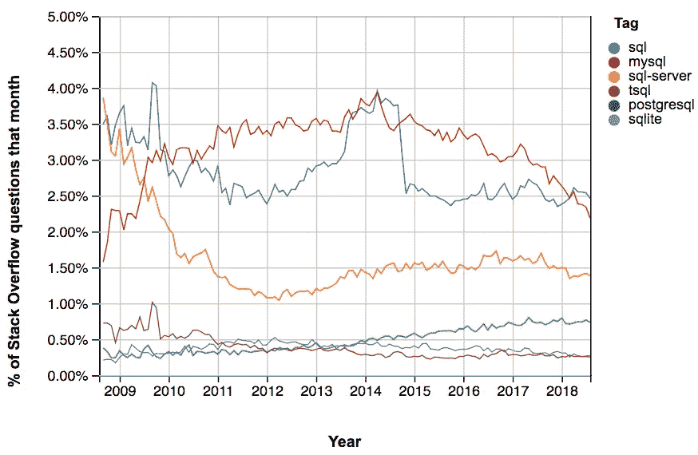

堆栈溢出趋势。[来源](https://www.datacamp.com/community/blog/sql-differences)。

根据堆栈溢出趋势，MySQL 一直是最受欢迎的 RDBMS。在本文中，我们将使用 MySQL Workbench 进行演示。

**在另一个 RDBMS 中使用下面解释的一些命令时，结果可能会有所不同。**


*MySQL 工作台接口*

***创建模式***

模式是数据库对象的逻辑集合。它将数据的组织视为构建数据库的蓝图。

仅当不存在同名的模式时，才会创建模式。

```
Syntax: CREATE {DATABASE | SCHEMA} [IF NOT EXISTS] *db_name ;*CREATE SCHEMA company_info;
use company_info;
```

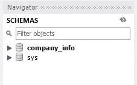

模式已创建

***创建表格***

**表格**是包含数据的数据库对象，逻辑上组织成行和列，类似于电子表格。每行代表一条记录，每列代表记录中的一个字段。

你可以在 MySQL 教程[文档](https://www.mysqltutorial.org/mysql-data-types.aspx/)中找到各种数据类型以及如何在设计数据库时有效地使用它们。创建表时，我们可以对表中的字段应用某些约束。您可以在[Java point](https://www.javatpoint.com/mysql-constraints)页面上找到不同的 MySQL 约束。

```
*Syntax*: CREATE TABLE table_name (column_name column_type);# Sample query for creating industry_data table
CREATE TABLE industry_data (
cmp_id INT UNSIGNED PRIMARY KEY,
companyname VARCHAR(50) NOT NULL,
industry_type VARCHAR(50) NOT NULL,
industry_code VARCHAR(50) NOT NULL,
start_yr INT
);
```

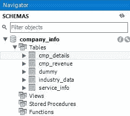

创建的表

***查看模式中的表***

```
show tables; 
```

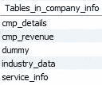

模式中的表

***查看表格描述***

```
desc cmp_details; 
```

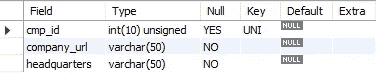

cmp_details 表描述

***涂改表***

`ALTER TABLE`该语句提供了添加、删除或修改现有表的列的选项。

```
Syntax:
# Addition of column & Modification of column datatype
ALTER TABLE table_name ADD|MODIFY *column_name column_definition*;
# Change column_name & column_definition
ALTER TABLE table_name CHANGE COLUMN *old_name new_name column_definition*; 
# Drop column 
ALTER TABLE table_name DROP COLUMN *column_name*;
desc dummy;
```

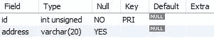

虚拟表描述

```
# Adding new column comments
ALTER TABLE dummy
ADD comments_a varchar(50),
ADD comments_b varchar(50);
```

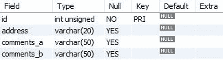

添加的列

```
# Modify datatype of column address
ALTER TABLE dummy
MODIFY address TEXT;
```

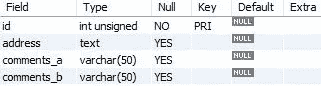

列数据类型已修改

```
# Dropping column
ALTER TABLE dummy 
DROP comments_b;
```

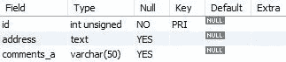

列已删除

```
# Changing column name & datatype
ALTER TABLE dummy 
CHANGE COLUMN comments_a address_line text;
```

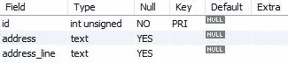

列已修改

***降表***

```
Syntax: DROP TABLE table_name;DROP TABLE dummy;
```

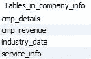

删除后模式中的表

***从 CSV 加载数据***

****小心遵循以下步骤(在方框中)。不要在工作场所的数据库连接中尝试这些。****

```
show global variables like 'local_infile';
# If local_infile is not 'ON' allow local file to be loaded
set global local_infile=true;
# Edit the Connection settings - 'Advanced' Tab
OPT_LOCAL_INFILE=1
```

*先决条件* : *一个数据库表，匹配其内容将被导入到的文件的结构。*

```
# Code to load the csv contents into a table
# Sample query for loading industry_data from csv
LOAD DATA LOCAL INFILE 'C:/SQL/industry.csv' 
INTO TABLE industry_data 
FIELDS TERMINATED BY ',' 
ENCLOSED BY '“'
LINES TERMINATED BY '\n'
IGNORE 1 ROWS;
```

***读书记录***

`SELECT`用于检索从一个或多个表中选择的数据，可以包括`*UNION*` 语句和子查询。
`*LIMIT*`*命令限制由`*SELECT*` 语句检索的记录数量。*

```
*SELECT * FROM company_info.cmp_details LIMIT 5;*
```

*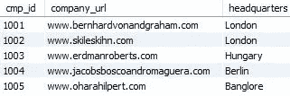*

*cmp _ 详细信息表*

```
*SELECT * FROM company_info.cmp_revenue LIMIT 5;*
```

*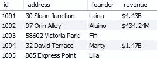*

*cmp _ 收入表*

```
*SELECT * FROM company_info.industry_data LIMIT 5;* 
```

*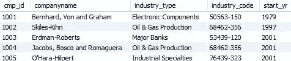*

*行业 _ 数据表*

```
*SELECT * FROM company_info.service_info LIMIT 10;*
```

**

*服务信息表*

*`SELECT service_station_id,active_status FROM company_info.service_info;`*

*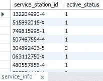*

*选择列*

****插入一条记录****

*`INSERT INTO`语句用于在表中插入新记录。如果要为表中的所有列输入值，则不需要在查询中指定列名。但是，值的顺序应该与表中的列相同。⁴*

```
*Syntax: INSERT INTO table_name ( field1, field2,...fieldN )
        VALUES ( value1, value2,...valueN );INSERT INTO company_info.cmp_revenue (id, address, founder, revenue)
VALUES (1055,'130 Dummy Junction','Diana','$8.43B');
INSERT INTO company_info.cmp_revenue (id, address, founder, revenue)
VALUES (1060,'150 Dummy Junction','Fiona','');SELECT * FROM cmp_revenue where id in ('1055','1060');*
```

*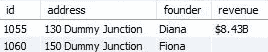*

*新插入的记录*

*对于记录的更新/删除，建议我们在 where 子句中指定表的唯一列或主键，以防止意外的记录被修改。*

****更新记录****

*`UPDATE`语句用于更新数据库中现有表的数据。我们可以使用一个`UPDATE`语句更新单个列以及多个列。⁷*

```
*Syntax: UPDATE table_name SET field1 = new_value1, field2 = new_value2 [WHERE clause];UPDATE company_info.cmp_revenue  
SET revenue = NULL
WHERE id in ('1055','1060');SELECT * FROM cmp_revenue where id in ('1055','1060');*
```

*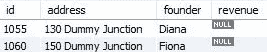*

*更新的记录*

****删除记录****

*`DELETE`语句用于从表中删除现有记录。根据我们在`WHERE`子句中指定的条件，我们可以删除单个记录或多个记录。⁷*

```
*Syntax: DELETE FROM table_name WHERE condition;DELETE FROM cmp_revenue where id in ('1055','1060');SELECT * FROM cmp_revenue where id in ('1055','1060');*
```

**

*记录已删除*

****过滤记录****

*MySQL 中的`WHERE`子句是一个关键字，用于指定从表中检索记录的标准。它总是遵循一个`SELECT`、`INSERT`、`UPDATE`或`DELETE`语句来过滤记录并对数据执行各种操作。*

*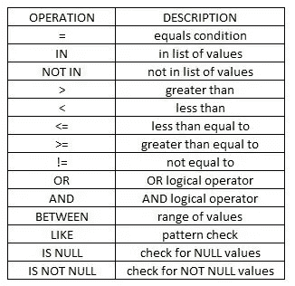*

*操作和描述*

*让我们使用我们创建的表，用`SELECT`语句来尝试这些操作。*

```
*Syntax: 
SELECT select_list 
FROM table_name 
WHERE condition;SELECT * FROM service_info WHERE cmp_id = '1002';*
```

**

*运算符=*

```
*SELECT * FROM service_info WHERE cmp_id in ('1001','1002');*
```

*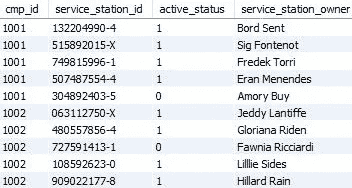*

*操作员在*

```
*SELECT * FROM cmp_details WHERE headquarters not in ('Hungary','Berlin','Banglore','California','New York','Berlin') LIMIT 10;*
```

*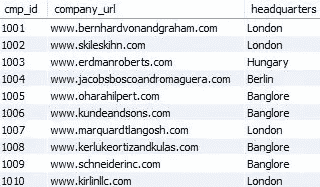*

*操作员不在*

```
*SELECT * FROM industry_data WHERE start_yr > 2010;*
```

*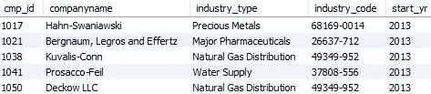*

*操作员>*

```
*SELECT * FROM industry_data WHERE start_yr < 1980;*
```

*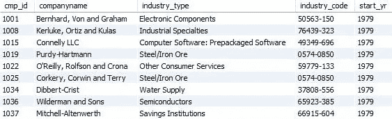*

*操作员<*

```
*SELECT * FROM industry_data WHERE start_yr <= 1985;*
```

*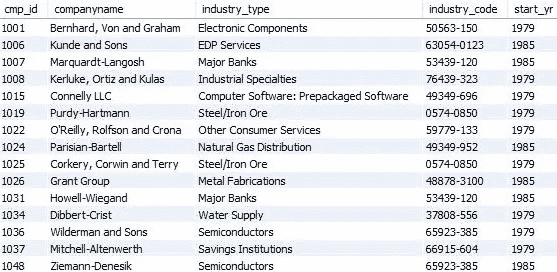*

*operator <=*

```
*SELECT cmp_id,companyname,industry_type FROM industry_data WHERE start_yr >= 2003;*
```

*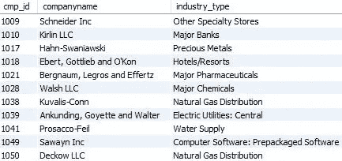*

*operator > =*

*下面的两个操作员将执行相同的操作。检查参数与条件中的值不相等的值。*

```
*# Not equal operation
SELECT DISTINCT start_yr FROM industry_data WHERE start_yr!= '1979';
SELECT DISTINCT start_yr FROM industry_data WHERE start_yr<>'1979';*
```

*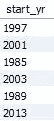*

*操作员<>*

```
*SELECT * FROM industry_data 
WHERE industry_type = 'Electronic Components' 
OR cmp_id in ('1017','1021');*
```

*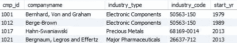*

*OR 运算符*

```
*SELECT * FROM industry_data 
WHERE industry_type = 'Electronic Components' 
AND start_yr = '1979';*
```

**

*逻辑积算符*

*`BETWEEN`运算符使用大于或等于和小于或等于运算符。*

```
*SELECT cmp_id,companyname,industry_type,start_yr 
FROM industry_data
WHERE start_yr BETWEEN 1990 AND 2000;*
```

*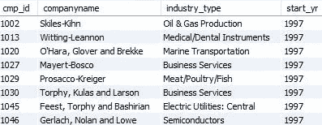*

*操作员之间*

```
*SELECT * FROM industry_data
WHERE industry_type LIKE 'oil%'
OR industry_type LIKE '%pharma%'
OR industry_code LIKE '%712';*
```

*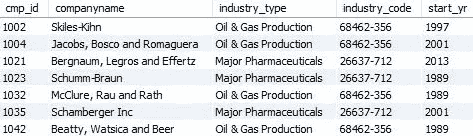*

*LIKE 运算符*

```
*SELECT * FROM cmp_revenue 
WHERE revenue IS NULL;*
```

*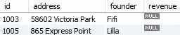*

*为空运算符*

```
*SELECT * FROM cmp_revenue 
WHERE revenue IS NOT NULL
LIMIT 10;*
```

*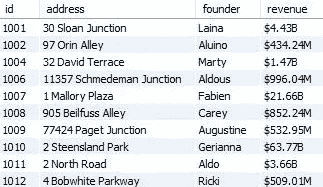*

*不是空运算符*

****整理数据****

*我们可以使用`ORDER BY`语句按升序或降序排列记录。默认情况下，如果没有提到首选顺序，记录将按升序排列。*

```
*Syntax :
SELECT select_list FROM table_name 
ORDER BY column1 [ASC|DESC], column2 [ASC|DESC], ...;SELECT * FROM cmp_revenue ORDER BY founder ASC;*
```

*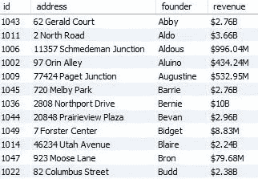*

*创始人-升序排列*

```
*SELECT id,address,founder FROM cmp_revenue ORDER BY id DESC;*
```

*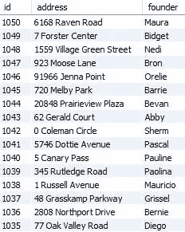*

*id -降序排序*

```
***JOIN** Syntax:
SELECT column_list FROM table_1 
[LEFT|RIGHT|INNER] JOIN table_2
ON join_condition;*
```

****左连接****

*`LEFT JOIN`选择左表中的所有记录，而不管右表中是否存在匹配行。如果右表中没有匹配的行，那么在最终结果集中右表的列中会为这些记录填充`NULL`。*

*我们现在将使用字段 cmp_id 上的`LEFT JOIN`操作来合并所有的表。*

```
*SELECT * FROM (
SELECT A.cmp_id,company_url,id,founder, 
revenue,companyname,industry_type, 
service_station_id,active_status,service_station_owner 
FROM cmp_details A
LEFT JOIN  cmp_revenue B
ON A.cmp_id=B.id
LEFT JOIN industry_data C
ON A.cmp_id=C.cmp_id
LEFT JOIN service_info D
ON A.cmp_id=D.cmp_id) T
WHERE cmp_id in (1017,1018,1019);*
```

*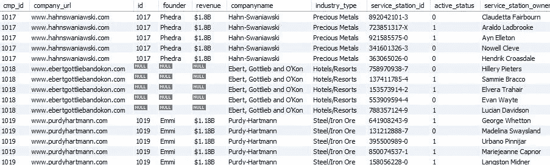*

*左连接*

*如果您注意到了，我在`SELECT`查询中提到了“cmp_id”字段旁边的表别名，但没有为其他列指定它，因为有 3 个表(cmp_details、industry_data、service_info)带有“cmp_id”字段。不提及表别名会导致关于‘CMP _ id’应该从哪个表派生的模糊性。*

****内部连接****

*`INNER JOIN`选择两个表共有的记录。如果两个表中都没有匹配的记录，那么对于这些记录，最终结果集中两个表的列都将被删除。⁵*

```
*SELECT * FROM industry_data A
INNER JOIN cmp_revenue B
ON A.cmp_id=B.id
WHERE A.cmp_id BETWEEN 1015 AND 1020;*
```

*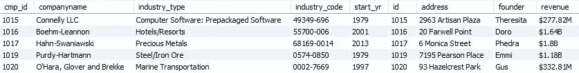*

*内部连接*

*我们可以看到 id 为‘1018’的记录被删除，因为它在一个表中可用，但在另一个表中不可用。*

****右加入****

*`RIGHT JOIN`返回 ON 条件中指定的右侧表中的所有记录，以及另一个表中符合连接条件的那些行。*

```
*SELECT * FROM industry_data A
RIGHT JOIN service_info B
ON A.cmp_id=B.cmp_id
WHERE B.cmp_id BETWEEN 1050 AND 1052;*
```

*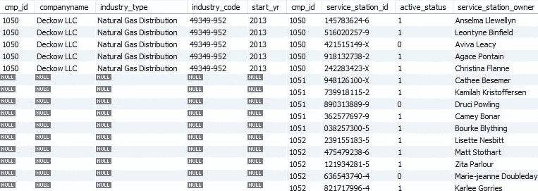*

*右连接*

*在这里，我们可以观察到即使在左边的表中没有找到相应的记录，右边的表中的记录也不会被删除。*

****聚合函数****

*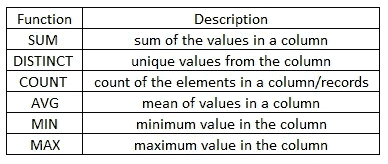*

*聚合函数*

```
*SELECT COUNT(*) as total_companies, COUNT(DISTINCT start_yr) as unique_yrs,MIN(start_yr) as min_year, MAX(start_yr) as max_year, AVG(start_yr) as avg_start_yr
FROM industry_data;*
```

*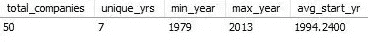*

*计数、不同、最小值、最大值、平均值*

****组由*** 组成*

*`GROUP BY`子句用于从多条记录中收集数据，并按一列或多列对结果进行分组。也可以使用`COUNT`、`SUM`、`MIN`、`MAX`、`AVG`等聚合函数。在分组列上。*

```
*Syntax:
SELECT c1, c2,..., cn, aggregate_function(ci) 
FROM table 
WHERE conditions 
GROUP BY c1 , c2,...,cn;*
```

*现在让我们找出一组行业类型的平均起始年份。*

*`***GROUP BY &*** ***AVG***`*

```
*SELECT industry_type, AVG(start_yr) FROM industry_data
WHERE industry_type in ('Natural Gas Distribution','Hotels/Resorts','Major Banks','EDP Services')
GROUP BY industry_type;*
```

*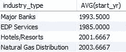*

*行业类型的平均起始年份*

*查找活动和非活动服务站的数量。*

*`***GROUP BY &*** ***COUNT***`*

```
*SELECT count(*),active_status FROM service_info
GROUP BY active_status;*
```

*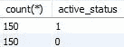*

****拥有****

*`HAVING`子句在`SELECT`语句中用于为一组行或聚合指定过滤条件。`HAVING`子句通常与`GROUP BY`子句一起使用，根据特定条件过滤组。如果省略了`GROUP BY`子句，则`HAVING`子句的行为类似于`WHERE`子句。*

```
*Syntax:
SELECT select_list FROM table_name 
WHERE search_condition 
GROUP BY group_by_expression 
HAVING group_condition;*
```

*假设我们需要找到拥有 3 个以上活动服务站的公司 id。*

```
*SELECT cmp_id,count(cmp_id),active_status FROM service_info
GROUP BY cmp_id,active_status
HAVING count(cmp_id) > 3 and active_status = 1;*
```

*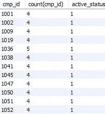*

*拥有*

****字符串函数****

*你可以在下表中找到 MySQL 中所有基本的字符串函数。例如，请参考 [w3resource](https://www.w3resource.com/mysql/string-functions/mysql-trim-function.php) 链接。*

*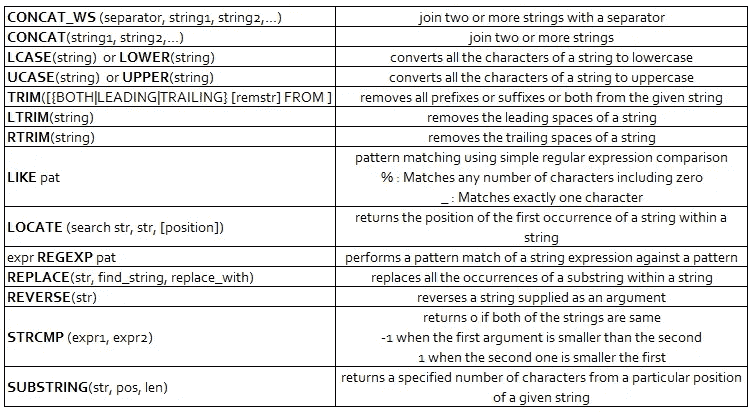*

*重要的字符串函数*

****工会****

*`UNION`操作符允许我们将两个或多个查询结果集合并成一个结果集。默认情况下，`UNION`操作符删除重复的行，即使没有明确提到`DISTINCT`操作符。*

```
*Syntax:
SELECT column_list 
UNION [DISTINCT | ALL] 
SELECT column_list 
UNION [DISTINCT | ALL] 
SELECT column_list ...SELECT * FROM cmp_details WHERE cmp_id in (1011,1013)
UNION
SELECT * FROM cmp_details WHERE cmp_id BETWEEN 1012 AND 1017
ORDER BY headquarters ASC;*
```

*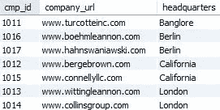*

*默认情况下 distinct*

```
*SELECT * FROM cmp_details WHERE cmp_id in (1011,1013)
UNION ALL
SELECT * FROM cmp_details WHERE cmp_id BETWEEN 1012 AND 1017
ORDER BY cmp_id ASC;*
```

*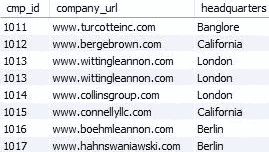*

*联合所有*

****案件****

*`CASE`表达式是一个控制流结构，允许我们向查询添加 if-else 逻辑。*

```
*#Simple CASE
Syntax:
CASE value    
WHEN value1 THEN result1    
WHEN value2 THEN result2    
…    
[ELSE else_result] 
END#Searched CASE expression
Syntax:
CASE    
WHEN expression1 THEN result1    
WHEN expression2 THEN result2    
…    
[ELSE else_result] 
END*
```

*基于起始年范围，根据条件设置 time_period 值。*

```
*SELECT DISTINCT start_yr,
CASE 
 WHEN start_yr <= 2000 THEN 'OLD'
 WHEN start_yr > 2000 AND start_yr < 2010 THEN 'MEDIUM'
 WHEN start_yr > 2010 THEN 'NEW'
 end as time_period
FROM
 industry_data;*
```

*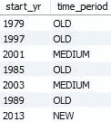*

*案例条件*

****子查询****

*子查询是嵌套在另一个查询中的查询。此外，子查询可以嵌套在另一个子查询中。*

*显示 2005 年以后成立的公司的收入详细信息。*

```
*SELECT * FROM cmp_revenue
WHERE id in (
SELECT cmp_id FROM industry_data
WHERE start_yr > 2005
);*
```

*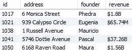*

*子查询*

****同*** *-常用表表达式**

*`WITH`子句用于定义常见的表表达式。公共表表达式是一个命名的临时结果集。*

```
*Syntax:
WITH cte_name (column_list) AS (
query
)
SELECT * FROM cte_name;*
```

*与派生表不同，CTE 可以是自引用的(递归 CTE)，也可以在同一个查询中被多次引用。与派生表相比，CTE 提供了更好的可读性和性能。*

```
*WITH companies AS (
SELECT companyname,industry_type,
CASE 
 WHEN industry_type='Natural Gas Distribution' THEN 1
    WHEN industry_type='Major Pharmaceuticals' THEN 2
    ELSE 0
END AS indus_category
FROM industry_data
WHERE start_yr > 2005
) SELECT companyname 
FROM companies
WHERE indus_category > 0;*
```

*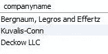*

*和 CTE 一起*

****汇总****

*我们在本文中涉及的概念:*

*   *创建模式和表*
*   *变更、降表— *(* `ALTER TABLE`，`DROP TABLE` *)**
*   *从 CSV 加载数据*
*   ***CRUD** 操作— *(* `INSERT INTO`，`SELECT`，`UPDATE`，`DELETE` *)**
*   *过滤记录— *(* `WHERE` *)**
*   *整理数据— *(* `ORDER BY` *)**
*   *加入— *(* `INNER`，`LEFT`，`RIGHT` *)**
*   *聚合函数— *(* `SUM`，`DISTINCT`，`COUNT`，`AVG`，`MIN`，`MAX`，`GROUP BY`，`HAVING`， *)**
*   *字符串函数*
*   **联合，*子查询，公用表表达式(`WITH`)*

> *SQL、Lisp 和 Haskell 是我见过的花在思考上的时间比打字多的编程语言。菲利普·格林斯本*

****包装完毕****

*感谢所有走到这一步的人。我希望这篇文章对你有所帮助。请在评论中分享您的反馈/疑问。现在，是时候使用您的 SQL 技能了。少打字，努力思考！祝你好运！*

**如果你觉得这篇文章很有趣，并且对数据科学/机器学习充满热情，点击* [*关注*](https://medium.com/@mahadeveaswar) *并随时在*[*LinkedIn*](https://www.linkedin.com/in/mahadev-easwar/)*上添加我。**

```
*REFERENCES:
1\. [www.mysqltutorial.org](http://www.mysqltutorial.org)
2\. [https://dev.mysql.com/doc/refman/8.0/en/](https://dev.mysql.com/doc/refman/8.0/en/)
3\. [https://www.javatpoint.com/](https://www.javatpoint.com/)
4\. [https://www.w3schools.com/sql/](https://www.w3schools.com/sql/)
5\. [https://www.tutorialspoint.com/mysql/](https://www.tutorialspoint.com/mysql/)
6\. [https://www.w3resource.com/mysql/mysql-tutorials.php](https://www.w3resource.com/mysql/mysql-tutorials.php)
7\. [https://www.geeksforgeeks.org/sql-tutorial/](https://www.geeksforgeeks.org/sql-tutorial/)*
```

****建议****

*[2021 年数据科学家必备的 SQL 技能](https://towardsdatascience.com/essential-sql-skills-for-data-scientists-in-2021-8eb14a38b97f)作者[叶磊华博士](https://medium.com/u/4e1d06dd743?source=post_page-----35743e73fd--------------------------------)*

*[2021 年数据科学家面临的 4 个棘手的 SQL 问题](https://towardsdatascience.com/4-tricky-sql-questions-for-data-scientists-in-2021-88ff6e456c77)作者[叶磊华博士](https://medium.com/u/4e1d06dd743?source=post_page-----35743e73fd--------------------------------)*