# 概率分布的完整概述，包括示例、实现

> 原文：<https://pub.towardsai.net/a-complete-overview-of-the-probability-distributions-with-examples-r-implementation-511571b71cb0?source=collection_archive---------3----------------------->


jaros aw kwoczaa 在 [Unsplash](https://unsplash.com?utm_source=medium&utm_medium=referral) 上拍摄的照片

## [数据科学](https://towardsai.net/p/category/data-science)， [R](https://towardsai.net/p/category/programming/r)

## 最流行和广泛使用的离散和连续概率分布

我们的最终目标是从总体中做出推论。我们首先需要了解概率，因为它是统计推断、预测模型和机器学习算法的基础。

不同类型的概率分布有助于发现事件发生的概率。不同类型的分配在不同的条件下起作用。

在本文中，我将讨论:

1.  概率分布的基础

2.不同类型分布的概念和性质

3.公式和如何计算不同类型的离散分布与例子。

4.在 r 中实现不同类型的分布。

> 我将从一些基本概念开始，然后慢慢转向发行版的类型及其实现

我将用例子解释每种类型的分布。我认为学习它们的最好方法是通过例子。你会发现很多文章、书籍都有冗长的描述。但是我发现如果没有很多实际操作的例子，它们很难理解。我会把主要精力放在做事上。每个主题都将通过示例进行讨论。少说话多做事。

> ***随机变量***

在一个实验中，当没有办法知道哪个结果会出现时，结果是随机的。结局应该只有一个。例如骰子的 5 次滚动的总和。当你掷骰子时，你不知道它的结果。或者当你从一副牌中随机抽取一张牌时，你不知道你抽取的是什么牌。这些是随机变量的例子。

有两种类型的随机变量:

1.  离散随机变量
2.  连续随机变量

## 离散分布

> ***用简单的例子来了解一些重要的基本概念***

这被定义为一个离散随机变量所取的所有值的概率的映射。概率分布是用一个叫做概率质量函数 PMF 的函数来表示的。

> PMF 是概率分布的核心。我们将计算每种分布类型的 PMF。请在进入下一部分之前学好它。

这里有一个例子。扔三次公平的硬币。可以得到 1 头 2 尾，2 头 1 尾，以此类推。有多少种不同的组合是可能的？有八种可能的组合:

HHH，HHT，泰国，THH，泰国，THT，HTT，TTT

这里 S 称为样本空间。同样有可能从 3 次投掷的样本空间中得到这些组合中的任何一个。

假设 X 是观察到的人头数。

> ***X 的 PMF 是什么？***

x 有 support Sx = {0，1，2，3}。这意味着 X 可以出现零次，一次，两次或三次。

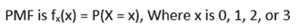

当结果是 TTT 时，X 是零(看上面的样本空间 S)。所以，X 为零的概率是 1/8。

fx(0) = 1/8

再看看样本空间，三次投掷都有三个头(HHH)的概率是 1/8。

fx(3) = 1/8

有 3 种可能的结果，其中 H 在 8 种可能的组合中只出现 1 次。所以，

fx(1) = 3/8

有 3 种可能的结果，其中 H 在 8 种可能的组合中出现 2 次。所以，

fx(2) = 3/8

这是 PMF 在表格中的表现:

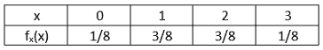

如果你把上表中所有的概率加起来，它们加起来就是一。因此，1/8 + 3/8 + 3/8 + 1/8 =1

让我们计算 X 的平均值:

```
µ = 0 * 1/8 + 1 * 3/8 + 2* 3/8  + 3* 1/8 = 1.5
```

这意味着如果我们独立地重复这个实验多次，样本平均值将接近 3.5。更多的实验会带来更好的近似。可以推断出 X 是“平均”或“长期”的 3.5。

注意，我们是如何计算平均值的。如果我们用一个公式来概括它，它将看起来像这样:

E(X) = x1 p1 + x2p2 + ……。+ xn*pn

其中，x1，x2…xn 是头部的出现，在这种情况下，是头部的出现。p1，p1，…..pn 是 x 出现的相应概率。均值也称为数学期望 e。

> ***方差和标准差***

理解一个分布的两个核心参数。方差定义为随机变量围绕其平均值或数学期望值分散的程度。

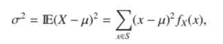

方差也表示为 sigma 平方。让我们计算上面掷硬币例子的方差。记得我们计算的平均值或期望值(E)是 3.5。我们现在用它来计算方差。


标准差就是方差的平方根。所以，

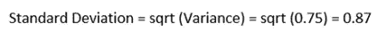

还有一个更重要的功能，我们需要学习。这就是将在分布中大量使用的累积分布函数(CDF)。

> ***【累积分布函数】***

表示为 F(x)。F(x)是随机变量 x 小于或等于 x 的概率。在我们掷硬币的例子中，F(2)意味着掷 2 次或少于 2 次的概率。

所以它是累积的:fx(0) + fx(1) + fx(2) = 1/8 + 3/8 + 3/8

> *这些都是基本功能。现在，让我们深入研究一下分布。*

## 不同类型的离散分布

有几种类型的离散分布。在这里，我将举例说明一些主要类型的离散分布:

> ***均匀分布***

**这是最简单的分布。**先看个例子会更容易理解。如果你掷一次骰子，得到 1、2、3、4、5 或 6 的概率是一样的，1/6。

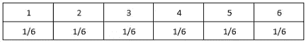

这种分布称为均匀分布。

**概率质量函数 PMF 为:**

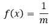

其中“m”是可能值的数量。骰子有六个面。所以这里 m 是 6， **PMF 是 1/6 或者 0.1667** 。

**累积分布函数 CDF 为:**

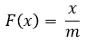

这里，x 是一个事件可能发生的次数。如果掷骰子三次，掷两次 3 的概率是多少？所以这里 x = 2。CDF **是 2/6 或 1/3** 。

**平均值的公式为:**

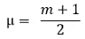

掷骰子的平均数是(6+1)/2 或 3.5。

**方差公式为:**

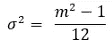

这个例子的方差是:

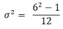

总共是 2.92 英镑。

> ***输入均匀分布的值也可以是一个范围。***

例如，一个随机的学生正在参加一个满分为 15 分的考试，及格分数为 10 分。你知道学生通过了。求学生成绩的 CDF。

> *以下是解决方案。*

你知道及格分数是 10 分。所以学生的分数必须在 10 到 15 分之间。学生的分数可能在 10 到 15 之间。学生可能得到 10、11、12、13、14 或 15 分。如果你数的话，可能的分数是 6。

综合发展框架应该是:

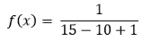

所以，是 1/6 或者 0.1667。

一般公式是:

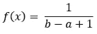

这里随机变量在整数范围(a，b)内，其中 b > a，m 为(b-a+1)。你可以用这个 m 和我之前提到的公式计算均值和方差。

## 二项分布

想一个你能通过或不能通过的考试。Covid 测试，可以是阳性或阴性。抛一枚公平的硬币，结果可能是“正面”或“反面”。在所有这些情况下，只有两种可能的结果，“是/否”。

> 概率是 p 或 q。p 是事件发生的概率，q 是事件不发生的概率。
> 
> 这是一个完整的例子

假设你正在参加一个没有任何准备的考试？有 15 道选择题。每个问题有四个选项。你需要答对 10 道题才能通过。你答对 10 道题的概率是多少？

让我们剖析一下这个问题。

这里，

问题数量为 15 个。所以，n = 15。

每个问题有四个选项。也就是说答对一道题的概率是 0.25 (p = 0.25)。

这意味着没有答对一个问题的概率是 1-p 或 0.75。

你需要从 15 个问题中答对 10 个问题(k=10)。

计算二项分布 PMF 的公式为:

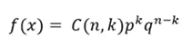

在哪里，

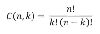

插入值:

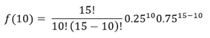

经过计算，你通过的可能性是 0.00067961！

如果你知道如何计算 PMF，你可以很容易地计算 CDF。让我们看看如何用 R 来做二项分布。

> r 使用“dbinom”函数计算 PMF，“pbinom”函数计算 CDF，“rbinom”函数生成二项式财产的随机分布。

一会儿用例子会更清楚。

在这里，我将使用 dbinom 函数来计算您答对 15 个问题中的 10 个问题的概率。

```
n=15; p=0.25; k=10
dbinom(k, size=n, prob=p )
```

输出:

```
0.00067961
```

**计算你最多答对 10 道题的概率是多少？**

这意味着你可以得到 0 或 1 或 2，最多 10。你可以分别计算 0，1，2，…10 的 PMF，然后把它们加起来。r 有一个很棒的函数 pbinom，它只用一行代码就完成了这项工作。

我将使用 pbinom 函数来完成。

```
pbinom(10, size=n, prob=p )
```

输出:

```
0.9998847
```

你通过考试的可能性有多大？这意味着你将答对 10、11、12、13、14 或 15 个问题。

有两种方法可以做到。你可以计算 10 到 15 的 PMF，然后将它们相加，或者分别计算 15 和 10 的 CDF，然后相减。在这里，我将向他们展示。

首先，让我们分别计算得到 10、11、12、13、14 和 15 的概率，并使用 dbinom 函数对它们求和。

```
sum(dbinom(10:15, size=n, prob = p))
```

输出:

```
0.000794949
```

现在，我们将使用累积分布函数做同样的事情。先计算 15 道题中每道题答对的累积概率，然后减去 9 道题答对的累积概率。然后相减，找出答对 10 到 15 道题的累计概率。

```
pbinom(15, size=n, prob=p) - pbinom(9, size=n, prob=p)
```

输出:

```
0.000794949
```

最后，从二项式分布中生成 30 个随机数，其中 n = 15，p=0.25。

```
rbinom(30, size = 15, prob = 0.25)
```

输出:

```
6 2 3 4 3 2 6 5 5 2 4 2 8 6 4 4 1 1 3 1 3 2 5 2 7 4 4 3 5 4
```

生成一组随机数在统计学和研究中很常见。

> ***二项分布的均值和方差***

平均值的公式是 np，并且

方差的公式是 p(1-p)

在我们的例子中，你必须从 4 个选项中选择一个问题的答案，答对一个问题的概率是 0.25。

*分布的平均值是 15*0.25 = 3.75*

*方差为 NP(1-p)= 15 * 0.25 *(1–0.25)= 2.8125*

## 超几何分布

与二项式分布不同，在超几何分布中，随机数据是在没有替换的情况下选择的。因此，选择的数据与之前的结果无关。让我们通过一个例子来清楚地理解它。

假设一个篮子里有 8 个黑球和 5 个白球。我从里面随机挑了三个球。我选了 1 个白球的概率是多少？

这意味着我们将计算得到 1 个白球的概率。这意味着两个球将是黑色的。

> 挑选 1 个白球和 2 个黑球的公式是(从 8 个黑球中选择 2 个黑球)*(从 5 个白球中选择 1 个白球)/(从总共 13 个球中选择总共 3 个球)。

下面是数学表达式:

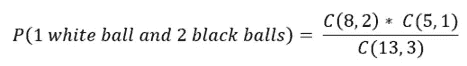

在哪里，

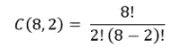

您可以使用“choose”函数直接在 R 中计算它，如下所示:

```
(choose(8, 2) * choose(5, 1)) / choose(13, 3)
```

输出:

```
0.4895105
```

或者，R 有一个 **dhyper** 函数来计算。我们感兴趣的白球总数记为“m ”,我们不感兴趣的黑球总数记为“n ”,我挑选的球总数记为“k”。

```
M <- 5; N <- 8; K <- 3
dhyper(1, m = M, n = N, k = K) #We put 1 in the beginning because we want to know the probability of picking 1 white ball.
```

输出:

```
0.4895105
```

**最多 2 个球是黑色的概率是多少？**

这就意味着，选 0 个黑球的概率加上选 1 个黑球的概率加上选 2 个黑球的概率。

r 有一个 phyper 函数来做这件事。m 和 n 的值这次会不一样。因为我们现在对黑球感兴趣。所以，m 是黑球的总数，n 是白球的总数。

```
M <- 8; N <- 5; K <- 3
phyper(2, m = M, n = N, k = K)#We put 2 in the beginning because we are looking to find the probability of picking at most 2 black balls
```

输出:

```
0.8041958
```

或者，您可以找到分别获得 0、1 和 2 个黑球的概率，并使用 dhyper 函数将它们相加:

```
M <- 8; N <- 5; K <- 3
sum(dhyper(0:2, m = M, n = N, k = K))
```

输出:

```
0.8041958
```

## 几何分布

事件首次发生前的独立试验次数是几何分布中的随机变量。

就拿前面的例子来说，一个篮子里 8 个黑球和 5 个白球。3 个黑球后抽 1 个白球的概率是多少？每次捡球后都要把球放回原处。

我们将概率表示为 p，将 q 表示为 1-p。这里，概率 p 将是在一次挑选中获得白球的概率。

球总数为(8+5) = 13，白球数为 5。所以，一次挑中白球的概率是 5/13。q 应该是(1-p)或者 8/13。公式是:

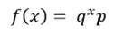

这里，x 是失败的尝试次数。代入数值，在 3 个黑球或 3 次失败尝试后，选择一个白球的概率为:

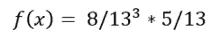

结果是 0.08963。您可以使用 R 进行同样的计算，R 有一个 dgeom 函数可以非常容易地完成这项工作。它将失败尝试的次数和概率 p 作为参数:

```
dgeom(3, prob = 5/13)
```

输出:

```
0.08963272
```

> ***最多尝试 3 次失败后，捡一个白球的概率是多少？***

这意味着我们需要计算在 0 次、1 次、2 次和 3 次失败尝试后选择白球的概率，并将它们相加。

```
sum(dgeom(0:3, prob = 5/13))
```

输出:

```
0.8565877
```

我们可以使用 pgeom 函数做同样的事情。

```
pgeom(3, prob = 5/13)
```

输出:

```
0.8565877
```

> ***几何分布的均值和方差***

平均值的公式为:

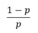

上面例子中的概率 p 是 5/13 = 0.384

平均值为:(1–0.384)/0.384 = 1.6

方差的公式为:

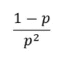

差异是:

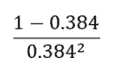

方差结果是:4.16

## 负二项分布

一个事件发生多次之前独立试验的次数。让我们通过做一个例子来学习它。

假设一个篮球运动员正在罚球。每次出手成功的概率是 0.5。7 次罚球中有 3 次进的概率是多少？

这里，随机变量是失败的次数。我们正在寻找 7 次试验中获得 3 次成功(获得 3 个黑球)的概率。

所以，x= 7，试验的次数

r = 3 (3 是成功的次数)

概率 p 是 0.5，q = (1-p)或 0.5。

负二项分布的公式是:

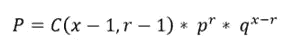

现在，插入数值并计算它们。我选择在 R:

```
choose(7-1, 3-1) * (0.5)^3 * (0.5)^4
```

输出:

```
0.1171875
```

您可以使用 R 中的 dnbinom 函数来做同样的事情。它以失败次数、成功次数和概率 p 为参数。

```
r=3
dnbinom(4, size = r, prob = 0.5)
```

输出:

```
0.1171875
```

> ***3 次成功前得到 0 到 7 次失败的概率是多少？***

你可以把这个问题重新表述为，

> *“在 3 次成功之前最多失败 7 次的概率是多少？”*

和前面的例子一样，可以通过分别计算 0、1、2、最多 7 个故障，然后求和来计算。

```
r=3
sum(dnbinom(0:7, size = r, prob = 0.5))
```

输出:

```
0.9453125
```

或者，您可以使用 pnbinom 函数:

```
pnbinom(7, size=3, prob = 0.5)
```

输出:

```
0.9453125
```

> ***负二项分布的均值和方差***

负二项分布的平均值公式为:

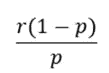

上述示例分布的平均值为:

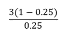

平均数是 9。

负二项分布的方差公式为:

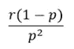

代入 r 和 p 的值:

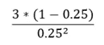

上述示例分布的方差为 36。

## 泊松分布

这种类型的分布用于模拟特定时间段内发生的特定事件的频率。

假设一家电卖场平均每天晚上 7 点到 9 点接待 10 个顾客。给定一天获得 9 个客户的概率是多少？

在这里，顾客的平均数量是 10。所以，

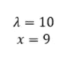

泊松分布的公式是:

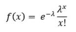

代入λ和 x 的值:

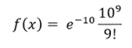

给定一天得到 9 个客户的概率是 0.12511。

```
dpois(9, lambda = 10)
```

输出:

```
0.12511
```

在同一时间段(晚上 7 点到 9 点)，该商店在某一天接待 10 到 15 名顾客的概率是多少？

我将从两个方面展示它。首先，找出该商店获得 10、11、12 到 15 个客户的概率，并使用 dpois 函数求和。

```
sum(dpois(10:15, lambda = 10))
```

输出:

```
0.4933299
```

使用 ppois 功能也可以做到这一点。我们需要找到累积概率分布或获得前 15 个客户的累积概率。计算获得前 9 个客户的累积概率。然后相减得到得到 10 到 15 个客户的累积概率。

```
ppois(15, lambda = 10)-ppois(9, lambda = 10)
```

输出:

```
0.4933299
```

您还可以使用 rpois 函数生成一组具有相同 lambda 值的随机数:

```
rpois(30, lambda = 10)
```

输出:

```
11 12  6 14  7 12 11 15  9  9 14  8 18 15 15 14 14  915  7  8 13  8 12 11 11  9 15 11 12
```

> ***分布的均值和方差***

泊松分布的均值和方差都是λ。

因此，对于上面的例子，均值和方差都是 10。

## 连续分布—均匀分布

这是最简单的连续分布**和几乎类似的离散均匀分布**。

对于范围[a，b]中的连续均匀分布，随机变量 X 的出现概率在整个范围内是均匀的。设 x 是 1 到 100 之间的一个随机数。这里 a 是 1，b 是 100。

x 是 1 到 100 之间的任何数的概率都是相同的。也就是 1/100 或者 0.01。在整个范围内都是一致的。x 是 10 的概率是 0.01，同样，x 是 90 的概率是 0.01。随机数发生的概率称为**概率密度函数(PDF)** 。

因此，我们可以说，从 1 到 100 中随机出现的任何数字的 PDF 都是 0.01。

> ***10 或更小的数出现的概率是多少？***

嗯，那就是 1 的 PDF+2 的 PDF+3 的 PDF+4 的 PDF+…10 的 PDF。因为这是均匀分布，所以它们的 PDF 都是 0.01。所以，一个数字从 1 到 10 出现的概率是 0.01 * 10 = 0.1。

这被称为**累积分布函数**。有道理，对吧？它是累积的。

> *PDF 和 CDF 这两个概念将在每种分发方法中反复使用。*

均匀连续分布的随机变量 X 的概率密度函数(PDF)公式为:

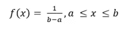

我在前面解释 PDF 和 CDF 的概念时已经解释了一个例子。让我们再看一个例子和用 r 实现的例子。

> *假设某公司股票价格遵循 50 到 90 美元之间的均匀分布。股价 63 美元的概率是多少？*

对于均匀分布，你可以很容易地计算出来。因为在整个范围内都是一样的，就像我之前解释的那样。但是这里我想引入 R 函数来计算均匀分布。

我们可以通过使用“dunif”函数很容易地做到这一点，该函数采用随机变量、最小值和最大值。我们可以用这一行代码来计算 PDF。

```
dunif(63, min = 50, max = 90)
```

输出:

```
0.025
```

> *股价 60 美元以下的概率有多大？*

这里我们需要计算累积分布函数(CDF)。在这里，股价为 60 美元或更低的概率意味着股价的概率是 50+51 的概率+52 的概率+……+60 的概率。

r 有' punif '函数，这样计算 CDF。

```
punif(60, min = 50, max=90)
```

输出:

```
0.25
```

> *股价至少 70 美元的概率有多大？*

股票价格至少是 70 美元意味着股票价格是 70 美元或者更多。所以我们需要 71 到 90 美元的 CDF。

看，总概率是 1。如果我们只扣除 69 的 CDF(这意味着 50 到 69 的累积概率),我们将得到 71 或更多的累积概率。

```
1 - punif(70, min = 50, max = 90)
```

输出:

```
0.5
```

这就是均匀连续分布

## 正态分布

最常见的连续分布。著名的钟形曲线或高斯分布代表正态分布。

正态分布完全由平均值和标准差决定。如果两个正态分布具有相同的均值和标准差，则它们是相同的。

和均匀连续分布一样，正态分布也涉及一个范围。概率是曲线下的面积。

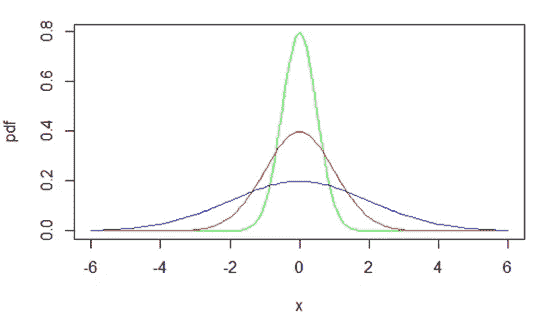

三个均值相同、标准差不同的正态分布

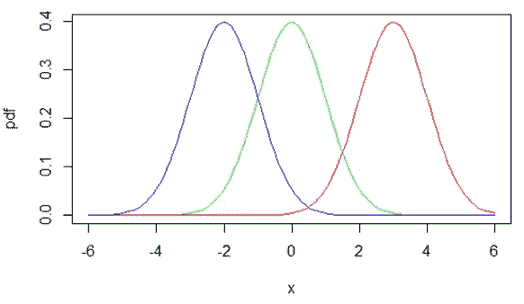

标准差相同但均值不同的三个正态分布

完整钟形曲线下的面积为 1。

正态分布如此重要和广泛应用的原因是，人口样本的许多自然现象遵循正态分布。像年龄、身高、身体质量指数等典型样本应该遵循正态分布。

让我们来解决一些 R 中的示例问题

> 假设人口的年龄正态分布在 12 到 72 岁之间。人口年龄的平均值是 40，标准偏差是 8。一个随机的人 35 岁的概率有多大？

r 具有“dnorm”函数，该函数将随机变量(本例中为 35)的平均值和标准偏差作为输入，并给出 PDF。

```
dnorm(35, mean = 40, sd = 8)
```

输出:

```
0.041
```

在上述正态分布中，一个随机的人 35 岁的概率是 0.041。

> *一个随机的人最多 30 岁的概率是多少？*

这意味着一个随机的人 30 岁或更少的概率。可能是 12 到 30 之间的任何数字。这是 12 到 30 的累积概率。我们将使用“pnorm”函数来计算正态分布的 CDF。

```
pnorm(30, mean = 40, sd = 8)
```

输出:

```
0.106
```

> *在同一个分布中，一个随机的人至少 30 岁的概率是多少？*

这里我们需要计算一个随机的人 30 岁或以上的概率。30，31，32…72 的累积概率。

我们知道总概率总是 1。如果我们从总概率中减去 29 的 CDF(那意味着 12，13，14……29 的概率)，我们将得到 30 到 72 的 CDF。

```
1 - pnorm(29, mean = 40, sd = 8)
```

输出:

```
0.915
```

> 这种类型的分析给出了一个更清晰的总体概念，而不仅仅是平均值和标准差，对吗？

> 你听说过 68–95–99 法则吗？

正态分布的这一规则使得概率推断容易得多。

68.27%的变量位于平均值的一个标准差内。

95.45%的变量位于平均值的两个标准偏差内。

99.73%的变量位于平均值的三个标准偏差内。

来测试一下吧！

> *计算一个随机的人出现在平均值的两个标准差中的概率。*

这里我们需要计算一个随机的人在平均值+2 *sd 和平均值-2 * SD 之间的概率。所以，这也是一个 CDF 计算。如果我们首先找到 12 的 CDF 均值+2*sd，然后减去均值-2 * SD 的 CDF，那么我们应该得到中间值的 CDF。

```
mu= 40
sigma = 8
pnorm(mu + 2*sigma, mean = 40, sd = 8) - pnorm(mu - 2*sigma, mean = 40, sd = 8)
```

输出:

```
0.9545
```

或 95.45%。你看到了吗？对于完全正态分布，95.45%的总体或变量位于平均值的两个标准差之间。你可以用同样的方法证明另外两个。请你自己试试。

**我们一直在计算随机变量的概率。**

现在我们要做另外一件事。

这意味着现在将给出概率，我们将相应地匹配人口比例。这里有一个例子。

> *假设你有 75%的概率，你需要知道年龄的 CDF。我们算完之后就更清楚了。*

```
qnorm(0.75, mean = 40, sd = 8)
```

输出:

```
45.4
```

这意味着 45 的 CDF 是 75%。再详细一点，如果我们计算一个随机的人 12 的概率+13 的概率+14 的概率+……+45 的概率，那就是 75%。

> 最后，我想演示如何生成一组正态分布的数据并绘制它们。

假设我们想要生成 1000 个平均值为 75、标准差为 11 的随机数。

```
y = rnorm(1000, mean = 75, sd = 11)
```

这行代码将生成一组千位数，平均值为 75，标准差为 11。我没有在这里显示输出，因为这会占用太多的空间。相反，让我们把它画出来，我会在这里展示这个图。

我会先将数字四舍五入，然后绘制一条更平滑的曲线

```
y = round(y)
plot(table(y), type = "h")
```

输出:

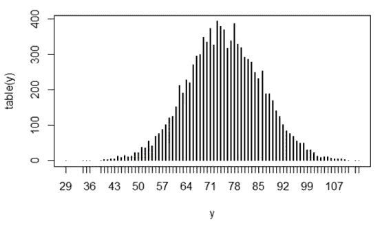

这里，表(y)给出了每个数字出现的频率。如果您不熟悉表(y ),请检查它的输出。

> *如果你生成更多的数据，这条曲线会看起来更正常，更平滑。*

## 指数连续分布

指数分布的范围是从零到正无穷大。这由单个参数定义，即每单位时间的平均发生次数，用λ表示。

这种分布通常用于排队论中等待时间的分布。它主要是关于某一事件发生之前的时间。病人进入医院，到达的时间间隔或者我们每天接到的推销电话的数量，离地震发生的时间。

可以使用以下公式手动计算 PDF:

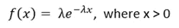

在本文中，我将使用 R 来计算 pdf 和 CDF。

让我们做一个例子来更好地学习它。

> *假设平均每小时有 25 名顾客到达零售店。如果一个客户刚刚到达，下一个客户在接下来的 3 分钟内到达的概率是多少？*

这里的费率是每小时 25 英镑。所以，我们需要小心这个单位。

请注意，它将在接下来的 3 分钟内提问。我们需要计算 CDF。r 有“pexp”函数来计算指数连续分布。

```
pexp(3/60, rate = 25)
```

输出:

```
0.7134
```

下一个客户在接下来的 3 到 7 分钟内到达的概率是多少？

为此，我们需要计算 7 的 CDF，并从中减去 3 的 CDF。这应该能为我们提供介于两者之间的 CDF。

```
pexp(7/60, rate = 25) - pexp(3/60, rate = 25)
```

输出:

```
0.2323
```

下一个顾客在 3 到 7 分钟之间到达的概率是 23.23%。

## 结论

恭喜你！如果你能完成以上所有的例子并理解分布，你就学到了一个非常重要的统计学主题。这在数据分析、数据科学和人工智能中同样重要。还有几种其他类型的发行版可用。一次性学会并记住所有的概率分布是相当困难的。我的想法是学习最常见的，并在必要时查阅书籍或谷歌搜索其余的。

欢迎在推特上关注我，喜欢我的 T2 脸书页面。

## 更多阅读

[](https://towardsdatascience.com/detail-explanation-of-simple-linear-regression-assessment-and-inference-with-anova-bb12ff4604d3) [## 简单线性回归的详细解释，评估，和用 ANOVA 的推断

### 一步一步的讨论和例子，手动实现和 R

towardsdatascience.com](https://towardsdatascience.com/detail-explanation-of-simple-linear-regression-assessment-and-inference-with-anova-bb12ff4604d3) [](https://towardsdatascience.com/detailed-guide-to-multiple-linear-regression-model-assessment-and-inference-in-r-146845067aa3) [## 多元线性回归模型、评估和推理的详细指南

### 模型开发、解释、方差计算、f 检验和 t 检验

towardsdatascience.com](https://towardsdatascience.com/detailed-guide-to-multiple-linear-regression-model-assessment-and-inference-in-r-146845067aa3) [](https://towardsdatascience.com/do-you-need-a-masters-degree-to-become-a-data-scientist-ab894c2a8d41) [## 成为数据科学家需要硕士学位吗？

### 我作为波士顿大学数据分析专业硕士学生的经历和体会

towardsdatascience.com](https://towardsdatascience.com/do-you-need-a-masters-degree-to-become-a-data-scientist-ab894c2a8d41) [](https://towardsdatascience.com/an-ultimate-cheat-sheet-for-data-visualization-in-pandas-f7bc239c9937) [## 熊猫数据可视化的终极备忘单

### 熊猫的所有基本视觉类型和一些非常高级的视觉…

towardsdatascience.com](https://towardsdatascience.com/an-ultimate-cheat-sheet-for-data-visualization-in-pandas-f7bc239c9937) [](https://towardsdatascience.com/an-ultimate-cheatsheet-of-data-visualization-in-seaborn-be8ed13a3697) [## 用 Python 的 Seaborn 库实现数据可视化的终极备忘单

### 对学习者来说也是一个很好的资源

towardsdatascience.com](https://towardsdatascience.com/an-ultimate-cheatsheet-of-data-visualization-in-seaborn-be8ed13a3697) [](https://towardsdatascience.com/the-detailed-guide-to-master-method-to-find-the-time-complexity-of-any-recursive-algorithm-b40c8250ed67) [## 掌握计算任何递归算法时间复杂度的方法的详细指南

### 做中学

towardsdatascience.com](https://towardsdatascience.com/the-detailed-guide-to-master-method-to-find-the-time-complexity-of-any-recursive-algorithm-b40c8250ed67)