# Tableau 图表综合备忘单:Tableau 桌面专家认证之路

> 原文：<https://pub.towardsai.net/a-comprehensive-cheat-sheet-on-tableau-charts-a-road-to-tableau-desktop-specialist-certification-d2d433872cef?source=collection_archive---------2----------------------->

## 第 12 章:一个完整的备忘单和带有免费 Udemy Tableau 转储的 Tableau 图表描述

欢迎来到第十二章，在这一章中，我们将学习 [Tableau](https://medium.com/u/fcbe60d0bf8b?source=post_page-----d2d433872cef--------------------------------) 中的不同图表。

> 如果你想浏览其他章节，请访问: [**画面:这是什么？为什么它是最好的？；Tableau 桌面专家认证之路。**](https://dakshtrehan.medium.com/tableau-what-it-is-1e2cdff35440)

> 如果您想直接访问 Tableau 桌面专家笔记，请在此处访问它们→[https://dakshtrehan . comment . site/Tableau-Notes-c 13 fceda 97 b 94 BDA 940 edbf 6751 cf 30](https://dakshtrehan.notion.site/Tableau-Notes-c13fceda97b94bda940edbf6751cf303)
> 
> 使用链接访问免费 Tableau 认证转储(有效期至 2022 年 7 月 6 日):
> 
> [https://www . udemy . com/course/tableau-desktop-specialist-certification-dumps-2022/？coupon code = e3f 08189 fa 4 bafae 72 BC](https://www.udemy.com/course/tableau-desktop-specialist-certification-dumps-2022/?couponCode=E3F08189FA4BAFAE72BC)

Tableau 的主要目标是创建交互式可视化。这些工具使创建图表/图形变得极其方便，只需拖放功能，不需要编码，没有错误。

“演示”面板非常有用，尤其是对新手来说。它会为我们选择的数据点建议所有有效的图表。突出显示的是我们可以创建的图表，阴影部分是对所选数据点无效的图表。

“向我展示”窗格总共包括 24 个图表，我们将讨论其中的一些图表、它们的使用情形以及它们的最低要求。

# 目录

*   **条形图**
    –水平条形图
    –堆积条形图
    –并排条形图
*   **折线图**
    –连续折线图
    –离散折线图
    –双轴图
    –组合轴图
    –双轴图 vs 组合轴图
*   **饼状图**
*   **面积图**
    –连续面积图
    –离散面积图
*   **地图**
    –符号地图
    –填充地图
*   **散点图**
*   **甘特图**
*   **气泡图**
*   **直方图**
*   **文本表格(交叉标签/数据透视表)**
*   **热图**
*   **高亮显示表**
*   **树形图**
*   **盒须图**
*   **本主题的认证问题示例**

# 条形图

条形图是在 Tableau 中可视化数据的最有效和最简单的方法。

条形图有三种类型:

## 水平条形图

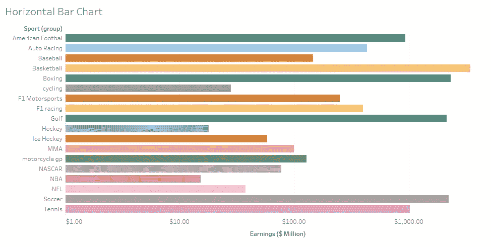

这是 Tableau 中最常用的图表之一，因为它使数据摄取和可视化变得尽可能容易。该图表清楚地描述了不同类别之间的差异，因此在数据人员中很受欢迎。

> 最低要求:
> 
> 0 或多个维度，1 或多个度量值

## 堆积条形图

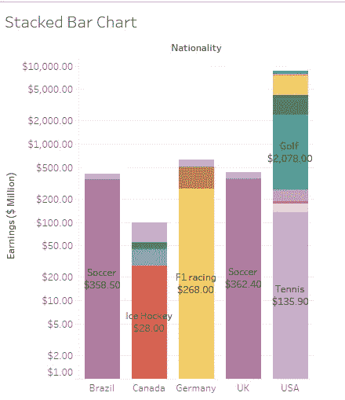

堆积条形图是水平条形图的扩展版本。动机是相同的，即显示类别之间的差异。但是，当我们想要进一步显示分类数据中子类别之间的差异时，可以使用堆积条形图。这增加了我们的细节层次。

> 最低要求:
> 
> 一个或多个维度，一个或多个度量

## 并排条形图

这些类似于堆叠条形图，唯一的区别是类别不是相互堆叠，而是像嵌套条形图一样展开，即条形图中的条形图。这使得视图更清晰，更易于可视化。

> 最低要求:
> 
> 一个或多个维度，一个或多个度量
> 
> (至少需要 3 个字段)

# 折线图

折线图可以是连续的、离散的或双折线图。

**当我们创建一个折线图时，我们在我们的标记卡中得到“路径”选项。**

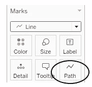

## 连续折线图

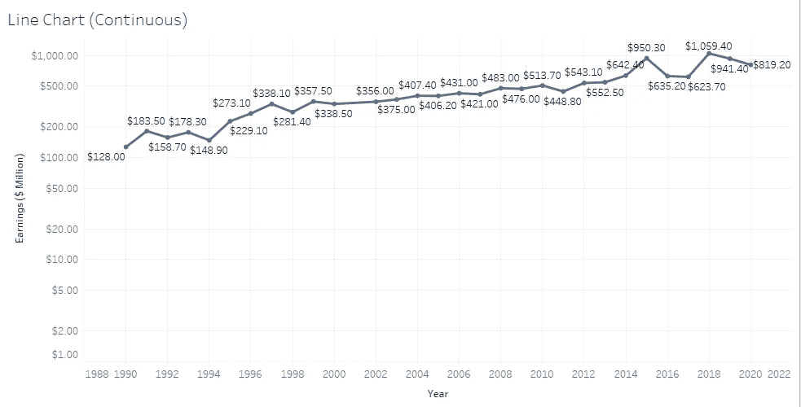

当我们试图描绘一个事物如何随时间变化的故事时，连续图表是有用的。我们可以在视图中添加多个类别，以显示不同类别之间的差异。

> 最低要求:
> 
> 1 个日期、0 个或多个维度、1 个或多个度量

## 离散折线图

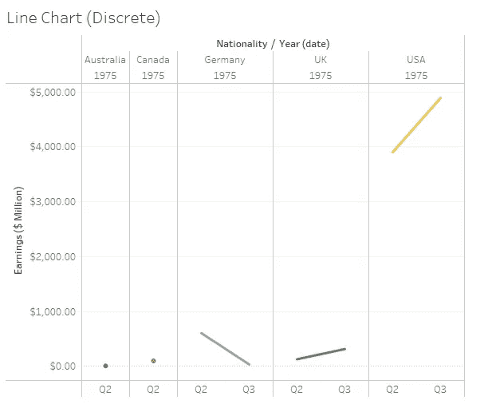

它与连续折线图相同，唯一的区别是它需要一个离散的日期，而不是连续的日期，因此提供了更好的详细信息，因为我们可以将我们的日期分成更多的类别，如季度、月份等。

> 最低要求:
> 
> 1 个日期、0 个或多个维度、1 个或多个度量

## 双轴图表

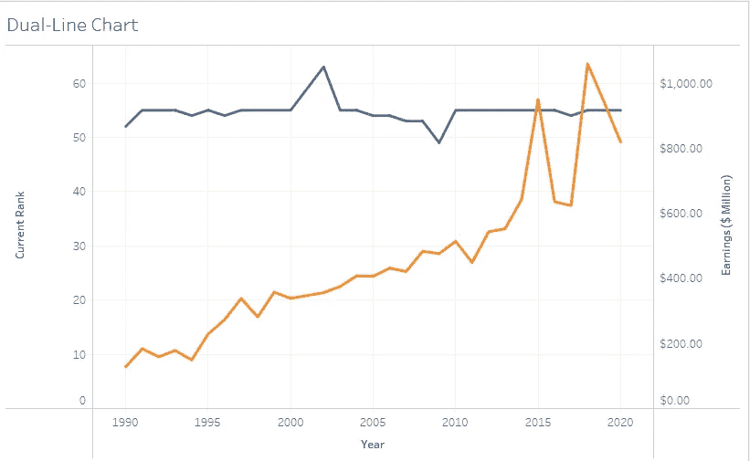

当我们想要比较连续时间内两个度量的性能时，这种类型的图表非常有用。它之所以被称为双轴，是因为我们有两个独立的轴用于两个不同的测量，尽管我们可以通过右键单击任何一个轴并选择“同步轴”来同步这两个轴以创建更好的视图。

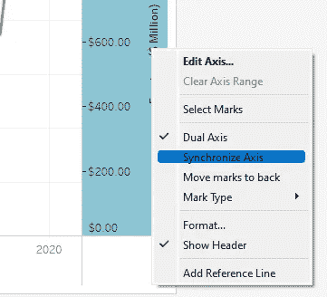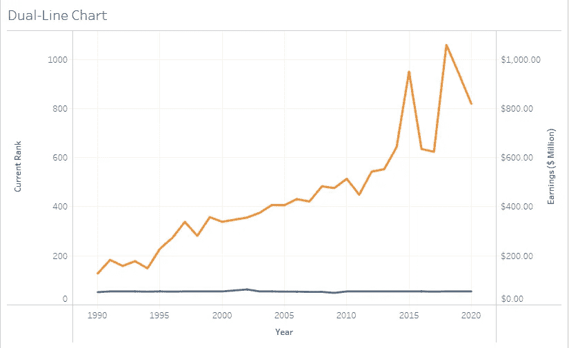

> 最低要求:
> 
> 1 个日期、0 个或更多维、2 个度量

## 组合轴图表

如果我们同步并隐藏双轴图表的任何轴，我们会得到一个组合轴图表。

最大的优势是我们可以添加另一个双轴图表，即一个视图中的三个测量值。

## 双轴图表与组合轴图表

*   在组合轴图表中，两个度量共享同一轴。在双轴图表中，两个度量都有不同的轴。
*   在组合轴图表中，只有一个标记。在双轴图表中，会创建多个标记。
*   在组合轴图表中，我们可以比较 2 个以上的度量。在双轴图表中，我们只能比较 2 个度量。
*   **组合轴图表也称为混合轴图表或共享轴图表。双轴图表也称为组合图表。**

# 圆形分格统计图表

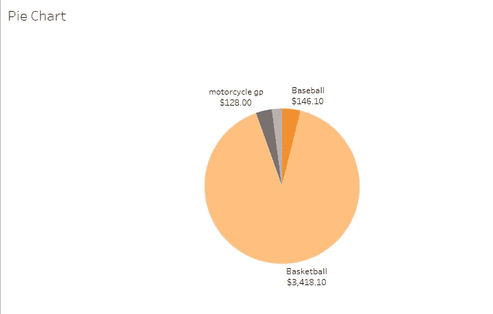

如果不使用饼图会更好，因为它们并不真正准确。看图表，除了篮球，其他三个部分看起来都差不多。如果没有给你确切的数据点，你能做出区分吗？我很确定不是。此外，如果我们有 20 个不同的切片，这将是一个烂摊子。

所以，只有当你最多有 6 个切片，最好是百分比关系时，才使用饼图。如果没有，你可以使用条形图。

**当我们添加一个饼图到视图中时，我们在我们的标记卡中得到“角度”选项。**

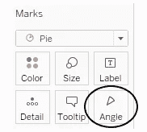

> 最低要求:
> 
> 一个或多个维度，1 或 2 个度量

# 对比图

有两种类型的面积图:

## 连续面积图

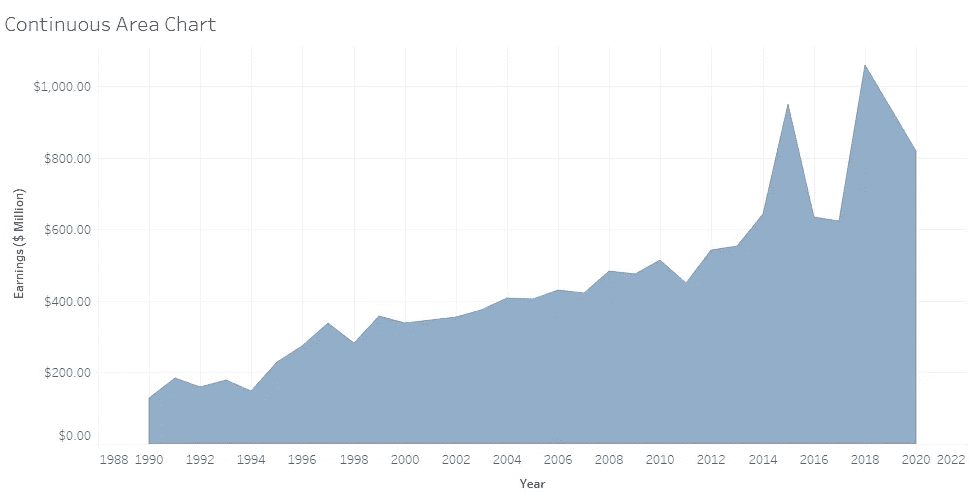

这是最漂亮的图表之一，它将折线图和条形图结合在一起。线条显示了多年来的进展，区域显示了测量的量。

> 最低要求:
> 
> 1 个日期、0 个或多个维度、1 个或多个度量

## 离散面积图

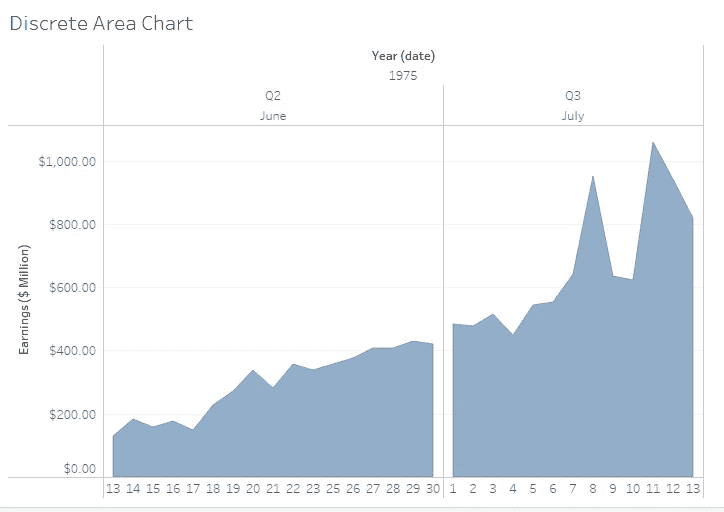

它类似于连续面积图，但需要离散日期而不是连续日期。

> 最低要求:
> 
> 1 个日期、0 个或多个维度、1 个或多个度量

# 地图

## 符号地图

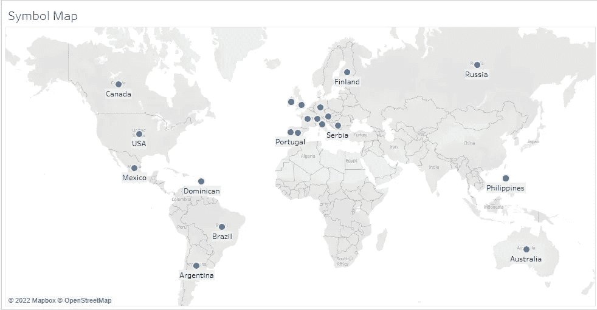

它可以用来讲述一个包含地理数据的故事。为了进一步增强视觉效果，我们可以调整尺寸和颜色。为了增加细节层次，我们可以在数据集中创建一个层次结构。我们也可以添加自定义形状，而不是圆点。我们可以将地图类型修改为卫星、街道、户外等。

> 最低要求:
> 
> 1 个地理维度，0 个或多个维度，0 到 2 个度量

## 填充地图

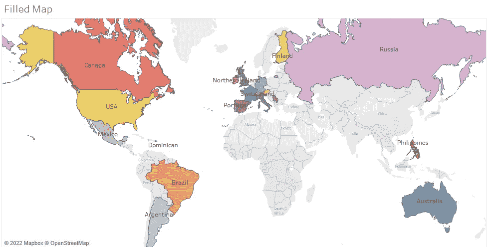

动机与符号地图相同，即使用地理数据。但是我们用颜色代替符号。看起来更直观，更吸引人。我们可以将地图类型修改为卫星、街道、户外等。

> 最低要求:
> 
> 1 个地理维度，0 个或多个维度，0 到 2 个度量

# 散点图

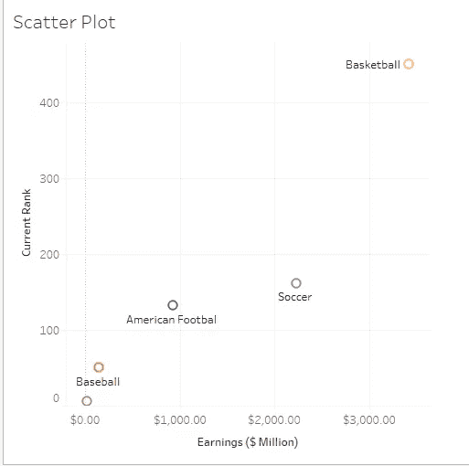

当我们想要比较两个不同的度量时，散点图是最好的图表之一。两个轴都包含两种不同的度量，为了给我们的图表添加更多的功能，我们可以添加一条趋势线来识别数据中的模式。

我们可以通过标记卡改变数据点的形状。

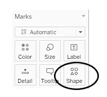

> 最低要求:
> 
> 0 或更多维，2 或 4 个度量值

# 线条图

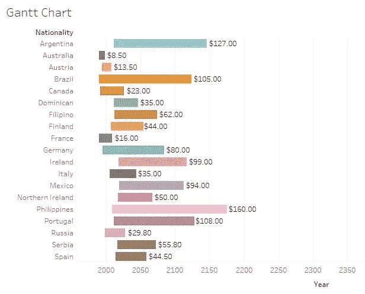

甘特图可以很好地比较一段时间内不同类别的任何衡量标准的绩效。它也是一个完美的项目管理工具。

> 最低要求:
> 
> 1 个日期、1 个或多个维度、0–2 个度量

# 泡泡图

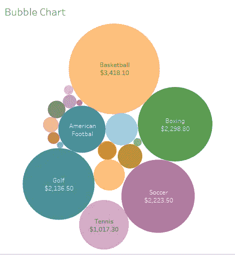

气泡图是最吸引人的图表之一。它会产生密集的气泡来有效利用空间。气泡的大小取决于尺寸，尺寸越高，气泡越大。

> 最低要求:
> 
> 1 或多个维度，1 或 2 个度量

# 柱状图

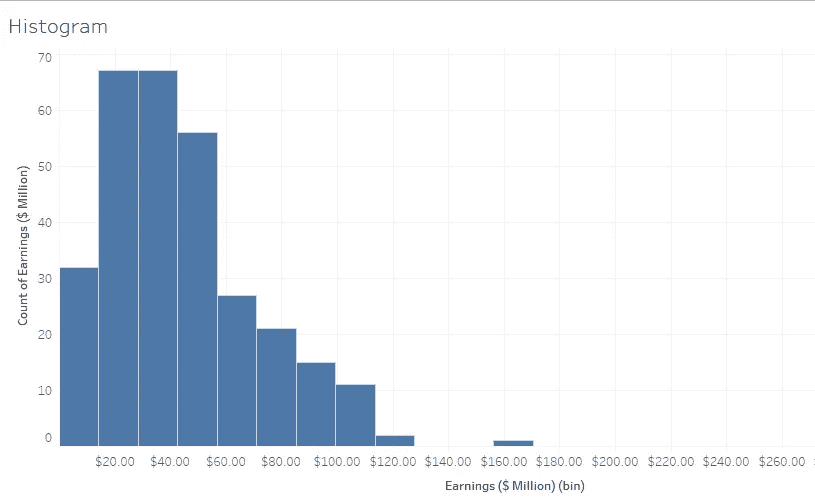

直方图有助于通过频率/计数来描述数据的分布。Tableau 会自动将数据分类，我们也可以手动操作。当我们想要分析我们的度量时，这个图表会很有用。

> 最低要求:
> 
> 1 项措施

# 文本表格(交叉标签/数据透视表)

这是表示数据的最简单的方法。该图表简单地创建了一个包含维度和度量的电子表格。这是最无聊的图表之一，因为它没有任何视觉线索，但它确实有用。

> 最低要求:
> 
> 一个或多个维度，一个或多个度量

# 热图

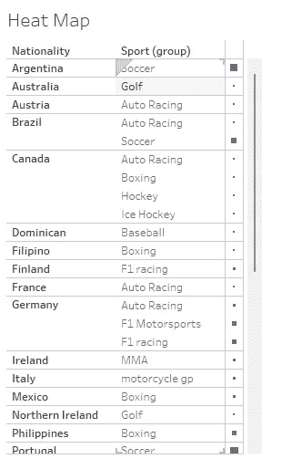

它是文本表格的扩展，使用颜色和形状来增强视图。

> 最低要求:
> 
> 1 个或多个维度，1 或 2 个度量值。

# 突出显示表格

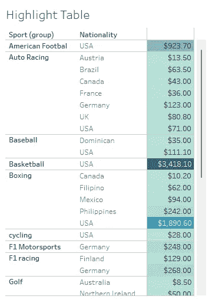

它是文本表格的扩展，使用彩色单元格(类似于 Excel 中的条件格式)。随着测量值的增加，颜色会变深。这个图表比文本表格更吸引人，因为它使用颜色作为线索。我们可以将配色方案设置为发散或收敛。

> 最低要求:
> 
> 1 个或多个维度，1 个度量

# 树形图

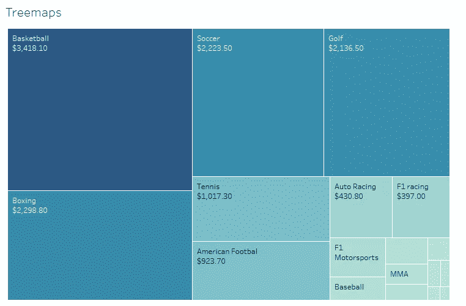

树形图是分层数据的理想图形。方框的大小取决于尺寸，该图在视觉上很吸引人，因为它使用了尺寸和颜色作为线索。度量值越高，盒子就越大。我们可以将配色方案更改为收敛或发散。

树形图只需要标记窗格，因此没有任何轴。但是为了增加粒度，我们可以向行/列架添加字段。树形图需要大小、颜色和细节。

> 最低要求:
> 
> 0 或多个维度，1 或多个度量值

# 盒须图

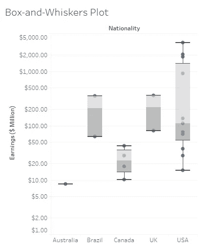

这是最复杂的 Tableau 图表之一。它比较了各个类别，并显示了每个类别的分布情况。

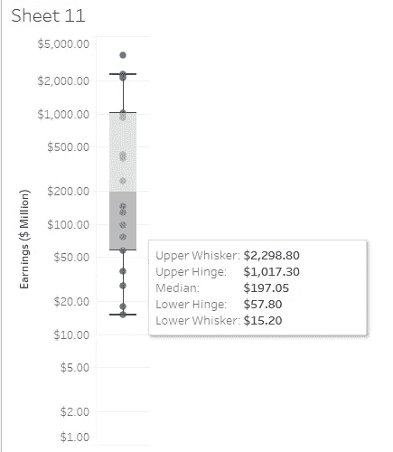

**上须和下须分别表示最大值和最小值。**

**上铰链和下铰链分别表示上四分位数(75%的数据点位于此处)和下四分位数(25%的数据点位于此处)。**

**中位数表示按升序/降序排序时数据的中间值。**

> 最低要求:
> 
> 0 或多个维度，1 或多个度量值

# **本主题的认证问题示例**

**哪个图表有助于识别异常值？** a .排列图
b .折线图
c .面积图
d .箱线图

**解决方案:**方框图

**双轴图表也被称为？** a .组合图表
b .组合轴图表
c .混合轴图表
d .共享轴图表

**解:**组合图

**创建组合集的先决条件是什么？**

a.他们必须有相同的名字。b .它们必须基于相同的维度。
c .我们无法创建组合集。
d .创建组合集没有先决条件。

**解决方案:**它们必须基于相同的维度

**挑错一个**

a.用折线图展示趋势
b .用条形图展示对比
c .用树形图展示积极和消极的措施
d .用折线图展示预测

**解决方案:**使用树形图显示积极和消极措施

**挑选关于直方图的错误陈述？**

a.直方图在显示连续的数字数据时效果最佳
b。与条形图不同，直方图不支持两个或更多类别之间的比较
c。对于影响顾客、消费者或客户的数据集，直方图可用于衡量满意度。
d .直方图是饼图的扩展版本

**解决方案:**直方图是饼图的扩展版本

> 使用链接访问免费 Tableau 认证转储(有效期至 2022 年 7 月 6 日):
> 
> [https://www . udemy . com/course/tableau-desktop-specialist-certification-dumps-2022/？coupon code = e3f 08189 fa 4 bafae 72 BC](https://www.udemy.com/course/tableau-desktop-specialist-certification-dumps-2022/?couponCode=E3F08189FA4BAFAE72BC)

# 参考资料:

[1] [Tableau 帮助| Tableau 软件](https://www.tableau.com/support/help)

[2] [个人笔记](https://dakshtrehan.notion.site/Tableau-Notes-c13fceda97b94bda940edbf6751cf303)

[3] [Tableau 桌面专家考试(新花样— 2021) — Apisero](https://apisero.com/tableau-desktop-specialist-exam-new-pattern-2021/)

# 感谢阅读！

请随意鼓掌，这样我就知道这篇文章对你有多有帮助，并在你的社交网络上分享它，这对我会很有帮助。

如果你喜欢这篇文章，想了解更多关于**机器学习，数据科学，Python，BI。请考虑订阅我的时事通讯:**

> [达克什·特雷汉的简讯](https://mailchi.mp/b535943b5fff/daksh-trehan-weekly-newsletter)。

在网上找到我:[www.dakshtrehan.com](http://www.dakshtrehan.com/)

在 LinkedIn 与我联系:[www.linkedin.com/in/dakshtrehan](http://www.linkedin.com/in/dakshtrehan)

阅读我的科技博客:[www.dakshtrehan.medium.com](http://www.dakshtrehan.medium.com/)

在 Instagram 上联系我:[www.instagram.com/_daksh_trehan_](http://www.instagram.com/_daksh_trehan_)

# 想了解更多？

[YouTube 是如何利用人工智能推荐视频的？](/how-is-youtube-using-ai-to-recommend-videos-38a142c2d06d)
[利用深度学习检测新冠肺炎](https://towardsdatascience.com/detecting-covid-19-using-deep-learning-262956b6f981)
[逃不掉的 AI 算法:抖音](https://towardsdatascience.com/the-inescapable-ai-algorithm-tiktok-ad4c6fd981b8)
[GPT-3 向一个 5 岁的孩子解释。](/gpt-3-explained-to-a-5-year-old-1f3cb9fa030b)
[Tinder+AI:一场完美的牵线搭桥？](https://medium.com/towards-artificial-intelligence/tinder-ai-a-perfect-matchmaking-b0a7b916e271)
[一个内部人士的使用机器学习卡通化指南](https://medium.com/towards-artificial-intelligence/an-insiders-guide-to-cartoonization-using-machine-learning-ce3648adfe8)
[谷歌是如何做出“哼哼来搜索？”](/how-google-made-hum-to-search-865f224b70d0)
[一行神奇的代码执行 EDA！](/one-line-magical-code-to-perform-eda-f83a731fbc35)
[给我 5 分钟，我给你深度假！](/give-me-5-minutes-ill-give-you-a-deepfake-ce83a645b0f9)

> *欢呼*