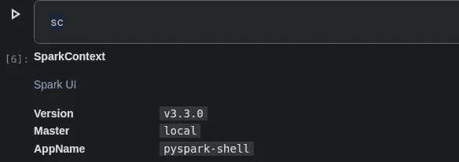
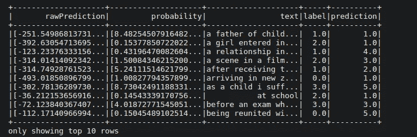

# 使用 PySpark MLlib 进行文本分类的综合指南

> 原文：<https://pub.towardsai.net/a-comprehensive-guide-for-text-classification-using-pyspark-mllib-d9c45c824458?source=collection_archive---------1----------------------->

> **简介**

你有没有想过，如果你在社交媒体网站上发布了一些违反他们社区标准的东西，他们如何识别它并采取适当的行动？

嗯，这背后的想法叫做**分类**，无论是**文字**分类、**图片**分类、**视频**分类，还是**音频**分类。尽管如此，这个概念保持不变；我们试图对相关和不相关的内容进行分类。


> **问题陈述**

你在一家大型科技公司工作，该公司希望根据社交媒体内容分析客户的情绪，以便为客户采取适当的措施。

你需要在 **6 个不同的类别**之间进行分类，即悲伤、快乐、爱、惊讶、愤怒和恐惧。所以给定的问题称为**多类分类。**

> **数据准备**

任何机器学习算法的第一步都是获取数据，所以我们要使用 Kaggle 提供的开源数据，你可以从 ka ggle->[https://www . ka ggle . com/datasets/praveengovi/emotions-dataset-for-NLP](https://www.kaggle.com/datasets/praveengovi/emotions-dataset-for-nlp)下载数据

我们有文本文件形式的数据，值之间用(；)，所以在做任何转换和模型建立之前，首先我们需要把我们的数据做成某种方式，让 spark 可以轻松读取，

现在让我们导入创建 Spark 会话所需的所有包。



图片来自作者

如您所见，我们有 Spark UI，它由版本号、主版本和 AppName 组成。

现在让我们使用 spark 上下文来读取数据，

如您所见，我们有两列**和**，一列包含**文本**，另一列是我们需要预测的**目标**变量，即情感；如我之前所说，这是监督学习，因为我们有数据列和目标列，

接下来，让我们对数据集进行一些探索

**检查任何空值**

所以我们没有任何空值，这很好

**让我们检查一下我们的目标数据分布**

> **特色工程**

为什么我们需要做特征工程？？？

答案是**非常直接**，“我们的机器学习模型只会理解数字特征。”

因此，在自然语言处理中，我们需要一些方法将我们的类别特征转换成数字特征，我们有很多方法将类别特征转换成数字特征。

我们可以使用类似于**计数矢量器**、 **BagOfWords** 、 **TFIDF** 、 **OneHotEncoder** 、 **WordEmbeddings** 、 **HashingTF** 等技术…

为了解决问题陈述，我们将创建一个管道，它由特征工程方法和我们的预测模型组成，

因此，对于功能工程，我们将创建一个管道，它由 T **okenizer、StopwordRemover、CountVectorizer 和 IDF** 组成，所以让我们这样做，

在上面的代码中，我们正在执行不同的操作，如 tokenizer、stopwordRemover、Vectorizer 和 IDF，这些函数中的每一个都需要 inputCol(您希望在哪个列中进行转换)和 outputCol(我们应该将转换后的数据放在哪里)

接下来，我们还需要**对案例中的目标列**进行编码(情感列)

我们来查一下悲伤是怎么 1.0，愤怒是怎么 2.0，等等…

```
print(labelEncoder.labels)
['joy', 'sadness', 'anger', 'fear', 'love', 'surprise']
```

在这里，我们可以看到快乐被标记为 0，悲伤被标记为 1，以此类推，我们可以用这个来预测实际的情绪，而不是 0，1，2…

> **模型构建**

现在我们有了处理过的数据，是时候建立我们的**机器学习模型了，**但是在建立模型之前，我们需要将我们的数据分成训练集和测试集，让我们开始吧。

```
#  split dataset
(train_df,test_df) = data.randomSplit((0.7,0.3),seed=42)
```

我们把数据分成 70:30 的比例，

现在让我们创建并定义我们的模型和管道，我们将使用**朴素贝叶斯分类器。**

在上面的代码中，我们成功地创建了带有管道的模型，

现在让我们在 train_df 上拟合模型

```
nb_model = pipeline.fit(train_df)
```

获得对测试数据集的预测

```
# get prediction on test data
predictions = nb_model.transform(test_df)
```

获取预测数据框中的所有列

```
print(predictions.columns)['text',
 'emotion',
 'label',
 'tokens',
 'filterTokens',
 'rawFeatures',
 'vectorizerFeatures',
 'rawPrediction',
 'probability',
 'prediction']
```

我们可以看到有很多列，但是我们只选择了我们需要的列，

```
predictions.select('rawPrediction', 'probability','text','label','prediction').show(10)
```



图片来自作者

在上图中，我们可以看到我们有原始预测、概率、文本、标签、预测，

> **模型评估**

现在是时候检查我们的模型表现的好坏了，

**准确率:- 73.84%，**

因此，我们获得了 73.84%的准确率，这对于基线模型来说并不算太差，而且我们使用了一个非常简单的模型，只进行了最少的文本处理，但我们仍然获得了 73%的准确率，这是非常好的。

让我们检查其他矩阵，如 f1、精度等等…

让我们画出困惑矩阵。

> **保存并加载模型**

一旦我们创建了模型，现在是保存模型的时候了，这在 PySpark MLlib 中非常简单。

```
# save and load the model
modelPath  = "models/pyspark_nb_model"
nb_model.write().save(modelPath)
```

这段代码将模型保存到给定的路径中

现在让我们把它装回去

```
# loading pickled model 
from pyspark.ml.pipeline import PipelineModel
presistedModel  =PipelineModel.load(modelPath)
```

> **模型预测**

给定自己的数据/内容，我们来预测一下情绪。

如果你记得上面的，哪个数字代表哪种情绪，

```
print(labelEncoder.labels)
['joy', 'sadness', 'anger', 'fear', 'love', 'surprise']
```

对于我们的第一个文本，**“哇，我喜欢这部电影，我对此感到兴奋，”**我们得到的预测是 5，对应于**惊喜**，这似乎是正确的，

对于第二条文字，**“再也不要回来找我我不喜欢你”**对应的是 1，也就是**悲伤**

看起来这个模型运行的很好，

> **需要改进的地方**

正如我们从上面的代码中看到的，我们的模型精度大约是 73%，这不是很好，我们可以努力提高我们的性能，为此，我们可以使用**更好的模型选择**，**更好的特征工程技术**，我们也可以使用**交叉验证技术，**

这个博客的座右铭是让你熟悉 **PySpark 以及我们如何使用 Mllib 进行机器学习处理。**

> **结论**

在本文中，我们学习了如何将 PySpark 与 MLlib 结合使用，以及如何创建多类分类模型。

我们首先将数据加载到 PySpark 数据框中，以便 MLlib 能够工作，然后我们进行了特征工程，其中包含标记化、IDF 和计数矢量器，以将我们的类别特征转换为数字特征，以便我们的模型能够理解这种关系。之后，我们用所有需要的细节初始化我们的模型，即特征列和目标列，最后，通过使用管道，我们将所有这些添加到一个函数中来训练和预测。

然后在我们做了模型评估之后，我们也用我们的句子做了模型测试，我们得到了一个相当好的结果:)

记住，本文只是使用 PySpark MLlib 解决分类问题的一种方法；很多东西都可以根据你的需要更新或者改变；请随意探索更多内容，并以本文为起点。

我希望你从这篇文章中学到了一些东西；下一篇文章再见。

查看我的 Youtube 频道，了解与 ML、AI、NLP 等相关的项目-> [Youtube](https://www.youtube.com/c/himanshutripathi)

暂时就这样了。下一篇文章再见。

让我们在 [Linkedin](https://www.linkedin.com/in/iamhimanshu0/) 、 [Twitter](https://twitter.com/iam_himanshu0) 、 [Instagram](https://instagram.com/iamhimanshu0/) 、 [Github](https://github.com/iamhimanshu0) 、[脸书](https://www.facebook.com/iamhimanshu0)上连线。

**感谢阅读！**