# 用熊猫掌握数据分析:使用斯坦福开放警务数据的逐步指南

> 原文：<https://pub.towardsai.net/a-comprehensive-guide-to-data-analysis-using-pandas-the-stanford-open-policing-data-44e059defa86?source=collection_archive---------1----------------------->

## 数据分析项目指南—使用 Pandas power 从您的数据中获取有价值的信息


由 [path 数码](https://unsplash.com/@pathdigital?utm_source=medium&utm_medium=referral)在 [Unsplash](https://unsplash.com?utm_source=medium&utm_medium=referral) 上拍摄

> 熊猫图书馆为数据科学提供了广泛的功能，包括清理、可视化和探索。但是，需要注意的是，使用该工具并不能保证结果准确。对库的不当使用会导致错误的结论、遗漏的数据或误导性的计算。本教程将指导您完成常见的数据科学任务，向您展示如何有效地使用 Pandas 以及如何避免常见错误。到最后，你将有信心和知识以负责任和有效的方式使用熊猫。

该数据集包含从美国警察进行的交通拦截次数以及在这些拦截期间发生的事情中获得的数据。数据范围从 2005 年到 2015 年。数据集是从斯坦福开放警务项目获得的。收集这些数据的目的是监测和加强该国执法部门和公众之间的互动。

## 目录:

在这个项目中，我们考察了一些与警察拦截一群来自美国斯坦福地区的人有关的因素。特别是，我们希望了解驾驶员年龄和驾驶员性别之间的关系，以及警察阻止他们的时间。

一个好的数据分析项目就是问问题。在这篇博文中，我们将回答以下问题:

1.  男人还是女人更经常超速？
2.  性别会影响在停车时谁会被搜查吗？
3.  在搜查过程中，司机多久被搜身一次？
4.  哪一年停车次数最少？
5.  药物活性如何随时间变化？
6.  大多数停靠站都在晚上吗？

# 读取数据

第一步是获取数据并将其加载到内存中。可以从这个链接下载资料:[斯坦福开放警务项目](https://www.kaggle.com/faressayah/stanford-open-policing-project)。我们正在用熊猫进行数据处理。用于数据可视化的 Matplotlib、Seaborn 和 hvPlot。一种快速检查数据的方法是使用`.head()`方法。

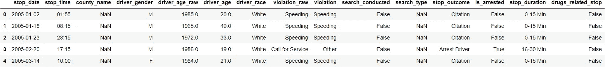

成功读取数据后，我们需要检查我们的数据。熊猫有很多功能，可以让我们快速有效地发现我们的数据。这里的目标是找到关于数据的更多信息，并成为您正在使用的数据集的主题专家。

一般来说，我们需要了解以下问题:

1.  我们有什么样的数据，我们如何对待不同类型的数据？
2.  数据中缺失了什么，你是如何处理的？
3.  如何添加、更改或删除功能以充分利用您的数据？

## 关于数据的信息

`.info()`方法打印关于数据帧的信息，包括索引`dtype`和列、非空值以及内存使用情况。

```
<class 'pandas.core.frame.DataFrame'>
RangeIndex: 91741 entries, 0 to 91740
Data columns (total 15 columns):
 #   Column              Non-Null Count  Dtype  
---  ------              --------------  -----  
 0   stop_date           91741 non-null  object 
 1   stop_time           91741 non-null  object 
 2   county_name         0 non-null      float64
 3   driver_gender       86406 non-null  object 
 4   driver_age_raw      86414 non-null  float64
 5   driver_age          86120 non-null  float64
 6   driver_race         86408 non-null  object 
 7   violation_raw       86408 non-null  object 
 8   violation           86408 non-null  object 
 9   search_conducted    91741 non-null  bool   
 10  search_type         3196 non-null   object 
 11  stop_outcome        86408 non-null  object 
 12  is_arrested         86408 non-null  object 
 13  stop_duration       86408 non-null  object 
 14  drugs_related_stop  91741 non-null  bool   
dtypes: bool(2), float64(3), object(10)
memory usage: 9.3+ MB
```

## 关于数据的描述性统计

`.describe()`生成描述性统计数据。描述性统计包括那些总结数据集分布的集中趋势、离散度和形状的统计，不包括`NaN`值。

分析数值和对象序列，以及混合数据类型的`DataFrame`列集。根据所提供的内容，输出会有所不同。有关更多详细信息，请参考下面的注释。


## 数据的形状

使用'`.shape`'查看数据帧形状:行、列

```
(91741, 15)
```

## 缺少值

在现实生活中，丢失数据是一个非常大的问题。在 Pandas 中，缺失数据由两个值表示:`NaN`或`None`。帕纳斯有几个有用的函数来检测、删除和替换 Pandas 数据帧中的空值:`.isna()`或`.isnull()`用于查找`NaN` , `.dropna()`用于删除`NaN`,`.fillna()`用特定值填充`NaN`。

```
stop_date                 0
stop_time                 0
county_name           91741
driver_gender          5335
driver_age_raw         5327
driver_age             5621
driver_race            5333
violation_raw          5333
violation              5333
search_conducted          0
search_type           88545
stop_outcome           5333
is_arrested            5333
stop_duration          5333
drugs_related_stop        0
dtype: int64
```

## 南是什么意思？

在计算中，`NaN`代表非数字，是数字数据类型的成员，可以解释为未定义或不可表示的值，特别是在浮点运算中。

**为什么某个值可能会丢失？**

丢失值的原因有很多，丢失数据可能是由于`nonresponse`、`Attrition`、`governments or private entities`、...

**为什么标成南？为什么不标记为 0 或空字符串或表示“未知”的字符串？**

我们将缺失值标记为`NaN`,以区别于特征的原始`dtype` 。

## 删除只包含缺失值的列。

```
stop_date           : ==============> 0.00%
stop_time           : ==============> 0.00%
county_name         : ==============> 100.00%
driver_gender       : ==============> 5.82%
driver_age_raw      : ==============> 5.81%
driver_age          : ==============> 6.13%
driver_race         : ==============> 5.81%
violation_raw       : ==============> 5.81%
violation           : ==============> 5.81%
search_conducted    : ==============> 0.00%
search_type         : ==============> 96.52%
stop_outcome        : ==============> 5.81%
is_arrested         : ==============> 5.81%
stop_duration       : ==============> 5.81%
drugs_related_stop  : ==============> 0.00%
```

删除丢失的值:如果所有值都是`NaN`，删除该行或列。

```
(91741, 14)
```

所有的数据都丢失了。我们将`drop`这个栏目。

```
stop_date                 0
stop_time                 0
driver_gender          5335
driver_age_raw         5327
driver_age             5621
driver_race            5333
violation_raw          5333
violation              5333
search_conducted          0
search_type           88545
stop_outcome           5333
is_arrested            5333
stop_duration          5333
drugs_related_stop        0
dtype: int64
```

# 男人还是女人更经常超速？

要回答这个问题，我们需要知道数据集中男性和女性的比例。之后，我们需要检查因超速被拦下的男女比例。

```
M    62895
F    23511
Name: driver_gender, dtype: int64

M    0.727901
F    0.272099
Name: driver_gender, dtype: float64
```

```
Speeding               48463
Moving violation       16224
Equipment              11020
Other                   4317
Registration/plates     3432
Seat belt               2952
Name: violation, dtype: int64

Speeding               0.560862
Moving violation       0.187760
Equipment              0.127534
Other                  0.049961
Registration/plates    0.039719
Seat belt              0.034164
Name: violation, dtype: float64
```

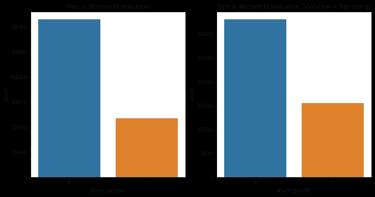

1:驾驶员性别分布——男性`62895` ( `73%`)，女性`23511` ( `27%` ) | 2:驾驶员性别 vs 违章速度分布——男性`62895` ( `68%`)，女性`23511` ( `32%`)

在这个数据集中，我们`62895` ( `73%`)男性和`23511` ( `27%`)女性。因此，在回答这个问题时，我们必须考虑数据的不等价分布或使用分数。

超速违章代表我们数据集中所有违章的`56%`。

```
M    32979
F    15482
Name: driver_gender, dtype: int64

M    0.680527
F    0.319473
Name: driver_gender, dtype: float64
```

## 当一个人被拦下来时，多久会超速一次？

```
Speeding               32979
Moving violation       13020
Equipment               8533
Other                   3627
Registration/plates     2419
Seat belt               2317
Name: violation, dtype: int64
```

```
Speeding               0.524350
Moving violation       0.207012
Equipment              0.135671
Other                  0.057668
Registration/plates    0.038461
Seat belt              0.036839
Name: violation, dtype: float64
```

从`62895`男子被警察拦下，`32979 (~53%)`因超速被拦下。

## 当一个女人被拦下来时，多久会超速一次？

```
Speeding               15482
Moving violation        3204
Equipment               2487
Registration/plates     1013
Other                    690
Seat belt                635
Name: violation, dtype: int64
```

```
Speeding               0.658500
Moving violation       0.136277
Equipment              0.105780
Registration/plates    0.043086
Other                  0.029348
Seat belt              0.027009
Name: violation, dtype: float64
```

从`23511`女子被警察拦下，`15482 (~66%)`因超速被拦下。

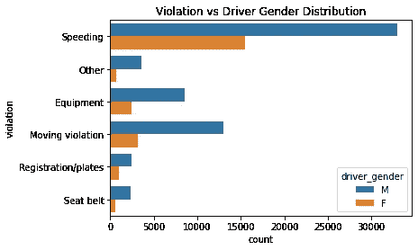

男性因超速而停车的比率为`68%`，女性因超速而停车的比率为`32%`，这与我们数据中男性(`73%`)和女性(`27%`)的比例不同。所以我们可以说，女性比男性更容易因超速被拦下。

# 性别会影响在停车时谁会被搜查吗？

要回答这个问题，我们需要知道在所有停留期间进行的搜索次数。

```
False    88545
True      3196
Name: search_conducted, dtype: int64
```

```
False    0.965163
True     0.034837
Name: search_conducted, dtype: float64
```

在所有的`88545`回采案例中，只搜索了`3196 (3%)`的数据。

```
M    2725
F     471
Name: driver_gender, dtype: int64
```

```
M    0.852628
F    0.147372
Name: driver_gender, dtype: float64
```

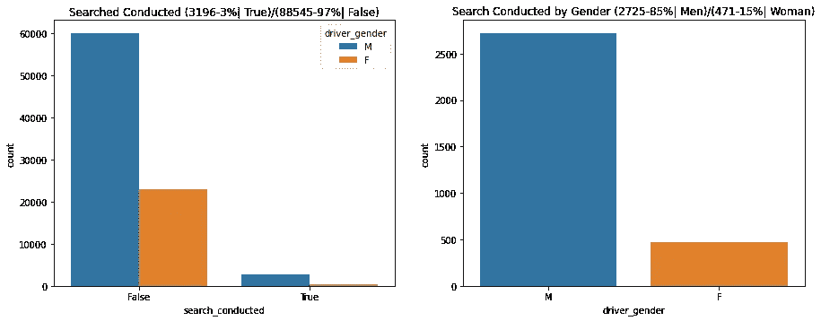

## 这能证明因果关系吗？

*   因果关系很难断定，所以把重点放在关系上
*   在研究一段关系时，包括所有相关因素

从停止的案件中，`2725` ( `85%`)是`men`，只有`471` ( `15%`)是女性。这一结果意味着在停车时，男性比女性更容易被搜身。

# 为什么' search_type '经常丢失？

```
88545
```

```
False    88545
True      3196
Name: search_conducted, dtype: int64
```

```
NaN    88545
Name: search_type, dtype: int64
```

`search_type`每次警察不搜查就失踪。现在我们知道为什么缺少搜索类型了。我们可以使用熊猫函数`.fillna()`通过`Not Searched`来填充搜索类型中缺少的值。

## 注意事项:

*   验证您对数据的假设
*   默认情况下，熊猫函数忽略缺失值

# 在搜查过程中，司机多久被搜身一次？

`search_type`是用逗号分隔的搜索类型文本。所以，我们需要把搜索类型分开，然后统计一下 Frisk 的出现。

```
Incident to Arrest                                          1219
Probable Cause                                               891
Inventory                                                    220
Reasonable Suspicion                                         197
Protective Frisk                                             161
Incident to Arrest,Inventory                                 129
Incident to Arrest,Probable Cause                            106
Probable Cause,Reasonable Suspicion                           75
Incident to Arrest,Inventory,Probable Cause                   34
Incident to Arrest,Protective Frisk                           33
Probable Cause,Protective Frisk                               33
Inventory,Probable Cause                                      22
Incident to Arrest,Reasonable Suspicion                       13
Inventory,Protective Frisk                                    11
Incident to Arrest,Inventory,Protective Frisk                 11
Protective Frisk,Reasonable Suspicion                         11
Incident to Arrest,Probable Cause,Protective Frisk            10
Incident to Arrest,Probable Cause,Reasonable Suspicion         6
Incident to Arrest,Inventory,Reasonable Suspicion              4
Inventory,Reasonable Suspicion                                 4
Inventory,Probable Cause,Protective Frisk                      2
Inventory,Probable Cause,Reasonable Suspicion                  2
Incident to Arrest,Protective Frisk,Reasonable Suspicion       1
Probable Cause,Protective Frisk,Reasonable Suspicion           1
Name: search_type, dtype: int64
```

我们将使用`collections`库中的`Counter`函数来统计每个 search_type 的数量。

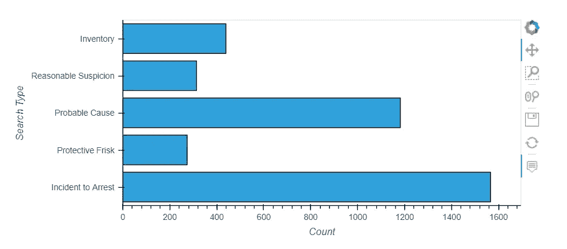

```
274
```

```
0.08573216520650813
```

我们有 5 种搜索类型(库存、合理怀疑、可能原因、保护性搜查、逮捕事件)。进行的所有搜查都是保护性搜身。

# 哪一年停车次数最少？

`stop_date`和`stop_time`是对象类型，所以我们需要将它们转换成 Pandas DateTime 对象，以便于操作它们。将我们的日期作为`datetime64`对象将允许我们通过`.dt` API 访问大量的日期和时间信息。

```
object
object
```

```
0        2005-01-02
1        2005-01-18
2        2005-01-23
3        2005-02-20
4        2005-03-14
Name: stop_date, Length: 91741, dtype: object
```

```
stop_date             datetime64[ns]
stop_time                     object
driver_gender                 object
driver_age_raw               float64
driver_age                   float64
driver_race                   object
violation_raw                 object
violation                     object
search_conducted                bool
search_type                   object
stop_outcome                  object
is_arrested                   object
stop_duration                 object
drugs_related_stop              bool
year                           int64
dtype: object
```

```
2012    10970
2006    10639
2007     9476
2014     9228
2008     8752
2015     8599
2011     8126
2013     7924
2009     7908
2010     7561
2005     2558
Name: year, dtype: int64
```

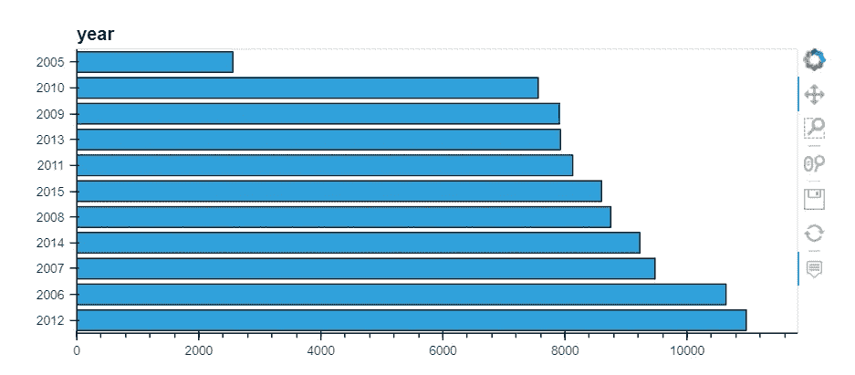

2012 年和 2006 年是警方逮捕人数最多的两年。2005 年是警察逮捕最少的一年。

# 药物活性如何随时间变化？

为了回答这个问题，我们需要检查数据集中的`drug_related_stop`列，为了跟踪一天中的这些活动，我们使用`stop_time`列。

```
False    90926
True       815
Name: drugs_related_stop, dtype: int64
```

```
False    0.991116
True     0.008884
Name: drugs_related_stop, dtype: float64
```

从我们所有的记录来看，`815 (0.88%)`次停车都与毒品有关。

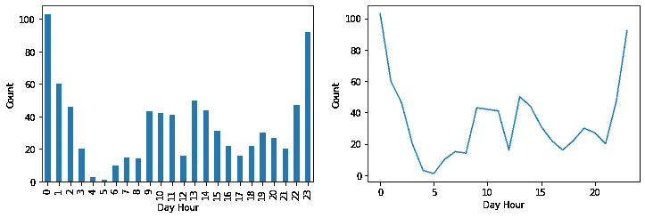

大多数与毒品有关的停留是在晚上 10 点至凌晨 1 点之间，这非常符合逻辑，因为大多数吸毒者都在一天的这个时间吸毒，但我们需要更大的数据集来证实这一假设。

# 大多数停靠站都在晚上吗？

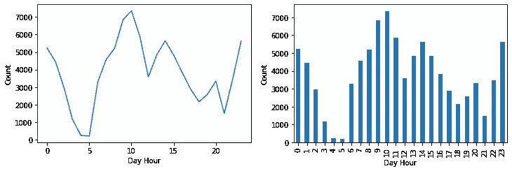

从图中可以看出，大多数停靠站都是在白天，而不是在晚上。但这是非常符合逻辑的，因为白天的交通比夜间的交通多。

# 找到 stop_duration 列中的错误数据并修复它

```
stop_duration Missing Values: 5333
stop_duration Unique Values: ['0-15 Min' '16-30 Min' '30+ Min' nan '2' '1']
```

默认情况下，`pandas.value_counts()`忽略缺失值。通过`dropna=False`使其计算缺失值。

```
0-15 Min     69543
16-30 Min    13635
NaN           5333
30+ Min       3228
2                1
1                1
Name: stop_duration, dtype: int64
```

似乎我们有两个额外的类别`1`和`2`，每个类别只有一个记录。我们会将它们视为缺失值。

```
0-15 Min     69543
16-30 Min    13635
NaN           5335
30+ Min       3228
Name: stop_duration, dtype: int64
```

# 每个违例的平均停止持续时间是多少？

对于`stop_duration`，我们有三个类别:“0-15 分钟”、“16-30 分钟”和“30+分钟”。

```
stop_duration Unique Values: ['0-15 Min' '16-30 Min' '30+ Min' nan '2' '1']

violation_raw Number of Unique Values: 12
```

```
violation_raw Unique Values: [
'Speeding' 'Call for Service'   
'Equipment/Inspection Violation' 
'Other Traffic Violation' 
nan 
'Registration Violation', 
'Special Detail/Directed Patrol' 
'APB' 
'Violation of City/Town Ordinance'
'Suspicious Person' 
'Motorist Assist/Courtesy' 
'Warrant'
'Seatbelt Violation'
]
```

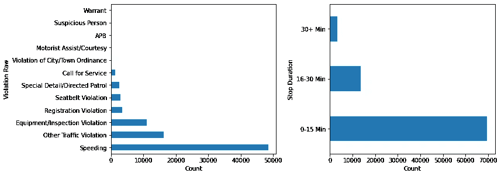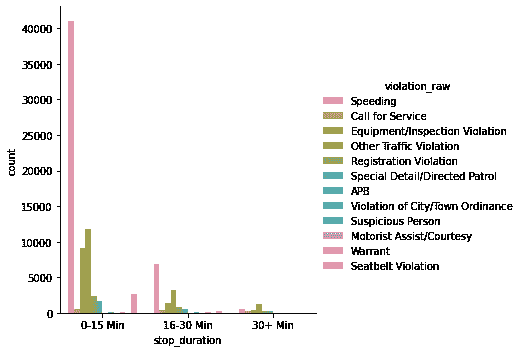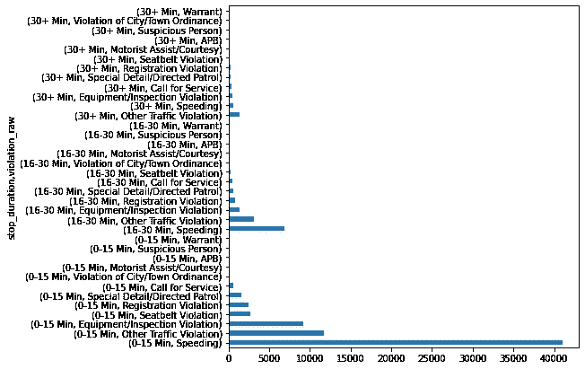

让我们创建一个新的列，在该列中，我们将时间间隔替换为平均值，这样我们就可以对它们应用数学运算。我们将它们映射如下:“0-15 分钟”:8，“16-30 分钟”:23，“30+分钟”:45。

```
8.0     69543
23.0    13635
45.0     3228
Name: stop_minutes, dtype: int64
```

```
violation_raw
APB                                 20.987342
Call for Service                    22.034669
Equipment/Inspection Violation      11.460345
Motorist Assist/Courtesy            16.916256
Other Traffic Violation             13.900265
Registration Violation              13.745629
Seatbelt Violation                   9.741531
Special Detail/Directed Patrol      15.061100
Speeding                            10.577690
Suspicious Person                   18.750000
Violation of City/Town Ordinance    13.388626
Warrant                             21.400000
Name: stop_minutes, dtype: float64
```

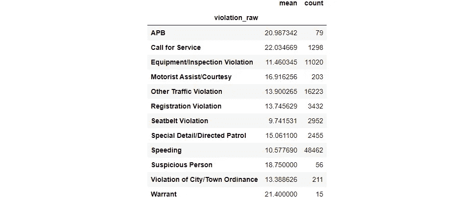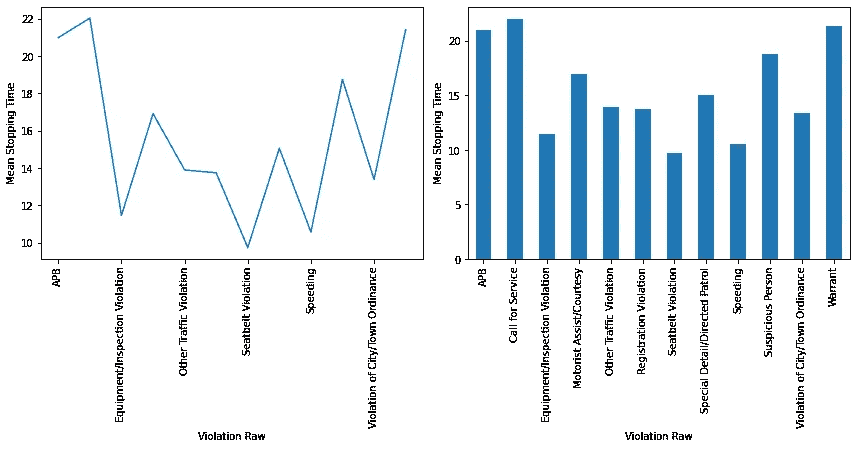

# 比较每个违规的年龄分布

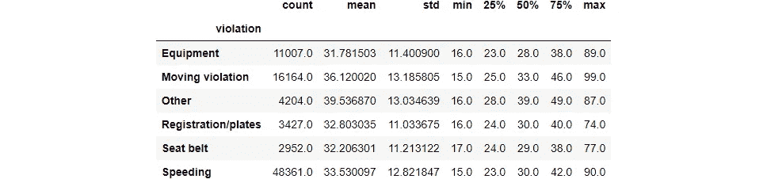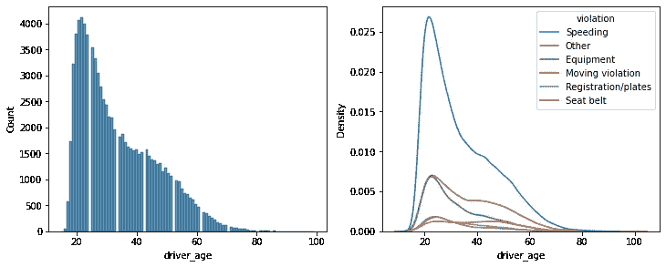

# 摘要

良好的数据分析需要掌握工具(Python 和 Pandas)和创造性思维(理解我们正在解决的问题并提出正确的问题)。在本文中，我们发现了如何执行数据分析。具体来说，我们了解到:

*   探索新数据集的第一步是确保数据类型设置正确。
*   因果关系很难断定，所以把重点放在关系上。所以，在研究一段关系时，要包括所有相关的因素。
*   对日期和时间使用 DateTime 数据类型。
*   使用可视化工具帮助您了解数据的趋势。

# 链接和资源:

*   链接到本教程中使用的数据:[斯坦福开放警务项目](https://www.kaggle.com/faressayah/stanford-open-policing-project)
*   链接到[完整笔记本](https://www.kaggle.com/faressayah/data-science-best-practices-with-pandas-part-2)