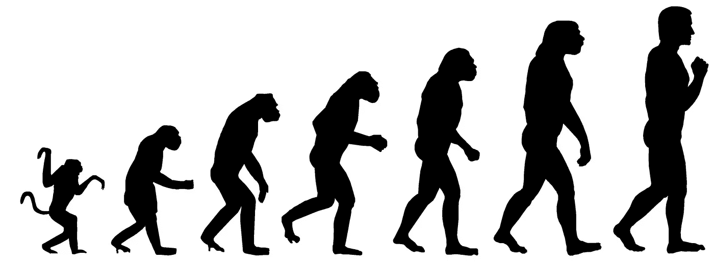
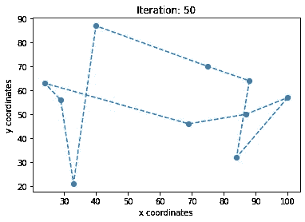
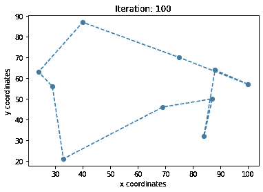
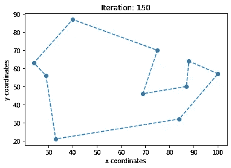
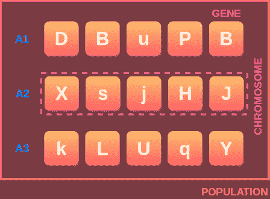
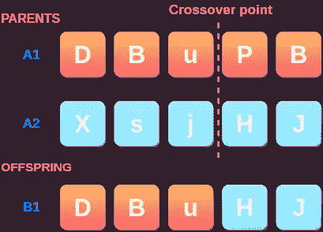
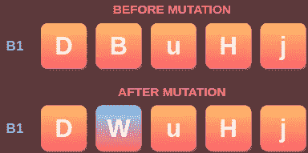

# 遗传算法简介

> 原文：<https://pub.towardsai.net/a-comprehensive-guide-to-genetic-algorithms-the-eli5-way-fcc8940ae9a4?source=collection_archive---------1----------------------->

## [编程](https://towardsai.net/p/category/programming)

[来源](https://towardsdatascience.com/gradient-descent-vs-neuroevolution-f907dace010f)

遗传算法基于查尔斯·达尔文的自然选择理论，通常用于解决研究和机器学习中的问题。

在这篇文章中，我们将学习遗传算法(GA) 的基础知识，以及如何使用它们来解决优化问题。

# 什么是遗传算法？

遗传算法是由密歇根大学的约翰·亨利·霍兰德和他的学生及合作者在 20 世纪 70 年代和 80 年代开发的。

它是进化算法的一个子集，它模仿自然选择的过程，其中最适合的个体生存下来，并被选择进行杂交，以繁殖下一代的后代。

自然选择过程还包括以突变的形式给后代增加小的随机性。这将导致一个新的群体的个人混合健身。

但是只有最适合的个体被选择出来进行繁殖，并且适应度在几代中不断提高。

# 优化问题的遗传算法

当遗传算法用于解决优化问题或搜索问题时，自然选择的过程不断重复，直到终止。

用遗传算法解决旅行商问题。

**终止**通常发生在达到新生成的个体与上一代没有显著差异的时候。

这意味着算法已经达到问题的最优或接近最优的解决方案。

实际上，遗传算法的工作原理如下。

**第一步。**生成一组随机个体

**第二步。**从给定的个体群体中寻找最佳个体

**第三步。**把他们交出来

**第四步。**轻微变异的新一代后代

**第五步。**重复*步骤 2 至 4* 直到终止

让我们简要地看一下这些步骤和使用的术语。我们还将尝试实现一种遗传算法，该算法解决了从随机字符串开始生成给定最佳字符串的问题。

# 原始群体

基因、染色体、群体——作者图片

这个过程从创造第一代个体开始，他们被称为初始种群。

每个个体都是给定问题的解决方案，并以一组称为基因的参数为特征。这些基因像链条一样连接在一起形成染色体。

创建初始群体的两种主要方法是，

1.  **随机初始化**——随机产生个体(解)
2.  **启发式初始化**——基于问题的已知启发式生成个体

在本教程中，我们将坚持随机初始化，并进一步进行。

# 适应度函数

为了发现一个人与其他人相比有多好或“适合”,我们使用一个适应度函数。

适应度函数将个人作为输入，并基于个人在找到问题的最优解决方案方面的表现返回适应度分数。

只有具有最高适应性分数的个体将被选择用于交叉(繁殖)。在本教程中，让我们只选择前两个最适合的个体进行交叉。

适应度函数必须足够快，因为适应度分数是为每一代的所有个体计算的。

在由于问题的复杂性而无法直接计算适应度的情况下，我们可以使用**适应度近似法**。

# 选择

父代选择，或简称选择，是选择最佳个体进行交叉的过程，对于遗传算法的收敛至关重要。

选择过程的目标是选择最适合的个体进行杂交，同时保持下一代足够多样化。

通常使用以下选择策略之一来选择个体。

1.  **适应度比例选择** —个体被选择进行交叉的概率*与其适应度分数*成正比。然而，它不适用于负的适应值。
2.  **锦标赛选择** —从群体中随机选择 *n* 个个体，只有最适合的个体进入下一轮锦标赛。
3.  **分级选择** —根据个体的适应度对个体进行分级，并选择等级最高的个体。简单来说，选择适应值最高的个体进行交叉。

在本教程中，我们将使用排名选择过程来选择交叉的个人。

# 交叉

遗传算法中的交叉类似于生物交叉，交叉是当前一代的个体将他们的基因传递给下一代个体的过程。

一旦交叉过程结束，新产生的个体替换旧的个体，并重复选择和交叉的过程。

单点交叉示例—图片由作者提供

两种常用的交叉方法是，

1.  **基于点的交叉**——子代染色体在一个或多个点上随机分裂，交替的区域被交替的亲代基因填充。
2.  **基于基因的杂交**——父母双方将基因传递给后代的概率相等。我们将在本教程中使用这种交叉方法。

## 变化

突变是一个轻微改变后代基因以保持种群足够多样化的过程。突变通常以低概率应用。

突变示例—作者图片

变异是引入和保持种群多样性的必要条件，因此可以防止遗传算法过早收敛。

变异概率不应该很高，因为这将使遗传算法更像一个随机搜索算法。

# 结束

当新产生的种群中最适合的个体是最优解或接近最优解时，遗传算法终止。

在计算时间较长的情况下，也可以在某个代之后调用终止。

在我们的例子中，只有当遗传算法完全达到最优解时，我们才要求终止。

# 遗传算法代码

这是我们的遗传算法，它解决了生成给定最优字符串的问题**“你好，遗传算法！”**，从一个随机的字符串开始。

抽样输出

# 期末思想

感谢阅读。我希望你发现这篇文章对理解遗传算法的基础很有用。

作为这篇文章的延续，我希望写一篇教程，用遗传算法解决著名的旅行推销员问题。

## 达萨拉德公司

*   *如果你喜欢这篇文章，* [*关注我中的*](https://skdasaradh.medium.com/) *了解更多*
*   *我们来连线一下*[*LinkedIn*](https://www.linkedin.com/in/dasaradhsk/)

# 参考

[1]维吉尼·马拉瓦拉哈奇，[遗传算法介绍——包括示例代码](https://towardsdatascience.com/introduction-to-genetic-algorithms-including-example-code-e396e98d8bf3) (2017)

[2]遗传算法—维基百科，[https://en.wikipedia.org/wiki/Genetic_algorithm](https://en.wikipedia.org/wiki/Genetic_algorithm)

[3]遗传算法——geeks forgeeks，[https://www.geeksforgeeks.org/genetic-algorithms/](https://www.geeksforgeeks.org/genetic-algorithms/)