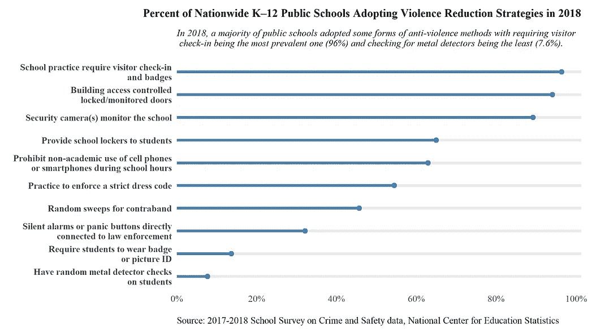
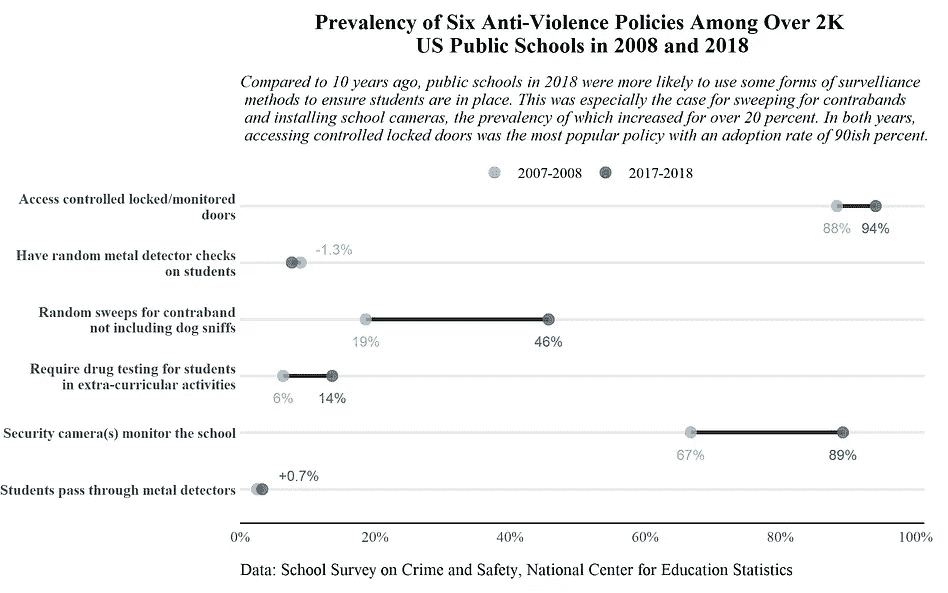
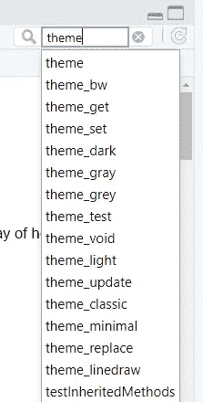
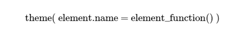
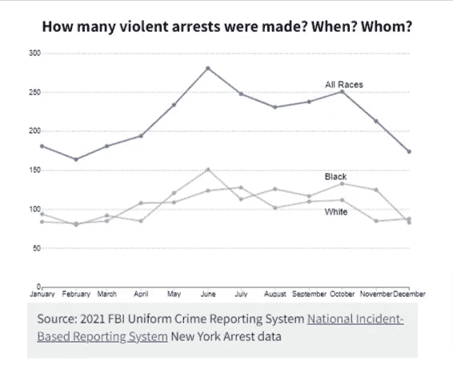
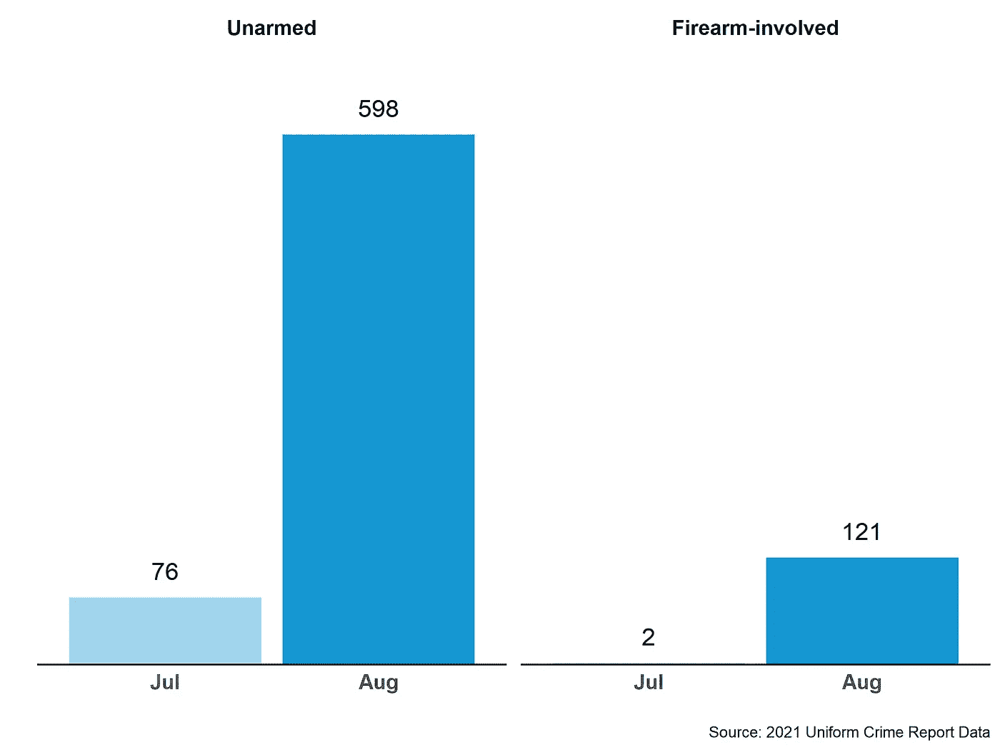
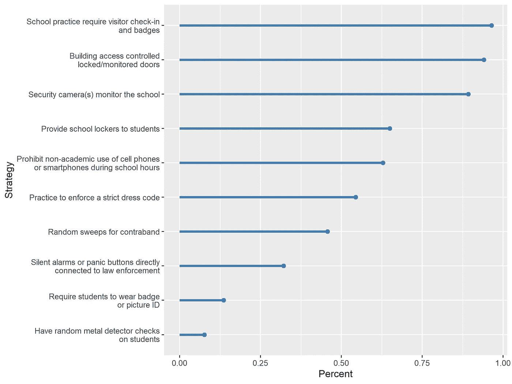
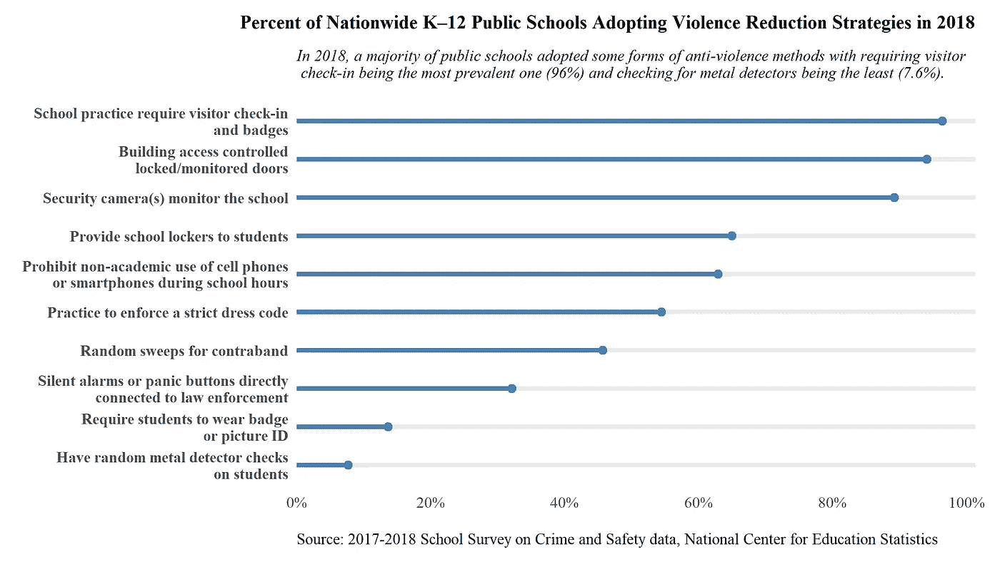

# 使用 R GGplot2 包进行图形定制的综合指南

> 原文：<https://pub.towardsai.net/a-comprehensive-guide-to-graph-customization-in-r-2188e9d84858?source=collection_archive---------3----------------------->

## 第一部分:让你的 ggplots 闪耀主题光芒()


泰勒·李在 [Unsplash](https://unsplash.com?utm_source=medium&utm_medium=referral) 上的照片

# 为什么要可视化数据，为什么要定制可视化

从数据科学家到研究人员和技术顾问，数据可视化是许多数据相关角色日常职责中不可或缺的一部分。在这些职位上，图表(包括地图)用于与利益相关者和没有数据科学背景或相对不精通数据科学的人交流数据发现。无论任务是探索性分析还是机器学习，非数据专业人士往往不太关心过程，而更关心结果，因为算法很难理解，无法用几句话解释。相反，他们想知道这个故事。这就是可视化与其他形式相比的优势所在，例如，纯文字和数据笔记本。

根据职位的不同，要求和首选可视化工具也会有所不同。数据记者经常使用 D3，HTML，以及相关的前端语言。由于出版物的性质，数据记者制作的图表也比其他专业人员更具格式和思想性。据一位曾在《纽约时报》工作的朋友说，标准是确定我们在网站上看到的图表。该团队将在幕后进行几轮编辑，从图表用途到标签、颜色和网格线。对于研究人员和分析师来说，这个要求可能没有那么严格。但是，一个图形越个性化，可视化效果就越好，故事就越引人注目，这不会错(也有许多数据可视化理论，例如，爱德华·塔夫特开发的数据-墨水比概念。这些理论可以帮助我们更好地理解什么样的数据可视化是伟大的。对它们感兴趣的读者可以做一些研究)。

作为一名专注于刑事司法和 K-12 教育问题的计算社会科学研究人员，我经常在项目中更喜欢 R 而不是 Python，原因有两个:R 的 *tidyverse* 系统使数据清理变得轻而易举，Python 中没有一个可视化库比 R 的 *ggplot2* 更易于使用、可定制和通用。

对于 ggplots，还存在一个重要的问题。虽然创建简单的图表是小菜一碟，但我们经常会努力按照自己的意愿定制它们。想想我们要在谷歌上的 ggplot 里搜索 *How to xxx 多少次。当然，网上有很多资源，但是缺乏一个全面的指南来指导所有的 ggplot 定制解决方案。作为一个在图形语法下开发的包，ggplot 是一个非常有组织性和逻辑性的可视化库，不管我们想做什么，都有一个规则。*

本系列将讨论“如何做”背后的一些规则。第一部分(这一部分)围绕*主题()*功能展开。下一个要讲音阶。在整个系列中，我将使用国家教育统计中心收集的[学校犯罪和安全调查](https://nces.ed.gov/pubsearch/pubsinfo.asp?pubid=2020054) (SSOCS)数据作为例子，其中包含美国公立学校安全和纪律相关政策和实践的信息。我的最终设想如下:



作者创造的形象。

# Theme()函数是做什么的

在 R Studio 中，如果在右下方面板的帮助标签中(标准布局中 workspace 环境下的地方)搜索“theme”这个词，会看到两种类型的输出: *theme* 和 *theme_** ，其中*表示一些词，例如 *theme_bw* 。在我们深入研究前者之前，理解这两种类型之间的关系很重要。

*主题*是*主题 _*、*的一般化版本，而*主题 _** 是建立在*主题*之上的。 *Theme_** 代表了 ggplot2 包中包含的众多既定主题，比如默认主题 *theme_grey* 就是其中之一。如果您没有指定任何主题元素或某个主题模块，这个主题中的灰色网格布局就是您将看到的。除了 theme_grey，常用的主题还有 *theme_bw* 、 *theme_classic* 、 *theme_void* 等等。我个人是 *theme_classic()* 的粉丝，给你一个白底两轴，任何方向都没有网格的布局。此外，开发人员和研究人员还编制了其他用于新闻媒体的主题模板，如《金融时报》和 FiveThirtyEight。这些模块分散在各种 R 包中，例如 *ggthemes* 。你可以在这个网站的图表上看到所有的主题和它们的样子。

总而言之，theme_*是一个定义了主题元素的主题，包括边距、面板背景、网格、轴、刻度和图例布局。需要注意的是，即使应用了主题，这些元素也不是不可覆盖的。为此，我们需要手动告诉我们的 ggplot，我们希望图形如何通过广义的*主题*函数。



作者创造的形象

# 奇妙的主题功能——元素

## 它的作用

正如我们已经谈到的，众多的*主题 _*()* 函数以某种方式设置预定义的主题元素。这是通过使用*主题()*函数来完成的。正如[文档页面](https://ggplot2.tidyverse.org/reference/theme.html)所描述的， *theme()* 允许用户修改任何主题组件并提供一致的外观。这里的主题组件指的是无数重要的美学元素，比如轴、网格、刻度线、字体、边距、图例和背景。这些是 ggplot 的非数据组成部分，这意味着这些元素并不决定图形的制作。例如，您不能使用函数制作条形图或散点图。你也不能用它来修改数据。如果没有图表，这个函数就没有意义。然而，这个函数真正的神奇之处在于，它允许您定制可视化组件，从而使您已经构建好的图形更加漂亮。在 *Matplotlib* 、 *Plotly* 、*阿莱尔*等众多可视化软件包中也可以做到这一点。然而，在这些工具中，这些转换是通过多个函数或步骤实现的，通常比 ggplot 的 theme()复杂得多，需要更多行代码。举个例子，在 *matplotlib* 中，如果你想移除绘图边框，最简单的方法是通过设置`ax.spines[’top’].set_visible(False)`首先移除顶部的框架，然后对其他三个框架重复同样的操作。而在 ggplot 中，它是一行程序(`panel.border = element_blank()`)。作为 ggplot 宇宙的一部分，*主题()*也是在 Hadley Wickham 思考的图形语法哲学下开发的，使它像其他 ggplot 功能一样有组织。也就是说，这个函数中的所有组件都遵循一个结构。

## 结构

哈雷·威克姆对*主题的结构*功能解释如下:



来自哈德利·威克姆写的公开的 ggplot 书

这里， *theme.name* 是我们想要对其进行转换的主题元素的名称， *element_function* 是我们想要应用于数据的转换。有超过五十个详细的元素名称，听起来很多，但是你真的不需要记住它们，因为这些元素名称可以分成五大组。这五组是:

1.  轴
2.  神话；传奇
3.  面板
4.  情节
5.  剥夺

我们将逐一讨论它们。

## 轴

Axis 决定 x 轴和 y 轴的格式。这包括轴上的一切，如标签和刻度。在*主题()*中，我们可以自定义以下内容:

*   `axis.title`:轴的标题
*   `axis.text`:轴的文本标签(即刻度标签)
*   `axis.ticts`:轴上的刻度线(注意:刻度中有一个 **s**
*   `axis.line`:轴线

在每个内部，我们还可以通过添加*来指定要修改哪个轴。x* 和*。元素名称后的 y* 。例如，如果我们只想对 x 轴应用一个变换，元素名应该是`axis.line.x`。如果我们不指定轴，那么默认情况下，变换应用于 x 轴和 y 轴。

在`axis.ticks`中，您也可以通过改变`axis.ticks.length`来使刻度线变长或变短。

## 神话；传奇

接下来是传说。图例是对 gg 图中各组的额外解释。如果有多个颜色或形状组，添加图例是常见的选择。但是在多组图表中，图例并不是显示组信息的唯一选择。另一个常见的选择是添加数据标签，这在多组折线图中尤其流行。例如，我在我的数据可视化类中创建了下面的图表，其中我使用了数据标签而不是图例。



作者创造的形象。这一可视化是我关于 2021 年纽约暴力逮捕的数据新闻文章的一部分。折线图是使用 D3.js、CSS 和 HTML 创建的。此处可进入[工作。](https://jcvincentliu.github.io/CAPP30239_FA22/NY_arrest/arrest.html)

在*主题*中，您可以修改以下图例组件:

*   `legend.box`:图例框
*   `legend.background`:图例框的背景
*   `legend.margin`和`legend.spacing`:每个图例周围的边距和间距。
*   `legend.title`和`legend.text`:图例标题和图例标签。注意不要用这两个来修改文本(单词)。您使用这两个来修改标题和标签元素(例如颜色、大小、角度)。我将在下一节关于元素函数的内容中详细讨论这一点。通过将单词设置为 NULL 或空字符串("")，可以删除单词。
*   `legend.position`、`legend.direction`和`legend.justification`:图例放置的位置(位置)、图例方向(水平/垂直)和图例对齐(在图表内放置图例时有用)。
*   `legend.key`:图例键的背景和大小。您可以指定按键大小(`legend.key.size`)及其宽度/高度(`legend.key.height` / `legend.key.width`)。图例符号是图例中使用的符号。有关图例键概念的更多信息，请参见此处的。

这些很多。然而，我们通常不需要使用它们。大多数时候我只需要使用第四和第五个要点中的元素(*)。标题，。文本，。位置，。方向*)改变图例。要查看更多示例，您也可以阅读本[指南](https://www.datanovia.com/en/blog/ggplot-legend-title-position-and-labels/)。

## 面板

面板是绘图的空间或映射数据的空间。人们经常混淆面板和绘图，后者是数据层和整个绘图框之间的区域。或者，您也可以将面板理解为由 x 轴和 y 轴限定或位于 x 轴和 y 轴内部的区域。该面板具有以下属性:

*   `panel.background`:面板背景。这是数据层/绘图区域的背景
*   `panel.border`:面板边框。这是绘图区域周围的空间(或绘图框和轴线之间的空间)。
*   `panel.spacing`:当应用`facet_wrap`或`facet_grid`时，这是两个多面图之间的空间。
*   `panel.grid`:网格线。这包括主网格线和次网格线。主网格是主数据断点上的线(或垂直于记号)。要指定主要或次要网格，在`panel.grid`后添加`.major`或`.minor`。要指定网格线的方向，添加`.x`(垂直)或`.y`(水平)。比如指定一条主要的水平网格线，代码应该是`panel.grid.major.x`。
*   `panel.ontop`:“是否将面板(背景、网格线)置于数据层之上”(来自主题功能[文档](https://ggplot2.tidyverse.org/reference/theme.html))。这是一个布尔值，其值为真/假。

同样，这是很多。然而，90%的时候，`panel.grid`是你唯一需要考虑的。对于多面图，`panel.spacing`也非常有用。其他主题名称很少见。通过实例了解剧情背景和边界，可以阅读[本文](http://www.sthda.com/english/wiki/ggplot2-themes-and-background-colors-the-3-elements)。

## 情节

绘图是整个绘图区域，不包括面板(数据层)。换句话说，一个图是你看到的一个完整的空间，而一个面板是由两个轴围成的整个空间中的一个较小的区域。该图包含以下元素:

*   `plot.background`:剧情背景
*   `plot.title`、`plot.subtitle`、`plot.caption`、`plot.tag`:剧情的标题、副标题、题注、标签。副标题是指标题下、情节上的文字，标签通常是标识一个情节的标签。大多数绘图没有标签，但多面绘图通常有。
*   `plot.margin`:地块周围的边距。这是地块和盒子之间的空间。

我经常使用所有这些元素名。正如你将在我上面的例子中看到的那样，下面要展示的；我使用了图表中除绘图背景之外的所有属性。

## 剥夺

最后但同样重要的是，条带或面板条带是与刻面图表相关联的元素。刻面图表是变量组之外的另一层。如果有一个以上的分组变量，分面是一种广泛使用的解决方案。例如，在我自己的数据新闻三部曲系列[用数据科学促进刑事司法](/part-final-fostering-social-impacts-with-data-science-c853e50d0379)中，我制作了一些多面图表。其中一个在下面。Faceting 也有其他名字，比如“小倍数”，这是纽约时报、皮尤研究中心、很多地方首选的一个名字，还有“格子图”。我个人是小倍数或分面图表的粉丝，因为这种技术增加了情节的价值。皮尤有一篇[中型文章](https://medium.com/pew-research-center-decoded/how-pew-research-center-uses-small-multiple-charts-2531bfc06419)解释了这种方法，并提供了一些很好的例子。



作者创造的形象。这是一张 2021 年 DC 被捕者使用武器的多面图。这个情节包含在我的数据新闻三部曲《用数据科学促进刑事司法》的最后一部分，由《走向人工智能》出版。看这里。

正如我提到的，R 中刻面图表中的元素可以使用 *strip* 主题进行修改。默认情况下，所有多面图表在图的顶部(和右侧)都有方框标签。如果你不熟悉 R 中的概念，这里有一些例子是。盒装标签被称为“strip”，这也是主题元素得名的原因。

条带具有以下属性:

*   `strip.background`:刻面标签背景。
*   `strip.placement`:放条的位置。该条可以放在轴的内部或外部。主题以“内”和“外”作为输入。
*   `strip.text`:纸条上的文字(多面标签)。
*   `strip.switch.pad`和`strip.clip`:条和轴之间的空间，以及是否“条背景边缘和条标签被修剪到条背景的范围”(来自[文档](https://ggplot2.tidyverse.org/reference/theme.html))。

因为默认背景颜色为灰色的条形标签很难看，巧妙地使用`strip.background`可以使小倍数更接近我们在新闻媒体上看到的小倍数。

## 其他的

还有一些杂项元素名称，但这些组件的数量很少。上面五个类别中唯一没有包括的常用的两个是`aspect.ratio`，它是绘图高度除以宽度(height/width)的比值，取一个数值，还有 margins，表示元素的边距。这个概念将在下一节中展开。

# 元素功能——奇迹发生的地方

记住， *theme()* 在结构上有两个部分，一个元素名和一个元素函数。上一节讲了元素，现在讲元素函数。

如果我们把主题功能描述为建造一辆火车，那么元素名称将是材料，元素功能将是使用材料建造火车各个部分的程序。如果我们想到写一篇文章的过程，那么元素就是主题，元素函数就是这些主题下的内容。有了元素名，我们就知道了“是什么”；然而，如果没有元素函数，我们就不知道如何处理“什么”。元素的功能是“如何”。

因为元素和元素函数有很深的联系，所以有多个元素函数对应不同类型的元素。我们也将一一讲述。

## 元素 _ 空白

很多教程在谈到 ggplot 主题的时候都会把`element_blank()`放在最后，但是我在这里反过来做。在所有四个元素函数中，这是最简单明了的一个。根据我的经验，这也是应用最广泛的方法之一。

`element_blank()`所做的是通过告诉主题函数在这个主题上不做任何事情来删除一个元素。换句话说，这个函数隐藏了图形中的一个元素。这可用于元素函数适用的所有元素名称(接近 80–90%的元素)。此函数不适用的一些例外情况是，例如，边距和刻度长度)。

例如，如果我们想要删除 x 轴和整个网格，那么整个主题函数应该是:

```
p + theme(
    axis.line.x = element_blank(),
    panel.grid = element_blank() 
)
```

通过设置从图表中移除图例也是一种常见的策略

```
p + theme(
    legend.position = element_blank()  
)
```

## 元素 _ 文本

除了`element_blank()`之外的其他三个函数只适用于具有某种属性的元素。首先，`element_text()`格式化文本相关的元素。这包括文本颜色、字体、大小、角度、粗细(粗体/正常/斜体)以及许多其他内容。该函数具有以下重要属性:

*   size:字体大小。这个以点为单位的数。
*   颜色:ggplot 允许的颜色名称。r 中有超过 [100 种颜色名称](https://r-graph-gallery.com/42-colors-names.html)，如果你是更高级的数据可视化制作者，还可以指定一个颜色十六进制代码。十六进制代码必须以“#”开头，后跟数字、字母或两者的组合。我实际上建议输入十六进制代码，因为颜色名称很难记住。
*   family:文本的字体系列。这很棘手，因为默认情况下 R 只包括三个字体家族，如果你希望使用个性化字体，如 Georgia，你必须在网站上下载它们并将字体加载到 R 中。在我看来，整个过程极其复杂和耗时。
*   字体:字体的粗细和风格。这相当于 CSS 的字体粗细参数。该参数采用以下四个值之一:“普通”、“粗体”、“斜体”和“粗体.斜体”。如果没有指定，那么粗细将是普通的，代表正常的字体粗细。
*   vjust 和 hjust:文本的垂直和水平对齐。这个函数沿着垂直/水平线移动文本，通常取 0 到 1 之间的值。
*   角度:文字角度。这个取 0 到 360 之间的一个数值。当文本标签很长时，设置文本角度会很有帮助。
*   边距:文本的边距。这与边距主题函数遵循相同的规则。我很快就会谈到这一点。

例如，如果我们想加粗 y 轴标签，将字体增加到 15 px，并将其颜色改为蓝色，我们可以这样做:

```
p + theme(
    axis.line.y = element_text(family = "bold", size = 15, color = "blue")
)
```

许多人(包括我)真的很喜欢`element_text()`，因为它让我们可以在文本上做无数的事情。

## 元素 _ 行

类似于`element_text()`，`element_line()`修改线元素。这条线通常是轴线或网格线。您可以使用`element_line()`在线路上执行以下操作:

*   颜色:同上
*   尺寸:同上，但单位是“毫米”。(**注**:该属性在最近的包更新中被重命名为*线宽*。)
*   线型:线的类型。这需要以下之一:“空白”、“实线”、“虚线”、“虚线”、“点划线”、“长划线”、“双划线”。根据[文档](https://ggplot2.tidyverse.org/reference/element.html)，你也可以给一个 0 到 8 之间的数值，但我个人认为字符串更清晰，更容易记忆。
*   线条末端:线条的末端形状。这需要“圆”、“粗”和“方”三个值中的一个，如果我们希望线条是圆的，而不是缺省的方形，这就很有用。
*   箭头:你可以用这个功能给一条线添加一个箭头。该参数来自 [*网格*包](https://rdrr.io/r/grid/arrow.html)(无需额外安装)。

例如，如果我们希望添加带箭头的灰色垂直网格虚线，我们可以这样做:

```
p + theme(
    panel.grid.x = element_line(linetype = "dotted", color = "grey90", arrow = arrow()) 
)
```

## 元素 _ 矩形

最后一个元素函数是`element_rect()`，适用于所有有框的元素。这方面的一些例子包括面板边框、图例背景、图例项和条带背景。如您所见，这些元素的共同点是它们都在一个矩形/正方形内。在这个函数中，“rect”指的是矩形。该函数具有以下属性:

*   fill:填充颜色。除了颜色名称或十六进制代码之外，它还可以将“透明”作为一个值。
*   颜色:轮廓颜色。它需要一个颜色名称或十六进制代码。
*   尺寸或线宽:以毫米为单位的轮廓宽度。类似`element_line(),` *尺寸*在最近一次更新中贬值，替换为*线宽*。
*   线型:等高线类型。这个同上。

例如，如果我们想将整个背景填充为灰色，并将多面标签的条带背景更改为灰色，同时将条带标签设为红色，我们可以:

```
p + theme(
    panel.background = element_rect(fill = "grey90"),
    strip.background = element_recet(fill = "grey90"),
    strip.text = element_text(color = "red")
)
```

## 其他的

还有一些不属于上述函数的杂项元素值。在这一类别中，首先需要知道的是利润，其值为:

```
p + theme(
    margin =  margin(c(t = 0, r= 0, b= 0, l= 0), "cm") 
)
```

在上面的例子中，t、r、b、l 分别代表“上”、“右”、“下”、“左”。您可以指定一个页边距或所有页边距。边距值后的“cm”是单位，如果没有指定，则默认为“pt”(点)。也有其他单位，所以单位是哪个为你工作。

另一个常用的主题值是 unit，它接受一个数值和一个可选的单位。例如，以下代码将两个轴上的刻度长度都更改为 0.5 厘米。

```
p + theme(
    axis.ticks.length = unit(.5, "cm")
)
```

在结束本节之前，有必要提一下其他三个常用的主题名称和主题对。这三个控制图例方向、位置和对齐。例如，我们可以将图例放在绘图顶部，并通过设置水平方向:

```
p + theme(
    legend.position = "bottom",
    legend.direction = "horizontal",
)
```

# 将主题()应用于数据

在前两节中，我已经说明了主题函数的原理和用法。现在，为了进一步解释这个函数及其魔力，我创建了两个应用和不应用主题的图表。数据来自学校犯罪与安全调查(SSOCS)，已被清理。完整的代码可以在我的 [GitHub 库](https://github.com/jcvincentliu/data-blogging/tree/main/ggplot%20theme%20customization%20guide)上看到。

棒棒糖图显示了 2762 所公立学校中 10 种反校园暴力策略的流行程度。这些政策中的许多也强化了大众监控系统如何延续从学校到监狱的管道的故事。在第一个图中，没有主题元素，也没有添加和格式化轴刻度和标签。

```
data %>%
    ggplot(aes(x = Strategy, y = Percent)) +
    geom_point(size=2, color = "steelblue") +
    geom_segment(aes(x = Strategy, xend = Strategy, 
                     y = 0, yend = Percent),
              size =1.3, color = "steelblue") +
    coord_flip() +
    scale_x_discrete(limits=rev)
```



作者创造的形象。主题转换前的原始棒棒糖图

在下面的图表中，我通过以下步骤准备好发布棒棒糖图表:

1.  添加标题、副标题、题注，并格式化 y 轴(即由于`coor_flip()`的影响，图表上的水平轴)
2.  应用`theme_classic()`主题
3.  将文本字体改为“衬线”(适用于网页)
4.  设置图表标题、副标题和题注的水平对齐、大小、边距和粗细的格式
5.  扩展图表的上边距、右边距和下边距，以便在图表和其他绘图区域之间留有空间
6.  移除轴线
7.  移除轴刻度
8.  粗体 y 轴刻度标签
9.  添加一条水平主网格线，颜色为灰色，并将线宽增加到 1.3 毫米。

```
data %>%
    ggplot(aes(x = Strategy, y = Percent)) +
    geom_point(size=2, color = "steelblue") +
    geom_segment(aes(x = Strategy, xend = Strategy, 
                     y = 0, yend = Percent),
              size =1.3, color = "steelblue") +
    coord_flip() +
    theme_classic() +
    labs(y = "", x = "",
         title = "Percent of Nationwide K–12 Public Schools Adopting Violence Reduction Strategies in 2018",
         subtitle = "In 2018, a majority of public schools adopted some forms of anti-violence methods with requiring visitor\n check-in being the most prevalent one (96%) and checking for metal detectors being the least (7.6%).",
         caption = "Source: 2017-2018 School Survey on Crime and Safety data, National Center for Education Statistics")+
    scale_x_discrete(limits=rev) +
    scale_y_continuous(labels = scales::percent, 
                       expand = c(0,0),
                       limits = c(0,1.013),
                       breaks = seq(0,1,.2)) +
    theme(
      text = element_text(family="serif"),
      plot.title = element_text(hjust = 1,  # move title along the line
                                size = 11,
                                face = "bold",
                                margin = margin(b = 10)), # bottom margin
      plot.subtitle = element_text(size=9, face = "italic",
                                   margin = margin(t = 0, b=10)),
      plot.caption = element_text(hjust = 0, size =9,
                                  margin = margin(t = 0)), # no top margin

      plot.margin = unit(c(t=0.3,r=0.5,b=0.3,l=0), 
                         "cm"),
      axis.line = element_blank(), # no axis lines
      axis.ticks = element_blank(), # no axis ticks
      axis.text.y = element_text(face = "bold"), # bold axis labels 
      panel.grid.major.y = element_line(size=1.3, # add x (horizontal) grid lines
                                        lineend = "round")      
    )
```



作者创造的形象。主题转换后完成的棒棒糖图

你对剧情变化满意吗？

# 结论

在本帖中，我们谈到了如何通过*主题()*和*主题 _*()* 函数自定义剧情外观。在本系列的下一部分中，我们将重点关注比例变换以及为什么这种变换是有用的。在第三部分，我们可能会谈到颜色的选择。

如果你有更多关于主题功能的问题，这个教程可能会有所帮助。

如果你喜欢这个帖子，请在 Medium 上**关注我。**

你也可以看到我的个人网站[这里](https://jcvincentliu.netlify.app/)和我的 LinkedIn [这里](https://www.linkedin.com/in/jcvincentliu/)。