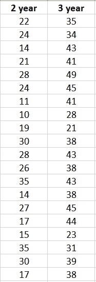

# Excel 中 T 测试的综合指南

> 原文：<https://pub.towardsai.net/a-comprehensive-guide-to-t-tests-in-excel-b4ecad31319e?source=collection_archive---------2----------------------->

## [统计数据](https://towardsai.net/p/category/statistics)

## 两件事真的不一样吗？

照片由 Geran de Klerk 在 Unsplash 上拍摄；作者编辑

> =T.TEST(数组 1，数组 2，tails，type)

excel 中的 t-test 函数非常强大。没有操作 Python 或 R 所必需的编码，每个人都可以计算出两组数据实际不同的可能性。这个功能为包括我自己的论文和科学发现提供了动力！遗憾的是，很多人仍然不了解 t 检验，不知道如何使用这个函数，也不知道如何解释函数的结果。

通过这篇文章，我们将检查这个函数的每一部分，并让您准备好充分发挥这个函数的潜力。

# 什么是 T 检验？

当您有两组数据时，您可以计算这些数据集的平均值。举个例子，假设我们正在测量 20 个 2 岁和 3 岁孩子的体重。并不是所有两岁的孩子和三岁的孩子都一样重。因此，如果我们计算两组的平均值，我们需要知道平均值在统计上是否不同。例如，考虑下面的数据。

作者提供的截图

总的来说，看起来 2 岁的体重比 3 岁的体重要低。如果我们计算平均值，我们会看到 2 岁儿童的平均体重是 22.35 磅，3 岁儿童的平均体重是 37.85 磅。虽然平均值不同，但我们不知道这种差异是否只是随机的。如果我们给更多的孩子称重，他们的体重会更接近吗？

这就是 t 检验的用武之地。t 检验允许我们说平均水平的差异是随机的，即我们碰巧随机抽样了较轻的 2 岁儿童和较重的 3 岁儿童。

## 假设和零假设

t 检验专门用于假设检验。假设是对两个事物之间的关系或区别的有根据的猜测。

例如，在我们上面的问题中，我们的假设是 3 岁的孩子和 2 岁的孩子体重不同。

如果我们想更具体一点，我们可以说 3 岁的孩子比 2 岁的孩子重。在这种情况下，我们已经为我们小组的预期变化指明了方向。

每个假设都有一个无效假设。零假设是指没有任何变化，没有差异的假设。

例如，我们的零假设是 3 岁的孩子和 2 岁的孩子一样重。

t 检验给了我们一个可测量的百分比，我们可以支持我们的假设，拒绝我们的零假设。我们稍后将讨论如何使用 t 检验的结果来拒绝或接受零假设。

# 该功能

现在你已经知道 t-test 是做什么的了，重要的是理解这个函数是如何工作的。这个函数的返回被称为 p 值，它给出了两个事实上不同的东西的意义。

> =T.Test(数组 1，数组 2，tails，type)

函数中有 4 个变量或输入:数组 1、数组 2、尾部和类型。

## 阵列 1 和阵列 2

函数的前两个参数是您想要测试的数据。您希望在数组 1 中包含第一个集合的所有数据，在数组 2 中包含第二个集合的所有数据。这些是可以互换的。

## 尾部

第三个输入是尾部。这个输入只有两个参数:

1 —单尾分布
2 —双尾分布

单尾和双尾的[选择](https://stats.idre.ucla.edu/other/mult-pkg/faq/general/faq-what-are-the-differences-between-one-tailed-and-two-tailed-tests/)取决于预期机会的方向。最常见的检验是双尾分布。

双尾分布不如单尾分布强大，这意味着所有被认为是双尾分布的事物都比单尾分布具有更低的显著性。

只有当您知道感知的变化方向，并且错过另一个方向的变化的后果可以忽略不计时，才应该选择单尾分布。这很大程度上取决于我们提出的问题。如果我们问 3 岁的孩子是否比 2 岁的孩子重，并且我们不在乎 3 岁的孩子可能更轻，那么我们可以进行单尾 t 检验。

例如，上述数据的单尾和双尾 t 检验结果分别为 4.92 倍 10^(-8 和 9.82 倍 10^(-8。由于 4.92 小于 9.82，这意味着单尾检验比双尾检验更有意义。

**重要的是，不应该使用单尾 t 检验，因为双尾 t 检验发现样本不显著。**

## 类型

第四个也是最后一个输入是确定要执行的 t 检验的类型。此输入有三个参数:

1 —配对 t 检验
2 —两样本等方差
3 —两样本不等方差

由于决定 t 检验的类型相当复杂，我们将在下面更详细地解释它。然而，最常见的检验是两样本不等方差检验(3)。

# T 检验的类型

在考察应该使用哪种类型的 t 检验时，你要问两个问题:成对的 *vs* 。两次采样然后等方差 *vs* 。不等方差。

## 成对与双样本

你应该问的第一个问题是，你的数据和你的研究问题是否自然配对。如果每组中的一个样本彼此之间的关系比组中的其他样本更密切，并且您正在研究这种特定关系，则应使用[成对 t 检验](https://www.scribbr.com/statistics/t-test/#:~:text=A%20t%2Dtest%20is%20a,are%20different%20from%20one%20another.)。

就拿上面的例子数据来说吧。如果我们的问题是“3 岁的孩子和 2 岁的孩子体重不同吗？”，那么我们需要执行一个双样本测试(输入 2 或 3)。这个问题没有假设 2 岁和 3 岁儿童的个体样本之间有任何关系。

另一方面，如果我们问，“3 岁的孩子和他们 2 岁的兄弟姐妹体重不同吗？”，现在我们将执行配对 t 检验(输入 1)。在这种情况下，我们会将数据排列在兄弟姐妹相对的位置。例如，每组中的第一个样本将是兄弟姐妹，依此类推。如果我们在第一个问题中包括非同胞的数据，我们需要在配对 t 检验中去掉这些数据。

这些测试之间的区别在于你测试的是零假设。

第一种情况，你的零假设是，3 岁儿童的平均体重与 2 岁儿童的平均体重相同。

第二种情况你的零假设是 2 岁和 3 岁的兄弟姐妹之间的体重差异为零。

一种类型的测试不一定比另一种给你更高的重要性，因为它们回答的是根本不同的问题。例如，在上面的数据集中，配对 t 检验和双样本 t 检验得出的 p 值为 2.99 x 10^(-7 和 9.84 x 10^(-8，其中配对 t 检验的显著性水平低于独立双样本 t 检验。

## 不等方差与等方差

如果您知道要使用双样本 t 检验，那么您需要决定是应该使用等方差还是不等方差 t 检验。双样本等方差(输入= 2)和双样本不等方差(输入= 3)之间的差异基于总体中的方差或偏差。

简而言之，如果你有关于整个人口变化的数据，并且知道这是相等的，你应该只选择一个相等的方差。你的总体变异不等于你的子集的标准差。在大多数情况下，这些信息是不可用的，因此，应该最少使用双样本等方差 t 检验。

事实上，如果您的方差实际上相等，那么[双样本不等方差将与双样本等方差 t 检验](https://academic.oup.com/beheco/article/17/4/688/215960)表现相同。因此，一般来说，您应该选择两样本不等方差，以确保不会出现假阳性错误。

# 解释您的 T 检验结果

一旦在 excel 中运行 t-test，它将给出的输出称为 p 值。 [p 值](https://www.statisticshowto.com/probability-and-statistics/statistics-definitions/p-value/#:~:text=The%20p%20value%20is%20the,value%20of%200.0254%20is%202.54%25.) (p)是两组数据的平均值之间的差异是由于随机机会造成的概率。在更多的统计学术语中，p 值是零假设实际上为真，但随机机会使其看起来不为真的概率。

例如，如果儿童体重差异的 p 值为 0.01，那么 2 岁儿童确实与 3 岁儿童体重相同的可能性为 1%。

因此，你需要有一个选择的置信水平来支持或拒绝你的零假设。置信水平告诉你真实总体与你的样本相匹配的百分比。

置信度=(1-p 值)x 100%

例如，如果我们的数据在 95%的置信水平下是显著的(p < 0.05)，那么你可以 95%确定两岁的孩子比三岁的孩子轻。

常见的置信水平分别为 95%、99%和 99.9%，或者 p 值等于 0.05、0.01 或 0.001。

一旦设置了置信水平，就可以使用 p 值来接受或拒绝该置信水平下的零假设。

例如，如果我们的置信水平是 95%，p = 0.028，那么我们可以拒绝我们的零假设，并以 95%的确定性支持我们的假设。