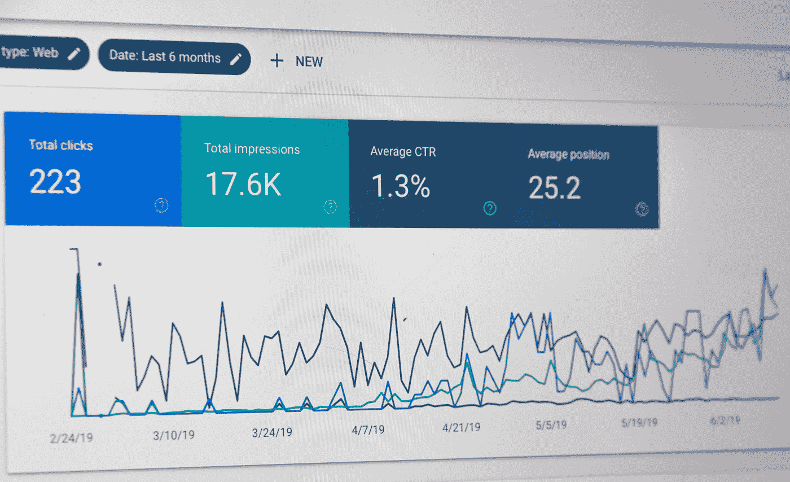

# 重要时间序列预测概念的精选列表

> 原文：<https://pub.towardsai.net/a-curated-list-of-important-time-series-forecasting-concepts-eb2306b55c19?source=collection_archive---------1----------------------->

与时间序列预测相关的概念及其解释的详细列表，以及 Python 包。对于任何有兴趣了解时间序列预测主要话题的人来说，这将是一个必去的列表

斯蒂芬·菲利普斯-Hostreviews.co.uk 在 [Unsplash](https://unsplash.com?utm_source=medium&utm_medium=referral) 上的照片

你可能遇到过几篇关于时间序列预测的文章。这些肯定解释了一些概念，但不是全部或大部分。 ***这篇文章旨在成为任何渴望理解与时间序列预测相关的主要概念的人的首选。它将解释时间序列分析和预测的概念以及基于 python 的库和包。***

**什么是时间序列数据？**

它是在一致的时间间隔内收集或记录的一系列数据点。时间序列数据为每个值附加一个时间间隔。时间间隔可以是几分钟、几小时、几天、几个月或其他任何时间，并且应该相等。这被称为时间序列数据的频率。

什么是趋势、季节性和周期性？

如果数据长期增加或减少，则数据中存在趋势。

在特定时间点(一年)的重复模式被称为季节性。这种模式应该不断重复。冬季保暖衣物销量的增加就是季节性的一个例子。周期性和季节性的区别在于，在周期性的情况下，波动具有随机性，没有固定的周期。

**一般用于预测的模型有哪些？**

时间序列预测模型通常可以分为以下几大类——经典模型(或统计模型)、ML 模型(基于机器学习的模型)和组合模型。

1.  经典模型主要是统计模型。这类模型的著名例子有自回归(AR)、移动平均(MA)、自回归移动平均(ARMA)、自回归综合移动平均(ARIMA)、ARIMAX (X 表示外生)、SARIMAX (S 表示季节性)、指数平滑等。
2.  基于 ML 的方法包括 XGBoost、Random Forest 和其他使用回归方法的方法。时间序列预测中使用的深度学习方法有 LSTM、N-BEATS、DeepAR 等。
3.  也尝试了一些组合方法。例如，M5 竞赛的获胜者使用了六个模型的等权组合。每个模型都采用了不同的学习方法和训练集。

**多元时间序列的情况下要用哪个模型？**

在多元时间序列的情况下，可以使用 VAR(向量自回归)及其导数(VARMA 和 VARMAX)等模型。

在数据不稳定的情况下，应该使用哪种模型？

这里可以使用 GARCH(广义自回归条件异方差)等高级模型。

**在训练和验证一个模型时，我们可以在进行训练测试分割之前随机打乱数据吗？**

不，因为时间序列数据是按时间顺序排列的，我们不能随机洗牌并进行训练测试分割。数据后面的值可以被认为是一个测试集，其余的值将被用作一个训练集。

**如果数据中有缺失值怎么办？**

是的，处理缺失值将是显而易见的答案。然而，由于时间序列数据的特殊性，这种方法与众所周知的方法相比会有所不同。这是因为连续时间间隔之间的值会相互影响。线性插值、样条插值、上一次观测结转和下一次观测结转是几种方法。

**评估时间序列预测模型性能的指标有哪些？**

评估指标与回归模型的情况相同。这些是 R 平方、平均绝对误差(MAE)、均方根误差(RMSE)等。

**有哪些基于 python 的包可用于时间序列预测？**

下面的列表提到了一些基于 python 的包:

tsfresh、AutoTS、Kats、Prophet、darts、sktime、statsmodel、PyFlux 和 Orbit。本文的参考资料部分提到了对这些包的参考。

**一个时间序列数据的平稳性是什么，它的重要性是什么？**

平稳数据在相同距离的周期之间具有恒定的均值、恒定的方差和一致的协方差。进行 ADF 检验以确认时间序列数据的平稳性。这一点很重要，因为对于平稳性，数据的统计属性不会随时间而改变。

**什么是外生变量和内生变量？**

外生变量是独立于其他变量的变量，输出变量依赖于这个变量。包含这个变量可能会对时间序列预测模型做出更好的解释。

内生变量是依赖于其他变量的变量，也是产出变量所依赖的变量。

**白噪声的意义是什么？**

时间序列模型中的误差项应该是白噪声。如果它们不是白噪声，那么仍然存在模型需要考虑的一些模式。

关注我( [kumarkaushal.bit](https://medium.com/@kumarkaushal.bit) )了解更多与数据科学相关的有趣话题，其中重要概念以直截了当、易于理解的方式进行了解释。

**参考文献:**

 [## M5 准确性竞赛:结果、发现和结论

### 在这项研究中，我们介绍了 M5“准确性”竞赛的结果，这是两个平行挑战的第一个…

www.sciencedirect.com](https://www.sciencedirect.com/science/article/pii/S0169207021001874)  [## 自回归条件异方差—维基百科

### 在计量经济学中，自回归条件异方差(ARCH)模型是时间序列的统计模型

en.wikipedia.org](https://en.wikipedia.org/wiki/Autoregressive_conditional_heteroskedasticity)  [## ts fresh—ts fresh 0 . 18 . 1 . dev 39+g611e 04f 文档

### tsfresh 是一个 python 包。它自动计算大量的时间序列特征，即所谓的…

tsfresh.readthedocs.io](https://tsfresh.readthedocs.io/en/latest/)  [## AutoTS — AutoTS 0.5.0 文档

### 要求:Python 3.6+，numpy，pandas，statsmodels，和 scikit-learn。

winedarksea.github.io](https://winedarksea.github.io/AutoTS/build/html/index.html)  [## Kats | Kats

### Python Kats 中时间序列分析的一站式商店是一个分析时间序列数据的工具包，一个轻量级的…

facebookresearch.github.io](https://facebookresearch.github.io/Kats/)  [## 欢迎使用 sktime — sktime 文档

### sktime 为广泛的时间序列机器学习提供了一个易于使用、灵活和模块化的开源…

www.sktime.org](https://www.sktime.org/en/stable/)  [## 时间序列分析 tsa —统计模型

### 包含对时间序列分析有用的模型类和函数。基本模型包括单变量…

www.statsmodels.org](https://www.statsmodels.org/dev/tsa.html)  [## 简介— PyFlux 0.4.7 文档

### PyFlux 是一个用于时间序列分析和预测的库。用户可以从一系列灵活的建模和…

pyflux.readthedocs.io](https://pyflux.readthedocs.io/en/latest/)  [## 关于 Orbit-Orbit 1 . 1 . 3 dev 文档

### Orbit 是一个用于贝叶斯时间序列建模和推理的 Python 包。它提供了一种熟悉而直观的…

orbit-ml.readthedocs.io](https://orbit-ml.readthedocs.io/en/latest/about.html)  [## 先知

### Prophet 是一个用 R 和 Python 实现的预测程序。它速度很快，并提供完全自动化的预测…

facebook.github.io](https://facebook.github.io/prophet/)  [## GitHub — unit8co/darts:一个用于时间序列的简单操作和预测的 python 库。

### darts 是一个 Python 库，用于时间序列的简单操作和预测。它包含各种型号，从…

github.com](https://github.com/unit8co/darts)