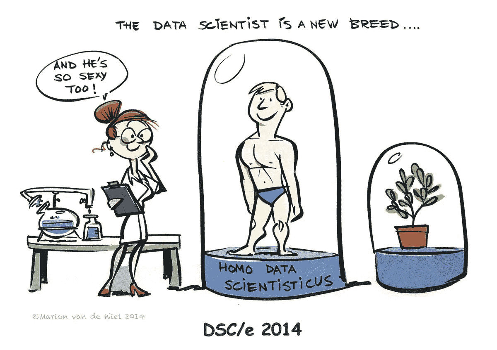
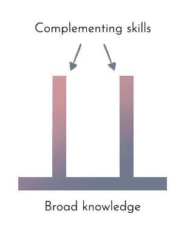
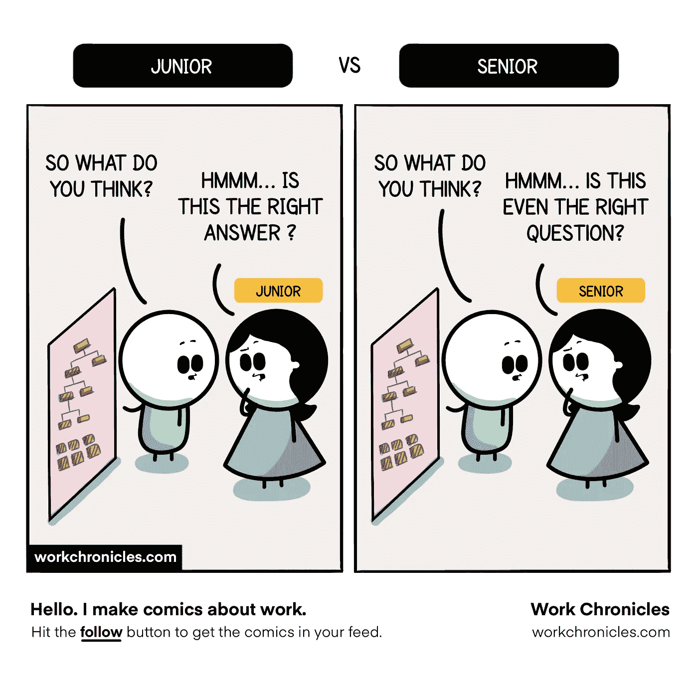
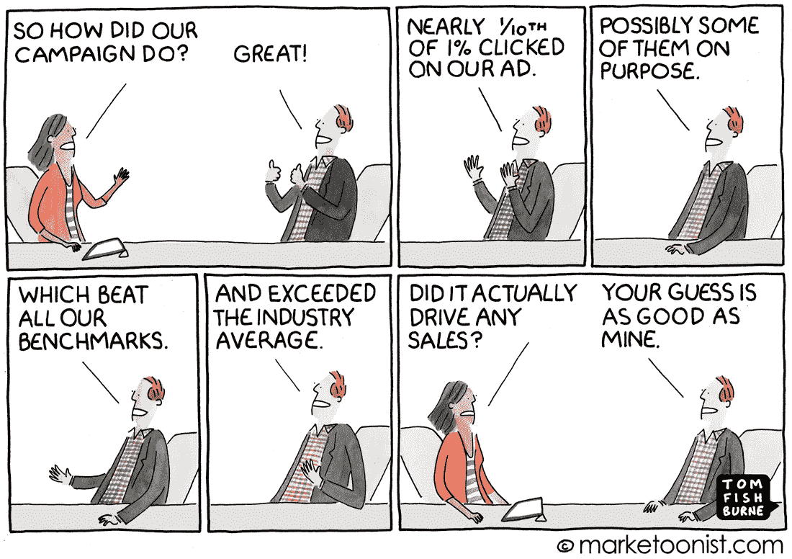

# 数据科学家不仅仅是数据科学家

> 原文：<https://pub.towardsai.net/a-data-scientist-is-more-than-just-a-data-scientist-a158711426ea?source=collection_archive---------2----------------------->

## 我对进入数据科学领域并取得进步的最佳方式的想法…

照片由[UX](https://unsplash.com/@uxindo?utm_source=medium&utm_medium=referral)在 [Unsplash](https://unsplash.com?utm_source=medium&utm_medium=referral) 上拍摄

你好，我可以问你一个问题吗？**数据科学家成功所需的顶级技能是什么？**我可以保证这个问题的答案因人而异，因公司而异。我必须承认，这个问题没有单一的客观答案。但是，作为一名数据科学家，我一直想知道为什么。如果能造出无人驾驶汽车，预测未来，为什么不能客观回答这个问题？因此，让我解释一下为什么回答这个问题很难，以及我对数据科学家应该具备哪些技能以及培养这些技能的最佳方式的看法。

本博客并不打算提供技术资源。相反，我的重点是改变你的视角，引导你进入数据科学领域并在其中成长。

那么，回到我最初的观点，为什么确定一个数据科学家必须具备的能力如此困难？我认为，这可归因于三个主要因素:

1.  [**近年来，“数据科学家”一词已经变得淡化**](https://towardsdatascience.com/data-science-has-become-too-vague-538899bab57)
2.  **公司文化**
3.  **分工**

数据科学家无疑是二十一世纪最性感的工作([图片来源](https://twitter.com/diegokuonen/status/804243148771889152))

任何跟踪这个领域几年的人无疑都会同意我的前两点。事实上，“数据科学家”一词在最近几年已经被淡化了；现在，数据科学家可以扮演任何角色，从业务问题公式化到模型部署和监控。其次，数据科学家的角色会受到公司文化和数据成熟度的影响。在与一些老牌公司和一些初创公司合作后，**我发现，在初创公司的早期阶段，作为一名数据科学家，需要的是商业头脑，而不是技术技能。**

最后，也是最重要的，还有“**分工**”亚当·斯密在《国富论》的*中用一个别针工厂装配线的生动例子来解释劳动分工是生产率提高的主要来源。数据分析任务，如制作大头针，需要许多过程，这就是为什么组织通常雇佣专家，如数据工程师、实验科学家、机器学习专家等。产品经理监督工作并处理各职能部门之间的交接。*

由于这种分工，许多数据科学家最终做了大量的数据建模工作，这给人一种印象，即数据科学家只需要与数据相关的技能，其他什么都不需要。让我告诉你，这是完全不正确的，这就是为什么我把博客命名为“数据科学家不仅仅是数据科学家。”

[图片来源](https://appunite.com/blog/become-a-pi-shaped-developer)

这就是为什么数据科学家的知识应该采取 **π形**的形式，而不是仅仅成为一个领域的专家，在整个端到端流程中具有良好的横向知识，并在 1 到 2 个特定领域具有深入的知识。 [**数据科学家必须是多面手，而不是专家**](https://hbr.org/2019/03/why-data-science-teams-need-generalists-not-specialists) **。**

当你向一些数据科学家咨询如何成为该领域的专家时，最常见的回答是“Kaggle 竞赛”然而，残酷的现实是，Kaggle 比赛不会让你为现实世界做好准备。毫无疑问，Kaggle 是新人和那些希望建立个人档案的人的好去处。然而，在第一个学习阶段之后，Kaggle 未能提供现实世界的挑战感。

很难相信吗？当我在 [**Kiva 组织**](https://www.kiva.org/) **开始我的**实习项目时，作为我在 MSBA 课程**的一部分，我学到了这一点。以下是体验式学习优于 Kaggle 竞赛的几个原因。**

## 1.解决问题的思维过程

[图像来源](https://workchronicles.com/so-what-do-you-think-junior-vs-senior-2/)

现实世界的项目不像 Kaggle 竞赛，Kaggle 为你提供了对问题的清晰看法，手头的数据，所需的解决方案，有时还需要做什么。所以你几乎没有什么可以集思广益和思考的了。

然而，在现实世界中，您的问题陈述通常没有精确定义，或者是开放式的业务问题。在大多数情况下，分析从将业务问题转化为分析挑战开始，然后尝试各种分析方法来解决它。

作为我在 Kiva 实习项目的一部分，我们遇到了一个非常模糊的商业问题；我们花了大约 3-4 周的时间来完全理解 Kiva 的业务，然后是业务问题，最终确定业务问题的范围。然后，为了确保我们在正确的轨道上，我们解释了我们的理解，并提出了许多解决问题的方法。那时我们就问题和方法达成了一致。这为我们提供了一个安全的环境，让我们集思广益，产生创新和创造性的想法，进行快速的理智检查，如果必要的话，扼杀这些想法。

## 2.数据收集和清理

在 Kaggle 比赛中已经可以使用数据集，它们通常是干净的和结构良好的。这限制了你的思维；你抓住问题，尝试不同的方法，发现哪一种效果最好。然而，在现实世界中，作为数据科学家，我们有责任理解这个问题，并从数据仓库中存在的大量数据中找到有用的数据属性的关键列表。在某些情况下，数据不容易获得，必须使用网络搜集从各种来源收集。

在决定在 Kiva 上使用一组特性之前，我们必须了解所有可访问的数据、其质量和数量。这需要大量的反复试验。此外，大部分数据通常并不干净，因此在分析数据之前清理和修复数据是我们的责任。

## 3.性能与业务影响

[图像来源](https://marketoonist.com/2016/05/campaign-performance.html)

在课堂上和其他比赛中，我们的成功标准是模型的表现，或者它预测未知数据的能力。然而，在大多数真实场景中，我们更关心业务影响，而不是性能。业务影响范围从增加底线利润到增加销售额到减少支出。

这包括确保你彻底掌握客户(营销团队或产品团队)的问题，并且客户非常清楚我们正在努力解决的问题，并且渴望在未来使用这些预测。

## 4.与非技术受众交流

作为数据科学家，我们需要与营销、产品、销售和工程团队密切合作。这些人大多是非技术人员，这意味着您无法像与数据科学家同事一样与他们交流。你必须清楚地理解这个团队感兴趣的是什么，并且只用最少的术语传达必要的信息。

## 5.多方面的

除了上面提到的一切，这里还有一些实习项目帮助我提高的其他技能。

*   **讲故事** —每个数据科学家都需要的另一项关键才能是讲故事。由于我们日常接触的大多数人都是非技术人员，当你向他人传达你的影响力时，这项技能会派上用场。
*   **优先化** —每天，我们都被特别的分析请求淹没，并且可能有大量的项目正在进行中。我们有责任评估影响并确定项目的优先顺序。

## **那现在怎么办？**

优秀的数据科学家不仅仅是数据科学家。他是一个能够发现问题的侦探，一个非常擅长讲故事的人，一个能够使用机器学习方法解决问题的魔术师，一个能够合作的好团队成员，一个能够区分任务优先级的好项目经理。

此外，为了成为一名优秀的数据科学家，你应该关注整体发展，而不是简单的数据工具，这只能通过参与端到端项目来实现，就像我在 Kiva 的实习项目一样。

## 那么接下来呢？

*   尝试解决端到端的问题
*   从一个开放式的业务问题开始，集思广益，并确定其范围
*   如果可能，搜集/收集数据
*   想想成功的标准

# 感谢阅读！

你同意/不同意我的观点吗？请在下面的评论中告诉我。

**延伸阅读**

 [## 为什么数据科学团队需要多面手，而不是专家

### 大多数企业组织起来是为了提高效率。他们通过专业化来做到这一点。高度…

hbr.org](https://hbr.org/2019/03/why-data-science-teams-need-generalists-not-specialists)  [## 机器学习是 Kaggle 竞赛-机器学习掌握

### 最近更新于 2016 年 9 月 5 日，Julia Evans 最近写了一篇题为“机器学习不是 Kaggle 竞赛…

machinelearningmastery.com](https://machinelearningmastery.com/machine-learning-is-kaggle-competitions/)