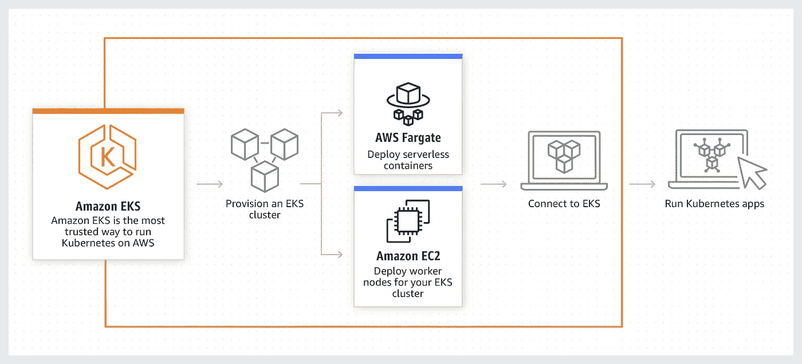
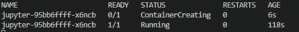
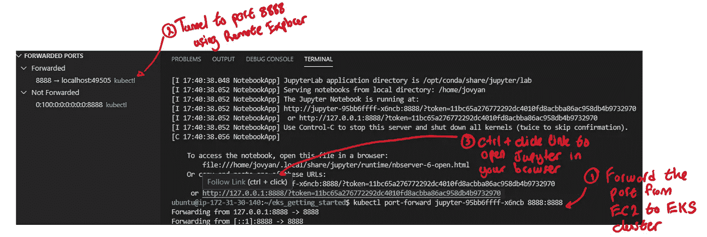
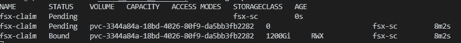
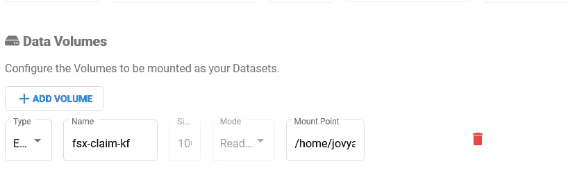

# 数据科学家在 AWS 上使用 Kubernetes 的入门指南

> 原文：<https://pub.towardsai.net/a-data-scientists-guide-to-getting-started-with-kubernetes-on-aws-281e034dc980?source=collection_archive---------1----------------------->



来源:[https://aws.amazon.com/eks/](https://aws.amazon.com/eks/)

# 介绍

在本文中，我将分享如何使用 Kubernetes 来运行数据科学工作负载。我将首先展示如何在 AWS 上设置 Kubernetes 集群。然后，我将展示如何使用 Kubeflow 手动启动 Jupyter 笔记本。在这个过程中，您将学习一些管理 Kubernetes 集群的命令。

我假设读者知道如何启动 EC2 实例，并且能够阅读简单的 bash 脚本。如果不是这样，那么请参考本[教程](https://aws.amazon.com/getting-started/hands-on/get-started-dlami/)来了解如何启动 EC2 实例，并参考本[文章](https://medium.com/towards-artificial-intelligence/how-i-wrangle-data-at-the-command-line-17ad48faf699?source=post_stats_page---------------------------)来了解关于数据科学 bash 脚本的入门知识。

本文中提到的所有代码和脚本都可以在这个 [repo](https://github.com/hsm207/eks_getting_started) 中获得。

# 动机

本文的目标读者是想要评估 Kubernetes 作为数据科学平台的可行性的数据科学家。因此，重点是快速启动并运行 Kubernetes 集群，以便他们可以继续探索使用它来运行数据科学工作负载的许多选项。

# 先决条件

如果您想按照本文中描述的步骤进行操作，您将需要以下内容:

1.  附加了 IAM 角色的 EC2 实例，其中包含 AdministratorAccess 策略。
2.  Visual Studio 代码(VS 代码)

使用 EC2 实例的原因是，在 AWS 上创建 Kubernetes 集群需要一些工具和配置。我决定通过 EC2 实例来实现，因为我不想破坏我的本地环境。我为这个 EC2 实例使用的图像是“深度学习 AMI (Ubuntu 18.04)”。

我使用 VS 代码连接到 EC2 实例。这只是为了方便起见，因为它附带了许多漂亮的特性，使得与远程机器一起工作变得容易。有关将 VS 代码连接到远程机器的更多详细信息，请参考本[指南](https://code.visualstudio.com/docs/remote/ssh)。注意，我使用的是内部版本的 VS 代码，所以我启动它的命令是`code-insiders`而不是`code`。

# 启动 Kubernetes 集群

## 概观

我们将使用亚马逊 EKS 创建一个 Kubernetes 集群。这包括以下步骤:

1.  安装`eksctl`和`kubectl`
2.  创造一个`ClusterConfig`
3.  应用`ClusterConfig`

## 步骤 1 安装`eksctl`和`kubectl`

`eksctl`是创建 EKS 集群的工具，而`kubectl`是用于管理集群的工具。

在安装这些工具之前，我们需要运行以下命令:

图 1:设置环境

图 1 的要点是将`awscli`工具升级到最新版本，并将`ap-southeast-1`设置为默认区域，因为我希望在该区域创建集群，并且不希望每次需要引用集群时都必须提供`--region`参数。

现在我们准备用以下命令安装`eksctl`:

图 2:安装 eksctl

下面是安装`kubectl`的命令:

图 3:安装 kubectl

## 步骤 2 创建一个 `ClusterConfig`

一个`ClusterConfig`是一个 YAML 文件，它告诉`eksctl`我们希望我们的集群拥有的属性。这里有一个简单的例子:

图 4:最小集群配置

图 4 描述了一个名为`dev`的集群，它是在`ap-southeast-1`区域中提供的。该集群将始终有两个节点属于一个名为`ng-1`的组。该组中的节点将在`ap-southeast-1a`可用性区域中创建。节点的类型将仅为`t3a.2xlarge`点实例。

## 步骤 3 应用`ClusterConfig`

假设我们已经将上一节中的`ClusterConfig`保存在一个名为`minimal.yaml`的文件中，我们可以通过运行以下命令来创建集群:

```
eksctl create cluster -f minimal.yaml
```

此时，您可以安装 Kubernetes 仪表板来帮助您监控集群和启动服务。但是我更喜欢通过命令行来做事情，所以我将跳过它。如果你想了解一下，你可以参考[06a _ install _ dashboard . sh](https://github.com/hsm207/eks_getting_started/blob/master/scripts/kubernetes/06a_install_dashboard.sh)和[06b _ connect _ dashboard . sh](https://github.com/hsm207/eks_getting_started/blob/master/scripts/kubernetes/06b_connect_dashboard.sh)脚本的安装说明。

# 手动启动 Jupyter 笔记本

## 快速简单的方法

要启动 Jupyter 笔记本，只需执行以下命令:

图 5:如何在 Kubernetes 上发布 Jupyter 笔记本

图 5 告诉 Kubernetes 使用 DockerHub 上的`jupyter/tensorflow-notebook`映像创建一个名为`Juypter`的部署。

要检查部署是否成功，您可以运行`kubectl get pods -w`来监控部署的 pod 的状态。pod 是容器的集合，在我们的例子中，它只是基于`jupyter/tensorflow-notebook`图像的一个容器。

您的输出将如下所示:



图 6:监控部署的进度

当状态转换到`Running`时，您可以退出命令(Windows 上的`Ctrl + C` )。

那么如何连接笔记本呢？因为您可能知道在本地启动笔记本，所以您需要找出在标准输出中打印的服务器令牌。

在这种情况下，您可以通过执行`kubectl logs jupyter-95bb6ffff-x6ncb`从容器的日志中查看令牌的详细信息。请注意，您实际上不必在`jupyter-`之后键入随机字符串。相反，您可以依靠 autocomplete(作为图 3 中命令的一部分安装),只需在键入`j`后按下`TAB`键，因为现在集群中只有一个容器。

接下来，您需要使用`kubectl port-forward jupyter-95bb6ffff-x6ncb 8888:8888`将端口 8888 从 EC2 实例转发到容器。然后，您需要将端口 8888 从本地机器通过隧道传输到 EC2 实例。

VS 代码的连接过程很简单，因为您可以使用远程资源管理器自动建立端口隧道。有关详细信息，请参考[1]。下面是一个截图，展示了所有东西是如何组合在一起的:



图 7:使用 VS 代码的简单端口隧道

虽然我们可以连接到笔记本电脑，但这并不是很有用，因为我们无法访问任何数据来分析、构建模型等。我们可以使用命令行工具从 S3 下载我们需要的东西，但是这对于大型数据集来说并不实用。

下一节将描述将 S3 存储桶挂载为文件系统的方法。在继续之前，让我们通过执行`kubectl delete deployments jupyter`删除当前部署。

## 安装 S3 铲斗

让我们使用 Amazon FSx 挂载一个包含我们希望处理的数据的 S3 存储桶。更具体地说，我们将从 S3 存储桶中动态创建一个 Lustre 文件系统。执行此操作的命令如下:

图 8:动态供应 Lustre 文件系统

图 8 中有很多内容，但主要的一点是它告诉 Kubernetes 创建一个名为`fsx-claim`的容量为 1.2 TB 的可挂载卷(第 115 到 128 行)。

实际的存储将取自第 95 到 108 行中定义的名为`fsx-sc`的存储类。这部分定义了我们希望 Lustre 文件系统拥有的属性。需要注意的关键是，我们希望将这个文件系统与存储在`AWS_BUCKET`变量中的 S3 存储桶连接起来。

其余的命令通过分配正确的权限、端口和可用性区域来确保集群可以访问文件系统。

最后一个命令监视`fsx-claim`的创建。如果一切设置正确，您应该会看到它的状态从`Pending`变为`Bound`:



图 9:监控 fsx-claim 的创建

现在我们已经准备好部署一个内部安装了`fsx-claim`的 Jupyter 笔记本容器。

不幸的是，这不是用一行程序就能完成的。我们必须创建一个 YAML 文件来描述我们想要的部署。

最好设计一个简单的模板，然后修改它，而不是从头开始编写 YAML 文件。下面是如何为名为`jupyter`的部署生成一个模板，该部署部署一个`jupyter/tensorflow-notebook`容器:

图 10:从模板中定制部署

图 10 中的第 1 行将模板存储在`tmp`目录中一个名为`deploy.yaml`的文件中。第 2 行打开 VS 代码，这样我们可以编辑它来满足我们的需要。一旦完成，第 3 行将创建一个部署，如`deploy.yaml`中所定义的。

`deploy.yaml`应该是这样的，以便安装`fsx-claim`:

图 11:使用 FSx 部署 Jupyter 的配置

需要注意的重要事项是:

*   第 32 至 38 行将`fsx-claim`安装到容器内的`/home/jovyan/fsx`目录中。
*   默认情况下，`/home/jovyan/fsx`的内容将归`root`所有，因此用户`jovyan`可以读取但不能写入。第 40 行修改了这一点，使得该目录的所有者是 group 100，其中也包括用户`joyvan`。
*   不幸的是，在写的时候第 40 行被破坏了。因此，第 21 到 27 行是它的变通方法。它启动一个容器来更改`/home/jovyan/fsx`中的权限，这样**任何人**都可以读/写它。参考[4]以理解该许可的含义。

本文附带的存储库有一个[演示笔记本](https://github.com/hsm207/eks_getting_started/blob/master/notebooks/demo-fashion-mnist.ipynb)，展示了如何读写这个文件系统。

有关使用 FSx Lustre 文件系统的利弊，请参考[5]。

# 使用 Kubeflow 发布 Jupyter 笔记本电脑

手动启动 Jupyter 笔记本是一个很好的学习体验，有助于理解构成 Kubernetes 集群的各个部分。但是，对于日常使用来说，非常繁琐。在这种情况下，Kubeflow 是正确的选择。

来自 Kubeflow [项目网站](https://www.kubeflow.org/docs/about/kubeflow/):

> Kubeflow 项目致力于使在 Kubernetes 上部署机器学习(ML)工作流变得简单、可移植和可扩展。我们的目标不是重新创建其他服务，而是提供一种简单的方法来将 ML 的最佳开源系统部署到不同的基础设施上。无论你在哪里运行 Kubernetes，你都应该能够运行 Kubeflow。

Kubeflow 可以做的不仅仅是运行 Jupyter 笔记本。一些有趣的使用案例包括:

*   超参数调谐
*   神经结构搜索
*   分布式培训
*   模型服务

要在 EKS 集群上安装 Kubeflow，首先需要安装 AWS iam 验证器，可以使用以下命令来完成:

图 12:安装 aws iam 验证器

然后，要安装 Kubeflow:

图 13:安装 Kubeflow

图 13 中的最后一个命令将 EC2 实例的端口 8080 转发到 Kubeflow 的仪表板。因此，您需要从本地机器通过隧道连接到端口 8080。

继续在 Kubeflow 仪表板中创建一个名为`anonymous`的名称空间。[6]有关于用 Kubeflow 启动 Jupyter 笔记本的详细说明，所以我在这里不再重复。

如果您想像我们手动启动笔记本时那样附加一个 FSx Lustre 文件系统，那么您将需要创建一个 YAML 文件来描述在`anonymous` 名称空间中的声明，例如:

图 14:在 Kubeflow 中使用的 FSx 声明

图 14 与图 11 中的对应部分完全相同，除了我将 in 命名为`fsx-claim-kf`，并将它的名称空间指定为`anonymous`，以匹配我们之前创建的 Kubeflow 名称空间。默认行为是在`default`名称空间中创建声明，这不是我们想要的。

现在，您只需在创建笔记本电脑服务器时，在数据卷部分键入索赔的名称，即`fsx-claim-kf`:



图 15:在 Kubeflow 笔记本中安装 FSx 卷

您将可以从挂载点访问存储在该文件系统中的任何数据。

# 清除

在 Kubernetes 上工作时，跟踪自己创建的 AWS 资源，并在完成后删除它们，以避免产生不必要的成本，这一点很重要。

如果你一直在阅读这篇文章，下面是一些需要清理的命令:

图 16:删除本文中创建的 AWS 资源的命令

# 结论

本文向您展示了如何使用亚马逊的 EKS 服务快速建立 Kubernetes 集群，以及如何部署 Jupyter 笔记本。此时，您已经有足够的知识来探索 Kubernetes 上的其他数据科学用例，例如运行 Spark 集群。

我希望这篇文章对你有用。

# 参考

[1] [使用 VS 代码的端口转发/隧道](https://code.visualstudio.com/docs/remote/ssh#_forwarding-a-port-creating-ssh-tunnel)

[2] [eksctl 文档](https://eksctl.io/)

[3] [kubectl 文档](https://kubernetes.io/docs/reference/generated/kubectl/kubectl-commands)

【4】[chmod 777 是什么意思](https://linuxize.com/post/what-does-chmod-777-mean/)

【5】[什么是亚马逊 FSx for Lustre？](https://docs.aws.amazon.com/fsx/latest/LustreGuide/what-is.html)

[6][kube flow 中 Jupyter 笔记本概述](https://www.kubeflow.org/docs/notebooks/why-use-jupyter-notebook/)