# 价格弹性的详细介绍——附示例

> 原文：<https://pub.towardsai.net/a-detailed-introduction-to-price-elasticity-with-example-2ba3b1c00fc0?source=collection_archive---------0----------------------->

## [数据科学](https://towardsai.net/p/category/data-science)

## 价格弹性的重要性以及如何用它来寻找最佳价格点。


由[马库斯·斯皮斯克](https://unsplash.com/@markusspiske?utm_source=medium&utm_medium=referral)在 [Unsplash](https://unsplash.com?utm_source=medium&utm_medium=referral) 上拍摄的照片

作为一名数据科学实习生，我意识到**你提供的价值与你得到的价格成正比。**

只有当你拥有的技能能够以增加销售额或降低成本的形式转化为对客户的附加值时，这些技能的数量才是最重要的。简单。
**你提供的价值越多，你作为数据科学家的价值就越大。**

在今天的文章中，我将回顾我在实习期间反复遇到的一个重要话题，这个话题就是**价格弹性。**

# **什么是“价格弹性”？**

价格弹性告诉我们特定产品的销售对其价格的单位变化有多敏感。

它只不过是销售额百分比变化与价格百分比变化的比率。例如:

比方说，某个商店每天销售 20 个手袋。

商店在袋子上贴了一个价格标签，比如说 200 美元，他们从中获利。

一天，商店经理决定**将包的价格提高到 220 美元，这使得销售额下降到 15。**

价格变化的百分比为:

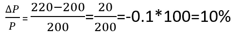

销售额的百分比变化是:

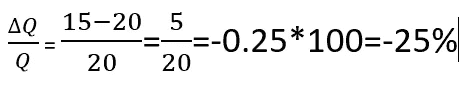

因此，如果我要计算这款包的价格弹性，我会采用**销售额变化与价格变化的比率。结果是:**

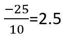

那么这个 2.5 告诉我们什么呢？简单地说，价格的单位变化会对销售量产生 2.5 倍的影响。这个值也被称为弹性系数，它只是衡量销售对单位价格变化的敏感程度。

在这个例子中，我们得到的弹性值是 2.5，但是如果我们的弹性值小于 1 呢？或者是 0 呢？让我们来看看这些案例。

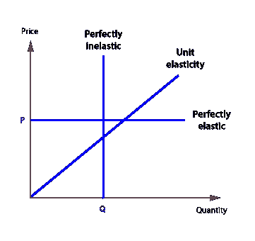

图片来自[https://www . economics online . co . uk/Competitive _ markets/Price _ elasticity _ of _ supply . html](https://www.economicsonline.co.uk/Competitive_markets/Price_elasticity_of_supply.html)

## 1)完全无弹性(系数= 0)

如果我们有一个“完全无弹性”的案例，其中我们的**弹性系数是 0，**我们的销售不会受到价格变化的任何影响。像燃料这样的必需品是完全没有弹性的，也就是说，即使价格大幅上涨，销售也不会下降，因为人们对它的依赖程度很高。

## **2)完全弹性(系数=** ∞)

如果我们有一个“完全弹性”的案例，其中我们的**弹性系数几乎是无穷大，**单位价格的变化将对产品的销售产生巨大的影响。有**替代品**且“不影响我们日常生活”的产品往往弹性系数较高。例如:如果苹果价格上涨，人们会寻找替代品，甚至根本不买苹果，因为没有苹果也能“生存”。

## 3)单位弹性(系数= 1)

在单位弹性的情况下，价格的单位变化会导致销售量的单位变化。例如，15%的价格上涨导致 15%的销售萎缩。所以基本上弹性系数是 1。

## 4)弹性在 0 和 1 之间

如果弹性在 0 到 1 之间，也是无弹性的情况。显然，并非完全没有弹性，但价格的变化对销售的变化影响很小，但会导致收入的增加。

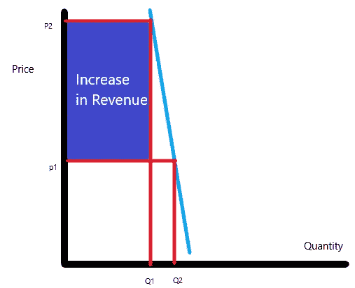

非弹性情况。(系数在 0 和 1 之间)

# 双对数模型

现在我们已经过了弹性的概念和不同类型的弹性。但问题依然存在，**为什么它很重要？作为一个企业主，我为什么要关心？**

嗯，事情是这样的，企业主想知道他们的销售量会随着价格的变化而变化多少。他们也对能使他们的利润最大化的卖点感兴趣。这就是弹性概念有所帮助并被广泛使用的地方。

为了找到弹性，我们求助于**双对数模型**。

我有一种特定产品在 2 年内不同价格的销售数据。

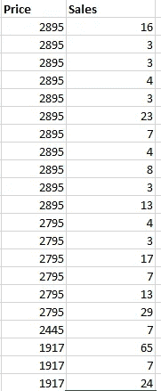

用图表来看，我得到了

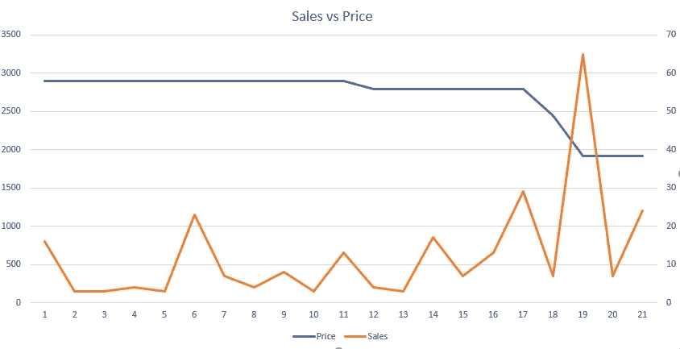

在价格下降的几个月里，平均日销售额有相当大的增长。有几个点的销售额出乎意料地上升和下降，但这可以归因于全年发生的特殊事件，如圣诞节等。

让我们进一步想象一下

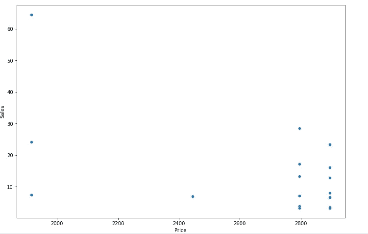

散点图给了我们同样的发现，较低的价格增加了销售。

转向弹性。

## 双对数模型

既然我们已经将数据可视化了，我们将对因变量和自变量取对数

```
data['Log(price)'] = np.log(data['Price'])
data['Log(Avg Sales)'] = np.log(data['AvgDailySales'])
data['constant'] = data['Price']/data['Price']
```

我们现在用一个线性回归模型来拟合我们的变量，并找出弹性系数。

```
from sklearn.linear_model import LinearRegression
LR = LinearRegression()
X= data[['Log(price)','constant']]
y = data['Log(Avg Sales)']LR.fit(X,y)
coef = LR.coef_
coefintercept = LR.intercept_
intercept
```

系数为-2.934，截距为 25.672

**这里的-2.934 是我们变量**的弹性系数。

双对数模型方程可以写成:

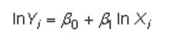

对数方程

其中 **B1 为-2.934** ， **Bo 为 25.672。**

同样的等式可以简化为:

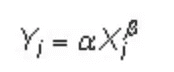

其中“Alpha”是截距的**指数，X 是**价格**，“Beta”是我们的**弹性系数**，Y 是我们的**预期需求。让我们进一步看这个问题。****

我们将向我们的数据集中添加另一个名为“ **Expected Demand** ”的列，并将其可视化。

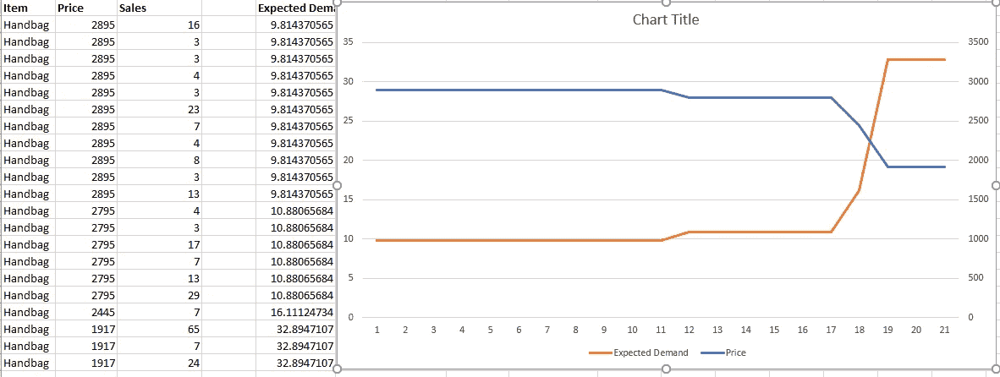

到目前为止，一切顺利。

手袋的最低售价是 1917，比如说，“生产一个包”的成本是 1700。我们能否找到一个**最佳价位**？让我们来看看

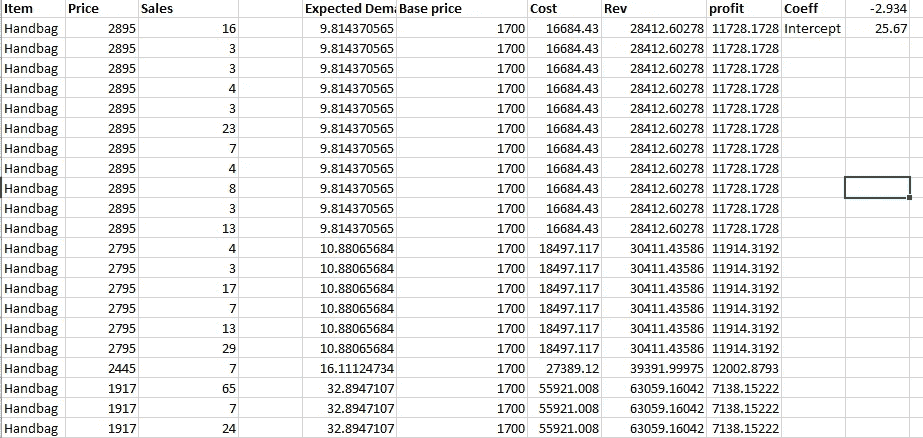

我在上面的视图中设置了一个**基价 1700，这是一个包的单价。**

成本是预期需求和基价的**乘积**，Rev 是预期需求和价格的**乘积。**

利润就是收入和成本之间的差额。

绘制利润曲线给我们提供了:

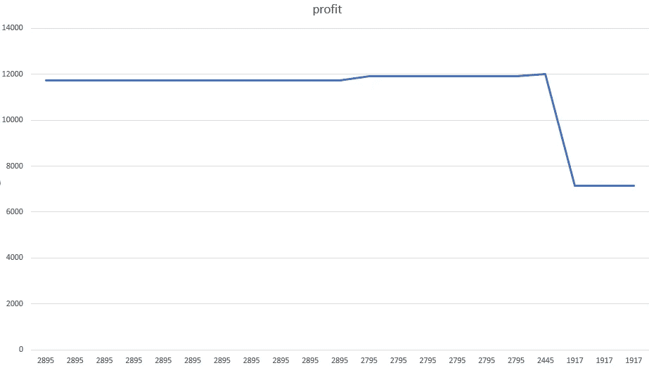

价格下降导致利润稳步增长，但价格进一步下降(2795 年至 1917 年)会导致利润下降。所以在这种情况下，产品的价格不应该从 2795 下降，因为这将使利润最小化，而且不是最佳点。

注意:我们必须假设底价为 1700，因此这在确定最佳销售点时起着一定的作用。

# 结论

在这篇文章中，我回顾了弹性的基础知识，以及如何使用弹性系数来更好地理解数据的行为，并找到“最佳销售价格”。

零售是一个非常有趣的领域，从事零售项目的数据科学家在业务中扮演着非常重要的角色。

如果你喜欢这篇文章，请随意为它“鼓掌”，并与你的同事分享。谢谢你