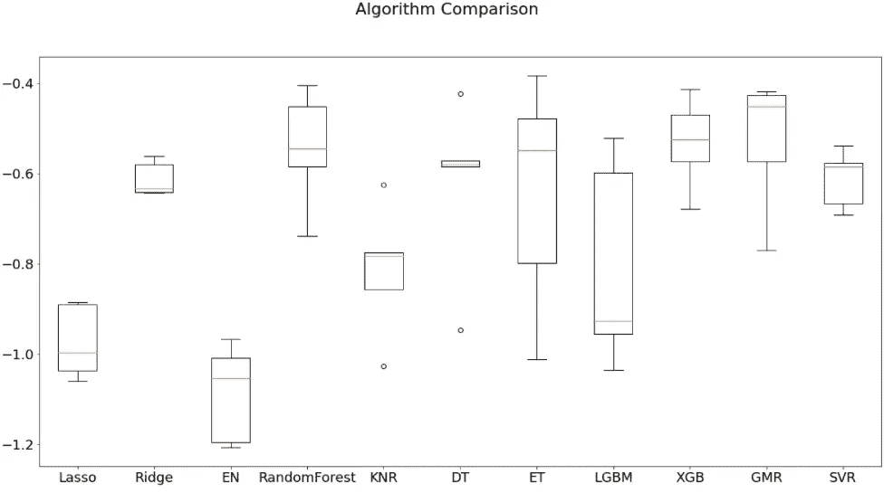

# 你应该看看这个有效的模型选择框架

> 原文：<https://pub.towardsai.net/a-framework-for-model-selection-ea4dcda2cb3a?source=collection_archive---------0----------------------->


在 [Unsplash](https://unsplash.com/s/photos/selection?utm_source=unsplash&utm_medium=referral&utm_content=creditCopyText) 上由 [vitamina poleznova](https://unsplash.com/@poleznova?utm_source=unsplash&utm_medium=referral&utm_content=creditCopyText) 拍摄的照片

在每个机器学习项目中，我们都需要选择一个模型来改善我们的起始基线。

事实上，如果基线给了我们一个有用的起始模型来理解我们可以从一个非常简单的解决方案中期待什么，那么通过**一个特定的方法论**选择的模型帮助我们平稳地进入项目的优化阶段。

在这篇文章中，我将与你分享我的个人框架(和代码库),以有组织和结构化的方式进行模型选择。

# 该方法

假设我们有一个回归问题要解决。让我们从导入所需的库和配置日志机制开始

```
**from** **sklearn** **import** linear_model
**from** **sklearn** **import** ensemble
**from** **sklearn** **import** tree
**from** **sklearn** **import** svm
**from** **sklearn** **import** neighbors
**from** **lightgbm** **import** LGBMRegressor
**from** **xgboost** **import** XGBRegressor
**import** **logging**logging.basicConfig(level=logging.INFO)
```

我遵循的思维模式如下:

1.  我们将创建一个空列表并用对( *model_name* ， *model* )填充它
2.  我们将通过 Scikit-Learn KFold 交叉验证来定义分割数据的参数
3.  我们将创建一个 for 循环，交叉验证每个模型并保存其性能
4.  我们将查看每个型号的性能，以便选择性能最佳的型号
5.  我们定义一个列表并插入我们想要测试的模型。

让我们定义一个列表，并插入我们想要测试的模型。

```
models = []
models.append(('Lasso', linear_model.Lasso()))
models.append(('Ridge', linear_model.Ridge()))
models.append(('EN', linear_model.ElasticNet()))
models.append(('RandomForest', ensemble.RandomForestRegressor()))
models.append(('KNR', neighbors.KNeighborsRegressor()))
models.append(('DT', tree.DecisionTreeRegressor()))
models.append(('ET', tree.ExtraTreeRegressor()))
models.append(('LGBM', LGBMRegressor()))
models.append(('XGB', XGBRegressor()))
models.append(('GBM', ensemble.GradientBoostingRegressor()))
models.append(("SVR", svm.LinearSVR()))
```

对于属于*模型的*列表中的每个模型，我们将通过 [model_selection 来评估其性能。KFold](https://scikit-learn.org/stable/modules/generated/sklearn.model_selection.KFold.html) 。它的工作方式相当简单:我们的训练数据集( *X_train，y_train* )将被分成相等的部分(称为 *folds* )，分别进行测试。因此，KFold 交叉验证将**提供每个分割的平均性能指标，而不是基于整个训练数据集的单一指标**。这项技术非常有用，因为它允许您更精确地测量模型的性能。

由于这是一个回归问题，我们将使用均方差(MSE)度量。

让我们定义交叉验证的参数，并初始化循环的。

```
n_folds = **5** # number of splits 
results = [] # save the performances in this list
names = [] # this list helps us save the model names for visualization

# we begin the loop where we'll test each model in the models list
**for** name, model **in** models:
    kfold = model_selection.KFold(n_splits=n_folds)
    logging.INFO("Testing model:", name) cv_results = model_selection.cross_val_score(
        model, # the model picked from the list
        X_train, # feature train set
        y_train, # target train set
        cv=kfold, # current split
        scoring="neg_mean_squared_error", 
        verbose=**0**, 
        n_jobs=-**1**) results.append(cv_results)
    names.append(name) msg = "%s: %f (%f)" % (name, cv_results.mean(), cv_results.std()) logging.INFO(msg+"**\n**")
```

每个模型都将进行交叉验证和测试，其性能将保存在*结果*中。

可视化非常简单，将通过箱线图来完成。

```
# Compare our models in a box plot
fig = plt.figure(figsize=(**12**,**7**))
fig.suptitle('Algorithm Comparison')
ax = fig.add_subplot(**111**)
plt.boxplot(results)
ax.set_xticklabels(names)
plt.show()
```

# 最后的结果

最终结果将是这样的:



我们的模型选择脚本的最终输出

从这里可以看出 RandomForest 和 GradientBoostingMachine 是如何表现最好的机型。然后，我们可以开始创建新的实验，并进一步测试这两个模型。

# 把所有的放在一起

这是用于模型选择的复制粘贴模板，我会在 model_selection.py 脚本中方便地使用它(我在这里讨论如何构建一个机器学习项目

用于模型选择的复制-粘贴就绪模板

# 结论

很高兴你来了。希望您会发现这篇文章很有用，并在您的代码库中实现其中的一些片段。

如果你想支持我的内容创作活动，请随时关注我下面的推荐链接，并加入 Medium 的会员计划。我将获得你投资的一部分，你将能够以无缝的方式访问 Medium 的大量数据科学文章。

[](https://medium.com/@theDrewDag/membership) [## 通过我的推荐链接加入 Medium-Andrew D # data science

### 阅读 Andrew D #datascience(以及媒体上成千上万的其他作者)的每一个故事。您的会员费直接…

medium.com](https://medium.com/@theDrewDag/membership) 

祝你愉快。留得安好👋