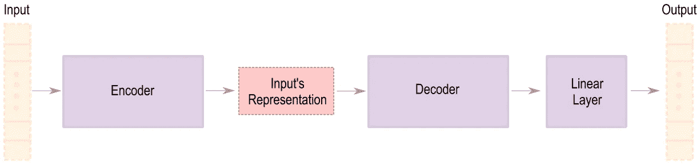

# 使用深度学习的文本摘要的完整介绍，带有示例代码(Ft。拥抱脸)

> 原文：<https://pub.towardsai.net/a-full-introduction-on-text-summarization-using-deep-learning-with-sample-code-ft-huggingface-d21e0336f50c?source=collection_archive---------0----------------------->

## [自然语言处理](https://towardsai.net/p/category/nlp)

*用 HuggingFace 的示例代码介绍抽象文本摘要任务(seq 2 seq/编码器-解码器架构)中的推理过程。一系列中的第一个！*

照片由[亚伦·伯顿](https://unsplash.com/@aaronburden?utm_source=medium&utm_medium=referral)在 [Unsplash](https://unsplash.com?utm_source=medium&utm_medium=referral) 上拍摄

> **更新“2021 年 12 月 14 日”**:我发表了系列的[第二部分，解释了基于变压器的编码器-解码器模型的训练循环。](/how-to-train-a-seq2seq-text-summarization-model-with-sample-code-ft-huggingface-pytorch-8ba97492f885)

# 什么是自动文本摘要？

这是一个获取文档中最重要的部分(如新闻、书籍、文章等)并生成包含这些信息的较短文本的过程。有两种类型的文本摘要:

*   **提取**:从源文档中选择若干句子，作为摘要。通常使用一个排名函数来评估每个句子，并挑选得分最高的。
*   **Abstractive** :在这种方法中，我们将使用生成模型来形成描述文档的新句子。(就像人类做的一样！)

图一。提取和抽象概括方法的区别。提取算法选择文档的第一句作为摘要，但是抽象模型使用文档中的单词(如名称、位置等)和它自己的单词(如克服)来形成摘要。

⚠️:这篇文章的主要焦点是抽象概括。

# 使用什么架构？

文本摘要任务的主要体系结构被称为序列对序列(seq2seq ),它具有图 2 所示的六个主要组成部分，如下所述。

图二。编码器-解码器架构。

*   **输入**:我们要汇总的是标记化的源文档。什么是标记化？将文件中的每个字转换成代表它的数字的过程。([此处阅读更多内容](https://nlpiation.medium.com/how-to-use-huggingfaces-transformers-pre-trained-tokenizers-e029e8d6d1fa))
*   **编码器/表示**:这个模块处理源文档并创建一个固定大小的高维张量来表示它。这种表示包含关于文本的上下文信息，这些信息也可以用于不同的下游任务，如分类(在编码器上使用线性层，而不是解码器)。编码器在训练中学习语言和单词之间的关系。(阅读[此处](https://medium.com/mlearning-ai/what-are-the-differences-in-pre-trained-transformer-base-models-like-bert-distilbert-xlnet-gpt-4b3ea30ef3d7)了解不同的培训目标)
*   **解码器/线性层/输出**:一个生成模型，使用所述表示一次一个令牌地写一个摘要。解码器的输出将是与包含每个索引成为下一个预测记号的概率的记号赋予器词汇大小相同的张量(使用线性层)。

seq2seq 架构可以使用不同的构建模块来形成编码器/解码器模型。不久前，我们主要使用 LSTM/GRU 设备，而现在，[变压器](http://jalammar.github.io/illustrated-transformer/)网络是显而易见的选择。

# 它是如何工作的？(让我们看看代码)

我将使用 Huggingface 库和预先训练的 BART [1]模型来展示一个模型如何生成每个令牌以形成一个摘要，而不涉及关于该模型的实现和子模块的太多细节。第一步是加载编码器、解码器和线性图层部分。让我们加载模型并将其打印出来，以找到所有子模块的名称。

⚠️我们通常必须使用`eval()`函数将模型的模式改为评估，同时进行推断以获得更一致的结果。在处理 Huggingface 库时，这不是强制性的，因为默认情况下，它以提到的模式加载模型。

可以看到，BART 模型有三个主要组件:编码器(12 层)、解码器(12 层)和 lm_head(我们称之为线性层)。您可以通过像`model.model.encoder`、`model.model.decoder`和`model.lm_head`那样调用它们来轻松使用架构的特定部分。但是，Huggingface 有一些内置函数，可以更灵活地访问编码器和解码器，如下所示:

最后一个准备步骤是加载一个示例文章，并使用 BART tokenizer 对其进行标记。这可以通过加载预先训练好的标记器并调用它来完成。(阅读[此处](https://nlpiation.medium.com/how-to-use-huggingfaces-transformers-pre-trained-tokenizers-e029e8d6d1fa)了解更多详情)

现在，我们已经具备了开始生成摘要的所有要素。这个过程从使用编码器对文章进行编码开始，以创建我们的表示。这一步只做一次，因为文章不会改变！*(相同的表示将用于生成所有的令牌。)*

解码器组件是负责生成摘要的单元。请记住，生成过程从传递<bos>(句子开头)标记开始，以启动该过程，然后一次传递一个标记来完成摘要。以下代码的含义是*“根据文章的编码表示预测出现在< bos >标记之后的单词”。*</bos>

`logits.argmax(1)`将从所有概率中挑选最可能的令牌，并返回令牌 id。在我们的例子中，它将返回与 BART 词汇表中的标记' **se** '相对应的 **1090** 。🤔(稍后将详细介绍)

我们成功地生成了摘要的第一个令牌。通过将`start_token`从仅仅< bos >改变为具有两个[ < bos >，se]的张量，也很容易预测第二个表征。这种方法被称为贪婪搜索，是最简单的推理方法。(我推荐在这里阅读[以获得更多关于不同策略的信息](https://huggingface.co/blog/how-to-generate)

让我们使用 Huggingface 内置的`generate()`功能来处理这个重复的任务。

有意思！因此，该模型试图通过预测单词“ **se** ”来生成名称“ **sebastian** ”。一些分词器会将单词分解成更小的块，以使词汇量更小，因此，保持模型的参数计数更低。

正如您所看到的，BART(最好的预先训练好的总结模型之一)正在正确的轨道上生成一个好的总结。它已经从文章中提取了一些关键信息。您可以通过使用像`max_length`(生成更长的文本)、`num_beam`(使用光束搜索而不是贪婪)和`no_repeat_ngram_size`(避免重复)这样的变量来提高模型输出的质量。

> ⚠️代码可以在 GitHub 的[笔记本](https://github.com/NLPiation/tutorial_notebooks/blob/main/summarization/hf_BART_inference_breakdown.ipynb)中找到。

# 最后的话，

我使用示例代码演示了在文本摘要任务中序列对序列建模推理文本的方法。(如果你仔细想想，同样的事情正在两个不同的标记器的翻译任务中发生！)本文主要关注推理。下一步是了解如何在您的数据集上训练/微调更适合您的应用的摘要模型。

> 我每周给 NLP 的书呆子发一份时事通讯。如果您想了解自然语言处理的最新发展，可以考虑订阅。
> [阅读更多，订阅](https://nlpiation.github.io/) —加入酷孩子俱乐部，立即报名！

**参考文献**

[1] Lewis，Mike，等人，“Bart:自然语言生成、翻译和理解的去噪序列间预训练” *arXiv 预印本 arXiv:1910.13461* (2019)。