# 检测服务器计算机异常行为的高斯方法

> 原文：<https://pub.towardsai.net/a-gaussian-approach-to-detection-of-anomalous-behavior-in-server-computers-c70f7c3c1d94?source=collection_archive---------1----------------------->

## [机器学习](https://towardsai.net/p/category/machine-learning)

## 让我们检测异常点…

异常检测是属于**半监督学习**的机器学习问题的不同变体。它是**半监督的**，因为在异常检测(通常也称为离群点检测)中，模型通常涉及使用验证集标签拟合的参数，而训练过程不涉及训练集标签。此外，测试集标签用于评估模型性能指标，如准确度、精确度、召回率、F1 分数和 AUROC(ROC 曲线下的面积)。

一种常见的异常检测方法是**高斯分布**。在这种方法中，所有特征都被建模为高斯分布，并且给定一个新的数据点，数据点的概率由高斯/正态分布函数给出。如果概率低于特定阈值(根据验证集上模型的性能设置)，则新数据点被认为是异常值或异常值。

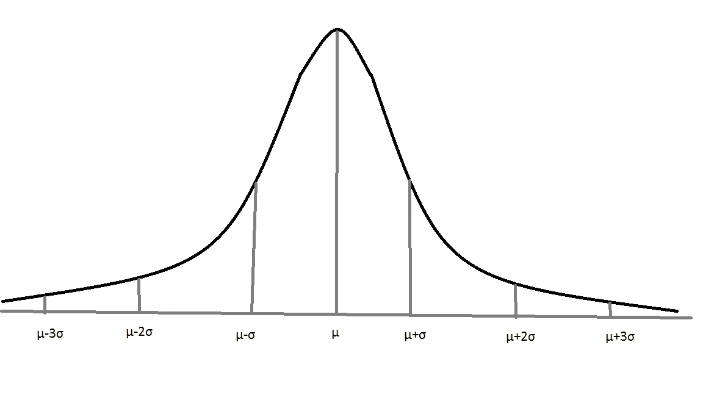

**均值=和标准差= σ的高斯/正态分布**

根据高斯/正态分布:

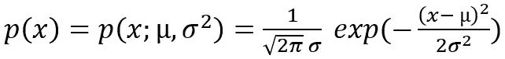

**p(x)是 x 在高斯分布中的概率**

> **高斯分布异常检测算法:**

让我们考虑有 *m* 个数据点(实例),每个数据点具有 *n* 个选定特征。

*   每个特征的平均参数( *j* = 1 到 *n* )是拟合的。

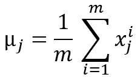

*   每个特征的方差参数( *j* = 1 到 *n* )是拟合的。

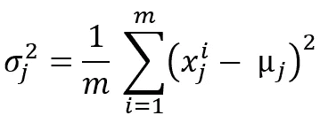

*   给定一个新的数据点， *x* = *{x_1，x_2，…，x_j}* ， *p(x)* 由下式给出:

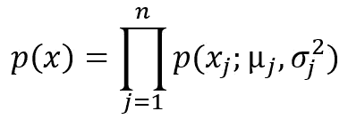

或者，

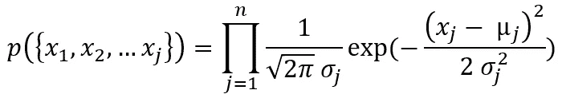

*   现在，选择阈值参数 **ε** ，使得，

```
if p(x) < **ε:** # x is an ANOMALY or OUTLIER !!!!
else:
    # x is NOT an ANOMALY or OUTLIER !!!!
```

> **在 Python 中应用高斯分布模型对服务器计算机数据集进行异常检测**

**问题陈述**:*检测服务器计算机*的异常行为

该数据集可在 GitHub link 上获得，

[](https://github.com/navoneel1092283/Server_Computer_Dataset.git) [## navoneel 1092283/服务器计算机数据集

### 以吞吐量(mb/s)和延迟(ms)作为异常行为检测特征的计算机服务器数据集…

github.com](https://github.com/navoneel1092283/Server_Computer_Dataset.git) 

**I.** 数据读取(数据集存在于。mat 格式)

```
import scipy.io
data = scipy.io.loadmat('data.mat')X = data['Xval'] # **features** y = data['yval'] # **class** **labels (0->Non-Anomalous, 1->Anomalous)**
```

**二世。**数据可视化(以散点图的形式)

```
import matplotlib.pyplot as plt
%matplotlib inlineplt.scatter(X.T[0], X.T[1])
plt.xlabel('Latency (ms)')
plt.ylabel('Throughput (mb/s)')
plt.show()
```

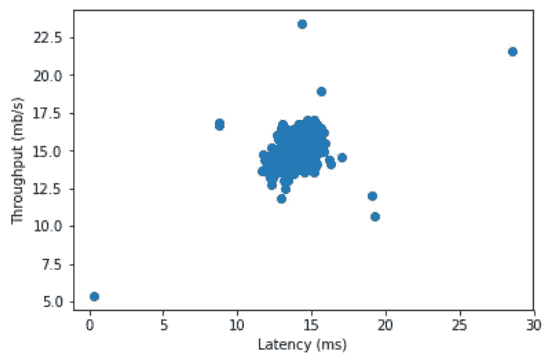

**延迟和吞吐量这两个特性的散点图**

**三世。**用于异常或异常值检测的高斯分布算法的实现

```
import numpy as np
from math import *def **gaussian**(X, x, epsilon):
    # X represents the Training Set Features 
    # x represents the set of new data-points (Validation/Test Set)

    mean = np.zeros(X.shape[1])
    std = np.zeros(X.shape[1])
    Xt = X.T
    xt = x.T
    p = np.zeros(x.shape[0]) # vector of output predictions for i in range(0, X.shape[1]):
        mean[i] = Xt[i].mean()
        std[i] = Xt[i].std()for i in range(0, x.shape[0]):
        prob = 1
        for j in range(0, X.shape[1]):
            prob = prob * (1/sqrt(2*3.14)) * exp(-pow((xt[j][i] 
                           - mean[j]),2)/2 * std[j] * std[j])

        if prob < epsilon:
            p[i] = 1

    return p
```

**四。**训练集、验证集和测试集的准备

这里，已经有关于训练集、验证集和测试集的准备的某些常规规则:

*   训练集应该有 60%(大约。)的实例数。
*   训练集中的所有实例都应该是非异常的(根据标签)。
*   验证集应该有大约 20%的实例包含异常和非异常实例(根据标签)。
*   包含剩余实例的测试集也应该有异常和非异常的例子(根据标签)。

```
# Inspecting the distribution of class labels in the dataset...
unique, counts = np.unique(y, return_counts=True)
print(dict(zip(unique, counts)))
```

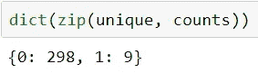

有 **298 个非异常**和 **9 个异常**的例子

```
itemindex = np.where(y==1) # storing indices of anomalous examples# **Training Set Preparation**
training_set = np.ones((int(0.6*X.shape[0]),X.shape[1]))
y_train = np.ones(int(0.6*X.shape[0]))
count = 0
i = 0
while(count < int(0.6*X.shape[0])):
    if i not in itemindex[0]: 
        training_set[count] = X[i]
        y_train[count] = y[i]
        count = count + 1
    i = i + 1# **Validation Set Preparation**
validation_set = np.ones((int(0.2*X.shape[0]+1),X.shape[1]))
y_validation = np.ones(int(0.2*X.shape[0]+1))
count = 0

while(count <= int(0.2*X.shape[0]) - 5):
    validation_set[count] = X[i]
    y_validation[count] = y[i]
    count = count + 1
    i = i + 1

for j in range(1,6):
    validation_set[-j] = X[itemindex[0][j-1]]
    y_validation[-j] = y[itemindex[0][j-1]]# **Test Set Preparation**
test_set = np.ones((int(0.2*X.shape[0]),X.shape[1]))
y_test = np.ones(int(0.2*X.shape[0]))
count = 0while(count < int(0.2*X.shape[0]) - 4):
    if i not in itemindex[0]: 
        test_set[count] = X[i]
        y_test[count] = y[i]
        count = count + 1
    i = i + 1for j in range(6,10):
    test_set[count] = X[itemindex[0][j-1]]
    y_test[count] = y[itemindex[0][j-1]]
    count = count + 1
```

**V.** 用调整的阈值参数训练模型， **ε** = 0.0001(发现在验证集上给出最佳性能)

```
predictions_validation = gaussian(training_set, validation_set
                                  , 0.0001)
```

**六。**验证集上的性能分析

```
# **Accuracy Calculation...**
k = 0
for i in range(0, y_validation.shape[0]):
    if predictions_validation[i] == y_validation[i]:
        k = k + 1
accuracy = k/y_validation.shape[0]
print("Validation Accuracy: ", accuracy)# **Precision Calculation...**
tp = fp = 0
# tp -> True Positive, fp -> False Positive
for i in range(0, predictions_validation.shape[0]):
    if predictions_validation[i] == y_validation[i] == 0:
        tp = tp + 1
    elif predictions_validation[i] == 0 and y_validation[i] == 1:
        fp = fp + 1
precision = tp/(tp + fp)
print("Precision on the Validation Set: ", precision)# **Recall Calculation...**
fn = 0
fn = 0
# fn -> False Negatives
for i in range(0, predictions_validation.shape[0]):
    if predictions_validation[i] == 1 and y_validation[i] == 0:
        fn = fn + 1
recall = tp/(tp + fn)
print("Recall on the Validation Set: ", recall)# **F1-Score Calculation...**
f1_score = (2 * precision * recall)/(precision + recall)
print("F1-Score on the Validation Set: ", f1_score)
```

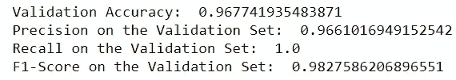

**验证集上的性能**

**七。**验证集上的散点图性能可视化

```
# **SCATTER PLOT WITH DATA-POINT HAVING ACTUAL LABELS** itemindex = np.where(y_validation==1)
validation_non_anomalous = np.zeros((y_validation.shape[0] 
                           - itemindex[0].shape[0]
                           , validation_set.shape[1]))
count = 0for i in range(0, validation_set.shape[0]):
    if i not in itemindex[0]:
        validation_non_anomalous[count] = validation_set[i]
        count = count + 1
    i = i + 1validation_anomalous = np.zeros((itemindex[0].shape[0]
                       , validation_set.shape[1]))
count = 0for i in itemindex[0]:
    validation_anomalous[count] = validation_set[i]
    count = count + 1plt.scatter(validation_non_anomalous.T[0], validation_non_anomalous.T[1], c = "green", label="Non-Anomalous")
plt.scatter(validation_anomalous.T[0], validation_anomalous.T[1], c = "red", label="Anomalous")
plt.xlabel('Latency (ms)')
plt.ylabel('Throughput (mb/s)')
plt.legend()
plt.show()# **SCATTER PLOT WITH DATA-POINT HAVING LABELS GIVEN BY THE MODEL**
itemindex = np.where(predictions_validation==1)
validation_predicted_non_anomalous = np.zeros((y_validation.shape[0]
                                     - itemindex[0].shape[0],
                                     validation_set.shape[1]))
count = 0for i in range(0, validation_set.shape[0]):
    if i not in itemindex[0]:
        validation_predicted_non_anomalous[count]=validation_set[i]
        count = count + 1
    i = i + 1validation_predicted_anomalous = np.zeros((itemindex[0].shape[0]
                                 , validation_set.shape[1]))
count = 0for i in itemindex[0]:
    validation_predicted_anomalous[count] = validation_set[i]
    count = count + 1plt.scatter(validation_predicted_non_anomalous.T[0], validation_predicted_non_anomalous.T[1], c = "green", label="Non-Anomalous")
plt.scatter(validation_predicted_anomalous.T[0], validation_predicted_anomalous.T[1], c = "red", label="Anomalous")
plt.xlabel('Latency (ms)')
plt.ylabel('Throughput (mb/s)')
plt.legend()
plt.show()
```

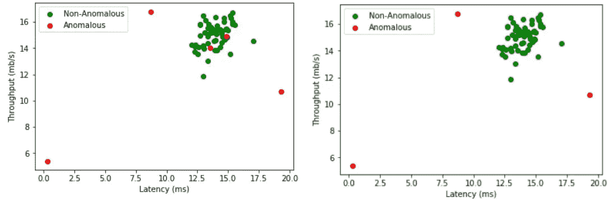

**含实际标签的散点图与含验证集预测标签的散点图**

**八。**测试集上的性能分析

```
predictions_test = gaussian(training_set, test_set, 0.0001)# **Accuracy Calculation...**
k = 0
for i in range(0, y_test.shape[0]):
    if predictions_test[i] == y_test[i]:
        k = k + 1
accuracy = k/y_test.shape[0]
print("Test Accuracy: ", accuracy)# **Precision Calculation...**
tp = fp = 0
# tp -> True Positive, fp -> False Positive
for i in range(0, predictions_test.shape[0]):
    if predictions_test[i] == y_test[i] == 0:
        tp = tp + 1
    elif predictions_test[i] == 0 and y_test[i] == 1:
        fp = fp + 1
precision = tp/(tp + fp)
print("Precision on the Test Set: ", precision)# **Recall Calculation...**
fn = 0
fn = 0
# fn -> False Negatives
for i in range(0, predictions_test.shape[0]):
    if predictions_test[i] == 1 and y_test[i] == 0:
        fn = fn + 1
recall = tp/(tp + fn)
print("Recall on the Test Set: ", recall)# **F1-Score Calculation...**
f1_score = (2 * precision * recall)/(precision + recall)
print("F1-Score on the Test Set: ", f1_score)
```

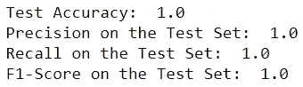

**测试集上的性能**

**九。**散点图在测试集上的性能可视化

```
# **SCATTER PLOT WITH DATA-POINT HAVING ACTUAL LABELS** itemindex = np.where(y_test==1)
test_non_anomalous = np.zeros((y_test.shape[0] 
                           - itemindex[0].shape[0]
                           , test_set.shape[1]))
count = 0for i in range(0, test_set.shape[0]):
    if i not in itemindex[0]:
        test_non_anomalous[count] = test_set[i]
        count = count + 1
    i = i + 1test_anomalous = np.zeros((itemindex[0].shape[0]
                       , test_set.shape[1]))
count = 0for i in itemindex[0]:
    test_anomalous[count] = test_set[i]
    count = count + 1plt.scatter(test_non_anomalous.T[0], test_non_anomalous.T[1], 
            c = "green", label="Non-Anomalous")
plt.scatter(test_anomalous.T[0], test_anomalous.T[1], c = "red"
            , label="Anomalous")
plt.xlabel('Latency (ms)')
plt.ylabel('Throughput (mb/s)')
plt.legend()
plt.show()# **SCATTER PLOT WITH DATA-POINT HAVING LABELS GIVEN BY THE MODEL**
itemindex = np.where(predictions_test==1)
test_predicted_non_anomalous = np.zeros((y_test.shape[0]
                                         - itemindex[0].shape[0],
                                         test_set.shape[1]))
count = 0for i in range(0, test_set.shape[0]):
    if i not in itemindex[0]:
        test_predicted_non_anomalous[count]=test_set[i]
        count = count + 1
    i = i + 1test_predicted_anomalous = np.zeros((itemindex[0].shape[0]
                                 , test_set.shape[1]))
count = 0for i in itemindex[0]:
    test_predicted_anomalous[count] = test_set[i]
    count = count + 1plt.scatter(test_predicted_non_anomalous.T[0]
            , test_predicted_non_anomalous.T[1], c = "green"
            , label="Non-Anomalous")
plt.scatter(test_predicted_anomalous.T[0]
            , test_predicted_anomalous.T[1], c = "red"
            , label="Anomalous")
plt.xlabel('Latency (ms)')
plt.ylabel('Throughput (mb/s)')
plt.legend()
plt.show()
```

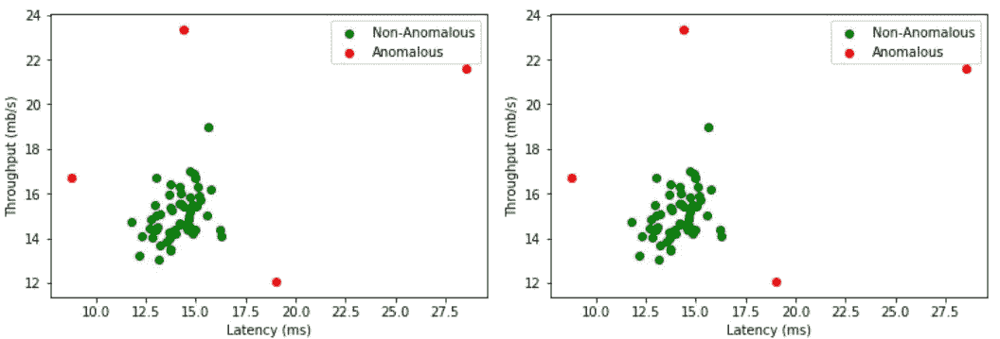

**测试集的实际标签散点图与预测标签散点图【完全相同】**

因此，高斯分布算法正确地识别测试集中的所有异常值或异常，而不会错误地将非异常实例预测为异常。

还有许多其他高级异常检测模型，如[贝叶斯网络](https://en.wikipedia.org/wiki/Bayesian_Network)、[隐马尔可夫模型](https://en.wikipedia.org/wiki/Hidden_Markov_model) (HMMs)、基于[聚类分析](https://en.wikipedia.org/wiki/Cluster_analysis)的异常检测等。我将在接下来的文章中介绍这些方法。