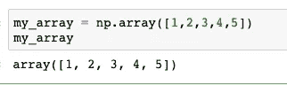
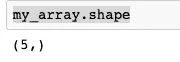
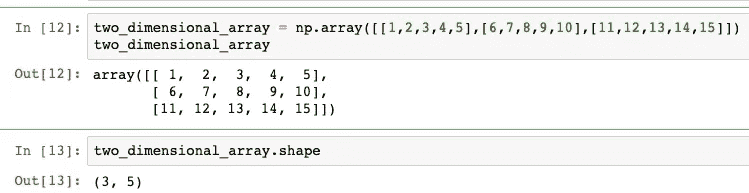
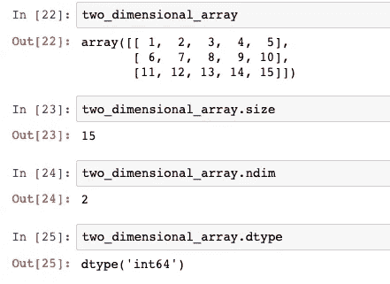
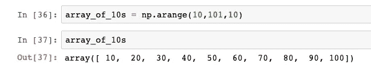
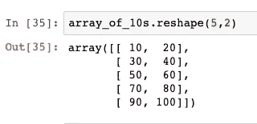
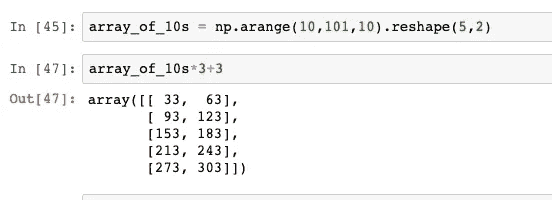
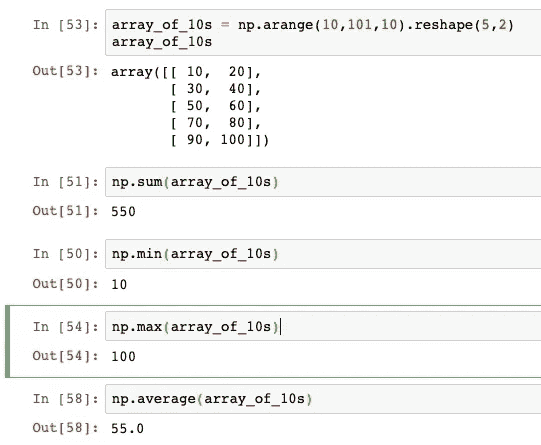

# 对 NumPy 的温和介绍

> 原文：<https://pub.towardsai.net/a-gentle-intro-to-numpy-89735ec0718f?source=collection_archive---------1----------------------->

## 任何数据科学家都必须学习的库


贷记[像素](https://pixabay.com/users/pexels-2286921/)

NumPy 这个名称代表数值 python，旨在促进多维数组的处理和数学运算。它是一个开源库，许多其他科学软件包都基于它。

本文将介绍一些 NumPy 基础知识，比如创建数组和对数组执行简单的操作。

## **让我们开始吧**

如果您的环境中没有安装 NumPy，您需要使用以下命令安装它:

```
pip install numpy
```

预安装软件包后，您可以通过以下导入开始使用:

```
import numpy as np
```

## **创建数组**

导入库后，您可以开始创建阵列。创建数组最简单的方法是使用列表:



上面的代码创建了一个包含五个元素的一维数组。

您可以使用 shape 属性检查数组的详细信息。在我们的数组上调用 shape 确认数组是一维的，有五个元素。



与我们创建一维数组的方式相同，我们可以创建任何多维数组。现在让我们创建一个二维数组作为例子:



正如你所看到的，你可以使用形状属性来查看数组维数。二维数组可以被认为是矩阵。上面的二维 NumPy 数组有三行五列(3，5)。

您可能会遇到的最常用的 NumPy 数组维度是一维数组(第一个示例中的标准数组)和二维数组(第二个示例中的矩阵样式)。但是，您可以使用 NumPy 创建任何维度的数组。

## **基本数组属性**

您已经遇到了名为 shape 的 NumPy 数组属性之一。其他重要的属性是 size、ndim 和 dtype。让我们在第一个阵列上演示它的用法。


size 属性为我们提供了 NumPy 数组中的许多元素，在我们的例子中是 5 个。ndim 确认我们有一个一维数组，dtype 告诉我们元素是整数。

同样，我们可以检查我们使用的第二个示例数组的属性:



您可以看到，这里有 15 个元素，2 个维度，数据也由整数组成。

## **排列功能**

有一个方便的实用函数可以创建名为 arange()的 NumPy 数组。该函数采用三个参数:initial index(包含)、end_index(不包含)和步长来创建数组。让我们在这里演示一下:



正如您在这里看到的，我们已经创建了一个从 10 到 100 的数字数组，每个数字递增 10。

## **整形功能**

操纵 NumPy 数组的另一个有用的函数是 shape()函数。该函数可用于改变数组维数。让我们把它应用到我们的数组中:



我们刚刚将一个有十个元素的一维数组改造成一个有 5 行 2 列的二维数组。

上一篇检查点中提到的两个函数 arange()和 shape()经常一起使用来创建人工数组，并帮助我们避免手动键入长列表。

## **数组上的数学运算**

创建后，你可以对 NumPy 数组的元素进行传统的数学运算。让我们试试乘法和加法:



我们刚刚将所有的元素数组乘以 3，并为每个元素增加了数字 3。

## **聚合函数**

可以应用于 NumPy 数组的另一个有用的操作是聚合函数。这样，您就可以计算数组中所有元素的总和、其最小值和最大值，或者元素的平均值。让我们看一个现实生活中的例子:



在上面的例子中，我们已经创建了一个 10 的数组，并将其重塑为 2 行 5 列的二维数组。然后，我们找到了数组的总和、最小值、最大值和平均值。所有这些都只有一行代码。

NumPy 的简短介绍到此结束。我希望您喜欢这个演示，现在您能够使用一些基本的库功能了。

*原载于 about data blog . com:*[2020 年 1 月 27 日 NumPy](https://www.aboutdatablog.com/post/a-gentle-intro-to-numpy)*的温柔介绍。*

*PS:我正在 Medium 和*[***aboutdatablog.com***](https://www.aboutdatablog.com/)*上撰写深入浅出地解释基本数据科学概念的文章。你可以订阅我的* [***邮件列表***](https://medium.com/subscribe/@konkiewicz.m) *以便在我每次写新文章时得到通知。如果你还不是中等会员，你可以在这里加入*[](https://medium.com/@konkiewicz.m/membership)**。**

*下面还有一些你可能喜欢的帖子*

*[](https://towardsdatascience.com/what-are-lambda-functions-in-python-and-why-you-should-start-using-them-right-now-75ab85655dc6) [## python 中的 lambda 函数是什么，为什么你现在就应该开始使用它们

### 初学者在 python 和 pandas 中开始使用 lambda 函数的快速指南。

towardsdatascience.com](https://towardsdatascience.com/what-are-lambda-functions-in-python-and-why-you-should-start-using-them-right-now-75ab85655dc6) [](https://towardsdatascience.com/jupyter-notebook-autocompletion-f291008c66c) [## Jupyter 笔记本自动完成

### 数据科学家的最佳生产力工具，如果您还没有使用它，您应该使用它…

towardsdatascience.com](https://towardsdatascience.com/jupyter-notebook-autocompletion-f291008c66c) [](https://towardsdatascience.com/7-practical-pandas-tips-when-you-start-working-with-the-library-e4a9205eb443) [## 当你开始与图书馆合作时，7 个实用的熊猫提示

### 解释一些乍一看不那么明显的东西…

towardsdatascience.com](https://towardsdatascience.com/7-practical-pandas-tips-when-you-start-working-with-the-library-e4a9205eb443)*