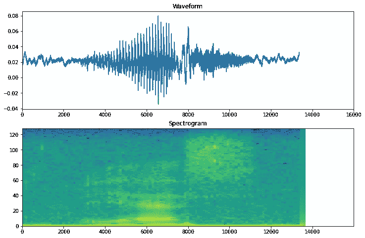
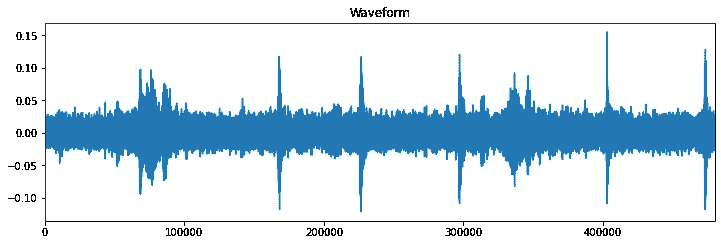
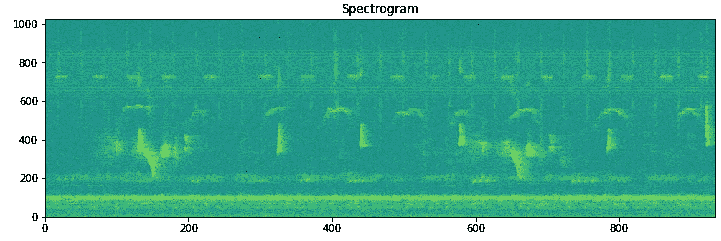
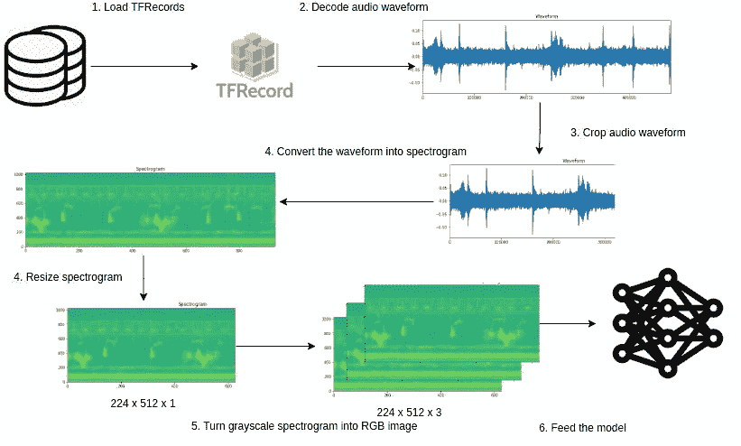

# Tensorflow 音频分类简介

> 原文：<https://pub.towardsai.net/a-gentle-introduction-to-audio-classification-with-tensorflow-c469cb0be6f5?source=collection_archive---------1----------------------->

## [深度学习](https://towardsai.net/p/category/machine-learning/deep-learning)

## 深度学习在 Tensorflow 音频分类中的应用



来源:https://www.tensorflow.org/tutorials/audio/simple_audio

我们已经看到了许多与**视觉**和**语言**领域相关的深度学习的最新进展，很直观地理解为什么 CNN 在图像上表现非常好，具有像素的**局部相关性**，以及像 RNNs 或 transformers 这样的序列模型如何也在语言上表现非常好，具有其**序列**性质，但音频呢？当我们处理音频数据时，使用什么类型的模型和过程？

> 在这篇文章中，你将学习如何处理一个简单的音频分类问题，你将学习一些常用和有效的方法，以及 Tensorflow 代码。

> 声明:此处提供的代码基于为“[雨林连接物种音频检测](https://www.kaggle.com/c/rfcx-species-audio-detection)”ka ggle 竞赛开发的[我的作品](https://www.kaggle.com/dimitreoliveira/rainforest-audio-classification-tensorflow-starter/notebook)，但出于演示目的，我将使用“[语音命令](https://arxiv.org/abs/1804.03209)数据集。

## 波形

我们通常在“**中有音频文件。wav** 格式，它们通常被称为**波形**，一个波形是一个**时间序列**，具有在每个特定时间的信号幅度，如果我们可视化这些波形样本中的一个，我们将得到类似这样的结果:



x 轴是时间，y 轴是归一化的信号幅度

直觉上，人们可能会考虑使用某种类型的 **RNN** 模型将这些数据建模为常规的**时间序列**(例如股票价格预测)，事实上，这是可以做到的，但由于我们使用的是音频信号，更合适的选择是将**波形**样本转换为**频谱图**。

## 光谱图

频谱图是波形信号的**图像表示**，它显示了其**随时间变化的频率强度范围**，当我们想要评估信号随时间变化的频率分布时，它会非常有用。下面是我们上面看到的波形图的声谱图表示。



x 轴是采样时间，y 轴是频率

## 语音命令用例

为了使本教程更简单，我们将使用"[语音命令](https://arxiv.org/abs/1804.03209)"数据集，这个数据集有一个一秒钟的音频剪辑，带有语音单词，如:"向下"、"向前"、"向左"、"不"、"向右"、"停止"、"向上"和"是"。

## 使用 Tensorflow 进行音频处理

现在，我们已经了解了如何处理音频数据以用于深度学习模型，我们可以继续查看代码实现来做到这一点，我们的管道将遵循下图描述的简单工作流程:



简单音频处理图

> 请注意，在我们的用例中，在**第一步中，**数据是直接从。wav”文件，而第三步**是可选的**，因为每个音频文件只有一秒钟，在某些情况下，对于较长的文件以及在所有样本中保持固定长度，裁剪音频可能是个好主意。

**加载数据**

```
def load_dataset(filenames):
  dataset = tf.data.Dataset.from_tensor_slices(filenames)
  return dataset
```

`load_dataset`函数将负责加载`.wav`文件并将它们转换成 Tensorflow 数据集。

**提取波形并标记**

```
commands = np.array(tf.io.gfile.listdir(str(data_dir)))
commands = commands[commands != 'README.md']def decode_audio(audio_binary):
  audio, _ = tf.audio.decode_wav(audio_binary)
  return tf.squeeze(audio, axis=-1)def get_label(filename):
  label = tf.strings.split(filename, os.path.sep)[-2]
  label = tf.argmax(label == commands)
  return labeldef get_waveform_and_label(filename):
  label = get_label(filename)
  audio_binary = tf.io.read_file(filename)
  waveform = decode_audio(audio_binary)
  return waveform, label
```

加载完`.wav`文件后，我们需要解码它们，这可以使用`tf.audio.decode_wav`函数来完成，它会将`.wav`文件转换成浮点张量。接下来，我们需要从文件中提取标签，在这个特定的用例中，我们可以从每个样本的文件路径中获取标签，之后我们只需要对它们进行一次性编码。

下面是一个例子:
首先，我们得到这样一个文件路径:

```
"data/mini_speech_commands/up/50f55535_nohash_0.wav"
```

然后我们提取第二个“ **/** ”之后的文本，在这种情况下，标签是 **UP，**最后，我们使用`commands`列表对标签进行一键编码。

```
Commands: ['up' 'down' 'go' 'stop' 'left' 'no' 'yes' 'right']Label = 'up'After one-hot encoding:Label = [1, 0, 0, 0, 0, 0, 0, 0]
```

**将波形转换成频谱图**

下一步是将**波形**文件转换为**频谱图**，幸运的是 Tensorflow 有一个功能可以做到这一点，`tf.signal.stft`应用短时傅立叶变换( **STFT** )将音频转换到时频域，然后我们应用`tf.abs`算子去除信号相位，只保留**幅度**。请注意，`tf.signal.stft`功能有一些参数，如`frame_length`和`frame_step`，它们会影响生成的声谱图，我不会详细介绍如何调整它们，但您可以参考[此视频](https://www.coursera.org/lecture/audio-signal-processing/stft-2-tjEQe)了解更多信息。

```
def get_spectrogram(waveform, padding=False, min_padding=48000):
  waveform = tf.cast(waveform, tf.float32)
  spectrogram = tf.signal.stft(waveform, frame_length=2048, frame_step=512, fft_length=2048)
  spectrogram = tf.abs(spectrogram)
  return spectrogramdef get_spectrogram_tf(waveform, label):
  spectrogram = get_spectrogram(waveform)
  spectrogram = tf.expand_dims(spectrogram, axis=-1)
  return spectrogram, label
```

**将光谱图转换成 RGB 图像**

最后一步是将光谱图转换为 RGB 图像，这一步是可选的，但这里我们将使用在 ImageNet 数据集上预先训练的模型，该模型需要具有 3 个通道的输入图像，否则，您可以只保留一个通道的光谱图。

```
def prepare_sample(spectrogram, label):
  spectrogram = tf.image.resize(spectrogram, [HEIGHT, WIDTH])
  spectrogram = tf.image.grayscale_to_rgb(spectrogram)
  return spectrogram, label
```

**结合在一起**

```
HEIGHT, WIDTH = 128, 128
AUTO = tf.data.AUTOTUNEdef get_dataset(filenames, batch_size=32):
  dataset = load_dataset(filenames)

  dataset = files_ds.map(get_waveform_and_label, num_parallel_calls=AUTO)
  dataset = dataset.map(get_spectrogram_tf, num_parallel_calls=AUTO)
  dataset = dataset.map(prepare_sample, num_parallel_calls=AUTO) dataset = dataset.shuffle(256)
  dataset = dataset.repeat()
  dataset = dataset.batch(batch_size)
  dataset = dataset.prefetch(AUTO)
  return dataset
```

综上所述，我们使用了`get_dataset`函数，它将文件名作为输入，在完成上述所有步骤后，返回一个包含 RGB 光谱图图像及其标签的 Tensorflow 数据集。

## 模型

```
def model_fn(input_shape, N_CLASSES):
  inputs = L.Input(shape=input_shape, name='input_audio')
  base_model = efn.EfficientNetB0(input_tensor=inputs, 
                                  include_top=False, 
                                  weights='imagenet')

  x = L.GlobalAveragePooling2D()(base_model.output)
  x = L.Dropout(.5)(x)
  output = L.Dense(N_CLASSES, activation='softmax',name='output')(x)

  model = Model(inputs=inputs, outputs=output)

  return model
```

我们的模型将有一个 **EfficientNetB0** 主干，在它的顶部，我们添加了一个**globalaveragepool2d**，后面是一个 **Dropout，**，最后是一个 **Dense** 层，它将进行实际的多类分类。

> 对于小数据集来说，EfficientNetB0 可能是一个很好的基准，即使它是一个快速而轻便的模型，它也有相当好的准确性。

## 培养

```
model = model_fn((None, None, CHANNELS), N_CLASSES)model.compile(optimizer=tf.optimizers.Adam(), 
              loss=losses.CategoricalCrossentropy(), 
              metrics=[metrics.CategoricalAccuracy()])

model.fit(x=get_dataset(FILENAMES), 
          steps_per_epoch=100, 
          epochs=10)
```

对于 Keras 模型来说，训练代码是非常标准的，所以您可能不会在这里发现任何新东西。

## 结论

现在，您应该对将深度学习应用于音频文件的工作流有了更清晰的理解，尽管这不是唯一的方法，但这是关于易用性/性能权衡的最佳选择之一。如果你要制作音频模型，你也可以考虑其他有前途的方法，比如变压器。

作为额外的预处理步骤，您可以截断或填充波形，这可能是一个好主意，如果您的样本具有不同的长度，或者如果样本太长，您只需要其中的一小部分，您可以在下面的参考资料部分找到如何做到这一点的代码。

**参考文献**
- [简单音频识别:识别关键词](https://www.tensorflow.org/tutorials/audio/simple_audio)-[雨林-音频分类 tensor flow starter](https://www.kaggle.com/dimitreoliveira/rainforest-audio-classification-tensorflow-starter)-[雨林-音频分类 TF 改良](https://www.kaggle.com/dimitreoliveira/rainforest-audio-classification-tf-improved/notebook)

[](https://www.kaggle.com/dimitreoliveira/rainforest-audio-classification-tensorflow-starter?scriptVersionId=60260050&cellId=1) [## 雨林-音频分类 Tensorflow 启动器

### 使用 Kaggle 笔记本探索和运行机器学习代码|使用来自雨林连接物种音频的数据…

www.kaggle.com](https://www.kaggle.com/dimitreoliveira/rainforest-audio-classification-tensorflow-starter?scriptVersionId=60260050&cellId=1) [](https://www.kaggle.com/dimitreoliveira/rainforest-audio-classification-tf-improved/notebook?scriptVersionId=53686233&cellId=1) [## 雨林-音频分类 TF 改进

### 使用 Kaggle 笔记本探索和运行机器学习代码|使用来自雨林连接物种音频的数据…

www.kaggle.com](https://www.kaggle.com/dimitreoliveira/rainforest-audio-classification-tf-improved/notebook?scriptVersionId=53686233&cellId=1)