# 自动微分的简明介绍

> 原文：<https://pub.towardsai.net/a-gentle-introduction-to-automatic-differentiation-74e7eb9a75af?source=collection_archive---------1----------------------->

作为一名数学和计算机科学的学生，我很自然地对人工智能产生了兴趣，因为这是一个位于这两个知识领域交叉点的领域:它位于美丽的数学基础之上，同时提出了许多计算挑战。此外，它的应用是不可计数的，它有望彻底改变每个行业。特别是机器学习，这是人工智能的一个主要领域，专注于构建通过从数据中提取洞察力来学习执行任务的程序，在研究人员和从业者中间都经历了显着的兴趣增长。


来源: [Unsplash](https://unsplash.com/photos/ZiQkhI7417A)

但是对于机器来说，学习意味着什么呢？深入到几乎所有机器学习算法的基础，可以看到“学习”被公式化为目标函数的优化，该目标函数测量算法执行手头任务的好坏。当涉及到该函数的优化时，经常依赖于基于梯度的优化方法，这需要计算目标函数相对于模型参数的导数。

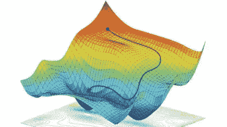

两变量标量函数的优化([来源](https://www.researchgate.net/profile/Alexander-Amini/publication/325142728/figure/fig1/AS:766109435326465@1559666131320/Non-convex-optimization-We-utilize-stochastic-gradient-descent-to-find-a-local-optimum.jpg))。

然而，例如，在 TensorFlow 或 PyTorch 中构建神经网络时，这些导数的实际计算对于使用*自动微分*的程序员来说是透明的。在本文中，我们将讨论这种技术与计算导数的其他方法有何不同，并对其工作原理进行简单介绍。

本文旨在成为一系列关于人工智能特定主题的文章中的第一篇，隐藏了经常被忽略的美丽的数学片段。

# **如何计算导数？**

在机器学习的背景下，我们通常会发现自己在使用一个标量函数来测量我们的模型在一些样本数据上的预测误差。对于这个函数，我们要计算它的梯度，也就是它对模型参数偏导数的向量。首先，回忆偏导数的定义:

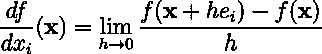

xᵢ.的偏导数

因此，我们要计算以下向量:


多实变量标量函数的梯度向量。

下面，我们通过介绍其他微分技术的局限性来说明自动微分所解决的问题。

***手动微分***

它包括手动计算导数。然后，将获得的表达式插入程序中。从理论角度来看，这可能是有趣的，但当我们只需要它的数值评估时，这可能是不必要的，因为这是一个耗时的过程，而且容易出错。

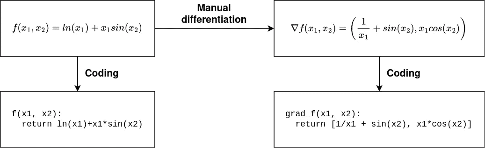

图片作者，灵感来源于[【1】](https://www.jmlr.org/papers/volume18/17-468/17-468.pdf)。

***象征分化***

函数的微分是一个机械的过程，因此可以通过计算机程序(如 Mathematica，Maple…)来实现。

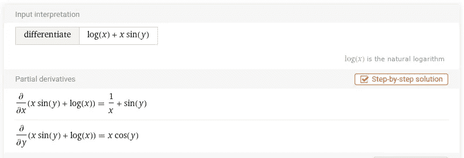

使用 [WolframAlpha](https://www.wolframalpha.com/) 的符号微分。

但是，结果可能是一个大型表达式，其计算效率不高。这个问题被称为**表情膨胀。**

为了说明这一点，请考虑以下示例:


其梯度的符号形式如下所示:

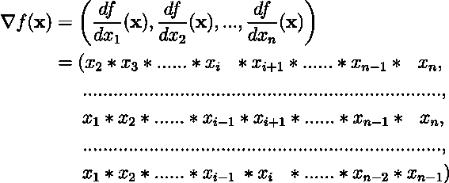

此外，符号微分只适用于采用**封闭形式**的函数。然而，如果函数被表达为具有循环、递归…的计算机程序，这可能无法确定:

```
def f(a: float, b: float) -> float:
  c : float = 0.0
  if a > b:
    for i in range(10):
      c += a*i
  else:
      c = a*b
  return c
```

***数值微分***

回想一下，函数的偏导数被正式定义为极限。因此，对于 *h* 取一个足够小的值，我们可以通过差商来近似其值:

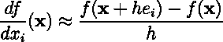

然而，这种近似在数值上是不稳定的(我们除以一个接近于零的数，减去可能近似相等的数)。

此外，在我们计算全梯度的情况下，这种技术将需要对目标函数进行 *n+1* 次评估，这可能非常昂贵。

# **自动微分**

自动微分解决了上述技术的问题。这种技术来自于这样一种观察，即每一种数值算法最终都缩小到对导数已知的一组有限的基本运算的求值。

例如，考虑函数:

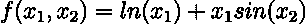

根据上面的观察，我们可以采用两种等价的符号来表示任何数值算法:

*   **评估痕迹**或 **Wengert 列表。**使用中间变量 *vᵢ* 和初等运算符构建函数。在下面的例子中，我们使用由*格里万克*和*瓦尔特*提出的三声部记谱法。

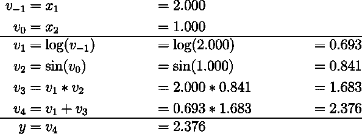

x₁ = 2.000 和 x₂ = 1.000 时 *f* 的评估轨迹。

*   **计算图。**每个变量的值通过对某组输入变量应用特定的初等运算符来确定。因此，变量之间存在一种*优先*的关系，我们将其表示为有向无环图的边。它的节点是参与函数计算的变量。

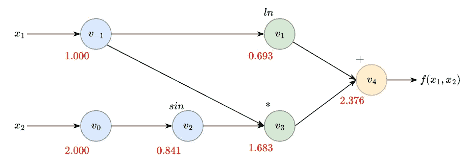

x₁ = 2.000 和 x₂ = 1.000 的 *f* 的计算图。

请注意，我们将输入变量标为蓝色，中间变量标为绿色，输出变量标为黄色。

这两种表示都允许我们用非线性控制流保持程序的所有表达能力，因为我们可以线性化执行的轨迹。此外，对于计算导数，我们只需要考虑程序执行过程中的数值计算，以及它们的顺序，而不考虑控制流路径。因此，*自动微分*允许我们用**非封闭形式**来微分函数。

为了说明在执行数值算法时*求值轨迹*是如何自然出现的，让我们用一些代码来增加本文的趣味。首先，我们将在 Python 中的 *float* 类型周围添加一个包装器，我们称之为*变量。*这允许我们覆盖它的操作符。此外，每个变量都有一个唯一的名称。

我们可以覆盖变量*的操作符，以跟踪在函数求值期间执行的基本操作。我们的*乘法*运算符定义如下:*

为其余的操作符创建类似的函数，我们可以计算我们的函数 *f* :

这段代码的执行向我们展示了评估跟踪。请注意，在评估我们的函数时，我们是根据优先关系以自然顺序遍历计算图。因此，这种运行通常被命名为*正向传递*。

```
v-1 = 2
v0 = 1
v1 = log(v-1) = 0.693
v2 = sin(v0) = 0.841
v3 = v-1 * v2 = 1.683
v4 = v1 + v3 = 2.376
```

这个评估轨迹将是计算我们的向量 *f* 的梯度的基础。但是，我们需要存储它，这样我们就可以复制所涉及的基本操作，以及它们在评估过程中的执行顺序。因为我们的评估轨迹是计算的线性表示，所以很自然地使用一个列表来记录它，在这个上下文中，这个列表通常被命名为磁带。其条目定义如下:

对于每个基本操作，我们记录它的输入、输出和一个闭包，名为 *propagate* ，它是计算我们函数的梯度的关键组件。因此，我们必须扩展我们的操作符，以确保每个计算都记录在*磁带*上:

# 反向模式自动微分

在导数从给定输出向后传播的意义上，反向模式自动微分可以被认为是广义反向传播算法。为此，我们用一个伴随变量*来补充每个中间变量 *vᵢ* :*

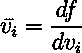

中间变量 *vᵢ.的伴随变量*

用简单的话来说，这些邻接点代表了每个变量对输出变化的贡献。准确地说，分配给输入变量的邻接点是我们想要为梯度确定的偏导数。

这些邻接的有效计算是通过将图从输出移动到输入来进行的。这背后的基本原理是应用*多元链式法则*。在我们的例子中，我们可以用它来计算第一个输入变量的偏导数 w.r.t:

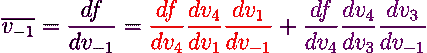

第一个输入变量的伴随变量。

简单地说，*多元链规则*告诉我们的是，为了计算每个伴随，我们必须遵循**两条**规则:

*   **沿从输出变量到所选变量的路径乘以**偏导数。
*   **将所有路径的前一次计算结果相加**。

然而，我们有两个输入变量，因此我们最好只需遍历图形一次来计算两个偏导数，如果我们处理成百上千个输入变量，这一要求将是至关重要的。准确地说，邻接可以被认为是一个保存公共子表达式的*簿记设备*,以确保图中的每条边只运行一次。

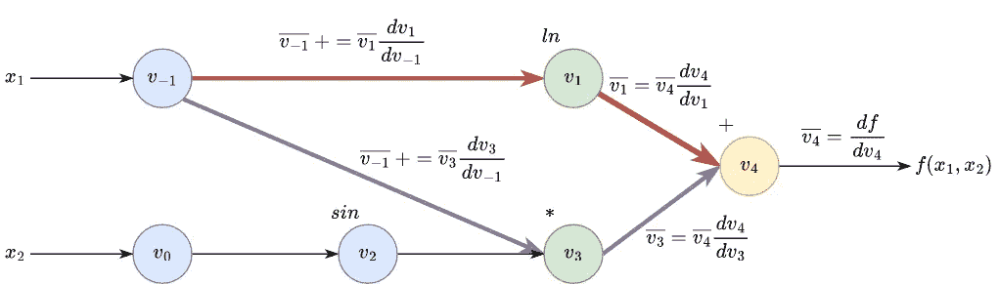

表示确定一阶偏导数的计算图形。

因此，为了执行*反向传递*，其中我们计算每个中间变量的邻接，我们需要跟踪每个中间变量相对于其输入的偏导数。这是由我们在*磁带*中记录的*关闭*完成的。让我们深入了解一下运算符*乘法*的实现细节:

首先，我们计算输出的*偏导数*，表示为相对于其输入的 *r* ，例如变量 *self* 和 *rhs:*

参数 *dL_outputs* 对应输出变量 *r* 的伴随。注意，尽管它被正式定义为一个 *L* ist *，*我们预先知道它正好包含一个元素，因为这是我们的操作符的输出数。我们可以使用这个伴随来更新其输入变量的伴随:

我们所做的是坚持上述规则的第一条，通过沿着从变量 *r* 的输出到每个输入变量的路径乘以偏导数。

因此，为了计算我们函数的梯度，我们必须沿着图*向后*，通过合计闭包*传播*返回的贡献来计算每个中间变量的邻接项:

让我们看看这个函数如何让我们计算之前定义的函数的梯度:

这些单元的执行返回以下输出:

```
dv4 ------------------------
v6 = v5 * v2 = 0.841
v7 = v5 * v-1 = 2.000
v8 = cos(v0) = 0.540
v9 = v7 * v8 = 1.081
v10 = 1.0 / v-1 = 0.500
v11 = v5 * v10 = 0.500
v12 = v6 + v11 = 1.341
dv4_dv4 = v5
dv4_dv1 = v5
dv4_dv3 = v5
dv4_dv-1 = v12
dv4_dv2 = v7
dv4_dv0 = v9
------------------------
dx1 1.3414709848078965
dx2 1.0806046117362795
```

有用！这正是我们函数在(2，1)处的梯度计算结果。

# **带梯度下降的线性回归**

前面的例子旨在说明自动微分是如何工作的。但是，在更实际的背景下展示其潜力是很方便的。

在下面的例子中，我们的目标是使用 *X* 的值来预测因变量 *Y* 的值。这两个随机变量之间的关系由以下关系来建模:

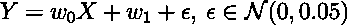

我们示例数据的模型

在我们的例子中，我们设定 *w₀=w* ₁=1.这些值应该是未知的，因此，我们的目标是从样本数据中推断出它们，或者换句话说，用线性模型拟合样本数据。

```
input_size = 50
X = np.random.random(input_size)
noise = np.random.normal(0, 0.05, input_size)
y_truth = X + 1 + noise
```

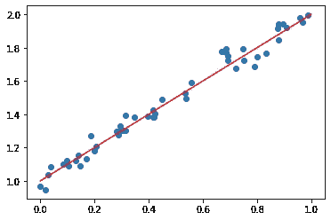

样本数据图和地面真实模型。

当用线性模型拟合样本数据时，我们的目标是最小化模型的预测和样本数据的真实情况之间的差异。在本例中，误差使用以下损失函数进行测量:

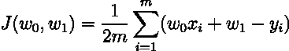

均方差。

我们如何找到最小化这个函数的参数？我们将使用*梯度下降*来优化该功能。也就是说，我们将使用梯度迭代调整参数:

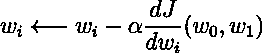

梯度下降。

因此，我们需要计算每次迭代的梯度。虽然我们的损失函数的微分很简单，但我们依靠我们的小框架来完成它:

我们通过定义函数 *t* o_ *v* ar 和 *to_vals* 包含了一个简单的向量化。这允许我们使用 *numpy* 函数来帮助提高代码的可读性。注意，计算是使用我们熟知的函数 *grad* 完成的。运行此代码后，我们可以看到拟合到样本数据的直线:

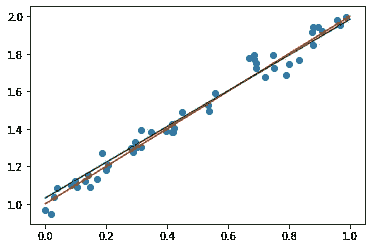

地面真实模型(红色)与拟合模型(绿色)的对比。

此外，我们可以根据迭代绘制损失值:

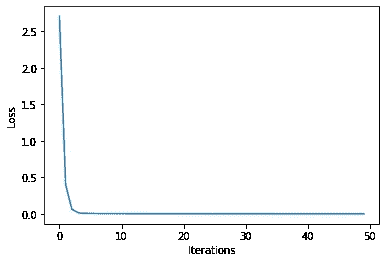

注意，在第一次迭代中，损耗下降非常快，收敛到零。我们的自动微分框架起作用了！我们还可以在参数空间上绘制梯度步长的轨迹:

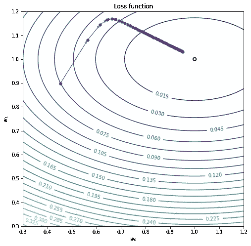

上图显示了我们的参数如何收敛到点(1，1)处损失函数的全局最小值。然而，在一些迭代之后，收敛是缓慢的，这不应该令人惊讶，因为我们的学习率在训练期间是固定的。

总之，我们开发了一个小框架，允许我们自动区分几个变量的函数。然而，重要的是要注意，这是一个最小的工作示例，TensorFlow 和 PyTorch 等框架提供的算法要复杂得多。该实现基于这个 [Colab 存储库](https://colab.research.google.com/drive/1VpeE6UvEPRz9HmsHh1KS0XxXjYu533EC)。要了解更多细节，我建议您去查看一下。

这篇文章的完整代码可以在我的 [GitHub](https://github.com/pablomlago/medium-articles) 中找到。

# 文献学

**【1】**格里万克和瓦尔特。[评估衍生品:算法微分的原理和技术](https://epubs.siam.org/doi/pdf/10.1137/1.9780898717761.bm) (2008)。工业和应用数学学会。

**【2】**a . g .拜丁，B. A .皮尔穆特，A. A .拉杜尔，J.M .西斯金德。[机器学习中的自动微分:综述](https://www.jmlr.org/papers/volume18/17-468/17-468.pdf) (2018)。机器学习研究杂志，18，1–43。