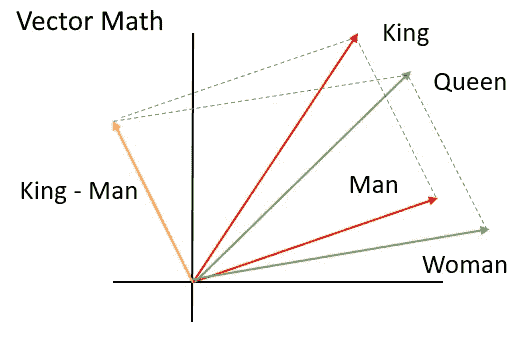
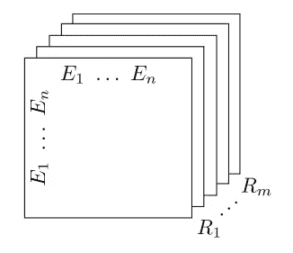
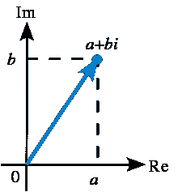
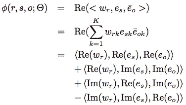
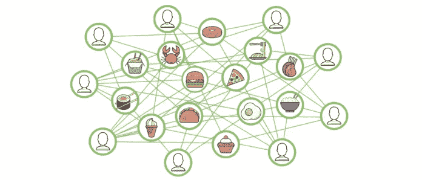
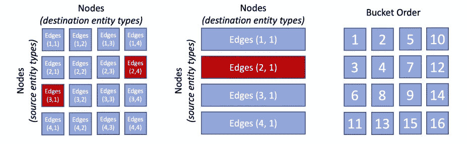
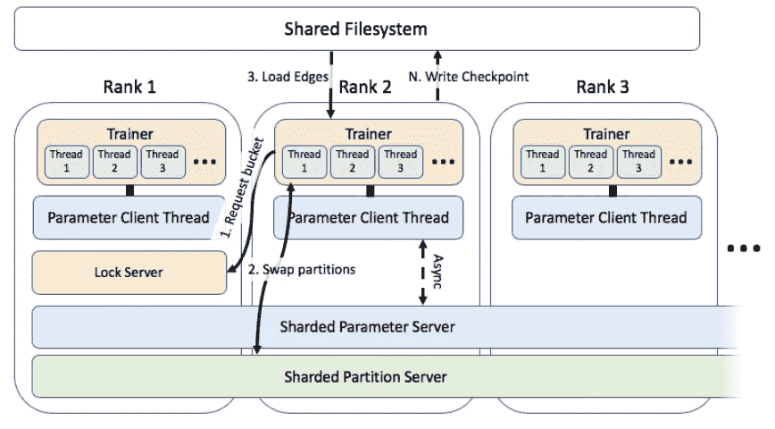

# 图形嵌入的简明介绍

> 原文：<https://pub.towardsai.net/a-gentle-introduction-to-graph-embeddings-c7b3d1db0fa8?source=collection_archive---------0----------------------->

[马志威](https://unsplash.com/@makcedward?utm_source=medium&utm_medium=referral)在 [Unsplash](https://unsplash.com?utm_source=medium&utm_medium=referral) 上拍照

我们可以考虑使用图形神经网络(GNN)来执行节点分类问题，而不是使用传统的机器学习分类任务。通过提供节点的显式链接，该分类问题不再被分类为独立的问题，而是利用了诸如节点度的图结构。图形属性的有用性假设单个节点与其他相似节点相关。

典型的例子是社交媒体网络。想象一下，脸书是如何根据你喜欢的帖子、你在哪里签到等将你和其他人联系起来的。一个图表能够代表这种关系，我们可以利用它来训练 GNN。GNN 的详细用例将在后面的故事中介绍。

这次我们将探索图形嵌入。图形嵌入与自然语言处理中的[单词嵌入](https://towardsdatascience.com/3-silver-bullets-of-word-embedding-in-nlp-10fa8f50cc5a)一样，使用低维表示来表示具有语义相似性的实体。换句话说，相似的实体(例如苹果和橘子都是水果)具有相似的矢量表示。

# 模型

许多研究者研究了 GNN 是如何工作的。本节将介绍 [TransE](https://papers.nips.cc/paper/5071-translating-embeddings-for-modeling-multi-relational-data.pdf) (Border 等人，2013)[RESCAL](https://pdfs.semanticscholar.org/68a3/3a3afac65eb6e0fb3726c1f9c8b727f32a42.pdf?_ga=2.21151099.1397092755.1575835510-317581445.1533093975)(Nickle 等人，2011)[dist mult](https://arxiv.org/pdf/1412.6575v4.pdf)(Yang 等人，2015)[ComplEx](https://arxiv.org/pdf/1606.06357.pdf)(Trouillon 等人，2016)。

## 迷睡

如果你熟悉 [word2vec](https://towardsdatascience.com/3-silver-bullets-of-word-embedding-in-nlp-10fa8f50cc5a) (Mikolov 等人，2013)，你可以假设 [TransE](https://papers.nips.cc/paper/5071-translating-embeddings-for-modeling-multi-relational-data.pdf) (Border 等人，2013)与 word2vec 相似。给定主体实体(又名头)、关系和对象实体(又名尾)，如果主体实体与对象实体相似，则对象实体嵌入应该接近主体实体嵌入加关系嵌入。否则，主体实体应该远离客体实体。

Word2vec 示例:国王+女人~=女王([来源](https://cfss.uchicago.edu/slides/text-analysis-fundamentals-and-sentiment-analysis/#1))

## 重新校准

[RESCAL](https://pdfs.semanticscholar.org/68a3/3a3afac65eb6e0fb3726c1f9c8b727f32a42.pdf?_ga=2.21151099.1397092755.1575835510-317581445.1533093975) (Nickle et al .，2011)使用多个矩阵来表示实体之间的关系。假设实体总数为`n`，关系总数为`m`，参数总数为`n` x `n` x `m`。如果实体`i`和实体`j`之间没有关系，则该值被设置为零。

实体(E)和关系(R)的矩阵(Nickle 等人，2011 年)

RESCAL 的挑战之一(Nickle 等人，2011 年)是可扩展性。由于矩阵存储了每个主体实体和客体实体之间的关系，因此引入了大量的参数。

## DistMult

[DistMult](https://arxiv.org/pdf/1412.6575v4.pdf) (杨等，2015)与 RESCAL (Nickle 等，2011)类似，只是参数个数不同。代替使用复数矩阵，Yang 等人通过仅使用对角矩阵(即，受限矩阵)来减少关系参数的数量。它需要较少的训练参数。RESCAL 的许多参数可能是 DistMult 的十到一百倍以上。

DistMult 拥有少量参数(与 TransE 相同)来实现卓越的性能。在计算中，DistMult 类似于 TransE，DistMult 使用乘法相互作用，而 TransE 使用加法相互作用。

DistMult 的一个问题是它只能模拟对称关系，而不适用于一般知识图，因为它使用对角矩阵来简化关系。

## 复杂的

为了处理对称和反对称关系， [Trouillon 等人](https://arxiv.org/pdf/1606.06357.pdf)，(2016)提出使用复嵌入(实部和虚部)。如果 a 不等于 b，对称关系意味着 sRo = oRs，而 s 是主体实体，R 是关系，o 是客体实体。如果它只适用于 a 等于 b，那么它就是反对称关系。

复数的例子([来源](https://en.wikipedia.org/wiki/Complex_number)

评分函数类似于 DistMult，因为引入了对角矩阵来对向量进行评分。DistMult 评分函数帮助计算对称部分，而反对称部分由虚嵌入处理。

复杂的评分函数。w:对角矩阵，e_s:主语实体向量，e_o:宾语实体向量，Re:实向量，Im:虚向量。(Trouillon 等人，2016 年)

# 培训目标

`Link prediction` ( [Nowell 和 Kleinberg，2004](https://www.cs.cornell.edu/home/kleinber/link-pred.pdf) )是训练一个实体嵌入的方法之一。给定定义的节点关系(即图形)，我们可以生成负样本(即损坏的关系，我们将在后面的部分中讨论)来扰乱模型，并允许模型学习实体之间的关系。

顾客和食物之间的关系([来源](https://eng.uber.com/uber-eats-graph-learning/))

一旦我们有了正样本和负样本，我们可以使用排序损失、逻辑损失或 softmax 损失作为损失函数来对这些样本进行评分。

*   排名损失:如果正样本分数大于负样本分数且误差较小，则会引入损失。
*   逻辑损失:它可以预测边缘存在的概率，而不是对样本进行排序。
*   Softmax 损失:了解实体连接的概率分布。

# 大规模训练

我们通过几种无监督的学习方法来训练实体嵌入。假设你在脸书或优步工作，有大量的节点和边。我们怎样才能把这些数据放进内存呢？Lerer 等人在 2019 年发布了一个 [PyTorch-BigGraph (PBG)](https://arxiv.org/pdf/1903.12287.pdf) 支持百万个节点和万亿条边。PBG 提供了一种在多台机器上执行分布式执行的方法。

## 划分

执行分布式执行的第一步是对数据进行分区。步骤是:

1.  对每个实体进行分区(如有必要)。
2.  桶的边缘分开。如果边与源分区 p1 和目的分区 p2 连接，则将边放入桶(p1，p2)中。
3.  打乱分区内的存储桶顺序。重要的是，至少一个分区(即桶(p1，p2)中的 p1 或 p2)被训练为预期第一个分区。从经验上来说，它比随机订单要好。

左图:节点被分割成多个分区。不重叠的分区可以并行执行。中心:基数小的实体没有分区。正确:订单很重要，而铲斗订单保证至少有一个铲斗之前经过培训。(勒勒等人，2019 年)

执行分布式执行时有两个基本变化。负样本从相同的分区中抽取，并且不再对边缘进行独立和相同分布的采样(i.i.d .)。其中一个影响是收敛速度变慢。我们将在后面的章节中再来讨论这些问题。

## 分配

数据经过分区后，可以发送到不同的机器上进行并行训练。传统机制使用参数服务器存储嵌入信息，并在工人发送梯度后异步更新参数。然而，缺点之一是巨大的网络带宽开销。因此，Lerer 等人提出了一种解决方案。

建议在单个机器中锁定分区嵌入。如果分区是不相交的，它可以被并行训练，否则，嵌入将被锁定在`Lock Server`中。只有共享参数才会被同步。

1.2 级培训师向锁服务器请求铲斗。2.从共享分区交换分区。3.从共享文件系统加载边并执行训练。(勒勒等人，2019 年)

## 负采样

PBG 有 3 种阴性取样方法。`All negatives`方法是为所有数据生成所有可能边的最简单的方法。`Same-batch negatives`该方法仅生成一批中所有可能的边。它减少了否定的总数和网络带宽开销。最后一种方法是`Uniformly-sampled negatives`，它在一个批次中生成固定数量的底片样本。您可以访问[文档](https://torchbiggraph.readthedocs.io/en/latest/loss_optimization.html#negative-sampling)以更深入地了解负采样方法。

# 拿走

*   PyTorch BigGraph (PBG)到目前为止(2019 年 11 月)只支持 CPU，而作者正在努力支持 GPU。敬请关注。
*   PyTorch BigGraph (PBG) [实现了](https://torchbiggraph.readthedocs.io/en/latest/scoring.html#operators)trans，RESCAL，DistMult 和 ComplEx 模型(有小的修改)。换句话说，你只需要提供正确的格式数据，PBG 会为你完成剩下的工作。
*   [Trouillon 等人](https://arxiv.org/pdf/1606.06357.pdf)，(2016)评估了每个阳性训练样本产生的阴性数量的影响。他们发现，每个正面训练样本有 50 个负面例子，这是准确性和训练时间之间的一个很好的权衡。
*   前面提到的模型和损失函数在 [PBG](https://github.com/facebookresearch/PyTorch-BigGraph) 中被重新实现，你可以简单地调用这个库来训练图形嵌入。

# 额外阅读

*   [PyTorch BigGraph](https://github.com/facebookresearch/PyTorch-BigGraph) 源库
*   图学在[妖孽吃](https://eng.uber.com/uber-eats-graph-learning/)

# 关于我

我是湾区的数据科学家。专注于数据科学、人工智能，尤其是 NLP 和平台相关领域的最新发展。欢迎在 [LinkedIn](https://www.linkedin.com/in/edwardma1026) 上与 [me](https://makcedward.github.io/) 联系，或者在 [Medium](http://medium.com/@makcedward/) 或 [Github](https://github.com/makcedward) 上关注我。

# 参考

*   D.诺埃尔和克莱恩伯格。[社交网络的链接预测问题](https://www.cs.cornell.edu/home/kleinber/link-pred.pdf)。2004
*   米（meter 的缩写））nicke v . Tresp 和 H. Kriegel。[多关系数据集体学习的三方模型](https://pdfs.semanticscholar.org/68a3/3a3afac65eb6e0fb3726c1f9c8b727f32a42.pdf?_ga=2.21151099.1397092755.1575835510-317581445.1533093975)。2011
*   南巴加、g .科尔莫德和 s .穆图克里希南。[社交网络中的节点分类](https://arxiv.org/pdf/1101.3291.pdf)。2011
*   A.博德斯，n .乌苏尼尔和 A .G .杜兰。[翻译用于多关系数据建模的嵌入](https://papers.nips.cc/paper/5071-translating-embeddings-for-modeling-multi-relational-data.pdf)。2013.
*   B.杨、易文涛、何晓霞、高军、邓力平。[在知识库中嵌入用于学习和推理的实体和关系](https://arxiv.org/pdf/1412.6575v4.pdf)。2015
*   T.Trouillon、J. Welbl、S. Riedel、E. Gaussier 和 G. Bouchard。[用于简单链路预测的复杂嵌入](https://arxiv.org/pdf/1606.06357.pdf)。2016
*   A.莱雷尔、吴、沈、拉克鲁瓦、魏尔斯泰特、博斯和佩萨霍维奇。 [PyTorch-BigGraph:大规模图嵌入框架](https://arxiv.org/pdf/1903.12287.pdf)。2019