# 暗示学习的温和介绍&知识蒸馏

> 原文：<https://pub.towardsai.net/a-gentle-introduction-to-knowledge-distillation-6240bf8eb8ea?source=collection_archive---------1----------------------->

## [深度学习](https://towardsai.net/p/category/machine-learning/deep-learning)

## 引导学生学习老师的行为。

知识提取是一种从复杂的模型集合中提取知识并将其压缩到一个模型中的方法，目的是使现实生活中的应用成为可能。知识蒸馏是由人工智能教父杰弗里·辛顿(Geoffrey Hinton)和他在谷歌的两位同事奥里奥尔·维尼亚尔斯(Oriol Vinyals)和杰夫·迪恩(Jeff Dean)在 2015 年提出的。

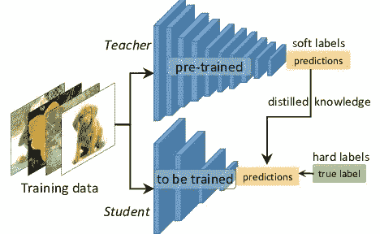

图片来自 Prakhar 的帖子[ [来源](https://towardsdatascience.com/knowledge-distillation-simplified-dd4973dbc764)

知识升华是指将一个繁琐的模型(教师)的学习行为转移到一个更小的模型(学生)中，其中教师产生的输出被用作训练学生的“软目标”。通过应用这种方法，作者揭示了他们在 MNIST 数据集上获得了令人惊讶的结果，并表明通过将模型集合中的知识提取到单个模型中可以获得显著的改进。

# 用于图像分类的知识蒸馏

Hinton 和他的两位合著者首先在论文中介绍了他们对图像分类任务的知识提取:[在神经网络](https://arxiv.org/abs/1503.02531)中提取知识。如文中所述，知识提取的最简单形式是在具有软目标分布的转移集上训练提取的模型。到目前为止，我们应该知道有两个目标用于训练学生模型。一个是正确的标签(硬目标)，另一个是从教师网生成的软标签(软目标)。因此，目标函数是两个不同目标函数的加权平均值。第一个目标函数是学生预测和软目标之间的交叉熵损失，第二个目标函数是学生输出和正确标签之间的交叉熵损失。作者还提到，最好的结果通常是通过对第二目标函数使用较低的权重而获得的。

从该论文中获得的一些令人惊讶的结果如下所示，更多详情，请参见原文[此处](https://arxiv.org/abs/1503.02531):

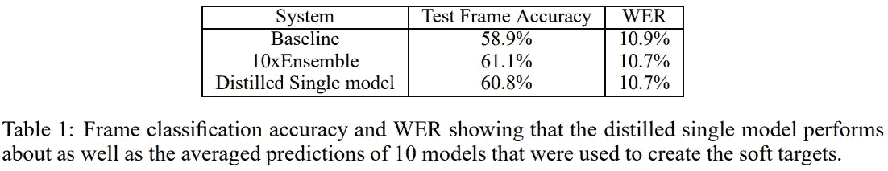

图片来自纸张[ [来源](https://arxiv.org/abs/1503.02531) ]

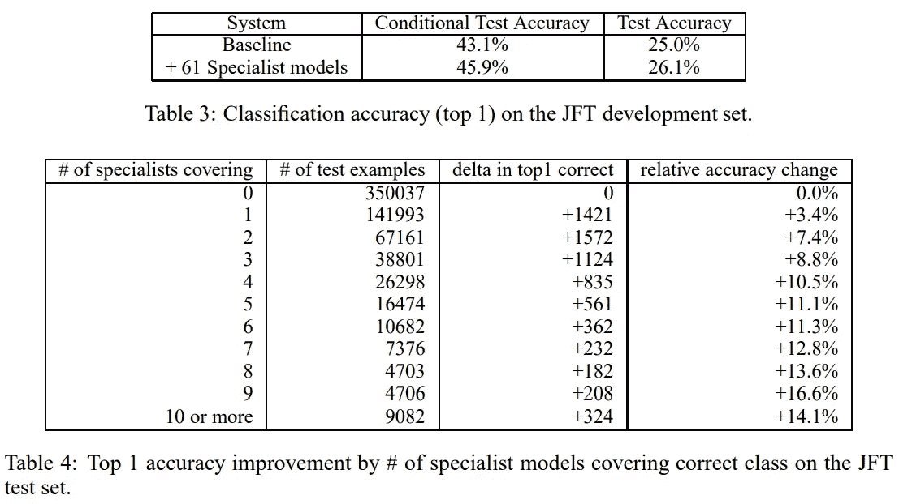

图片来自纸张[ [来源](https://arxiv.org/abs/1503.02531)

# 用于物体检测的知识蒸馏

在 NeurIPS 2017 中，陈国斌和他的合著者在论文中发表了他们关于结合提示学习的知识提炼用于对象检测的研究:[用知识蒸馏](https://paperswithcode.com/paper/learning-efficient-object-detection-models)学习高效的对象检测模型。在他们的方法中，他们进一步使用了一个*提示*，这是从教师的中间层获得的特征图，用于指导学生尽可能接近地学习教师的行为。此外，适应层对于提取知识的最佳性能是必要的，这个适应层将在后面讨论。fast-RCNN 是本文实验中使用的目标检测网络。他们的学习方案可以形象化为下图:

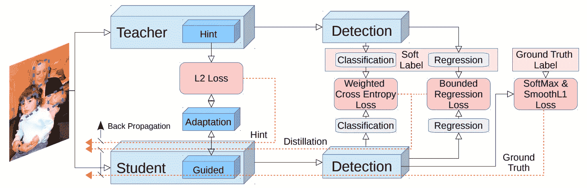

图片来自纸张。【[来源](https://paperswithcode.com/paper/learning-efficient-object-detection-models)

学习目标函数写如下:

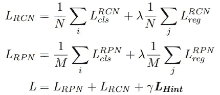

其中 RCN 和 RPN 分别代表回归分类网络和区域建议网络；n 和 M 分别是 RCN 和 RPN 的批量；L_RCN、L_RPN 和 L_Hint 分别是 RCN、RPN 和 Hint 的损耗；λ(通常为 1)和γ(通常设置为 0.5)是控制最终损耗的超参数。

# 暗示学习

Adriana Romero 在论文[fit Nets:Hints for Thin Deep Nets](https://arxiv.org/abs/1412.6550)中已经证明，当教师网络的中间表示被用作*提示*来帮助学生的训练过程时，学生网络的性能可以得到提高。在这个意义上，使用 L1 距离计算*提示特征 Z* (从教师的中间层获得的特征图)和*引导特征 V* (学生的中间层的特征图)之间的损失，

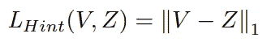

或者 L2 距离，

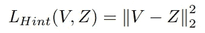

下图显示了从在 WAYMO 数据集上训练的预训练 YOLOv4 模型中提取的特征图，这是我的一个关于利用知识提取进行对象检测的项目。在这些示例中，输入图像的大小调整为 800x800。

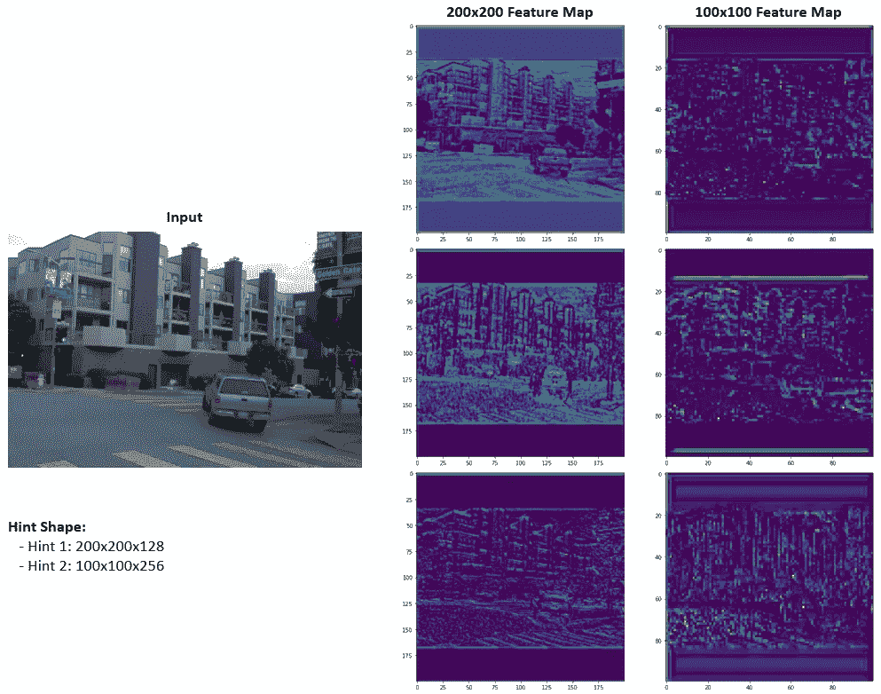

图片作者。

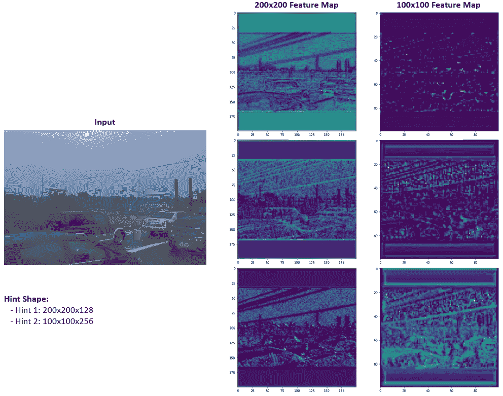

图片作者。

# 知识蒸馏+暗示学习

使用提示学习要求*提示特征*和*引导特征*具有相同的形状(高度 x 宽度 x 通道)。此外，*提示特征*和*引导特征*将总是不在相似的特征空间中，因此，使用适配层(通常是 1x1 卷积层)来帮助改善从教师到学生的知识传递。

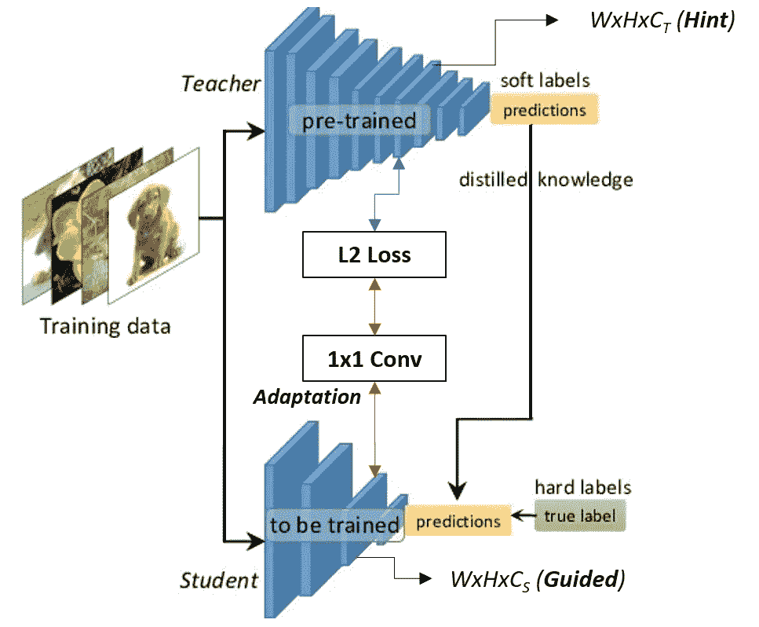

图片改编自 Prakhar 的帖子[ [来源](https://towardsdatascience.com/knowledge-distillation-simplified-dd4973dbc764)

下图描述了我在对象检测项目中工作的学习方案，其中，我使用了一个具有三个检测级别的小型网络来从预训练的 YOLOv4 中提取知识。

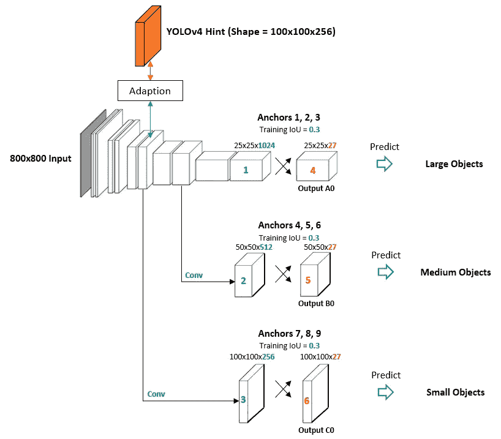

图片作者。

当将知识提炼和提示学习结合起来用于目标检测时，陈国斌显示出优异的结果。有关进一步的详细信息，请在原始论文[中找到与知识蒸馏](https://paperswithcode.com/paper/learning-efficient-object-detection-models)一起学习高效的对象检测模型。

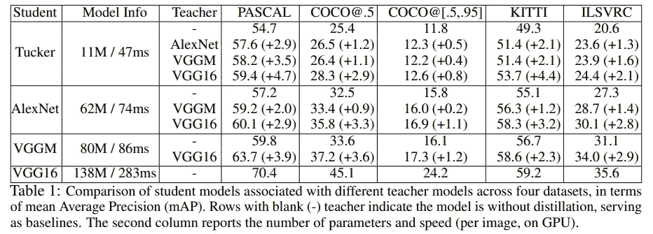

图片来自纸张。[ [来源](https://paperswithcode.com/paper/learning-efficient-object-detection-models)

# 结论

在这篇文章中，我简要介绍了知识提炼和提示学习。知识提取被认为是一种有效的方法，可以将复杂模型中的知识转化为更小、更精的知识。提示学习和知识提取的结合是提高神经网络性能的一个非常有效的方案。

欢迎读者访问我的脸书粉丝页面，这是一个分享关于机器学习的东西的页面:[深入机器学习](https://www.facebook.com/diveintomachinelearning)。

感谢您抽出时间！