# 元学习的简明介绍

> 原文：<https://pub.towardsai.net/a-gentle-introduction-to-meta-learning-8e36f3d93f61?source=collection_archive---------0----------------------->

[马志威](https://unsplash.com/@makcedward?utm_source=medium&utm_medium=referral)在 [Unsplash](https://unsplash.com/?utm_source=medium&utm_medium=referral) 上的照片

## 学会学习

人类开始可以在几个例子中学习新的东西，而深度学习迄今为止是数据饥渴的。要有一个好的性能模型，数百万甚至数十亿的训练样本绝对是实现它的经典方式。[数据扩充](https://towardsdatascience.com/data-augmentation-in-nlp-2801a34dfc28)是生成合成样本的方法之一。此外，标准的神经网络不能即时学习新知识。

我们能不能建立一个模型，像人类一样，通过几个例子来学习一项新技能？元学习(即学会学习)就是为了解决这个问题而诞生的。举几个例子，元学习模型可以快速学习和适应一个新的领域。

在这一系列元学习故事中，我们将介绍元学习的概念、几种元学习方法和例子。你可以访问以下网站来熟悉元学习

*   元学习导论
*   MAML 的增强
*   自然语言处理分类中的元学习
*   对话生成中的元学习
*   元学习中的无监督学习

在这个故事中，我们将涵盖术语、元学习的概念，并介绍不同的方法:

*   数据集
*   支持集和查询集
*   n 路 K 射
*   方法

# 术语

## 资料组

在一般的机器学习术语中，我们只有用于训练、测试和验证的训练集、测试集和验证集。在元学习中，这些名字被重新命名为`meta-training set`、`meta-testing set`和`meta-validation set`。在`meta-training set`内，我们有若干个`training set`和`testing set`组成一个`task`。

## 支持集和查询集

支持集是一组记录(输入和标签)，而标签在每个任务中都是不同的。查询集是另一组带有标签的记录，用于匹配输入以选择标签。

## n 路 K 射

n 路 K-shot 指的是多个标签和每个标签的 K 个训练数据。n 代表标签的数量，而 K 是训练数据的数量。当只有一个标签或很少标签(少于标签总数)时，我们有`One-Shot Learning`和`Few-Shot Learning`。关键思想是数据转换和知识共享。

例如，我们有 100 条记录(输入和标签)，而有 10 个不同的标签。在每一批中，只有 K 个记录(包含 N 个标签)将被输入到模型中。n 不需要具有全部数量的不同标签的匹配(即，在这种情况下为 10)。对于同一任务的支持集和查询集，标签是一致的，但是对于不同的任务，标签是不同的。

不同于一般的模型训练，我们只传递标签的子集进行模型训练。该模型具有在预测时间内预测看不见的标签的能力。

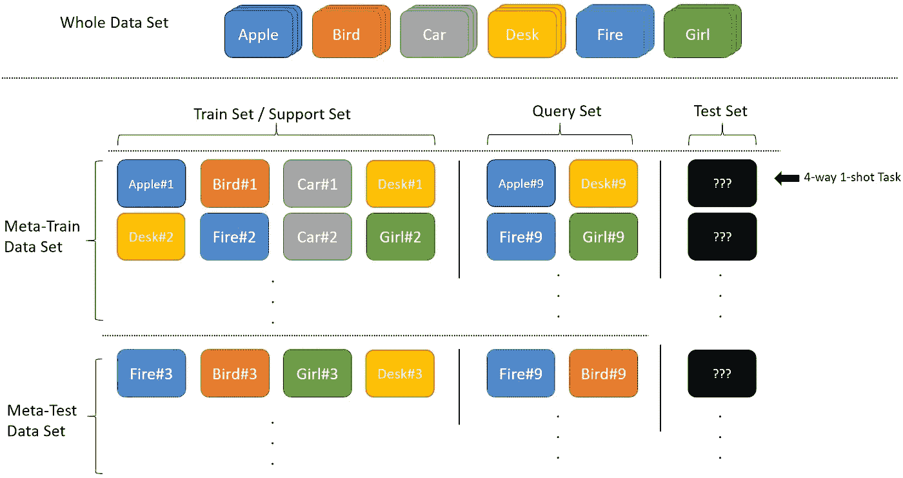

元学习术语图解

# 方法

## 基于度量的

***匹配网络***

`Matching Networks (Matching Nets)`由 Vinyals 等人(2016)提出。想法很简单，但结果很有希望。在将支持集和查询集转换为嵌入向量后，作者使用余弦距离来寻找最相似的数据。`Matching Nets`框架在每个任务中重复以下步骤。

1.  挑选 3 个(即 N 个)不同的标签对(输入和标签)数据作为支持集。
2.  选择 5(即 K)个配对数据，而标签应该是步骤 1 的结果之一。
3.  使用支持集计算步骤 2 的预测结果之间的差异(例如，余弦距离)。

下图显示了一个四路一次性学习示例。四个不同的狗标签(蓝色、黄色、橙色和红色矩形)作为支持集，而输入是一个狗图像。

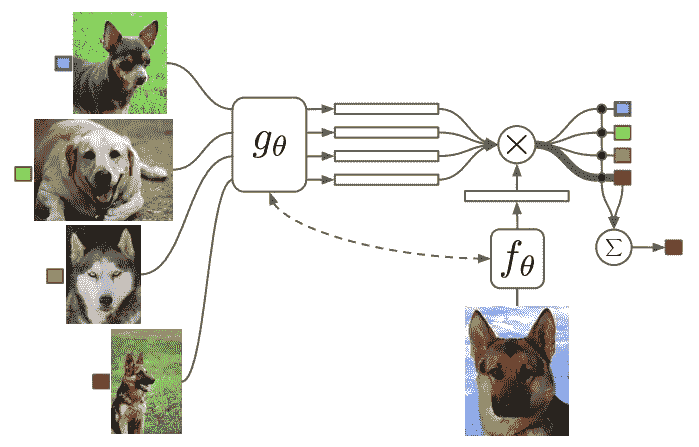

匹配网络架构(Vinyals 等人，2016 年)

在这种模型架构下，Vinyals 等人在计算机视觉(CV)和自然语言处理(NLP)领域对其进行了评估，以确认该模型可以应用于不同领域的问题。在 CV 领域，选择 [Omniglo](https://www.omniglot.com/) 和 [ImageNet](http://www.image-net.org/) 作为实验的数据集。

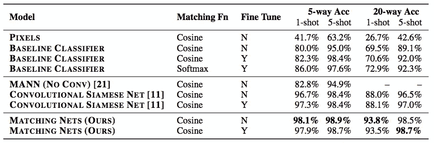

对 [Omniglo](https://www.omniglot.com/) 的性能评估(Vinyals 等人，2016)

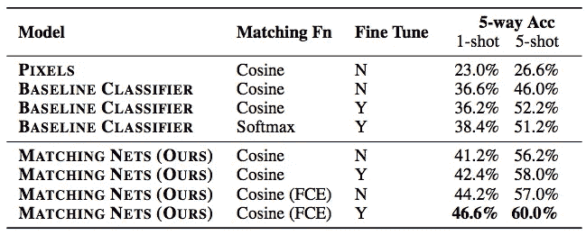

对 [ImageNet](http://www.image-net.org/) 子集的性能评估(Vinyals 等人，2016 年)

对于 NLP 领域，利用 [Penn Treebank](https://catalog.ldc.upenn.edu/LDC99T42) 数据集进行实验。给定一个有漏词的句子和支持句子集，最终模型输出是支持句子集的最佳匹配标签。而与另一个模型相比，匹配网络的性能并不令人满意。

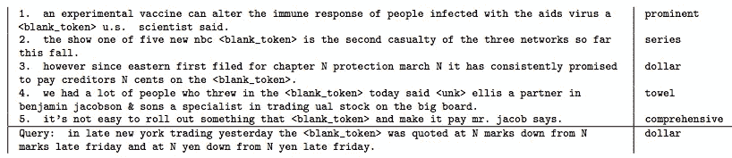

NLP 中输入数据和支持集的示例(Vinyals 等人，2016 年)

***原型网络***

`Prototypical Networks`是 Snell 等人在 2017 年提出的。应用聚类概念来预测数据的标签，而该聚类模型将针对每一集进行训练，并根据该模型来计算损失。

在每集中，该模型将把一个支持集和一个查询集转移到嵌入层。聚类的质心(即下图中的 c1、c2 和 c3)是相应标签的平均值。而查询集(即下图中的 x)将被分类到最近的聚类(即下图中的 c2。`Prototypical Networks`不使用余弦距离，而是使用欧几里得距离的平方来计算查询集之间的差异和支持集的质心。

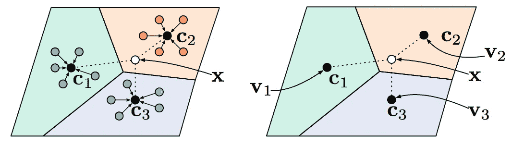

少射原型(左)，零射原型(右)。(斯内尔等人，2017 年)

Sneel 等人使用完全相同的数据集(Omniglot 和 mini ImageNet)将结果与`Matching Nets` (Vinyals 等人，2016)进行比较。实验表明`Prototypical Networks` (Snell et al .，2017)比`Matching Nets` (Vinyals et al .，2016)取得了更好的性能。

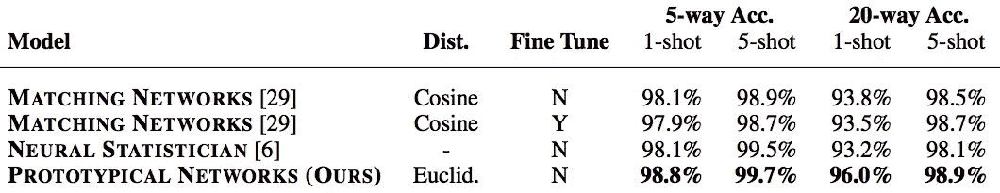

Omniglot 上的少量射击分类精度。(斯内尔等人，2017 年)

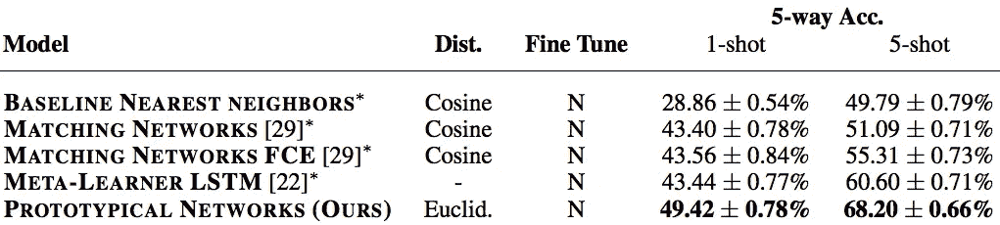

miniImageNet 上的少镜头分类精度。(斯内尔等人，2017 年)

***勤勤循环比较器***

`Attentive Recurrent Comparators (ARC)`由 Shyam 等人(2017)提出。它的灵感来自于人类比较一组物体的方式。例如，人类在玩照片狩猎游戏时，总是在两个物体之间来回寻找。这是因为我们的大脑不能一次分辨整个图像。

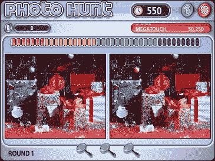

照片搜寻游戏([来源](https://en.wikipedia.org/wiki/Photo_Hunt#/media/File:Photo_Hunt_screen_shot.jpg))

ARC 使用类似的方法，来回比较一对输入。在每一次 ***扫视*** 中，两幅图像的一部分将被交替传递给模型，而不是整个传递图像。

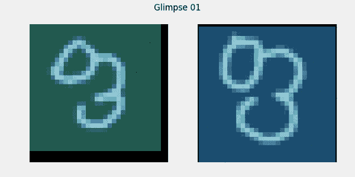

弧形在两个物体之间来回看([来源](https://github.com/sanyam5/arc-pytorch))

通过利用注意机制和长时短记忆(LSTM)结构，ARC 交替注意两个图像 A 和图像 B(输入对)的一部分。

神经网络将 h(t-1)(第一步中的空值)转换为 omega(t)。ω(t)是文中提到的一个*。提取一小部分用于学习的简单方法是随机/顺序裁剪图像。Shyam 等人建议使用柯西衰变核而不是这种简单的方法，因为它比另一种方法更平滑。*

*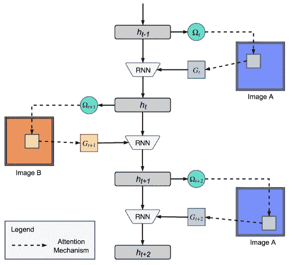*

*比较两个对象的弧形可视化(Shyam 等人，2017 年)*

*经过某一轮 ***一瞥*** 后，隐藏状态会传递给一个线性图层，输出的要么是两幅图像相似，要么不是。*

*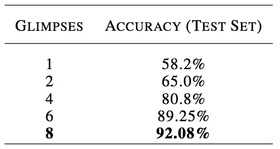*

*对 [Omniglo](https://www.omniglot.com/) 的性能评估(Shyam 等人，2017 年)*

## *基于优化*

****基于 LSTM 的元学习者****

*`LSTM-based meta-learner`由 Ravi 和 Larochelle 于 2016 年提出。作者观察到，由于局限性，基于梯度的优化在一些标记的例子面前失败。基于梯度的算法不能快速收敛，并且每次都需要初始化权重。Ravi 和 Larochelle 训练了一个基于 LSTM 元学习器优化器来优化最终的神经网络模型。*

*首先，我们将数据集分成两个子数据集，即元训练和元测试。之后，D(训练)和 D(测试)将被分割成小批量，如下所示。每次，每个记录集(1 行)都将输入到一个模型中，用于模型训练。*

*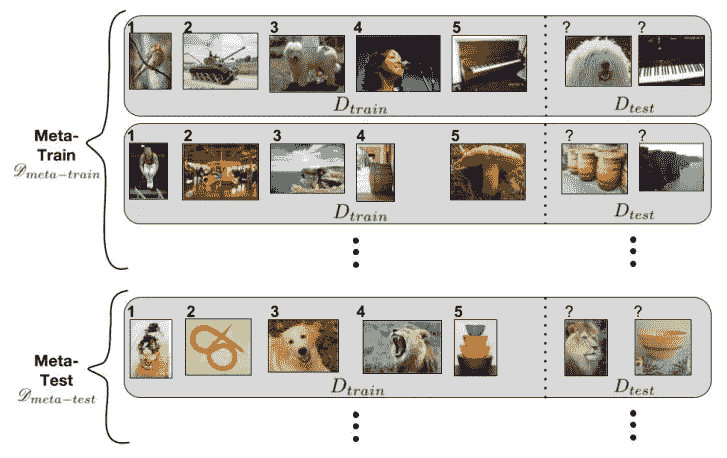*

*元学习设置(Ravi 和 Larochelle，2016 年)*

*训练元学习者非常简单。将逐步提供解释:*

*   *1:模型参数是随机初始化的*
*   *4:将元训练数据集分为 D(训练)和 D(测试)*
*   *5:初始化元学习者参数*
*   *8:将 D(训练)拆分为批次*
*   *9:训练学习者并获得损失*
*   *10:反馈损失和对元学习者的输出*
*   *11:根据#10 输出更新学习者参数*
*   *15:从学员处获得测试批次的损失*
*   *16:更新元学习者参数*

*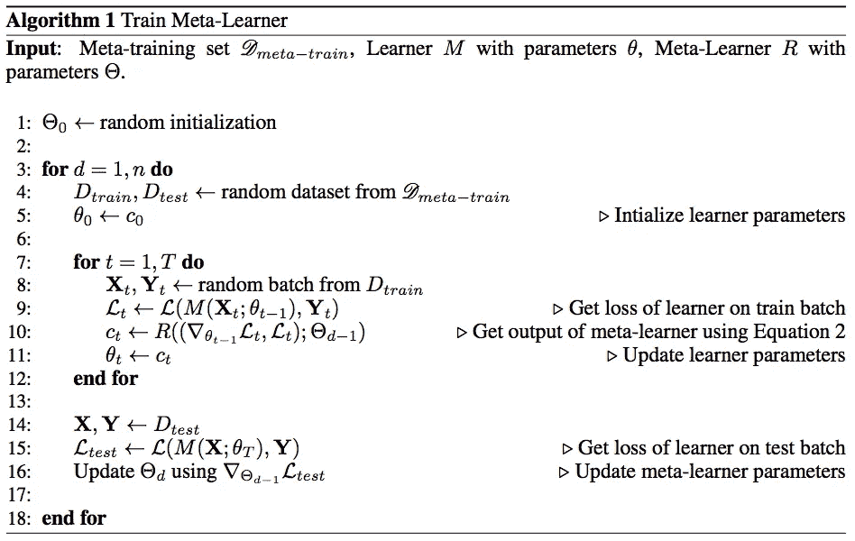*

*`LSTM-based meta-learner`程序(Ravi 和 Larochelle，2016 年)*

*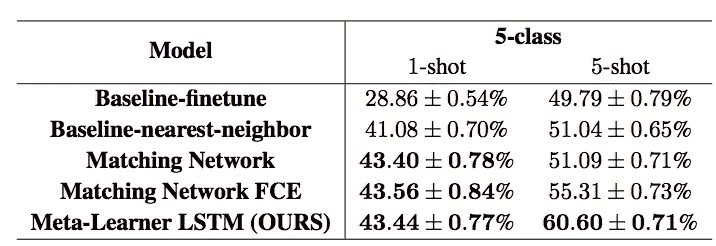*

*miniImageNet 上的少镜头分类精度。(拉维和拉罗歇尔，2016 年)*

****模型不可知元学习(MAML)****

*`Model-Agnostic Meta-Learning (MAML)`由芬恩等人于 2017 年提出。这是一个与模型无关的框架。模型不可知意味着它不是特定于模型的。Finn 等人在回归、分类和强化学习问题上评估了这个框架，结果是有希望的。*

*MAML 的目标是学习一个模型，如果一个模型是预先训练好的，它可以在新的任务上取得快速进展。在这个框架中涉及两个梯度更新。在计算了一批梯度(还没有更新到模型)之后，将基于前述的一批梯度计算第二个梯度。他们称之为**更新涉及到一个渐变通过一个渐变**。*

*下图显示了逐渐变更新渐变的概念。虚线是每个任务的梯度，而实线是考虑所有任务的梯度后的最终梯度。*

*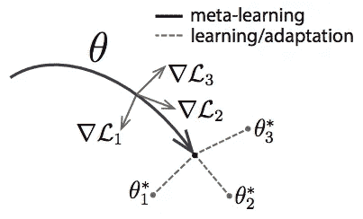*

*针对能够快速适应新任务的表征θ进行优化(Finn 等人，2017 年)*

*首先，需要通过使用以下过程来训练预训练的 MAML 模型。将逐步提供解释:*

*   **要求分配任务*:从任务池中生成批量任务。相同的记录可以存在于不同的任务中，它可以分别在任务 1、任务 2 中被支持集、查询集。*
*   **需要步长超参数*:初始化一个学习率参数。*
*   **1* :重量初始化*
*   **2*:for 循环，保持训练直到完成*
*   **3* :从任务池中获取一批任务*
*   **4 ~ 7*:for 循环，逐个遍历任务。评估任务并计算每个任务的梯度下降。在实际编码中，有[内部 for 循环](https://github.com/cbfinn/maml/blob/master/maml.py#L99)对任务进行多次求值。*
*   **8* :根据步骤 *6* 更新每批任务的梯度下降。*

*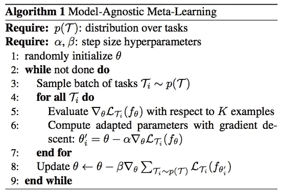*

*元学习程序(Finn 等人，2017 年)*

*在微调阶段，它非常类似于元学习阶段，除了没有权重初始化(因为我们已经有一个预训练的权重)*

*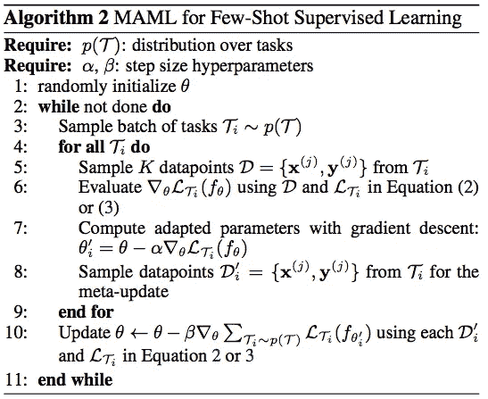*

*微调程序(Finn 等人，2017 年)*

## *基于记忆的*

****记忆增强神经网络****

*`Memory-Augmented Neural Networks (MANN)`中的一次性学习是由桑托罗等人(2016)提出的。他们将 MANN 应用于元学习，使得模型可以访问外部记忆(或信息)来辅助模型预测结果。在此之前，我们将快速浏览一下曼恩概念，并在元学习中回到曼恩。这有助于解决记忆罕见的事件。*

*[神经图灵机](https://arxiv.org/pdf/1410.5401.pdf) (NTM)是 Graves 等人在 2014 年推出的。一个快速的一些总结是，模型的回复既取决于内部记忆(即 RNN 隐藏状态)又取决于外部记忆(即神经网络之外的记忆库)来决定输出。为了访问外部存储器，NTM 提供了两种方法来寻址相应的存储器。第一个是内容寻址，当相似性度量是余弦相似性时，该模型将处理相似性记忆。另一个是位置寻址，模型将通过旋转关注特定的位置。*

*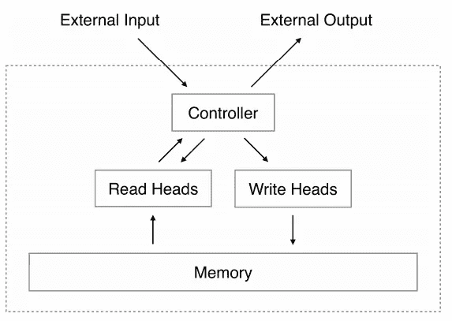*

*NTM 建筑(格雷夫斯等人，2014)*

*桑托罗等人按照 NTM 的设置进行了一些修改，这些修改是输入和寻址方法。**输入**包括特征(x_t)和 y_(t-1)的时间偏移。y 时间偏移意味着前一个“记录 y”标签。**最近最少使用的访问(LRUA)** 用于访问外部存储器。Graves 等人没有使用内容寻址或位置寻址，而是提到 LRUA 适合基于序列的预测任务，但不适用于独立于序列任务的信息的联合编码。LRUA 将内存写入最少使用的内存位置或最近使用的内存位置。*

*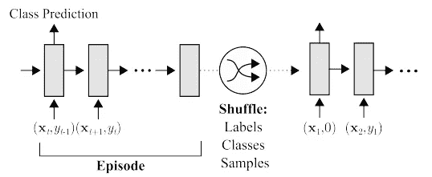*

*曼恩任务设置(桑托罗等人，2016 年)*

****【Meta net】****

*蒙克达赖和于介绍`Meta Networks (MetaNet)`。元网络模型解决了动态学习新任务信息能力的缺乏。所提出的解决方案利用了特定于任务的嵌入(快速权重)和学习嵌入(慢速权重)。*

*特定于任务的嵌入是从元学习者那里学习的，元学习者是一个任务不可知的模型。在生成嵌入之后，它将传递给一个基础学习者，这是一个特定于任务的模型来生成输出。*

*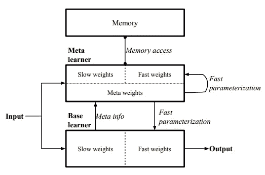*

*元网络架构(Munkhdalai 和 Yu，2017)*

*为了训练元网络，有三个主要步骤:获取元信息、生成快速权重和优化慢速权重。下面是伪:*

*步骤 2~4:训练模型以获取嵌入，而 loss_emb 被设计用于捕获表征目标。*

*步骤 5:生成嵌入。*

*步骤 7~14:针对目标任务训练模型。*

*步骤 16~20:生成输出*

*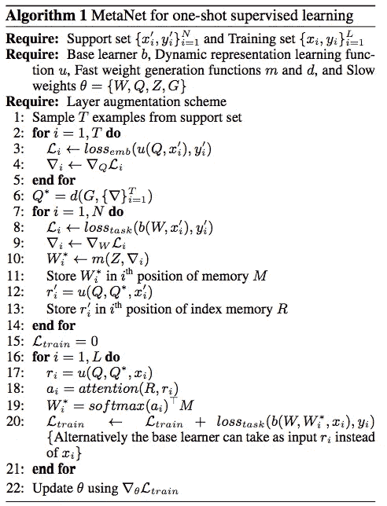*

*元网络培训程序(蒙克达莱和于，2017 年)*

# *附录*

*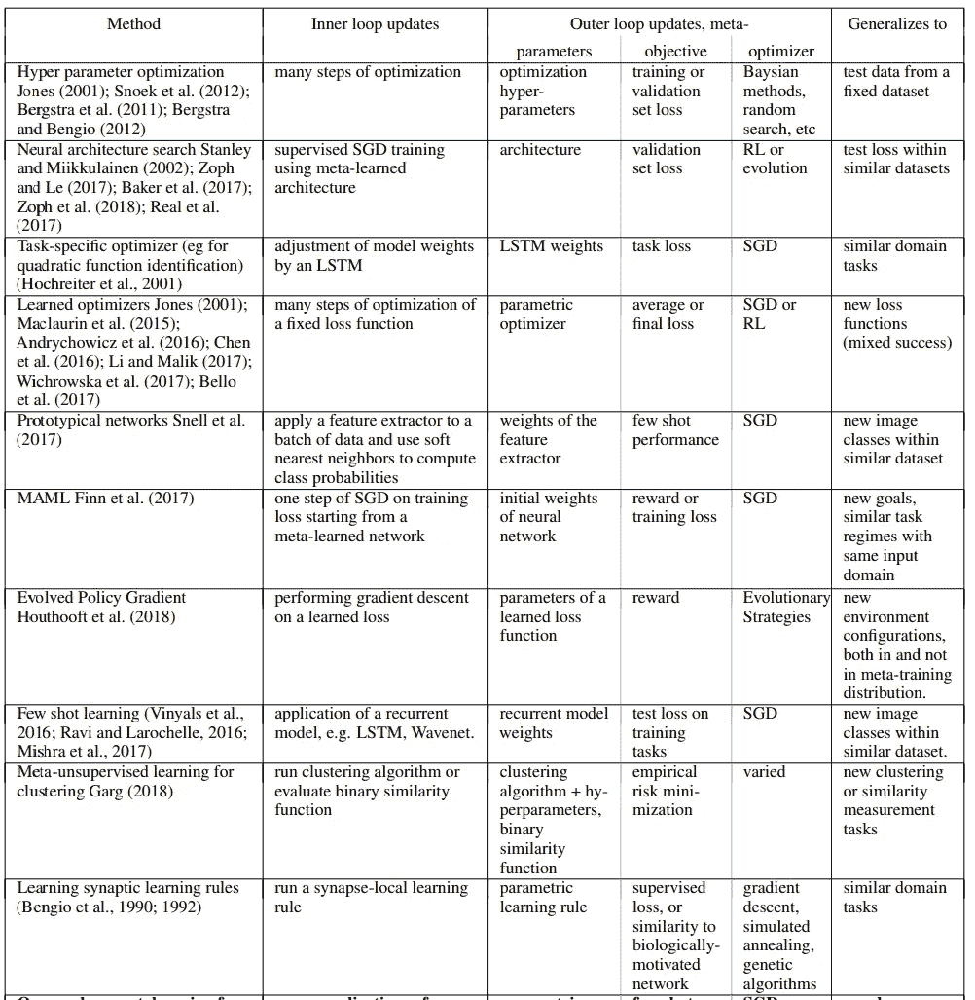*

*已发表的元学习方法的比较(Metz 等人，2018 年)*

# *拿走*

*百花齐放，百家争鸣。解决元学习问题有很多不同的方法。从我的经验来看，元学习主要是在计算机视觉(CV)领域发展起来的，同时也有一些研究者将其应用于自然语言处理(NLP)领域。一个可能的原因是迁移学习(如 [BERT](https://towardsdatascience.com/how-bert-leverage-attention-mechanism-and-transformer-to-learn-word-contextual-relations-5bbee1b6dbdb) ， [XLNet](https://medium.com/dataseries/why-does-xlnet-outperform-bert-da98a8503d5b) )非常成功，各种词汇量太高，无法在 NLP 中采用元学习。*

# *喜欢学习？*

*我是湾区的数据科学家。关注数据科学的最新发展，尤其是 NLP、数据扩充和平台相关领域。在 [LinkedIn](https://www.linkedin.com/in/edwardma1026) 或 [Github](https://github.com/makcedward) 上随时联系 [me](https://makcedward.github.io/) 。*

# *延伸阅读*

*   *[viny als 的模型与优化元学习](http://metalearning-symposium.ml/files/vinyals.pdf)(NIPS 2017)*
*   *[文本的数据扩充](https://towardsdatascience.com/data-augmentation-library-for-text-9661736b13ff)*
*   *原型网络实现( [PyTorch](https://github.com/jakesnell/prototypical-networks/) )*
*   *匹配网络实现( [TensorFlow](https://github.com/AntreasAntoniou/MatchingNetworks) ， [PyTorch](https://github.com/activatedgeek/Matching-Networks) )*
*   *电弧实现( [Theano](https://github.com/pranv/ARC) ， [PyTorch](https://github.com/sanyam5/arc-pytorch) )*
*   *基于 LSTM 的元学习( [Torch](https://github.com/twitter/meta-learning-lstm) ， [PyTorch](https://github.com/markdtw/meta-learning-lstm-pytorch) )*
*   *MAML 实现( [TensorFlow](https://github.com/cbfinn/maml) ， [PyTorch](https://github.com/dragen1860/MAML-Pytorch) )*
*   *MANN 实现中的一次性学习( [Tensorflow](https://github.com/hmishra2250/NTM-One-Shot-TF) ， [Keras](https://github.com/t2kien/Memory-Augmented-Neural-Network---Oneshot-learning) )*
*   *元网络实现([链接器](https://bitbucket.org/tsendeemts/metanet/src/master/))*
*   *[Omniglot 数据集](https://github.com/brendenlake/omniglot)*
*   *[ImageNet 数据集](http://image-net.org/download)*

# *参考*

*   *A.Graves，G. Wayne 和 I. Danihelka。[神经图灵机](https://arxiv.org/pdf/1410.5401.pdf)。2014*
*   *A.桑托罗、s .巴尔图诺夫、m .伯特温尼克、d .威斯特拉和 t .利利拉普。[用记忆增强神经网络进行一次性学习](https://arxiv.org/pdf/1605.06065.pdf)。2016*
*   *O.Vinyals、C. Blundell、T. Lillicrap、K. Kavukcuoglu 和 D. Wierstra。[一次性学习的匹配网络](https://arxiv.org/pdf/1606.04080.pdf)。2016*
*   *南拉维和拉罗彻尔。[作为少量学习模型的优化](https://openreview.net/pdf?id=rJY0-Kcll)。2016*
*   *J.斯内尔，k .斯维斯基和 R. S .泽梅尔。[用于少量学习的原型网络](https://arxiv.org/pdf/1703.05175.pdf)。2017*
*   *页（page 的缩写）希亚姆，s .古普塔和 a .杜克基帕蒂。[细心的递归比较器](https://arxiv.org/pdf/1703.00767.pdf)。2017*
*   *C.芬恩、p .阿贝耳和 s .莱文。[用于深度网络快速适应的模型不可知元学习](https://arxiv.org/pdf/1703.03400.pdf)。2017*
*   *T.蒙克达赖和于。[元网络](https://arxiv.org/pdf/1703.00837.pdf)。2017*
*   *长度梅斯，N. Maheswaranathan，B. Cheung 和 J. Sohl-Dickstein。[无监督表示学习的元学习更新规则](https://arxiv.org/pdf/1804.00222.pdf)。2018*