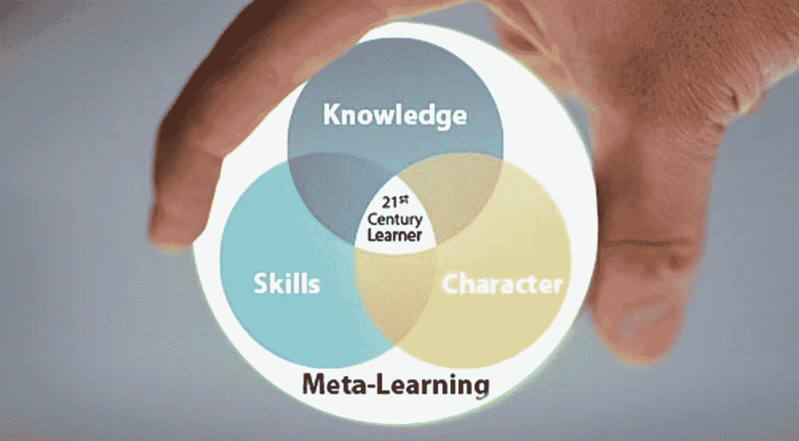

# 元学习的简明介绍

> 原文：<https://pub.towardsai.net/a-gentle-introduction-to-meta-learning-e2b4ffaffd5a?source=collection_archive---------0----------------------->

## 元学习不是一个单一的学科，而是可以从学习算法中获取知识的不同类型的方法。

来源:[https://www . cmrubinworld . com/the-global-search-for-education-what-meta-learning](https://www.cmrubinworld.com/the-global-search-for-education-what-meta-learning)

> 我最近创办了一份专注于人工智能的教育时事通讯，已经有超过 125，000 名订户。《序列》是一份无废话(意思是没有炒作，没有新闻等)的 ML 导向时事通讯，需要 5 分钟阅读。目标是让你与机器学习项目、研究论文和概念保持同步。请通过订阅以下内容来尝试一下:

 [## 序列

### 与机器学习、人工智能和数据发展保持同步的最佳资源…

thesequence.substack.com](https://thesequence.substack.com/) 

元学习是深度学习领域中最活跃的研究领域之一。人工智能(AI)社区中的一些思想流派同意这样的论点，即元学习是开启人工一般智能的垫脚石之一(AGI)。近年来，我们看到了元学习技术的研究和发展的爆炸式增长。然而，元学习背后的一些基本思想仍然被数据科学家和工程师广泛误解。从这个角度来看，我认为回顾一下元学习的一些基本概念和历史以及该领域的一些流行算法可能是一个好主意。

元学习背后的思想可以追溯到 1979 年和 Donald B. Maudsley 的工作，当时他将新的认知范式称为*“学习者意识到并越来越多地控制他们已经内化的感知、探究、学习和成长习惯的过程”。在 John Biggs (1985)的著作中可以找到一个更简单的定义，他将元学习定义为“意识到并控制自己的学习”。从认知科学的角度来看，这些定义是准确的，但它们似乎有点难以适应人工智能(AI)的工作。*

在人工智能系统的背景下，元学习可以简单地定义为获得知识多样性的能力。作为人类，我们能够用最少的信息同时完成多项任务。我们可以通过看到一张新的物体的图片来识别它，或者我们可以学习复杂的多任务活动，例如立刻驾驶或驾驶飞机。虽然人工智能代理可以掌握非常复杂的任务，但它们需要对任何原子子任务进行大量的训练，并且它们在多任务处理方面仍然非常糟糕。因此，通向知识多样性的道路要求人工智能主体“学会如何学习”，或者用一个更令人讨厌的术语来说，元学习 j。

# 元学习模型的类型

人类根据特定的环境学习不同的方法。同样，不是所有的元学习模型都遵循相同的技术。一些元学习模型专注于优化神经网络结构，而其他模型(如爬虫)则更专注于找到正确的数据集来训练特定的模型。加州大学伯克利分校人工智能实验室最近的一篇研究论文全面列举了不同类型的元学习。以下是我最喜欢的一些:

# 少数镜头元学习

少数镜头元学习的想法是创建深度神经网络，可以从极简数据集学习，例如，模仿婴儿如何通过只看一两张图片来学习识别物体。少量元学习的想法激发了诸如[记忆增强神经网络](http://proceedings.mlr.press/v48/santoro16.pdf)或[一次性生成模型](https://arxiv.org/abs/1603.05106)等技术的产生。

# 优化元学习

优化元学习模型专注于学习如何优化神经网络以更好地完成任务。这些模型通常包括神经网络，这些神经网络对另一个神经网络的超参数应用不同的优化，以便改进目标任务。优化元学习的一个很好的例子是专注于改进梯度下降技术的模型，就像本研究中[发表的那样。](http://snowedin.net/tmp/Hochreiter2001.pdf)

# 度量元学习

度量元学习的目标是确定学习特别有效的度量空间。这种方法可以被视为元学习的几个镜头的子集，其中我们使用一个学习的度量空间来评估学习的质量和几个例子。[这篇研究论文](https://arxiv.org/abs/1703.05175)展示了如何将度量元学习应用于分类问题。

# 递归模型元学习

这种类型的元学习模型是为循环神经网络(RNNs)定制的，如[长短期记忆(LSTM)](http://www.bioinf.jku.at/publications/older/2604.pdf) 。在这种架构中，元学习器算法将训练 RNN 模型，该模型将顺序处理数据集，然后处理来自任务的新输入。在图像分类设置中，这可能涉及按顺序传入数据集的一组(图像、标签)对，随后是必须分类的新示例。[元强化学习](https://arxiv.org/abs/1611.02779)就是这种方法的一个例子。

随着深度学习更多地向无监督模型过渡，元学习的重要性正在稳步增加。如果我们能够把学习的过程概括为学习新的任务，那么 AGI 的想法突然变得更加务实。然而，就像人类一样，人工智能模型正在发现，学会学习比仅仅学习更难。