# 使用机器学习的预测性销售线索评分指南

> 原文：<https://pub.towardsai.net/a-guide-to-lead-scoring-using-machine-learning-part-1-40194182e168?source=collection_archive---------0----------------------->

## 在实施营销策略时，线索评分是一个有价值的工具，在本文中，您将了解如何使用机器学习来完成它。

在文章中，我正在覆盖→

1.  什么是销售线索评分，为什么它很重要
2.  销售线索评分的类型
3.  理解数据
4.  探索性数据分析和观察
5.  一个热编码
6.  功能选择— RFE
7.  方差膨胀因子
8.  SMOTE —过采样
9.  模型实施—逻辑回归、超参数调整
10.  模型评估

*参考我这里的 GitHub 回购->*[*【https://github.com/YashashriShiral/LeadScoring】*](https://github.com/YashashriShiral/LeadScoring)

# 1.什么是销售线索评分，为什么它很重要？

营销的目的是接触你的目标受众，传达你的产品的好处，让人们对产品和服务感兴趣。这样你才能成功获取，保持，成长。然而，你创造的线索越多，你在追求的过程中就越有选择性。销售代表不想浪费时间去追踪一大串潜在客户。由于销售运营在时间和金钱上都有很高的成本，他们应该专注于培养最投入和最合适的销售线索，以提高和保持有利可图的“投资回报”为了持续不断地发现强大的潜在客户，销售代表需要一个销售线索评分模型。简而言之，销售线索评分是确认潜在客户的过程，这样销售人员可以更有效地完成工作。关注潜在客户将会从高质量的潜在客户那里获得流量(潜在客户，在市场上购买你的产品的人拥有购买它所需的资源，但还没有购买它)。高质量的潜在客户伴随着高价值的客户，这意味着您的企业将获得更多收入。换句话说，我们的想法是根据所有潜在客户的特征与预先建立的转化客户档案的匹配程度，给他们打分。得分超过特定阈值的销售线索被视为理想目标。

尽管这些公司认识到了销售和营销协调的重要性，但有些公司仍在为此苦苦挣扎。销售团队抱怨营销部门把钱花在没有产生价值的活动上，营销部门抱怨他们提供的销售线索没有转化。因此，销售线索评分为您的营销和销售团队提供了一个通用的评估系统，他们可以使用该系统来确定要跟进的销售线索。

使用销售线索评分，您可以实现以下目标:

1.  提高销售效率
2.  提高营销效率
3.  提高销售和营销一致性
4.  增加收入
5.  精简您的时间和影响

# **2。销售线索评分类型:**

1.  **基于规则的销售线索评分-**

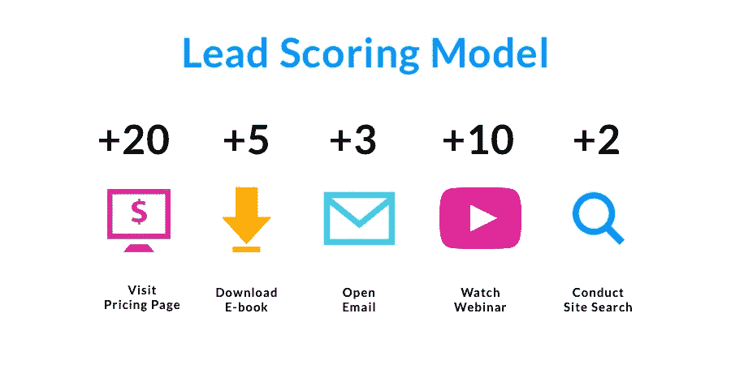

您可以查看为您的企业转化的客户之间的共同模式和属性，并根据与销售/营销团队的互动情况进行评分。在这种情况下，无论客户采取什么行动，您都要根据这些行动对业务的重要性来为他们分配价值。

如 ***5(点)页面浏览量+ 10(点)下载内容+ 15(点)参加网络研讨会+ 3(点)点击链接*** 。
当用户完成这些动作时，你可以为这些动作中的每一个加总积分值，并确定某人有多适合你的产品。您当然可以使用 python 和 SQL 来自动化这个过程。一些公司依赖这种方法，因为他们喜欢线索评分的个人方面。没有人比花时间说服顾客成为顾客的人更了解你的顾客(销售)

**2。预测性销售线索评分-**

预测销售线索评分是一种基于算法的机器学习方法，用于销售线索评分。在这种方法中，算法根据您的客户购买和行为数据来学习模式，以预测客户进行购买的可能性。预测评分可以识别手动无法发现的隐藏购买信号。在本文中，我们采用了预测性销售线索评分方法。

# **3。输入数据:**

我用的是 UCI 机器学习库中的数据集。你可以从[这里](https://archive.ics.uci.edu/ml/datasets/Bank+Marketing)下载。

**数据集信息:**该数据与一家葡萄牙银行机构的直接营销活动相关。营销活动以电话为基础。通常，为了了解产品(银行定期存款)是否认购(“是”)或不认购(“否”)，需要与同一客户进行多次联系。

因此，在数据集中，我们有客户的个人信息，他们的联系活动信息，以前的活动信息和一些社会统计数据，我们也有关于哪些销售线索已转换和尚未转换的信息。我们的工作是帮助选择最有希望的线索。建立一个模型，其中您需要为每个销售线索分配一个销售线索得分，这样得分高的客户转化机会就高，得分低的客户转化机会就低。

我正在构建一个**逻辑回归模型**，为每条线索分配一个 0 到 100 之间的线索得分，公司可以用它来锁定潜在的线索。较高的分数意味着销售线索是热门的，即最有可能转化，而较低的分数意味着销售线索是冷门的，大多数情况下不会转化。

**属性信息:**

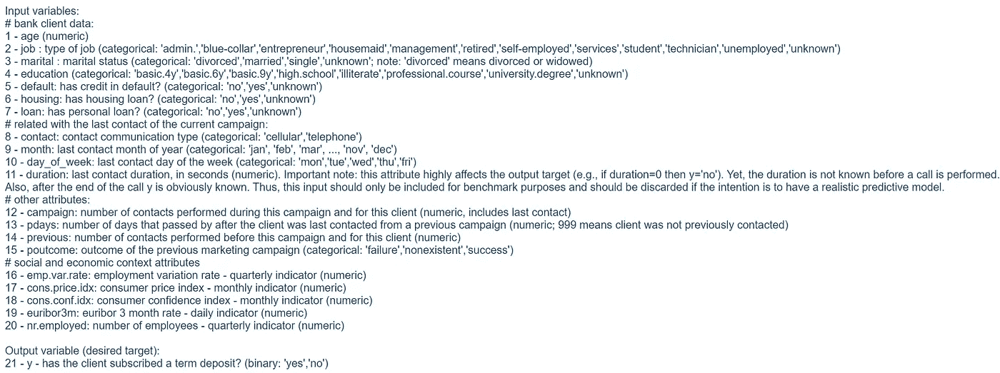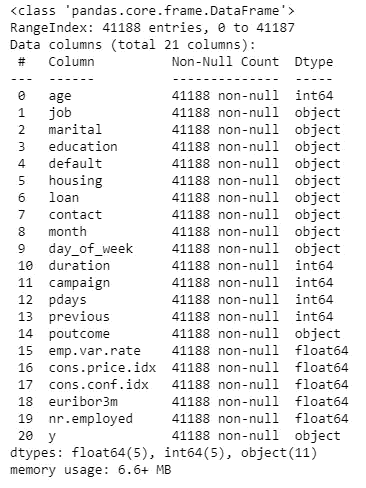

数据中有三种类型的属性:

我将删除' **duration** '属性—基于属性信息重要说明:该属性对输出目标有很大影响(例如，如果 duration=0，则 y='no ')。然而，在执行呼叫之前，持续时间是未知的。还有，通话结束后，y 显然是知道的。因此，该输入应仅用于基准测试目的，如果目的是获得现实的预测模型，则应丢弃。

**客户信息:**年龄、工作、婚姻、教育、违约、住房、贷款

**联系人活动信息**:联系人，月份，星期几

**市场活动信息:**市场活动、pdays、previous、poutcome

**社会和经济背景:** emp.var.rate，cons.price.idx，cons.conf.idx，euribor3m，nr.employed

# 4.探索性数据分析:

根据分析:客户年龄在 17-98 岁之间，40%的客户年龄在 30-40 岁之间。年轻和年长的顾客比中年顾客更容易转化。

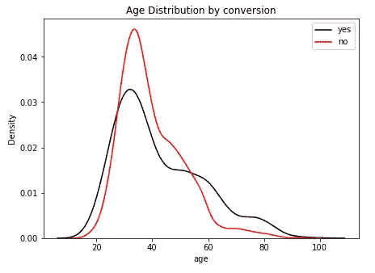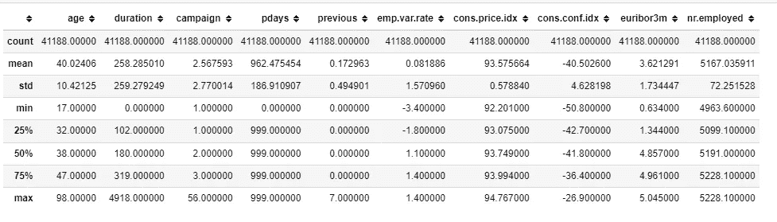

你可以开始绘制图表来理解变量的分布。

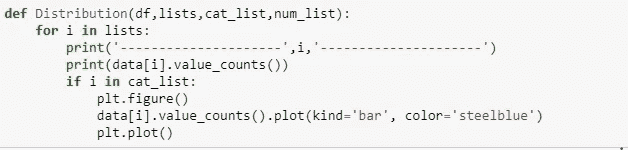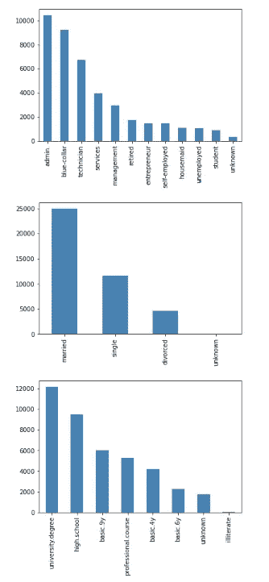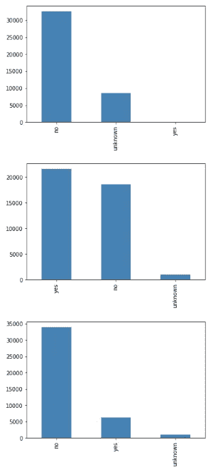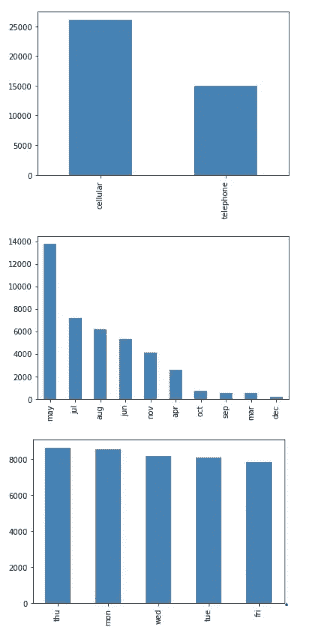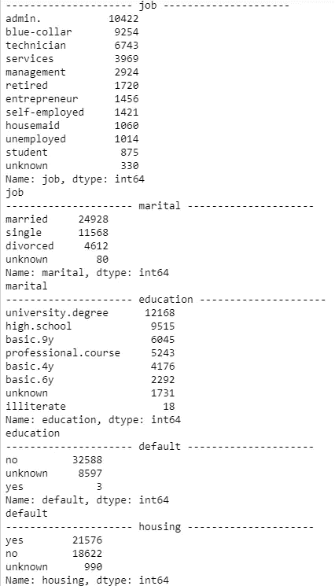

你可以画出所有的变量或者打印出上面的分布。

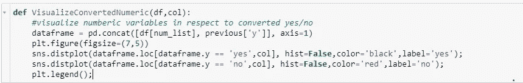

现在，我要做的是绘制转换/未转换(是/否)目标特征(y)相对于所有变量的分布图。了解哪些特性对分析很重要，以及它们的分布情况。

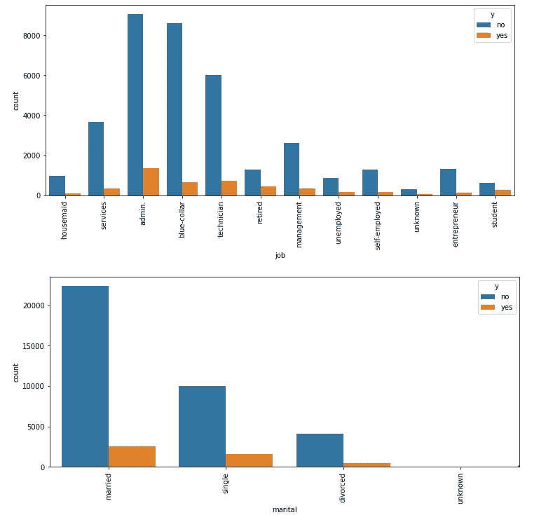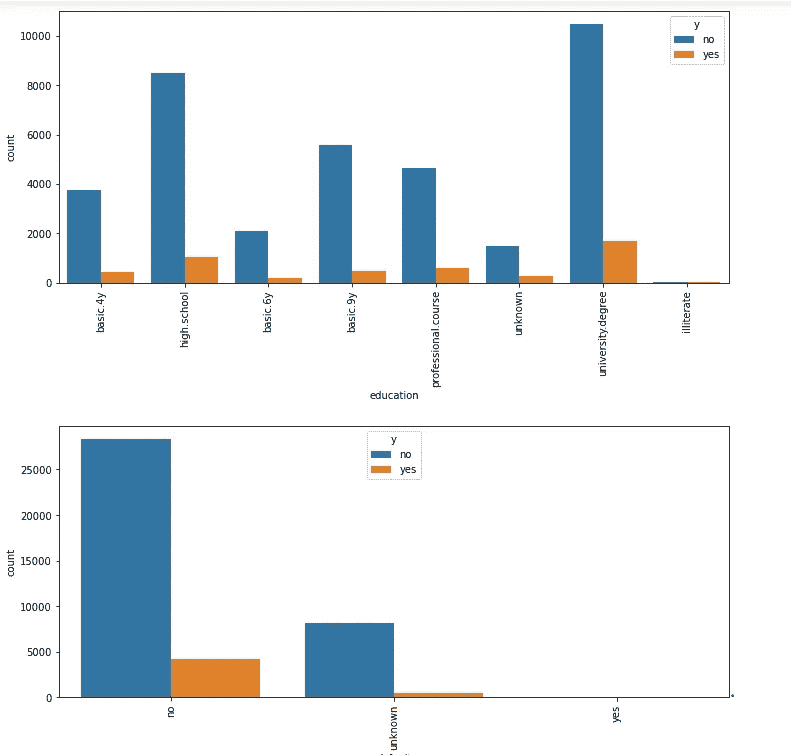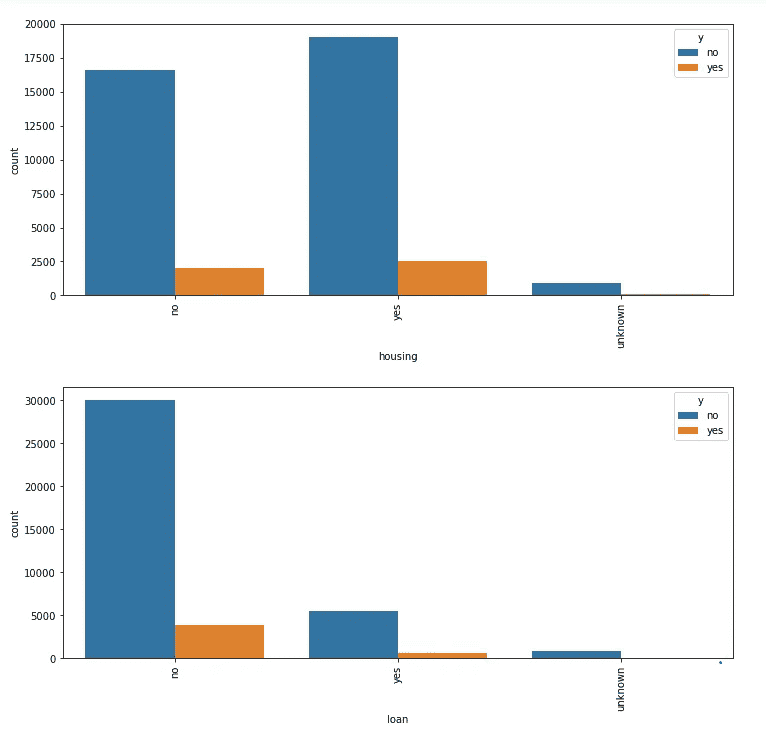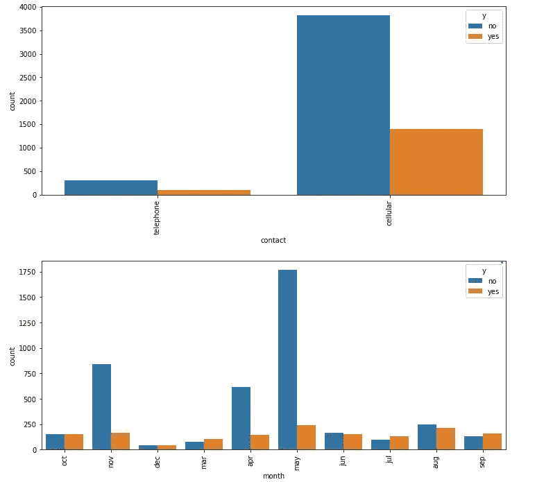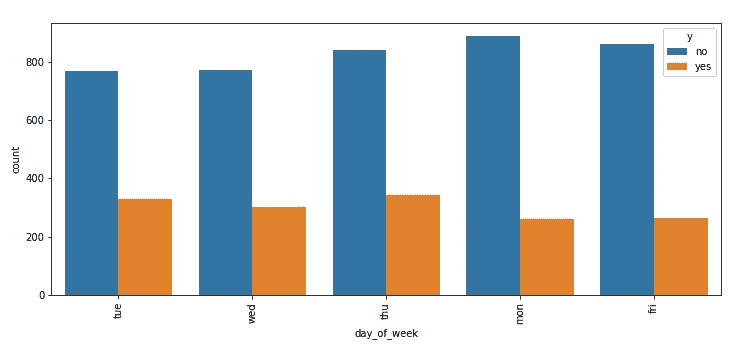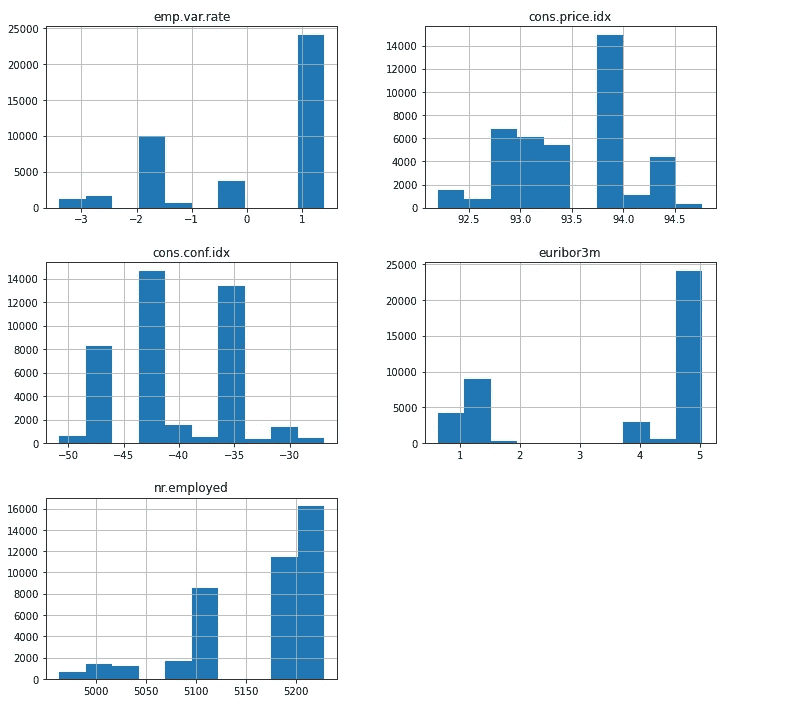

基于上图的观察结果:

*   与中年人相比，年轻和年长的顾客最有可能转变信仰
*   退休/学生最有可能改变信仰
*   单身人士皈依的几率很高
*   如果一个受过高中教育的顾客会转变
*   如果客户没有信用违约，有更大的机会得到转换
*   如果有手机联系的客户有更多的机会被转化
*   如果在 3 月/6 月/7 月/9 月/10 月/12 月联系，客户更有可能转变
*   如果在工作日周二/周三/周三致电，客户将有更好的机会转化
*   如果以前没有贷款，这是客户转变的好机会

我们的项目已经进行了一半，请耐心等待。理解数据中的内容的困难部分已经基本完成了。

现在我们只需要使用适当的统计工具并进行预测。让我们从了解变量之间的相关性(特征选择的重要方法)开始

## 皮尔逊相关性:

相关性是一种发现变量相关程度的方法。皮尔逊相关显示了数据之间的线性关系。

*   1 表示强正相关
*   -1 表示强烈的负面关系
*   0 表示完全没有关系

现在让我们看看，对于我们有的经济背景数字变量，相关性是什么样的。

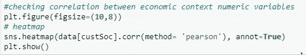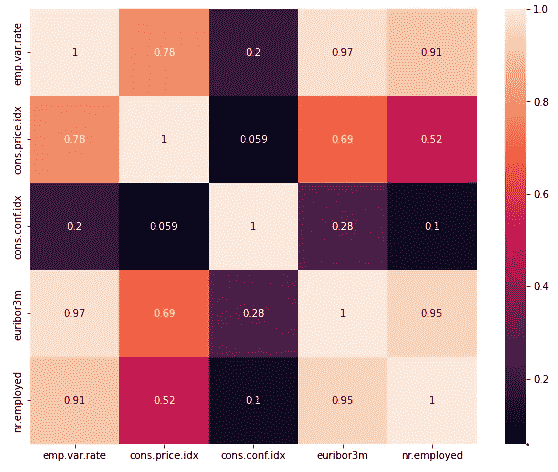

您可以看到,“cons.price.idx”与其他经济数字变量的相关性很高，nr.employed 与 EMP . var . rate(euribor 3m)的相关性也很高。这意味着我们的数据中存在多重共线性。

所有数值变量的相关性

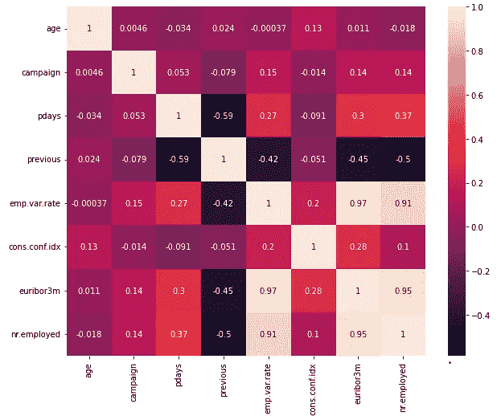

除了 nr.employed、emp.var.rate、euriborn3m 之外，其他数字特征相关性不高。

# 5.一个热门编码:

现在，正如我们所知，我们在数据中有许多分类变量，如果我们想对数据运行任何 ML 模型，我们需要将它们转换成数字形式。想详细了解编码的话可以参考我之前的文章— [这里](https://medium.com/@rasikashiral38/customer-segmentation-using-machine-learning-why-how-ffbc3141204f)。

在每个分类变量的一个热编码中，它创建一个新的数值变量。

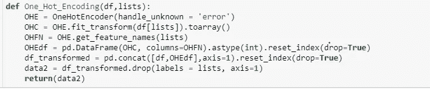

我想看看编码后变量之间的相关性

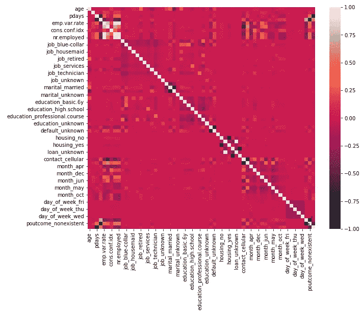

我知道这张图中发生了很多事情，让我们来分解一下:

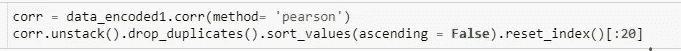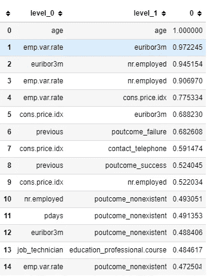

正如我们之前所观察到的，社会经济变量之间存在正相关，但其他变量之间不存在强相关。“previous”和“poutcome _ failture”之间有很强的相关性。现在让我们记住这一点。

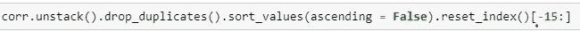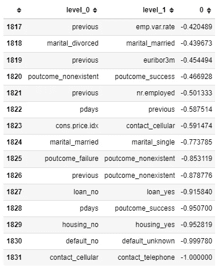

' default_no '、' default_unknown' & 'housing_yes '、' housing_no' & 'pdays '、' poutcome_success' & 'loan_yes '、' loan_no '之间存在负相关关系。这意味着变量中存在多重共线性。(当回归问题中的独立变量高度相关时，就会出现这种情况)

现在，我们将选择重要的要素，并尝试减少变量之间的多重共线性。

# 6.功能选择:

## 递归特征消除(包装方法)

特征选择是通过仅使用相关数据来减少模型的输入变量的一种方式，以便减少模型的过拟合。特征选择有助于模型的意义，使其易于解释。

**包装器方法:**在包装器方法中，特征选择是基于一种特定的机器学习算法，我们正试图使其适合给定的数据集。它遵循贪婪搜索方法，根据评估标准评估所有可能的特征组合。

**递归特征消除:**RFE 的目标是通过递归考虑越来越小的特征集来选择特征。首先，在初始特征集上训练估计器，并获得每个特征的重要性。然后，从当前特征集中删除最不重要的特征。该过程在删减集上递归重复，直到最终达到要选择的特征的期望数量。

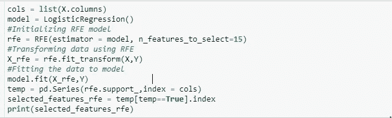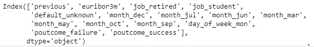

这些是使用 RFE 后我们得到的 15 个重要特性。

现在让我们看看这些变量是否仍然存在多重共线性，或者不使用方差膨胀因子。

# 7 .**。方差膨胀因子:多重共线性**

当一些特征高度相关时，我们可能很难区分它们对目标变量的单独影响。VIF 用于检测变量之间的多重共线性。VIF 按(1/1-R 平方)计算，其中 R 平方在线性回归中确定，其值介于 0 和 1 之间。因此，R 平方越大，相关性越强，VIF 也越大。一般来说，VIF 大于 5 表示高度多重共线性。

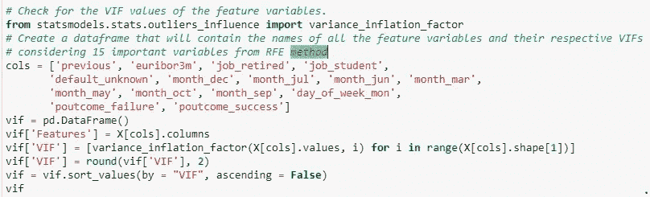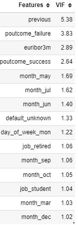

如您所见,“上一个”特征的 VIF 值大于 5。让我们从最终列表中删除该特性。

**最终的功能列表** → [ 'euribor3m '，' job_retired '，' job_student '，【T4 '，' default_unknown '，' month_dec '，' month_jul '，' month_jun '，' month_mar '，
'month_may '，' month_oct '，' month_sep '，' day_of_week_mon '，【T6]，' poutcome_failure '，' poutcome_success']

**差不多了，现在我们有了重要的特性，让我们继续模型实现。**

**在我们继续进行模型实施之前，还有一个步骤需要我们完成，那就是对数据进行过采样。**

# 8.SMOTE 过采样

如您所见，我们转化的客户较少(是/1)，即 3，252 人

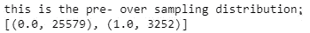

所以基本上，我们使用的数据集是不平衡的。我们不能忽略这种不平衡数据集的原因是，它会给少数类带来糟糕的性能，这是客户转换的时候(yes/1)。

处理不平衡数据集的方法之一是对少数类进行过采样。SMOTE(合成少数过采样技术)是一种这样的技术，它通过选择在特征空间中接近的样本，从少数类中合成新的样本。

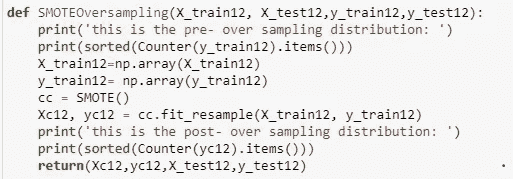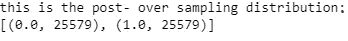

大获成功！！！现在让我们实现逻辑回归。

# **模型实现:逻辑回归**

**什么是逻辑回归:**逻辑回归是一种用于解决二元分类问题的预测分析。基于给定的独立变量数据集，逻辑回归估计事件发生的概率，例如投票或未投票。由于结果是一个概率，因变量被限制在 0 和 1 之间。

要详细了解逻辑回归，请参考这些文章→

1.  [https://learn.g2.com/logistic-regression](https://learn.g2.com/logistic-regression)
2.  [https://towards data science . com/logistic-regression-detailed-overview-46 C4 da 4303 BC](https://towardsdatascience.com/logistic-regression-detailed-overview-46c4da4303bc)

我们使用逻辑回归，因为如上所述，它用于预测分类变量，如电子邮件是否是垃圾邮件。(是/否)

我同时使用 scikit-learn 和 statsmodels 库。两个库对于逻辑回归的工作方式略有不同。我来解释一下 →

scikit-learn →如果模型无法概括数据，我们就会过度拟合训练数据。默认情况下，scikit-learn，lib 应用正则化。正则化平衡了对训练数据的预测准确性的需求。增加罚值会降低系数，从而降低过度拟合的可能性。如果惩罚太大，它将降低训练和测试数据集的预测能力。我们可以使用 GridSearchCV 为模型选择最优参数。

**超参数调谐:**

超参数是学习算法找到的模型的内部系数或权重。与参数不同，超参数是由开发人员在配置模型时指定的。在这个场景中，挑战在于知道在给定数据集上给定算法的超参数使用什么值，因此，我们使用 GridSearchCV。

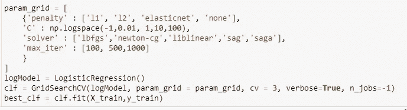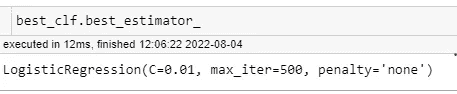

现在我们将在逻辑回归模型中使用这些超参数。

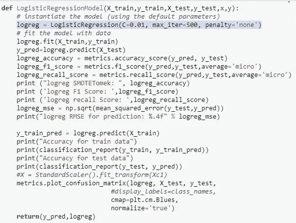

**我们先快速了解一下模型评估→**

混淆矩阵显示了与数据中的实际结果相比，分类模型做出的正确/错误预测的数量。

**准确性**:模型正确的频率

**精度(阳性预测值):**被正确识别的阳性病例的比例。真正为正的百分比是多少？

**召回(灵敏度):**被正确识别的实际阳性病例的比例。预测为阳性的百分比是多少？

**ROC AUC 曲线:**当我们想要可视化或检查分类模型的性能时，我们使用 AUC(曲线下面积)和 ROC(受试者操作特征)。ROC 是概率曲线，AUC 代表可分性的程度或度量。AUC 越高，模型预测的实际值越好。

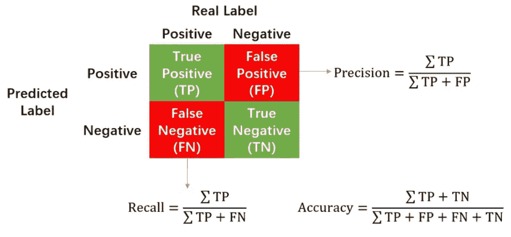

**Scikit-learn 模型输出:-**

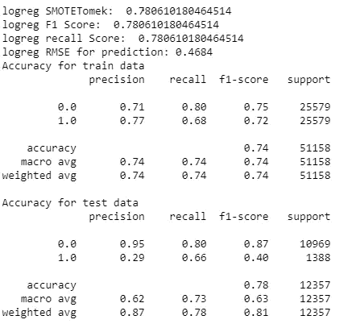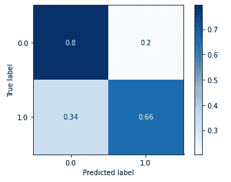

我们可以看到，训练数据的准确率为 74%,测试数据的准确率为 78%,这表明我们没有过度拟合数据，我们有很好的召回价值，也就是说，在 66%的时间里，我们正确地预测到客户被转化。

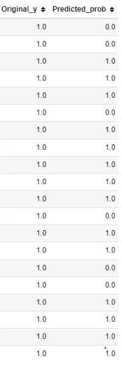

在测试数据集模型中的 1388 个转换客户中，有 914 个能够正确预测。

**Statsmodels 了解:**

正如我之前提到的，我也在使用 ***statsmodels，*** 在这个库中，正则化是默认关闭的。另一点要记住的是，默认情况下，统计模型不包括拦截。(在此等式中(P(X)/1-P(X))= b0+B1 * X，B0 是截距/偏差，如果我们从模型中排除截距项，则假设当所有预测变量为零时，观察成功的概率(P(Y=1))等于 0.5。这在任何实际世界中都不是这种情况)。但是 ***statsmodel*** 提供了统计量的汇总，包括 p 值、置信区间，以及概率形式的预测输出。

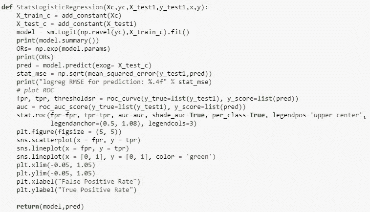

**Statsmodels 输出:**

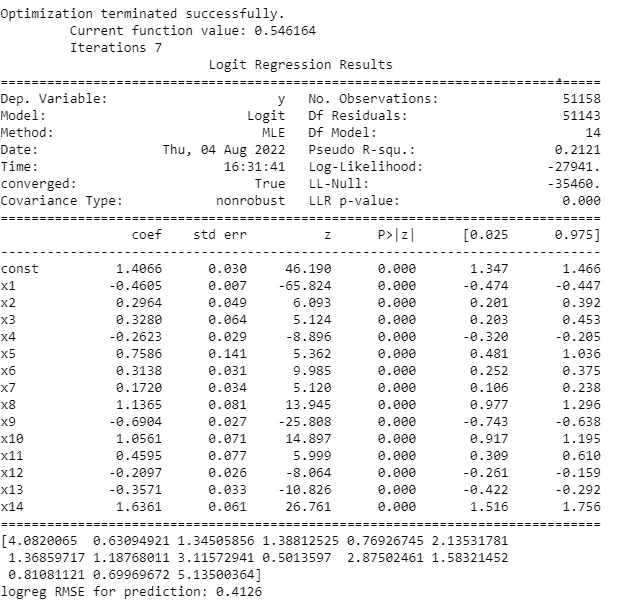

在这个总结中，你可以看到→ 'euribor3m '、' default_unknown '、' month_may '和' day_of_week_mon '这些变量对客户转化率有负面影响。其他变量受到积极影响。在第四列中，P>|z|显示了 P 值，您可以看到，对于所有变量，它们的值都小于 0.05，这意味着它们具有统计学意义。

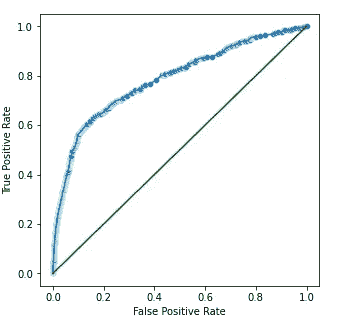

您可以看到 AUC 大于 0.5，这意味着分类器能够区分转换的客户和未转换的客户。

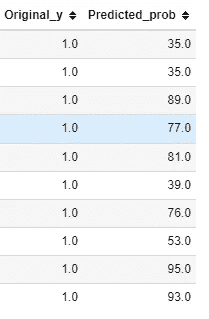

在这里，您可以看到它正在生成概率转换客户类别。

现在，如果业务人员想要了解我们在说 XYZ 客户将会转变时有多大的信心，您可以使用 Statsmodel a，它会给出概率；如果没有，您可以使用 Scikit-learn 模型进行预测。

# 模型解释

现在，我根据预测的概率将客户分为三类→

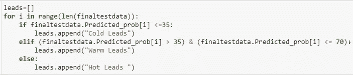

1.  潜在客户:对你的“定期存款”产品没有任何兴趣的客户。最难转化的线索之一。
2.  温馨提示:熟悉您的业务运作方式或“定期存款”产品的客户。这些客户参与对话，因此他们比冷线索更容易成为潜在客户。
3.  热门线索:对你的公司或产品感兴趣的客户。这些线索需要立即关注，因为当你花太长时间回应时，他们的兴趣可能会消退。

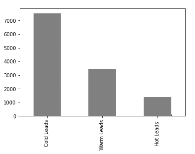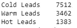

现在你有 3 桶潜在的线索，你可以传递给销售团队工作。销售和分销团队现在可以制定策略来接触这些热门线索并获得它们。

如果你觉得它有启发性，就鼓掌吧。有什么建议就评论:-)