# 机器学习流水线和核心指南

> 原文：<https://pub.towardsai.net/a-guide-to-machine-learning-pipelines-and-orchest-80f3e3a49994?source=collection_archive---------4----------------------->

## [机器学习](https://towardsai.net/p/category/machine-learning)

## 了解机器学习管道如何用于生产，并在灾难推文分类数据集上使用简单的步骤设计您的第一个管道。您还将学习如何接收数据、预处理、训练并最终评估结果。


图片 1

# 介绍

在本指南中，我们将了解机器学习(ML)管道的重要性，以及如何安装和使用[或](https://www.orchest.io/)平台。我们还将使用来自 Kaggle 的[自然语言处理](https://www.analyticsvidhya.com/blog/2021/02/basics-of-natural-language-processing-nlp-basics/)初学者问题，将推文分为灾难和非灾难推文。ML 管道是独立可执行的代码，用于运行多个任务，包括数据准备和训练机器学习模型。下图显示了每个步骤如何有一个特定的角色，以及跟踪这些步骤如何容易。 [Azure 机器学习](https://docs.microsoft.com/en-us/azure/machine-learning/concept-ml-pipelines)

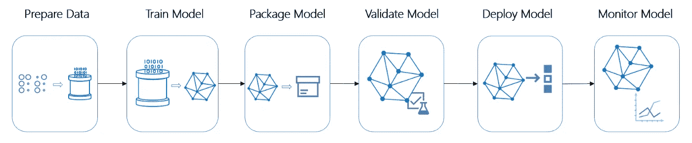

图片 2

# 为什么要使用管道？

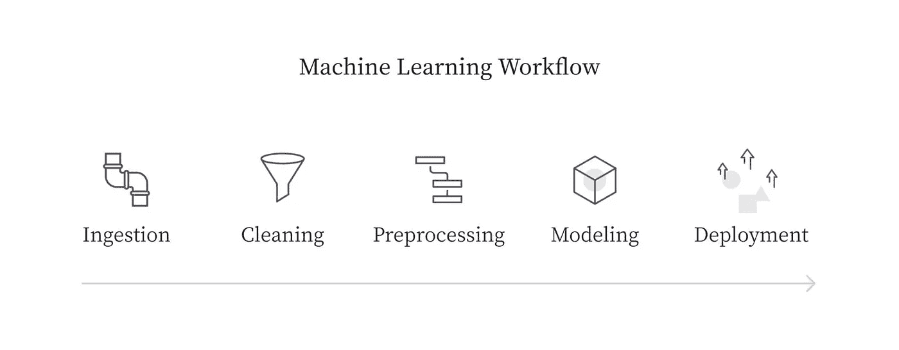

图 3

当您必须将这些模型部署到生产中时，问题就出现了。您需要灵活地扩展您的系统，跟踪变化，并在整个生态系统中维护相似的版本。

*   **Volume** :当部署多个版本的模型时，您需要运行一个类似的工作流，在超参数、数据后处理或删除额外步骤方面做一些更改。管道提供了实验的灵活性和再现性。
*   **多样性**:当向工作流程添加额外流程时，复制粘贴是一种糟糕的方法。
*   **版本控制**:当您想要对工作流中常用的部分进行更改时，如果您没有使用管道，则必须在每个工作流中手动进行更改。这会为错误创造空间，而且效率不高。[ML 管道及其重要性| Algorithmia 博客](https://www.algorithmia.com/blog/ml-pipeline)

# 什么是 Orchest？

[Orchest](https://github.com/orchest/orchest) 是一个数据管道生态系统，不需要 [DAGs](https://www.astronomer.io/blog/what-exactly-is-a-dag) 或任何第三方集成。环境很容易导航，你可以使用你最喜欢的 IDE **Jupiter Lab** 和 **VSCode。**你也可以用各种语言编写你的步骤，比如 Python，R，和 Julia。

Orchest 中的管道包含步骤。各个步骤是在隔离环境中执行的可执行文件，它们通过定义从一个步骤到另一个步骤的数据流的节点连接起来。Orchest 环境是用户友好的，因此您可以选择和删除步骤，并轻松地将它们与多个步骤连接起来。它还允许您可视化进度，并帮助您调试代码。可以看下面的视频更好的理解。

# 附加服务

Orchest 还提供外部集成，例如通过 **TensorBoard** 进行模型度量跟踪，或者使用 **Streamlit 构建您的 web 应用程序。**您可以观察下图中的所有附加服务。

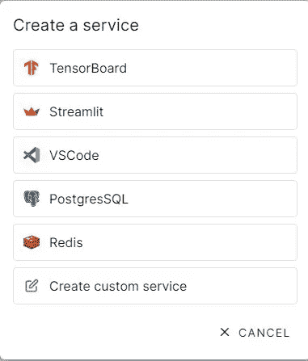

## 调度管道

就像[气流](https://airflow.apache.org/)一样，你可以为特定的管道安排你的工作。系统使用 system Cron 每小时或每天运行任务，具体取决于您的设置。


# 安装螺钉

在本节中，我们将学习如何通过简单的步骤在您的电脑上安装 Orchest。如果你使用的是 Linux 操作系统，那么你必须写一行代码。确保您的系统中安装了最新的 Docker 桌面。

## Windows 操作系统

按照以下步骤成功安装平台，更多信息请查看[安装(orchest.readthedocs.io)](https://orchest.readthedocs.io/en/stable/getting_started/installation.html)

*   Docker [引擎最新](https://docs.docker.com/engine/install/)版本:运行`docker version`检查。
*   Docker 必须配置为使用 [WSL 2](https://docs.microsoft.com/en-us/windows/wsl/install-win10) 。
*   [Windows 版 Ubuntu 20.04 LTS](https://www.microsoft.com/en-us/p/ubuntu-2004-lts/9n6svws3rx71?activetab=pivot:overviewtab) 。
*   在 Ubuntu 环境中运行下面的脚本。

## Linux 操作系统

只需在命令行中复制并粘贴下面的代码，然后按回车键。

```
git clone https://github.com/orchest/orchest.git && cd orchest
./orchest install

# Verify the installation.
./orchest version --ext

# Start Orchest.
./orchest start
```

# 逆风云

如果你打算使用 Orchest cloud，你可以注册免费轮胎并开始你的项目，而不需要安装任何东西[https://cloud.orchest.io/signup.](https://cloud.orchest.io/signup.)


图 4

# 灾难推特项目

这个挑战对于希望开始自然语言处理的数据科学家来说是完美的。[灾难推文的自然语言处理| Kaggle](https://www.kaggle.com/c/nlp-getting-started/overview) 。你将预测一条推文是关于一场真正的灾难(1)还是不是(0)。

**文件**

*   **train.csv** —训练集
*   **test.csv** —测试集
*   **sample _ submission . CSV**—格式正确的样本提交文件

**列**

*   `id` -每条推文的唯一标识符
*   `text` -推文的文本
*   `location` -发送推文的位置(可能为空)
*   `keyword` -推文中的特定关键词(可能为空)
*   `target`——仅在 **train.csv** 中，真实灾难推文(`1`)或不(`0`)

## 初始化

注册帐户后，您将看到“项目”选项卡，您可以单击“添加项目”选项卡。

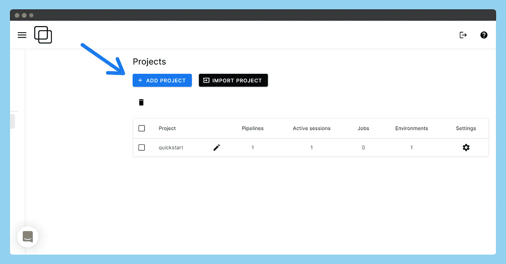

写下首选项目名称，然后按“创建项目”按钮。

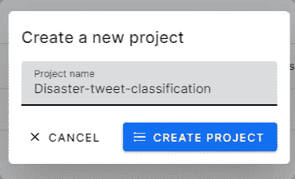

您现在需要创建一个管道并开始项目工作。一个项目可以有多个管道。

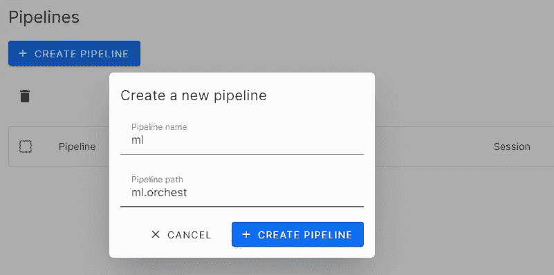

我们终于到达了一个有多个选项的空白画布，可以开始了。下一步是向我们的管道添加步骤。

## 添加步骤

按下**新步骤**按钮，然后为您的步骤添加图块。在我们的例子中，是**“数据”**。警告标志表示数据文件不存在。您可以单击警告标志并创建. ipynb 或。py 文件。

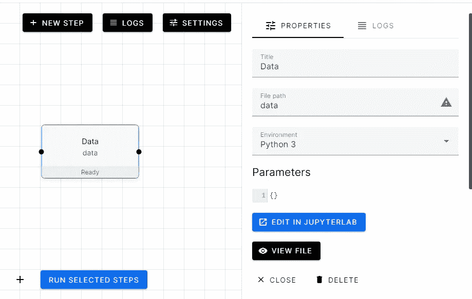

## 朱庇特实验室

创建 data.py 文件后，让我们通过单击 JUPYTERLAB 中的 EDIT 按钮添加 python 代码。

1.  导入训练和测试 CSV 文件
2.  显示每个数据帧的前三个样本
3.  使用 orchest 库转发数据。

*   要导出数据，请使用**或 chest.output((variable1，variable2，…)，name = )**
*   要导入数据，首先创建对象: **data=orchest.get_inputs()，然后是 variable1，variable2，…= data [""]**

```
import pandas as pd
import orchest## using pandas read_csv funtion to load csv files
train=pd.read_csv("Data/train.csv")
test=pd.read_csv("Data/test.csv")## Displying the dataframe of both training and testing
print("Training Datan")
print(train.head(3))
print("Testing Datan")
print(test.head(3))# Output the disaster tweets
print("nOutputting converted disaster tweets data...")
orchest.output((train, test), name="data")
print("Success!")
```

## 运行第一步

在 Jupyter 中调试完我们的代码后，可以通过点击 Switch to Pipeline 来运行我们的步骤了。选择数据步骤并运行它。这需要几秒钟，您可以在侧栏上看到该步骤的输出。

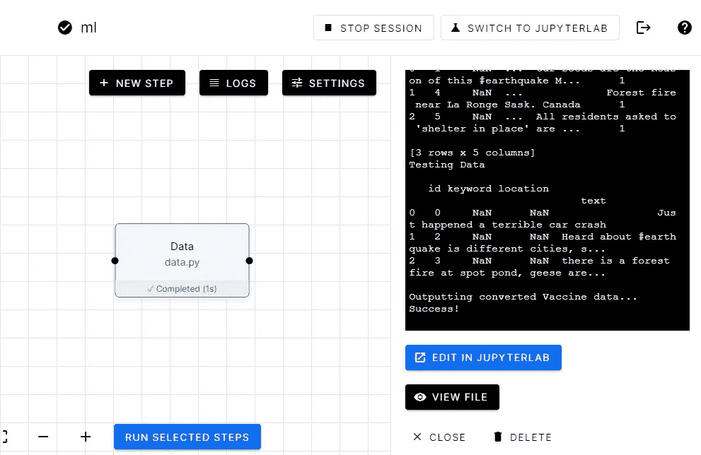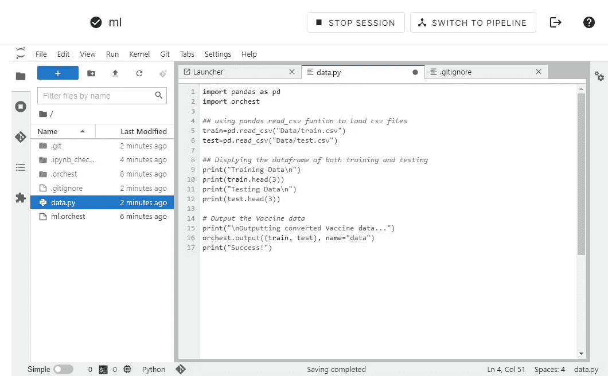

你可以在上面的图片中看到我们将如何在 Orchest 平台中使用 JupyterLab。

## 添加数据分析步骤

让我们添加另一个称为**“数据分析”**的步骤。我们将创建 ipynb，以便我们可以查看笔记本格式的每个单元输出。

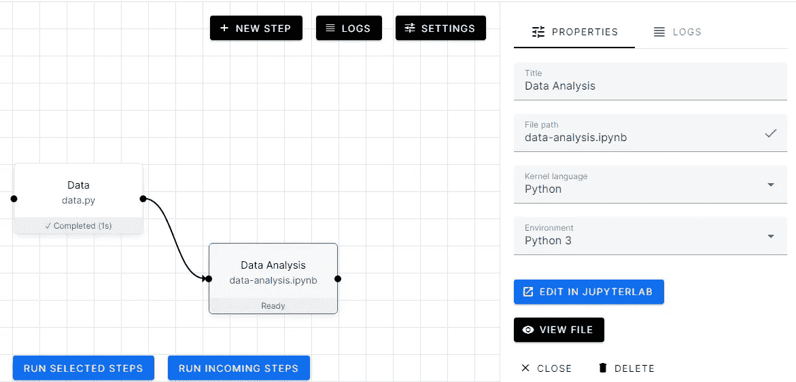

1.  检查缺失值
2.  目标值的分布
3.  位置分布
4.  灾难和非灾难推文的词云

```
import matplotlib.pyplot as plt
import seaborn as sns
from wordcloud import WordCloud
import orchest
## Ignoring Warning during trainings 
import warnings
warnings.filterwarnings('ignore')data = orchest.get_inputs()
train, test = data["data"]
## using isnull will give us bollean data and suming all true will give exact number of missing values.
print("Train Dataset missing data:n",train.isnull().sum(),"n")
print("Test Dataset missing data:n",test.isnull().sum())Train Dataset missing data:
 id             0
keyword       61
location    2533
text           0
target         0
dtype: int64 
Test Dataset missing data:
 id             0
keyword       26
location    1105
text           0
dtype: int64
```

深入灾难微博

```
display("Random sample of disaster tweets:",train[train.target==1].text.sample(3).to_frame())
display("Random sample of non disaster tweets:",train[train.target==0].text.sample(3).to_frame())
'Random sample of disaster tweets:'
text
3606	Boy 11 charged with manslaughter in shooting d...
6055	Gaping sinkhole opens up in Brooklyn New York ...
5091	3 former executives to be prosecuted in Fukush...
'Random sample of non disaster tweets:'
text
5227	What a win by Kerry. 7-16..... #obliteration
3973	@crabbycale OH MY GOD THE MEMORIES ARE FLOODIN...
1017	@SlikRickDaRula Drake really body bagging peep...
```

位置

```
train.location.value_counts()[:10].to_frame()
```

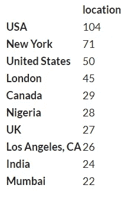

作者图片

# 词云

```
disaster_tweets = train[train['target']==1]['text']
non_disaster_tweets = train[train['target']==0]['text']
fig, (ax1, ax2) = plt.subplots(1, 2, figsize=[16, 8])
wordcloud1 = WordCloud( background_color='white',
                        width=600,
                        height=400).generate(" ".join(disaster_tweets))
ax1.imshow(wordcloud1)
ax1.axis('off')
ax1.set_title('Disaster Tweets',fontsize=40);
wordcloud2 = WordCloud( background_color='white',
                        width=600,
                        height=400).generate(" ".join(non_disaster_tweets))
ax2.imshow(wordcloud2)
ax2.axis('off')
ax2.set_title('Non Disaster Tweets',fontsize=40);
```


如下图所示，我们将使用单个单元格进行数据分析。

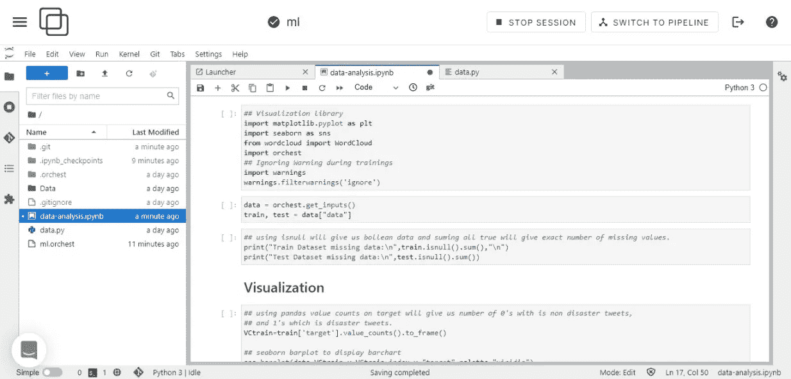

让我们运行数据分析步骤，正如您在下图中看到的，它从“数据”步骤中获取数据，并使用它来分析训练和测试数据集。

在本例中，我们使用的是**->data = or chest . get _ inputs()；训练，测试=数据[“数据”]。**如果你过去一直在做数据可视化，代码非常简单易懂，所以我不会深入到编码部分。


# 使用 Orchest 进行预处理

从现在开始，我们将创建步骤并开始添加代码。如前所述，我们将使用 orchest 库将数据从一个步骤转移到另一个步骤。

让我们从加载数据步骤中的数据开始。

```
## NLP library
import re
import string
import nltk
from nltk.corpus import stopwords
## ML Library
from sklearn.feature_extraction.text import CountVectorizer,TfidfVectorizer, TfidfTransformer
from sklearn.model_selection import RepeatedStratifiedKFold,cross_val_score
from sklearn.linear_model import LogisticRegression
from sklearn.naive_bayes import MultinomialNB
from sklearn.pipeline import Pipeline
from sklearn.metrics import f1_score
from sklearn.model_selection import train_test_split
import pickle
import orchest

data = orchest.get_inputs()
train, test = data["data"]
train.text.head() 0 Our Deeds are the Reason of this #earthquake M...
1 Forest fire near La Ronge Sask. Canada
2 All residents asked to 'shelter in place' are ...
3 13,000 people receive #wildfires evacuation or...
4 Just got sent this photo from Ruby #Alaska as ...
Name: text, dtype: object
```

## 文本清理

在这一部分，我们将删除特殊字符，网页链接和标点符号。

```
def text_processing(data):
 # lowering the text
 data.text=data.text.apply(lambda x:x.lower() )
 #removing square brackets
 data.text=data.text.apply(lambda x:re.sub('[.*?]', '', x) )
 data.text=data.text.apply(lambda x:re.sub('+', '', x) )
 #removing hyperlink
 data.text=data.text.apply(lambda x:re.sub('https?://S+|www.S+', '',x) )
 #removing puncuation
 data.text=data.text.apply(lambda x:re.sub(
'[%s]' % re.escape(string.punctuation), '', x
 ))
 data.text=data.text.apply(lambda x:re.sub('n' , '', x) )
 #remove words containing numbers
 data.text=data.text.apply(lambda x:re.sub('w*dw*' , '', x) )
 return datatrain = text_processing(train)
test = text_processing(test)
train.text.head()
0 our deeds are the reason of this earthquake ma...
1 forest fire near la ronge sask canada
2 all residents asked to shelter in place are be...
3 people receive wildfires evacuation orders in...
4 just got sent this photo from ruby alaska as s...
Name: text, dtype: object
```

## 标记化

标记化是将字符串、文本标记化或拆分成标记列表的过程。你可以把一个标记看作一个部分，就像一个单词是一个句子中的标记，一个句子是一个段落中的标记。

```
token=nltk.tokenize.RegexpTokenizer(r'w+')
#applying token
train.text=train.text.apply(lambda x:token.tokenize(x))
test.text=test.text.apply(lambda x:token.tokenize(x))
#view
display(train.text.head())
0 [our, deeds, are, the, reason, of, this, earth...
1 [forest, fire, near, la, ronge, sask, canada]
2 [all, residents, asked, to, shelter, in, place...
3 [people, receive, wildfires, evacuation, order...
4 [just, got, sent, this, photo, from, ruby, ala...
Name: text, dtype: object
```

## 删除停用词

在大多数情况下，删除停用词可以提高模型性能。

```
nltk.download('stopwords')
#removing stop words
train.text=train.text.apply(lambda x:[w for w in x if w not in stopwords.words('english')])
test.text=test.text.apply(lambda x:[w for w in x if w not in stopwords.words('english')])
#view
train.text.head()
[nltk_data] Downloading package stopwords to /home/jovyan/nltk_data...
[nltk_data] Unzipping corpora/stopwords.zip.
0 [deeds, reason, earthquake, may, allah, forgiv...
1 [forest, fire, near, la, ronge, sask, canada]
2 [residents, asked, shelter, place, notified, o...
3 [people, receive, wildfires, evacuation, order...
4 [got, sent, photo, ruby, alaska, smoke, wildfi...
Name: text, dtype: object
```

## 堵塞物

Python NLTK 中的词干化和词汇化是用于自然语言处理的文本规范化技术。这些技术广泛用于文本预处理。词干化和词汇化的区别在于，词干化速度更快，因为它在不知道上下文的情况下切割单词，而词汇化速度较慢，因为它在处理之前知道单词的上下文。

在这种情况下，PoerterStemmer 比 lemmatization 表现得更好

```
#stemmering the text and joining
stemmer = nltk.stem.PorterStemmer()
train.text=train.text.apply(lambda x:" ".join(stemmer.stem(token) for token in x))
test.text=test.text.apply(lambda x:" ".join(stemmer.stem(token) for token in x))
#View
train.text.head()
0 deed reason earthquak may allah forgiv us
1 forest fire near la rong sask canada
2 resid ask shelter place notifi offic evacu she...
3 peopl receiv wildfir evacu order california
4 got sent photo rubi alaska smoke wildfir pour ...
Name: text, dtype: object
```

## 文本矢量化

机器学习算法通常将数字特征向量作为输入。因此，当处理文本文档时，我们需要一种方法将每个文档转换成数字向量。

在我们的例子中，**计数矢量器**是性能最好的。我们将把您的训练数据集分为训练和验证两部分。

```
vectorizer = TfidfVectorizer()
train_vectors_count = vectorizer.fit_transform(train['text'])
test_vectors_count = vectorizer.transform(test["text"])
X_train, X_val, y_train, y_val = train_test_split(train_vectors_count, train["target"], test_size=0.2, random_state=40,stratify=train["target"])
orchest.output((X_train, y_train,X_val, y_val,test_vectors_count), name='train_val_test')
```

正如我们在下图中看到的，我是如何使用 Jupyter notebook 进行实验并提出更好的解决方案的。一旦您建立了一个管道，您就可以很容易地进行更改和评估您的模型的性能。

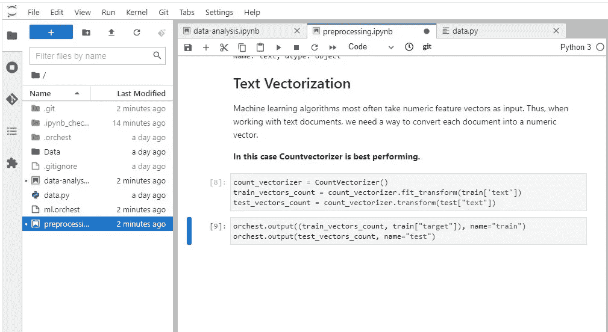

# EvalML: AutoML

我们将在 AutoML 步骤中使用 EvalML，这样我们就可以挑选性能更好的模型。下面的代码非常简单易懂，如果你想了解更多训练模型的方法，你可以查看 evaml 0 . 35 . 0 文档

EvalML 是一个 AutoML 库，它使用特定领域的目标函数来构建、优化和评估机器学习管道。

**关键功能**

*   自动化——让机器学习更容易。避免手动训练和调整模型。包括数据质量检查、交叉验证等。
*   数据检查-在建模前捕捉数据和问题设置中的问题并发出警告。
*   端到端-构建和优化管线，包括最先进的预处理、特征工程、特征选择和各种建模技术。
*   模型理解——提供工具来理解和反思模型，以了解它们在您的问题领域中的行为。
*   特定领域—包括特定领域目标函数的存储库和定义您自己的目标函数的接口。

```
import orchest ## EVALML from evalml.automl import AutoMLSearch from sklearn.model_selection import train_test_split from sklearn.metrics import f1_score import warnings  warnings.filterwarnings("ignore")data = orchest.get_inputs() train,test = data["data"]X = train.drop(['target'], axis=1) y = train['target']import woodwork as ww # X = ww.DataTable(X)  # Note: We could have also manually set the text column to  # natural language if Woodwork had not automatically detected from evalml.utils import infer_feature_types X = infer_feature_types(X, {'text': 'NaturalLanguage'}) # y = ww.DataColumn(y)from evalml.preprocessing import split_data  X_train, X_holdout, y_train, y_holdout = split_data(X, y, problem_type='binary', test_size=0.2)automl = AutoMLSearch(X_train=X_train, y_train=y_train,additional_objectives=['f1'], problem_type='binary',max_time=300)automl.search()%%time pipeline = automl.best_pipeline pipeline.fit(X_train, y_train)CPU times: user 7.44 s, sys: 437 ms, total: 7.88 s Wall time: 7.28 spipeline = BinaryClassificationPipeline(component_graph={'Drop Columns Transformer': ['Drop Columns Transformer', 'X', 'y'], 'Text Featurization Component': ['Text Featurization Component', 'Drop Columns Transformer.x', 'y'], 'Imputer': ['Imputer', 'Text Featurization Component.x', 'y'], 'One Hot Encoder': ['One Hot Encoder', 'Imputer.x', 'y'], 'XGBoost Classifier': ['XGBoost Classifier', 'One Hot Encoder.x', 'y']}, parameters={'Drop Columns Transformer':{'columns': ['location']}, 'Imputer':{'categorical_impute_strategy': 'most_frequent', 'numeric_impute_strategy': 'mean', 'categorical_fill_value': None, 'numeric_fill_value': None}, 'One Hot Encoder':{'top_n': 10, 'features_to_encode': None, 'categories': None, 'drop': 'if_binary', 'handle_unknown': 'ignore', 'handle_missing': 'error'}, 'XGBoost Classifier':{'eta': 0.1, 'max_depth': 6, 'min_child_weight': 1, 'n_estimators': 100, 'n_jobs': -1, 'eval_metric': 'logloss'}}, random_seed=0)preds = pipeline.predict(X_holdout)print("F1 score:",f1_score(y_holdout,preds)) orchest.output(automl,name='automl')F1 score: 0.6962457337883959
```

# 结果

让我们为 AutoML 步骤创建另一个步骤，以显示性能最佳的库。

```
import orchestdata = orchest.get_inputs() automl = data["automl"]automl.rankingsorchest.output(automl.rankings,name='automl_results')best_pipeline_id = automl.rankings.iloc[0]["id"] automl.describe_pipeline(best_pipeline_id)************************************************************************************************************* * XGBoost Classifier w/ Drop Columns Transformer + Text Featurization Component + Imputer + One Hot Encoder * *************************************************************************************************************  Problem Type: binary Model Family: XGBoost  Pipeline Steps ============== 1\. Drop Columns Transformer 	 * columns : ['location'] 2\. Text Featurization Component 3\. Imputer 	 * categorical_impute_strategy : most_frequent 	 * numeric_impute_strategy : mean 	 * categorical_fill_value : None 	 * numeric_fill_value : None 4\. One Hot Encoder 	 * top_n : 10 	 * features_to_encode : None 	 * categories : None 	 * drop : if_binary 	 * handle_unknown : ignore 	 * handle_missing : error 5\. XGBoost Classifier 	 * eta : 0.1 	 * max_depth : 6 	 * min_child_weight : 1 	 * n_estimators : 100 	 * n_jobs : -1 	 * eval_metric : logloss  Training ======== Training for binary problems. Total training time (including CV): 46.9 seconds  Cross Validation ----------------              Log Loss Binary    F1 # Training # Validation 0                      0.531 0.675      4,060        2,030 1                      0.582 0.657      4,060        2,030 2                      0.556 0.678      4,060        2,030 mean                   0.556 0.670          -            - std                    0.026 0.011          -            - coef of var            0.046 0.017          -            -automl.best_pipeline.component_graph.graph()
```

## 逻辑回归

我们将创建另外三个步骤，这些步骤将从预处理步骤中获取数据，并运行各种分类模型。

1.  使用默认超参数构建逻辑回归。
2.  运行重复分层 K 折叠
3.  观察每一次折叠的分数
4.  最后，训练和评估我们的模型

不错 0.75 的 F1 成绩对于香草车型来说已经相当不错了。

我们将使用这段代码，并为其他三个步骤更改模型的名称。

*   朴素贝叶斯
*   轻型 GBM
*   随机森林

```
import orchest
from sklearn.metrics import f1_score
import warnings
warnings.filterwarnings("ignore")
from sklearn.model_selection import RepeatedStratifiedKFold,cross_val_score
from sklearn.linear_model import LogisticRegression

data = orchest.get_inputs()
X_train,y_train, X_val,y_val,test = data["train_val_test"]
LR = LogisticRegression()
cv = RepeatedStratifiedKFold(n_splits=5, n_repeats=3, random_state=1)
scores = cross_val_score(LR, X_train, y_train, cv=cv, scoring="f1")
scores
array([0.70939227, 0.7405765 , 0.74273412, 0.69690265, 0.73456121,
       0.72246696, 0.70509978, 0.68673356, 0.75349839, 0.70792617,
       0.70707071, 0.72668113, 0.7211329 , 0.72766885, 0.72628135])
LR.fit(X_train,y_train)
y_pred = LR.predict(X_val)
print("F1 score :", f1_score(y_pred, y_val))
F1 score : 0.7532244196044712
orchest.output((LR, y_pred,),name="LR")
```

## 全体

我们将创建一个集成步骤，它将从所有三个模型步骤中获取数据，并使用 VotingClassifier 来训练和评估结果。

1.  摄取所有四个模型的数据
2.  使用所有四个模型构建投票分类器模型
3.  训练数据集上的训练模型
4.  验证数据集上的评估模型
5.  通过以热图形式显示令人困惑的矩阵进行评估。

我们得到了 0.73 的 F1 分数，这比简单的逻辑回归还要差。

```
import orchest
import seaborn as sns
import matplotlib.pyplot as plt
from sklearn.ensemble import RandomForestClassifier,VotingClassifier
from sklearn.metrics import f1_score,accuracy_score,classification_report,confusion_matrix
/opt/conda/lib/python3.7/site-packages/requests/__init__.py:91: RequestsDependencyWarning: urllib3 (1.26.7) or chardet (3.0.4) doesn't match a supported version!
  RequestsDependencyWarning)
data = orchest.get_inputs()
lgbm, pred_lgbm = data["lgbm"]
rf, pred_rf, X_train, y_train, X_val, y_val, test = data["RF"]
nb, pred_nb = data["NB"]
lr, pred_lr = data["LR"]
total_score=[]
model = VotingClassifier(
    estimators=[("lr", lr), ("RF", rf), ("NB", nb), ("LGBM", lgbm)],
    voting="hard",
)
model.fit(X_train, y_train)
# Make predictions
y_pred = model.predict(X_val)
f1_score = f1_score(y_val, y_pred)
# Check the F1 score of the model
print("F1 score:", f1_score)
F1 score: 0.7347670250896057
accuracy_score = accuracy_score(y_val,y_pred)
print("Accuracy Score:",accuracy_score)
Accuracy Score: 0.8056467498358503
plt.figure(figsize=(10, 10))
cm = confusion_matrix(y_val, y_pred)
sns.heatmap(
    cm,
    cmap="Blues",
    linecolor="black",
    linewidth=1,
    annot=True,
    fmt="",
    xticklabels=["Covid_Negative", "Covid_Positive"],
    yticklabels=["Covid_Negative", "Covid_Positive"],
)
plt.xlabel("Predicted")
plt.ylabel("Actual")
```

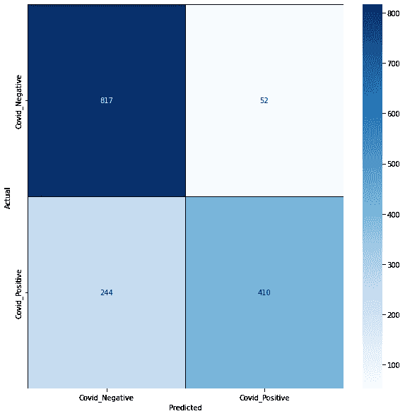

```
orchest.output((model, test, f1_score, accuracy_score),name='ensemble')
```

我跳过了一些步骤，因为它们遵循相似的模式。如果你想看到整个管道的代码，你应该看看我的 GitHub 库。[kingabzpro/ML-Pipeline-Disaster-tweets](https://github.com/kingabzpro/ML-Pipeline-Disaster-tweets)

# 使用 Orchest 的最终管道

我们的最终渠道包括:

*   **数据**:从 CVS 文件中摄取数据。
*   **数据分析**:可视化和分析推文分布
*   **预处理**:清洗、分词、切分数据集
*   **Automl** :使用 EvalML 用几行代码进行训练
*   **结果**:分析 AutoML 结果
*   **逻辑回归**:训练简单的逻辑分类器
*   **朴素贝叶斯**:训练和评估
*   **LGBM** :培训和评估
*   **随机森林**:训练和评估
*   **评估**:评估所有模型
*   **集合**:集合所有三个模型
*   **比较**:将集合模型结果与简单模型进行比较
*   **提交**:预测测试数据集，准备提交文件。

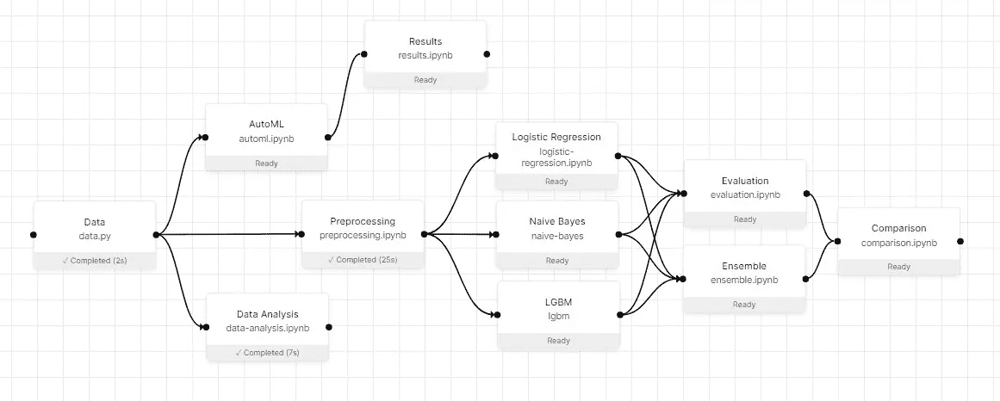

# 使用 Orchest 调度执行

我们通过单击“jobs”选项卡来创建作业，以计划每 24 小时运行一次此管道。


正如您在下图中看到的，我们的工作正在进行中。它将在每天 UTC 时间下午 12 点运行，直到我们取消该作业。如果使用外部数据集或 API，还可以添加参数和环境变量。

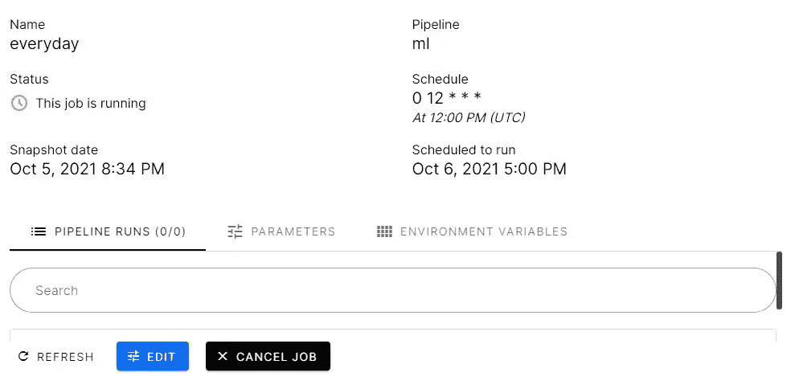

# 结果

这里的结果来自比较步骤，逻辑回归在所有结果中表现最好，而轻度 GBM 表现最差。我们将使用该结果来选择单个模型并预测测试数据集的目标。

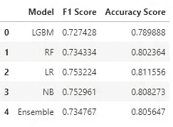

# 自动结果

AutoML 结果比我上面提到的任何模型都差。也许如果我们通过预处理数据得到它们，结果会更好。

你可以在下图中看到管道和结果。

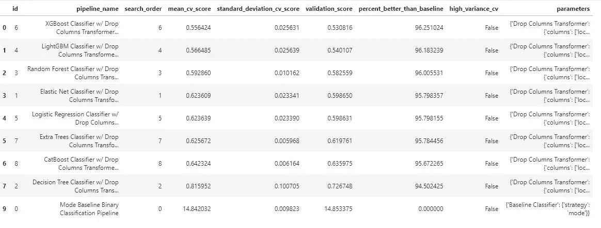

# 提交

在提交步骤中，最好的执行模型和测试数据集被接收。我们还将使用 pandas read_csv 加载 sample_submission 文件。

```
import pandas as pd
import orchest
  RequestsDependencyWarning)
sub = pd.read_csv("Data/sample_submission.csv")
data = orchest.get_inputs()
model,test = data["sub"]
pred_test = model.predict(test)
sub["target"] = pred_test
sub.head()
id	target
0	0	0
1	2	1
2	3	1
3	9	1
4	11	1
sub.to_csv("submission.csv",index=False)
```


正如你可以看到的，我们的模型在私有数据集上表现得相当好，F1 分数为 0.792。

# 结论

在本指南中，我们已经了解了如何将机器学习部分划分为不同的步骤，以及每个步骤如何使用数据流来处理数据并将其导出用于下一步。我们还学会了在管道中创建各种步骤，并使用 Jupyter notebook 对机器学习数据流进行编码。

在我看来，世界正在转向机器学习管道，因为它们提供了灵活性和可扩展性。您还可以添加**权重&偏差**用于实验跟踪或其他集成，例如使用 **Streamlit** 创建 web 应用程序。

在 Orchest 中不仅仅是创建一个数据管道。该平台为您提供了数据科学家熟悉的所有工具。我喜欢我创建这个指南的每一点，并尝试了各种功能。最后，在评估和创建提交文件之后，我们已经成功地在私有数据集上取得了几乎最好的成绩。下次我们将学习更多令人兴奋的 MLOps 工具，让您的生活变得轻松。MLOPs 是人工智能的未来，如果你想增加被你所在国家的顶级公司聘用的几率，开始投资 MLOPs 工具吧。

# 密码

你可以在 [GitHub](https://github.com/kingabzpro/ML-Pipeline-Disaster-tweets) 和 [DAGsHub](https://dagshub.com/kingabzpro/ML-Pipeline-Disaster-tweets) 上找到整个项目

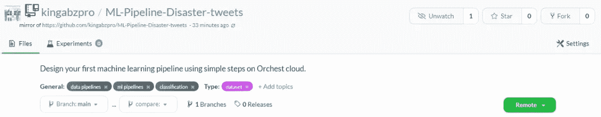

作者图片

# 学习资源

*   关于竞争数据特征的数据分析 NLP 的工程思想、清理和文本处理思想、基线 BERT 模型或带有标签的测试集:[带有灾难推文的 NLP—EDA、清理和 BERT | Kaggle](https://www.kaggle.com/gunesevitan/nlp-with-disaster-tweets-eda-cleaning-and-bert)
*   执行推文分析的逐步指南:[使用 NLP 的推文分析](https://medium.com/analytics-vidhya/tweet-analytics-using-nlp-f83b9f7f7349)
*   自然语言处理和推文情感分析:[卡珊德拉·科拉莱斯的中型文章](https://medium.com/@cmcorrales3/natural-language-processing-and-tweet-sentiment-analysis-fa1edbb5ddd5)
*   使用 Orchest: [用几行代码设计你的第一个机器学习管道一种构建机器学习管道的新方法](/a-new-way-of-building-machine-learning-pipelines-54700ed1aded)

# Orchest 示例项目

*   使用 Orchest 用几行代码设计你的第一个机器学习管道。你将学习对数据进行预处理，训练机器学习模型，并评估结果:[kingabzpro/covid 19-Vaccine-ML-Pipeline](https://github.com/kingabzpro/Covid19-Vaccine-ML-Pipeline)
*   这个存储库演示了一个 Orchest 管道，它使用 Quoki TTS 引擎生成一个音频片段，并在 Slack 上将其作为消息发送:[Rick lamers/Orchest-coqui-TTS](https://github.com/ricklamers/orchest-coqui-tts)

# 关于作者

[阿比德·阿里·阿万](https://www.polywork.com/kingabzpro) ( [@1abidaliawan](https://twitter.com/1abidaliawan) )是一名认证数据科学家专业人士，热爱构建机器学习模型和研究最新的 AI 技术。目前在 PEC-PITC 测试人工智能产品，他们的工作后来获得批准用于人体试验，如乳腺癌分类器。

# 图像来源:

*   图片 1—[https://www . free pik . com/free-vector/pipeline-maintenance-concept-illustration _ 13795579 . htm # page = 1&query = pipeline&position = 45&from _ view = search](https://www.freepik.com/free-vector/pipeline-maintenance-concept-illustration_13795579.htm#page=1&query=pipeline&position=45&from_view=search)
*   图片 2—[https://docs . Microsoft . com/en-us/azure/machine-learning/service/concept-ml-pipelines](https://docs.microsoft.com/en-us/azure/machine-learning/service/concept-ml-pipelines)
*   图 3—[https://www.algorithmia.com/blog/ml-pipeline](https://www.algorithmia.com/blog/ml-pipeline)
*   图 4—【https://www.orchest.io/?ref=producthunt 

*原载于 2021 年 10 月 18 日*[*https://www.analyticsvidhya.com*](https://www.analyticsvidhya.com/blog/2021/10/a-guide-to-machine-learning-pipelines-and-orchest/)*。*