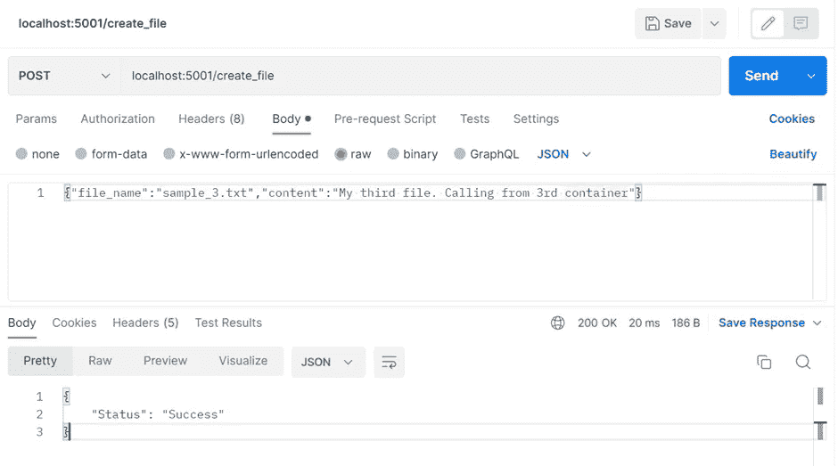
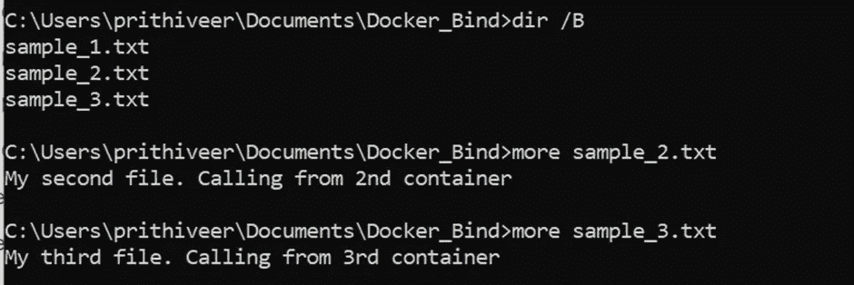
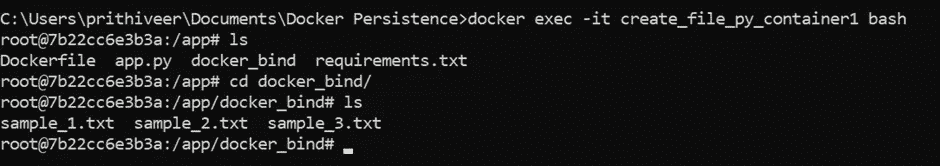
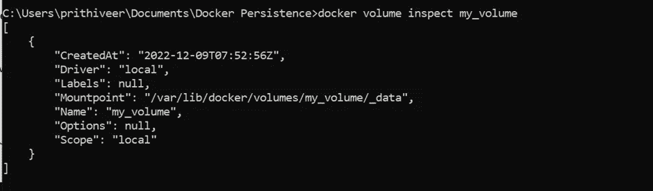
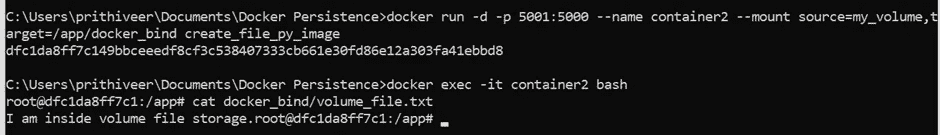
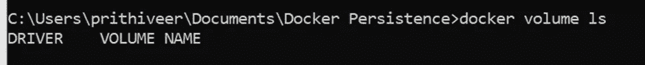
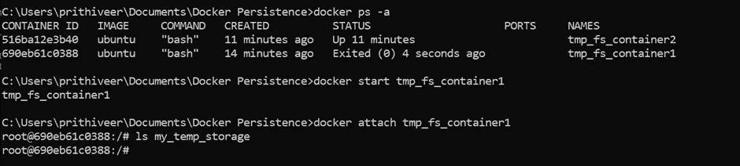
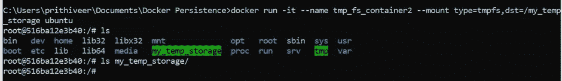
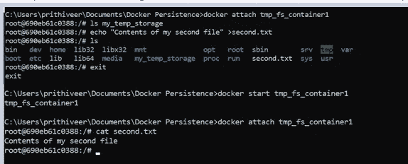

# Docker 中的持久存储指南

> 原文：<https://pub.towardsai.net/a-guide-to-persistent-storage-in-docker-74a50d26a2a1?source=collection_archive---------1----------------------->

## 绑定装载、卷和临时文件存储装载

# Docker 中持久存储的需求是什么？

应用程序生成两种数据，持久的和非持久的。非持久数据可以忽略，它们不必保存在任何地方。另一方面，需要保存持久数据以备将来使用；无论如何都不能丢。如果应用程序作为一个容器托管，持久数据必须可以被多个容器访问，因为它们共享负载和存储。数据必须是持久的，与容器的状态无关。既然我们已经理解了持久化数据的需要，那么让我们看看数据是如何存储在容器中的。

容器由多个层组成，容器内的文件存储在可写层中。只要容器存在，数据就只能持久化，这意味着当容器被删除时，其中的所有数据都将丢失。这存在以下问题，

1.  另一个容器很难访问该容器中存在的数据。
2.  因为容器的可写层与主机紧密耦合，所以很难将数据移动到不同的系统。

为了解决这个问题，docker 提出了两种持久存储的方法，卷和绑定挂载。Docker 还支持内存用例的临时文件存储。

> 在本文中，我们将学习不同的持久存储选项、它们的实现、它们的用例以及代码示例。


由[约翰·萨尔维诺](https://unsplash.com/@jsalvino?utm_source=medium&utm_medium=referral)在 [Unsplash](https://unsplash.com?utm_source=medium&utm_medium=referral) 上拍摄

# 目录

> 1.代码走查
> 
> 2.绑定安装
> 
> 3.卷
> 
> 4.临时文件存储装载
> 
> 5.结论

# 1.代码走查

对于本文，我们以一个简单的 python 应用程序为例，该应用程序将文件名和文件内容作为参数，并创建具有指定内容的文件。这个应用程序的源代码可以在[这里](https://github.com/Prithivee7/Docker-Fundamentals/tree/main/Docker%20Persistence)找到。

```
from flask import Flask, request
import os

app = Flask(__name__)

if not os.path.exists("docker_bind"):
    os.makedir("docker_bind")

@app.route("/create_file",methods=["POST"])
def run():
    data = request.get_json()
    file_name, content =  data['file_name'], data['content']
    file_path = f"docker_bind/{file_name}"
    with open(file_path,'w') as write_file:
        write_file.write(content)
    return {"Status":"Success"}

app.run(debug=False,host='0.0.0.0',port = 5000)
```

要将这个应用程序作为容器运行，先决条件是 docker 必须安装。安装 docker 后，打开命令提示符并执行以下命令。所有命令的列表可以在[这里](https://github.com/Prithivee7/Docker-Fundamentals/blob/main/Docker%20Persistence/docker%20commands%20for%20persistence.txt)找到。

**构建容器。**

```
docker build -t create_file_py_image .
```

来运行容器。

```
docker run --name create_file_py_container -p 5001:5000 create_file_py_image
```

运行上述命令后，我们可以打开 postman，向正在运行的容器发送一个请求，以文件名和内容作为参数。应用程序接受参数，用指定的名称和内容创建文件，并返回状态 success。我们将使用相同的代码来解释卷和绑定装载。



按作者排序的图像—向容器发送请求

# 2.绑定安装

> 2.1 什么是绑定挂载？
> 
> 2.2 创建绑定挂载。
> 
> 2.3 多个容器访问同一个绑定挂载。
> 
> 2.4 演示绑定挂载的持久性。
> 
> 2.5 我们可以在哪里使用绑定挂载

## 2.1 什么是绑定挂载？

绑定挂载用于持久化，从 docker 早期就有了。当我们使用绑定装载时，主机上的目录被装载到容器中。在绑定挂载中，目录由我们管理，而不是由 docker 管理。

绑定挂载也有一点缺点，因为容器能够在主机操作系统中修改、删除和创建资源。如果非 docker 元素需要访问 mount 文件夹，就必须引起注意。

## 2.2 创建绑定挂载

mount 标志用于表示我们需要的持久性类型。它可以是 bind、tmpfs 或 volume。在本例中，我们将其设置为 bind。为了创建绑定挂载，我们需要显式地提供源路径。它必须是绝对路径，而不是相对路径。源路径是主机中的路径。同样，我们需要提供目标路径。这是我们想要挂载的容器内部的路径。

```
docker run -d -it -p 5000:5000 --name create_file_py_container1 --mount type=bind,source="C:\Users\prithiveer\Documents\Docker_Bind",target=/app/docker_bind create_file_py_image
```

使用上面的命令，将创建一个容器。我们从 Postman 发送了一个请求，创建一个名为“sample_1.txt”的文件，内容为“我的第一个文件”。如下所示，我们可以在容器中使用 exec 并找到我们创建的文件。


按作者分类的图像-使用 create_file_py_container1 创建文件

## 2.3 多个容器访问同一个绑定挂载

在现实生活中，一个应用程序将被托管在多个容器中，我们要求将它们挂载到一个绑定挂载上。因此，出于演示的目的，我们又创建了两个容器。

```
docker run -d -it -p 5002:5000 --name create_file_py_container2 --mount type=bind,source="C:\Users\prithiveer\Documents\Docker_Bind",target=/app/docker_bind create_file_py_image

docker run -d -it -p 5003:5000 --name create_file_py_container3 --mount type=bind,source="C:\Users\prithiveer\Documents\Docker_Bind",target=/app/docker_bind create_file_py_image
```

像第一个容器一样，我们从容器 2 和容器 3 发送请求，并分别生成文件 sample_2.txt 和 sample_3.txt。在创建绑定挂载时，我们提供了一个源地址。我们可以在指定位置的容器中找到我们创建的所有文件。类似地，我们还可以在所有 3 个容器的 docker_bind 文件夹中找到所有文件，而不考虑每个容器创建的文件。



按作者分类的图像—源文件夹包含在 3 个容器中创建的所有文件

## 2.4 演示绑定挂载的持久性。

为了演示持久性，我们删除了所有 3 个容器并再次创建它们。因为当我们删除容器时，数据被写入可写层，所以容器中的所有数据都将丢失。但是由于绑定挂载，我们将能够看到所有创建的文件。



按作者排序的图像—再次创建容器并找到之前创建的文件

## 2.5 我们可以在哪里使用绑定挂载？

当我们确信主机的目录结构将保持一致时，我们可以使用绑定装载。它还可以用于将配置文件从容器共享到主机。

# 3.卷

> 3.1 什么是卷？
> 
> 3.2 创建卷并将其装入容器。
> 
> 3.3 多个容器访问同一个卷。
> 
> 3.4 用体积证明持久性。

3.5 我们可以在哪里使用卷？

## 3.1 什么是卷？

卷是处理持久文件存储的首选方式。卷基本上是绑定装载，除了 docker 管理主机上的存储。因此，您不必知道文件或目录的完全限定路径。

1.体积与容器无关。

2.它们可以映射到外部存储

3.多个容器可以访问同一个卷。

## 3.2 创建卷并将其装入容器。

卷是 docker 中的一级对象。它可以显式创建，也可以在装载容器时动态创建。在安装过程中，docker 会检查卷是否可用，如果不可用，它会创建一个卷。

显式创建卷

```
docker volume create my_volume 
```

装载时创建卷

```
docker run -d -p 5000:5000 --name container1 --mount type=volume, source="my_volume", target=/app/docker_bind create_file_py_image
```

使用上面的命令，我们创建一个名为 container1 的容器，端口为 5000。使用设置为 type volume 的装载标志类型，我们将“my_volume”装载到容器中。源将具有卷的名称，而目标将是容器内部需要连接的文件夹。当我们在挂载后发送请求时，文件在 docker_bind 文件夹中创建，并保存在我们创建的卷中。

列出卷并检查它

```
docker volume ls
docker volume inspect my_volume
```

如果我们需要检查文件在卷中的保存位置，我们可以使用 inspect 命令。这将返回挂载点位置和元数据。在/app/docker_bind 中生成的所有文件都可以在/var/lib/docker/volumes/my _ volume/_ data 位置找到。



作者检查卷的图像

## 3.3 多个容器访问同一个卷。

```
docker run -d -p 5002:5000 --name container2 --mount type=volume, source="my_volume", target=/app/docker_bind create_file_py_image
.
docker run -d -p 5003:5000 --name container3 --mount type=volume, source="my_volume", target=/app/docker_bind create_file_py_image
```

现在，容器 1、容器 2 和容器 3 正在访问同一个卷。因此，由所有 3 个容器创建的文件将驻留在同一个卷中。

## 3.4 用体积证明持久性。

我们向 container1 发送一个请求，创建一个名为 volume_file.txt 的文件。在内容中，我们写道，“我在卷文件存储中”。该文件将在 container1 的 docker_bind 文件夹中创建。然后会复制到我的 _volume。为了演示持久性，我们删除了 container1。之后，我们执行 container2 并检查 volume_file.txt 是否存在。正如我们在下图中看到的，我们能够显示 volume_file.txt 的内容，它是在 container1 中从 container2 创建的。这证明了体积的持久性。



作者提供的图片——展示卷的持久性

## 3.5 我们可以在哪里使用卷？

1.  当我们希望将数据存储在远程主机或云提供商而不是本地存储时，可以使用卷。

2.卷可用于从一台 Docker 主机向另一台迁移、创建备份或恢复数据。我们可以停止正在运行的容器，并从挂载路径目录中获取数据。

# 4.临时文件存储挂载(tmpfs)

> 4.1 什么是临时文件存储挂载？
> 
> 4.2 创建临时文件存储。
> 
> 4.3 演示临时文件存储中的“临时”。
> 
> 4.4 演示内存中属性。
> 
> 4.5 我们可以在哪里使用临时文件存储？

## 4.1 什么是临时文件存储挂载？

顾名思义，临时文件存储挂载不会永久存储数据。它们本质上是短暂的。它们是内存中的文件存储。任何其他容器都不能访问它们，一旦容器关闭，信息就会丢失。对于 tmpfs，不会创建任何卷。



按作者分类的图像—创建 tmpfs 不会创建卷

## 4.2 创建临时文件存储。

为了创建临时文件存储，我们需要将挂载标志设置为类型 tmpfs。执行以下命令后，将创建一个名为 my_temp_storage 的文件夹。

```
docker run -it --name ubututu_container1 --mount type=tmpfs,dst=/my_temp_storage ubuntu
```

在创建临时文件存储之后，我们可以在 tmpfs 目录中创建一个文件，在这种情况下，它将是 my_temp_storage。

```
echo "This is my file in temporary file storage" > my_temp_storage/logs.txt
```


按作者分类的图像—在 tmpfs 中创建文件

## 4.3 演示临时文件存储中的“临时”。

为了演示临时文件存储的短暂行为，我们停止 ubututu_container1 并再次启动它。这样做之后，我们会发现我们之前创建的文件(logs.txt)不再存在了。这是因为 tmpfs 不持久存储数据。



作者提供的图片——演示 tmpfs 的短暂行为

## 4.4 演示内存中属性。

在解释绑定装载和卷时，我们创建了多个容器来展示数据是如何持久存储的。但是对于 tmpfs，我们不能这样做，因为它是内存中的属性。这意味着一个容器的 tmpfs 文件夹中的文件不能被另一个容器访问。



作者提供的图片—展示内存中的属性

Tmpfs 不同于将文件保存在不同的位置。在 tmpfs 的情况下，当我们停止或退出容器时，信息会丢失。但在任何其他位置，如果我们停下来，启动容器，我们将能够找到文件。



按作者分类的图片—展示普通文件夹和 tmpfs 文件夹之间的差异

## 4.5 我们可以在哪里使用临时文件存储？

当我们不希望数据同时保存在容器和本地系统中时，最好使用 Tmpfs 挂载。它们用于存储与安全相关的信息，比如一旦容器关闭就需要过期的令牌。这也提高了容器的性能。

# 5.结论

在本文中，我们学习了 Docker 提供的不同类型的持久存储选项、它们的用例以及它们的实现。这些选项保证了一旦容器被移除，数据不会丢失。如果你不确定选择哪一个，就选卷。在绑定挂载的情况下，我们必须提供挂载的位置，但是在卷的情况下，docker 会为我们处理这个问题。对于敏感数据，我们可以使用临时文件存储，但我们必须小心，因为它们是短暂的。

# 参考

1.  [管理 Docker | Docker 文档中的数据](https://docs.docker.com/storage/)
2.  [Docker 卷解释(PostgreSQL 示例)— YouTube](https://www.youtube.com/watch?v=G-5c25DYnfI&t=105s)
3.  [(7384)Docker 中持久存储选项介绍— YouTube](https://www.youtube.com/watch?v=YV78PJ-o9w0)

# 想要连接吗？

如果你喜欢这篇文章，请关注我[这里](https://medium.com/@getprithivee)关于机器学习和计算机科学的更多故事。

linked In—[Prithivee Ramalingam | LinkedIn](https://www.linkedin.com/in/prithivee-ramalingam-032b42110/)