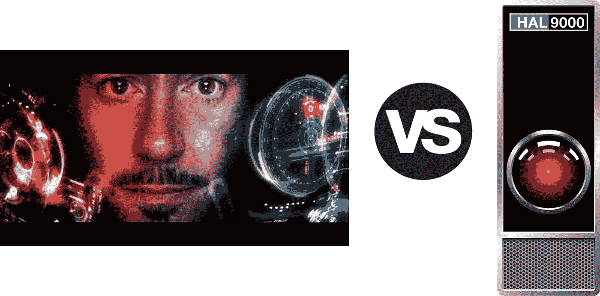

# 人工智能助手——贾维斯对哈尔

> 原文：<https://pub.towardsai.net/a-i-assistants-jarvis-vs-hal-8c3f62472ed?source=collection_archive---------2----------------------->

版权所有漫威影业有限责任公司和斯坦利·库布里克

## 一场 AI 助手| [对 AI](https://towardsai.net) 的战斗

## *看看是什么造就了一个伟大的人工智能助手和测试项目*

*作者* [*丹·洛维*](https://medium.com/u/ebffc7c8877?source=post_page-----8c3f62472ed--------------------------------)*[*乔纳森·B*](https://medium.com/u/edcaf69c2799?source=post_page-----8c3f62472ed--------------------------------)*[*布里亚纳·布朗内尔*](https://medium.com/u/74842fb1df6a?source=post_page-----8c3f62472ed--------------------------------) *，以及* [*罗杰·桑福德*](https://medium.com/u/8ac42c72302b?source=post_page-----8c3f62472ed--------------------------------)**

**专家和未来学家一直在描绘一幅画面，人们拥有虚拟助手，让他们摆脱单调乏味，专注于他们生来要做的事情。一旦琐事的负担从你肩上卸下，你会更有创造力、更有效率、更快乐。**

**这到底意味着什么？我们如何构建它？我是一个团队的成员，该团队参与了一个项目，试图在一个特定的行业中做到这一点。稍后会详细介绍。我们一直在思考，让虚拟助理有价值的关键核心问题是什么。**

**每当我想到未来的技术，我经常会从科幻小说中寻找发人深省的模型。这里有两个比较受欢迎的。**

**托尼·斯塔克的贾维斯— 拥有一个虚拟助手(带着英国口音),帮你摆脱操作技术的所有苦差事，这不是很好吗？需要设置新的服务器吗？就这么说吧。它会提出正确的问题，并忠实地执行。它在实验室里帮助你，穿着你的超级英雄服和你在一起。**

**2001 年的哈尔——现在哈尔已经超越了贾维斯模式。他已经得到了宇宙飞船的钥匙。在凶杀案发生之前，这种方法一直很有效。在电影中，他被称为船员中的一员。哈尔没有被指示做任何事。他履行自己的职责，并作为团队的一员与同路人互动。**

**无论我们是在构建 Jarvis 还是 HAL，我们需要定义的核心原则是什么？**

**我们相信，虚拟助手的发展将沿着两个方向推进:交易型和反应型**

# **交易→关系**

**今天，我可以对着手机说话，询问诸如“玻利维亚的国内生产总值是多少？”我会得到一个我绝对信任的答案。我有一个语音操作的助手，它可以让我了解大多数人类知识的任何基本事实。大多数发电厂自动化程度很高，可以远程开关。这些都侧重于理解、优化和执行单个事务。这是贾维斯的核心。**

**这方面的发展是从关注单个交易到关注交易之间的关系的转变。正是这些微妙的关系才是关键。例如，IBM Watson 吹嘘其在赛百味(子连锁店)上的成功。沃森观察天气模式，并利用这些信息在当地商店制作菜单和调整价格。**

**我们是交易系统的大师。我们需要关注关系的模式和复杂性。有些是显而易见的，有些是微妙和隐藏的。这个关系维度超越了数据，扩展到了与用户的关系。随着我们越来越远离纯粹的交易，与人之间微妙的关系变得越来越重要。**

# **被动→主动**

**贾维斯非常被动。托尼·斯塔克下达了命令，贾维斯立即行动起来。挑战在于如何从纯粹的被动模式转变为你的助手主动做事的模式。就像哈尔管理你的宇宙飞船(一旦我们克服了杀人倾向)，这是一个巨大的飞跃。给我带来信息或者为我做我没有要求的事情。助理算出来了。事情在后台发生，信息根据需要出现。如果你曾经有过一个真正伟大的助手，那就是他们伟大的原因。**

****

# **侍者和门房**

**一个旅馆侍者和一个门房在这两个光谱的两端。一个行李员是高度反应性和完全事务性的。把这些手提箱带到 857 房间。给我拿些汤来。适用于行李员的所有命令。**

**一个门房参与了一个对话，“你想看什么样的表演？”一家新餐馆刚刚开业，我想你会喜欢的。一个优秀的礼宾员了解他们的顾客并创造一种体验。我看到你来了，就提前在一家我想你会喜欢的餐馆订了桌。我们重视一个理发师胜过另一个，一个机械师胜过另一个，一个牙医胜过另一个，因为我们信任他们。我们一开始只是根据它们的外部特征来选择它们。我们和他们在一起，因为我们相信他们会为我们做正确的事。**

**让我们看看实现这些转变所需的细节。**

**预测——引用约吉·贝拉的话，“很难做出预测，尤其是对未来的预测”。沿着这些维度前进将需要越来越复杂的预测引擎。谷歌地图对驾驶时间的估计相当不错，但并不复杂。沃森的地铁天气系统是一个更加复杂的引擎。有些系统一直在做预测。新的人工智能技术可以筛选数据，看到模式，并产生令人震惊的预测。这里的飞跃不仅仅是做出和报告预测*，而是将预测构建到结构中*。这意味着它一直开着，一直在思考。**

****提供规范性建议。**最近，一位朋友在描述，如果你没有网络广告的背景，建立一个 Google Adwords 活动是多么具有挑战性。你面临着许多选择，而这些选择的后果是你感觉不到的。一个真正有价值的助手会提出建议，或者更好的是，在没有指导的情况下简单地执行行动(当然，在某种程度上，这就是 Hal 9000 如何让船员消失的)。没有这一点，系统会随着复杂性的增加而陷入困境。**

**寻找相关的机会。除了效率和自动化，还有增长。告诉我我不知道的。带给我意想不到的东西。这是最具挑战性的方面。你可以想象使用更传统的机器学习技术来帮助进行预测是一个特定的领域。从一个特定的领域中挣脱出来，并在其他领域中为你找到一些东西，这需要一套新的技术和工具来发明。让我们使用人工智能和机器学习技术来发现我可能永远不会想到的可能机会。**

# **让我们建造一些东西**

**正如我之前提到的，我们正在为一个特定的行业，广告，建立一个虚拟助手。我们专注于广告的一个方面；视频广告的制作和投放。**

**广告已经变得由技术驱动，并且越来越复杂。虚拟助理方法的时机已经成熟。**

**用这些想法作为我们的标准**

*   **交易→关系**
*   **被动→主动**
*   **预言性的**
*   **说明性建议**
*   **寻找相关机会**

**我们正在为这些观众设计一个虚拟助手。这是一项正在进行中的工作，可以说是隐形模式，所以我只能用一些我们正在考虑的方式来设计这个助手。**

# **AI 焦点小组**

**人们对信息的感受是广告的核心。这种反馈通常是通过访谈或焦点小组获得的。现在可以使用现代情感分析技术来解决这个问题。梳理堆积如山的社交媒体内容并提取模式是可能的。我们正在考虑应用最新的视频反应人工智能。**

**我们不是创建一个单独的工具，而是让我们的助理能够访问这一功能，并能够在后台收集这些信息。作为媒体创作过程的一部分，在整个媒体规划和反馈过程中，机器人助手将让它的机器人手指掌握观众的脉搏。这里的飞跃是*将当前的知识和最终的预测构建到结构中*。这将工具从一个命令驱动的事务实用工具变成了一个可以持续通知整个过程的工具。我们认为这让我们从侍者晋升为礼宾员。**

# **媒体策划**

**40 年前，在大多数媒体战略家诞生之前，你有 3 个主要网络和尼尔森人口路线图，媒体规划是非常不同的。如今，受众遍布各种习惯、网络和设备。他们随时随地想看什么就看什么。我们也有更多关于每个观众的信息。**

**我们正与合作伙伴一起，努力将这些数据传播到这个领域，并找到合适的受众。我们的助理成为越来越好的媒人。像网飞电影推荐引擎一样，它会根据在哪里找到观众的结果和分析不断改进。在我们的模型中，我们的助手不是在问，“告诉我该做什么。”它在问，“告诉我你想要什么。”**

# **自动化执行**

**有一个庞大的连锁系统和界面网络来管理广告的投放。在这里，我们需要像贾维斯这样的人来处理这一切。有许多供应商支持广告的实际投放和结果报告。每一个都在与另一个进行军备竞赛，创造出越来越复杂的工具。**

**贾维斯应该能利用幕后的所有信息。例如，我真的不想与所有的交易台、实时竞价和供需合作伙伴打交道。我有我的计划，我的助手应该能执行它。我们将通过与主要平台的合作来做到这一点，我们将自动化这些交互。**

# **出色的反馈**

**就我个人而言，我已经厌倦了一切面前的“聪明”这个词。我们期待结果的反馈会非常精彩。我们不希望生成枯燥、花哨的图表报告，而是希望结果能够将信息反馈到其他阶段，这样我们的虚拟助手就会越来越好。**

**除了反馈到其他阶段，接口本身也很重要。我们并不总是希望我们的门房告诉我们他们是如何想出他们的推荐的(除非它是关闭的，我们问他们为什么选择它)，我们只是希望推荐是清晰的，并且一直在变得更好。我在想，谷歌搜索栏的简单界面刚出来的时候是多么的强大。它看起来特别神奇，因为它将生成答案的所有工作隐藏在幕后，只是呈现答案。如果媒体计划自动使用以前活动的结果来不断改进其推荐，这将是多么令人惊讶啊！如果它能提供创造性的建议呢？**

**伟大的助手总能让复杂的世界变得更容易管理。我们的希望是，我们已经找到了一些创造新型自动化助手的核心原则。我们将这些首要原则应用于人类复杂的特定行业——广告业。**

**敬请关注。**

***丹·洛维是 SIMC 的执行董事***

***Jonathan Bissell 是圣马特奥县社区学院区社区、继续和企业教育的执行主任***

***布里亚纳·布朗内尔是 Pure Strategy Inc .的创始人兼首席执行官***

**罗杰·桑福德是 Crunch Mediaworks 的项目专家**