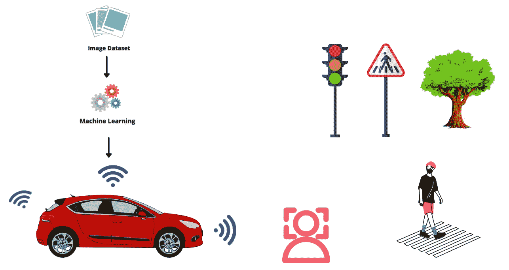
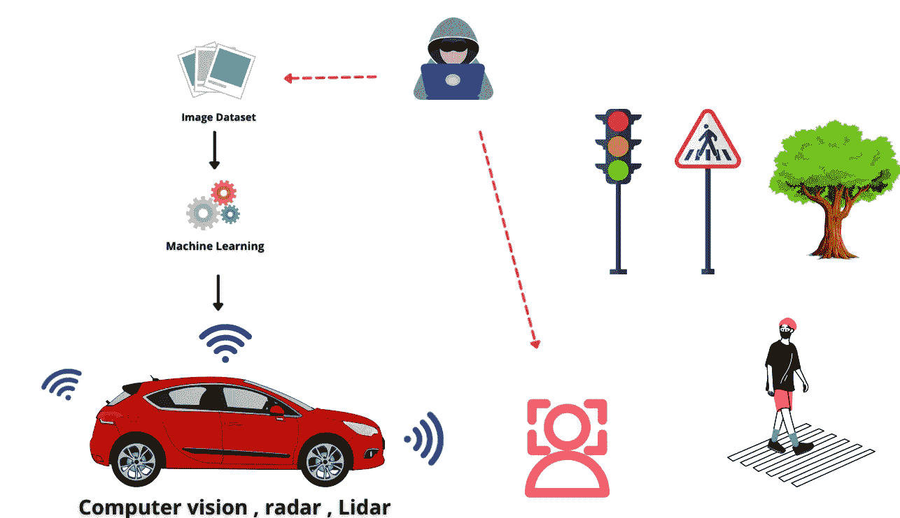
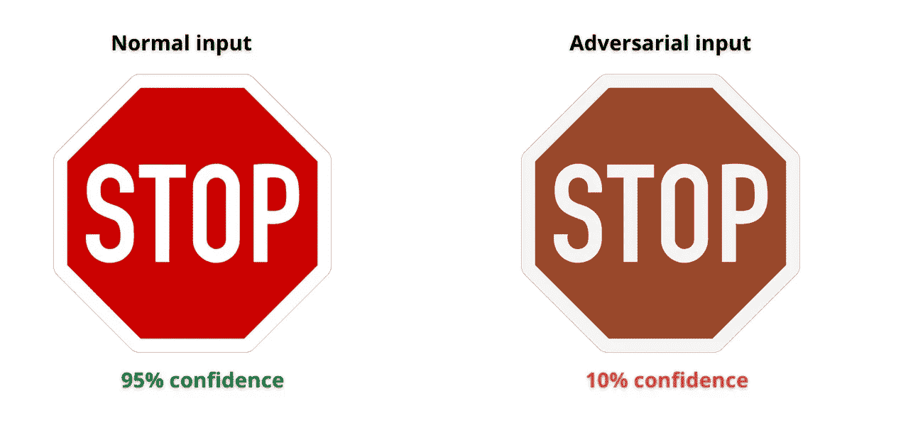

# 人工智能对自动驾驶车辆的攻击

> 原文：<https://pub.towardsai.net/a-i-attacks-on-self-driving-vehicles-df5b4d7968d6?source=collection_archive---------5----------------------->

## 新型人工智能攻击可能会在现实生活中产生后果。

Samuele Errico Piccarini 在 [Unsplash](https://unsplash.com?utm_source=medium&utm_medium=referral) 上的照片

在早先的一篇文章中，我讨论了[基于人工智能的攻击](/welcome-to-the-new-era-of-cyber-fraud-powered-by-deepfakes-46682ad9f942)是一种新型的威胁，目前正在大多数网络安全团队的雷达下飞行。

鉴于大多数人工智能系统的关键性质，这些攻击可能会对人们的生活产生潜在的改变，这就是为什么理解和减轻这些威胁如此重要。

今天，我想通过一个自动驾驶汽车的例子来关注人工智能系统可能如何受到威胁以及网络犯罪分子可能造成的破坏。

# 自动驾驶汽车

自动驾驶汽车或自动驾驶汽车是人工智能的最大应用之一，据称可以在一段时间内慢慢将人类从驾驶座上移开。

> “自动驾驶汽车(有时被称为*自动驾驶汽车*或*无人驾驶汽车*)是一种结合了传感器、摄像头、雷达和人工智能(AI)的车辆，可以在没有人类操作员的情况下在目的地之间行驶。”——
> 
> tech target at[https://www . tech target . com/search enterprise ai/definition/无人驾驶汽车](https://www.techtarget.com/searchenterpriseai/definition/driverless-car)

这些汽车将被设计成通过感知环境并做出由人工智能驱动的智能决策来做人类可以做的一切。

基于人工智能的车辆运行在机器学习上，机器学习建立了它们根据提供给它们的数据做出决策的能力。就像人类学习驾驶并随着时间的推移变得越来越好一样，机器学习算法获得的数据越多越好。

该算法被训练来识别停止标志、车辆、行人、道路标记等。，当到达目的地时，基于该信息采取行动。

来源:作者

这些汽车预计比手动驾驶的故障率更低，但像任何电动技术系统一样，存在网络安全风险，这可能比得到驾驶罚单更致命！

# 对自动驾驶汽车的攻击

如前所述，自动驾驶车辆由人工智能系统驱动，这些系统持续工作，以评估其环境并识别障碍和人类，并规划到达目的地的最佳路径。

除了存在的标准威胁，如不安全的操作系统、基础设施、组件等。有特定的基于人工智能的攻击可以篡改这些汽车的工作。

欧盟网络安全局(ENISA)最近的一份报告关注了自动驾驶汽车的网络安全风险，以及如何减轻这些风险。

## **1-危及人工智能供应链**

人工智能模型和用于训练自动驾驶的数据集可能会被网络犯罪分子污染或“毒害”，类似于供应链攻击。大量的人工智能模型是预先训练好的，然后被导入到一个组织的环境中，攻击者可以潜在地污染它们，作为未来的后门。

通过毒害机器学习模型正在被训练的数据；汽车可能会对周围环境中的物体进行错误分类，从而导致事故以及对生命和财产的严重损害

来源:作者

## **2 —通过对抗性输入规避模型:**

通过稍微修改环境，网络罪犯就有可能“欺骗”这个模型。例如，在停止标志上绘画和在道路上涂鸦会导致基于人工智能的系统做出错误的决定。“对抗性输入”是攻击者由于逃避机器学习模型而采用的一种技术，尤其是在涉及计算机视觉的情况下。通过稍微操纵人工智能系统的输入，攻击者可以产生完全不同的输出。

> 这种精心制作的图像“噪声”不会被人类注意到，但会导致人工智能完全将特定的输入重新分类为不同的对象，这可能会导致严重的问题。

下面是一个例子，由于颜色的微小变化，图像识别系统可能会将停车标志分类错误。

# 如何应对这些威胁

该报告详细介绍了可以实施的缓解措施，其中许多措施可以应用于几乎任何人工智能系统。良好的网络安全卫生有一个标准，例如进行风险评估，并确保安全设计是系统的重要组成部分，等等。

其他的是人工智能系统特有的，如下所示:

*   **定期评估人工智能模型和输入到模型中的数据，以确保其未被更改或改变**
*   **对供应链进行彻底审查**，包括第三方供应商，以确保供应链中没有薄弱环节
*   安全测试和渗透测试专门针对人工智能系统和攻击。点击阅读更多信息
*   开发人员和专业人员对人工智能网络安全的了解越来越多，这是一个主要障碍，也是引入风险的原因。我之前写过关于如何威胁建模 AI 系统的文章，你可以在下面阅读。

 [## 威胁建模人工智能和机器学习系统

### 使用威胁建模识别人工智能和洗钱风险

towardsdatascience.com](https://towardsdatascience.com/threat-modeling-a-i-and-machine-learning-systems-8c1c6b86eb21) 

以上只是对报告条款的快速总结，如果你想了解不保护 AI 的一些现实影响，这绝对值得一读。

**祝你的人工智能之旅好运！**

> 我希望你喜欢读这篇文章。如果你觉得这个话题很有趣，可以看看我关于[人工智能治理和网络安全](https://cloudsecguy.gumroad.com/l/aigovernance/1tojq7p?_gl=1*14yiflk*_ga*NzkyMjgyNDkyLjE2NjQxNzQ0MDc.*_ga_6LJN6D94N6*MTY2NTU1NDIxMC4xNjcuMS4xNjY1NTU0MjIxLjAuMC4w)的打折课程，该课程讲述了新型人工智能风险以及如何减轻它们。

 [## 通过我的推荐链接加入 Medium—tai mur Ijlal

### 阅读 Taimur Ijlal(以及媒体上成千上万的其他作家)的每一个故事。您的会员费直接支持…

taimurcloud123.medium.com](https://taimurcloud123.medium.com/membership)