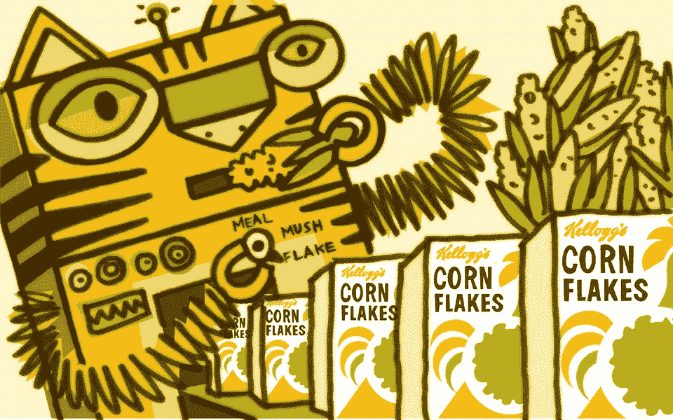
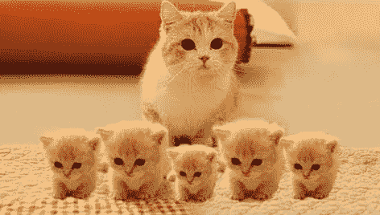
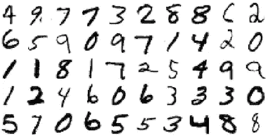

# 让人工智能为广告服务

> 原文：<https://pub.towardsai.net/a-i-in-advertising-5c6b5b7dba3a?source=collection_archive---------4----------------------->

## 在广告行业实现 AI |[走向 AI](https://pub.towardsai.net)

## 在野外散步

你是一名数字广告专业人士。你要么拥有，要么能接触到大量的信息，希望这些信息能帮助你在正确的时间把正确的信息传递给正确的人，而不会因为你似乎对他们了解多少而吓到他们。

你也敏锐地意识到媒体世界正在发生什么。与此同时，我们对人工智能如何被用来在海滩上的照片中认出你的朋友，或者你如何使用手机询问最近的披萨店感到惊讶和自满。

人工智能觉得这应该是一个很好的工具来增加你的营销武库。基本原理非常简单明了。以同样的模式识别技术为例，它可以识别照片中的小猫，并根据行为数据对其进行分析，然后观察会出现什么。我们已经看到了其他模式识别应用的成功，这些应用产生了令人印象深刻的结果，如医疗诊断或玩危险游戏。这些技术在寻找信息海洋中的模式方面变得越来越好。然而，在前进的道路上有一些障碍需要克服。这里有三个重要的:炒作，厂商锁定，无帧率。

**炒作** 天网来了！我们都要失业了！这比火还大！许多公司都在人工智能上下了大赌注，包括你在广告业的许多更大的竞争对手。所有酷孩子都在这么做。如果你没有完全接受这一切，你会害怕落后。不要误解我，这里有巨大的潜力，但我们正在应对炒作的迷雾。伟大的演示，但粗略的结果。这一切都是如此新颖，感觉如此重要，但你如何真正让它成为一个广告工具，每个人都在大喊大叫？这非常令人兴奋，但这也是在游戏的早期，很难知道什么是正确的第一步。

厂商锁定公司在他们的产品中加入人工智能魔法是为了让你锁定他们的解决方案。他们这样做的原因很明显。然而，我们在这项技术的开发上还为时过早，无法锁定具体的供应商。有些人声称能够整合第三方数据。虽然这可能是真的，但它仍然会让你陷入他们的思维方式和方法中。

无帧率
SMPTE(电影和电视工程师协会，为我们提供标准电视彩条的好人)成立于 1916 年，当时电影正被发明出来。他们在 1917 年的第一个标准是播放电影的帧率(每秒 24 帧)。数字广告业务充满了这样的技术标准；显示横幅尺寸、VAST、OpenRTB 等。人工智能数字营销标准尚未出现。我如何有效地衡量和比较结果？我如何将从一家供应商那里学到的东西应用到所有供应商身上？我可以混合搭配解决方案吗？这些都是需要回答的问题，才能把它变成真正的商业和营销工具。

**问题:广告未来学家要做什么？
回答:采取 21 世纪的方法**

技术发展今非昔比。在 21 世纪，事情是这样的。创造一些真正酷的东西，把它送给别人，鼓励和支持尽可能多的人使用你酷的东西，在未来赚钱。这正是谷歌正在用他们的人工智能工具 TensorFlow 做的事情。它是完全免费和开源的。Google now 很乐意向你出售云服务来运行你的模型，并为你的硬件应用提供定制芯片。你能想象微软在 80 年代放弃 DOS 吗？

下面是要做的前两件事。

**1)免费把数据** 一饮而尽，这对于做数据生意的人来说是非常可怕的。然而，它必须以尊重所有权和价值的安全方式来完成，但它必须完成。整体将大于部分之和。

作为人工智能，这非常重要，机器学习需要数据和大量数据。在其他人工智能分支机构，有标准的数据库可用于建立训练模型和评估结果。例如，ImageNet 是一个超过 1400 万分类图像的集合，用于帮助训练和测试图像识别系统(是的，有很多小猫)。

广告需要相当于 ImageNet 的东西，一个足够大的数据集，可以进行独立的研究和验证。没有它，我们就停留在 20 世纪。

这种信息需要来自各种来源、方法和途径。在挂毯上看到图案需要许多不同颜色的线。释放数据使人们能够:

*   尝试不同的机器学习模型进行研究
*   根据这些模型测试和训练他们的数据
*   向该数据集添加数据以改进它
*   访问和扩展他人的作品

这可以通过尊重将要提出的所有问题的方式来实现。挑战不是技术性的，而是情感上的。为了更伟大的目标，需要克服恐惧。

**2)创建操场**

MNIST(改进的国家标准和技术研究所数据库)是一个包含 60，000 个手写数字样本的数据库。它用于训练和测试机器学习手写识别。每个数字书写样本的尺寸被标准化为 28×28 像素。测试的结果用百分比误差来表示。

我们的广告系统需要一套有用的标准。就像 OpenRTB 系统(让买家和卖家对广告时段出价的协议)创造了一个市场，并帮助推动了数字广告的增长一样，人工智能广告将需要一些商定的结构，以便每个人都可以一起玩。

这需要超越简单的数据存储方式。它需要变得对人工智能友好。我们的目标是提供一个平台，在这个平台上可以开发、测试和集成不同的模型和技术。想想 GitHub 做人工智能广告。

**为什么这样做？** 这需要努力。有哪些好处？

**在数据中寻找模式**。人工智能非常擅长发现人类看不到的模式。这让我们能够在每天收集的行为数据海洋中发现潜在的模式。我们可以访问显示视图、点击、网络访问、商店访问、餐馆郊游。是否有模式有待发现？机器更适合寻找的模式？

**降低研发成本，降低摩擦**。将人工智能和机器学习技术应用于缩小数据集具有挑战性，而且成本高昂。能够访问大量丰富的标准数据集来测试新模型和增加较小的集中数据集的影响，使进展成为可能。很难想象没有 MNIST 的数字识别研究。没有它，项目会变得庞大和难以管理。有了它，那些项目就容易执行了。我们提出的建议也是如此。如果没有这样的东西，测试一种新的方法，或者一种关于行为和广告的理论是非常困难的。历史表明，这种方法让几乎不可能的事情变得触手可及。

**分类**。人工智能擅长的一件事是对数据进行分类。这张图片是一只小猫吗？这是痣皮肤癌吗？以新的微妙的方式准确地将人们分组是非常有价值的。这个人有可能养猫吗？他们想买辆新车吗？基于面板数据，我们还能创造出什么样的特征呢？媒体呢？我们能更深入地了解谁在看什么以及为什么看吗？

**应用。通常很难预测研究如何转化为实际应用。我想到了两个例子。**

*实时决策*。有一个基础设施，允许根据市场力量实时做出广告决策。被认为更有价值的观众可以卖出更高的价格，这个决定在 500 毫秒内做出。如果你可以基于人工智能驱动的结果做出更好的决定呢？就像脸书可以识别你朋友的图像一样，实时竞价平台可以识别更微妙、更有价值的观众。

*人工智能辅助媒体策划*。媒体策划是艺术和科学的结合。如果有一种工具可以根据过去的数据帮助预测广告的表现会怎么样呢？给定一定的目标，它可以像网飞推荐电影一样帮助推荐。如果它能给你一个“尼尔森之前”的评级预测呢？

SIMC 和 Pure Strategy 正在召集一批广告技术专家、人工智能专家和数据创新者来创建这个平台。如果您有兴趣加入或只是想了解更多信息，请联系:

丹·洛维
丹.洛维@simc.tv

关于 SIMC-社会和互动媒体联盟。SIMC 专注于基于标准的广告技术。丹·洛维是执行董事。

关于 Pure Strategy-Pure Strategy 将人工智能引入商业分析，因此公司可以在数据收集计划上获得更好的 ROI，改善客户体验，并制造更好的产品。使用深度神经网络和机器学习，我们创建了一个个性化的人工智能来理解非结构化数据。Briana Brownell 是创始人兼首席执行官。