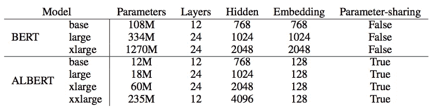
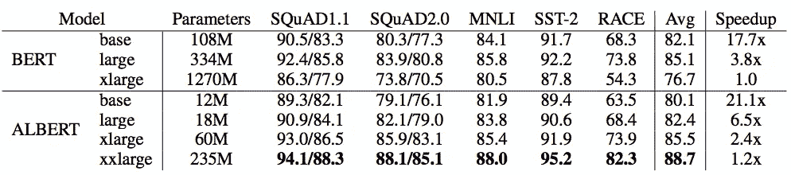
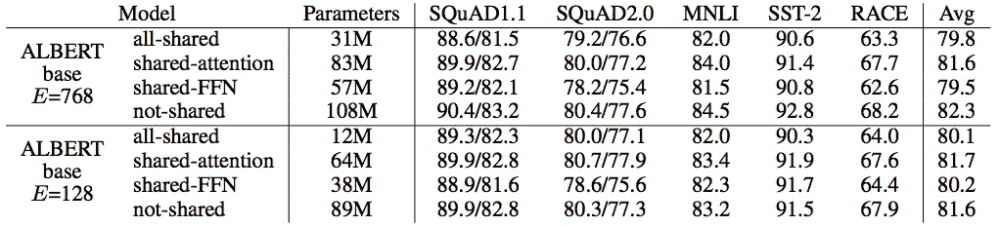
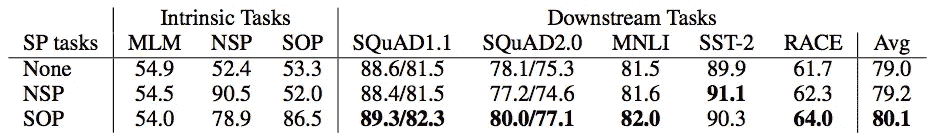
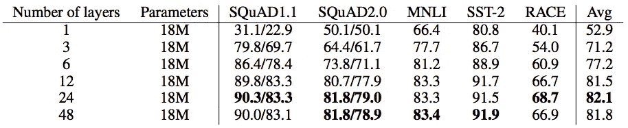
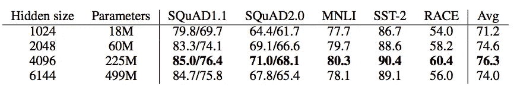
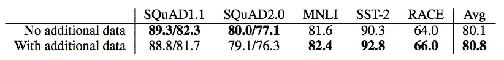
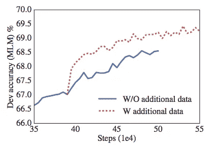
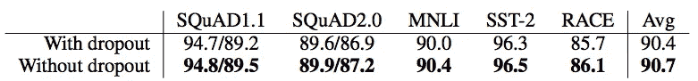
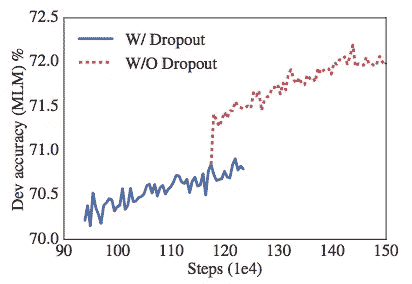

# 一个减少推理时间的 Lite BERT

> 原文：<https://pub.towardsai.net/a-lite-bert-for-reducing-inference-time-bed8d990daac?source=collection_archive---------2----------------------->

## 伯特

由 [Ksenia Makagonova](https://unsplash.com/@dearseymour?utm_source=medium&utm_medium=referral) 在 [Unsplash](https://unsplash.com?utm_source=medium&utm_medium=referral) 上拍摄

[BERT](https://towardsdatascience.com/how-bert-leverage-attention-mechanism-and-transformer-to-learn-word-contextual-relations-5bbee1b6dbdb) (Devlin 等人，2018)在 2018 年取得了许多最先进的成果。然而，在生产中使用 BERT (Devlin 等人，2018 年)并不容易，即使是小尺寸实验。BERT 的基础版本(Devlin 等人，2018 年)包括 108M 参数，而 X-Large 版本包括 1270M 参数。

由于极大数量的参数，引入了两个主要问题。首先，它需要较大的占地面积，并且由于资金问题，它可能无法在生产中轻松扩展。另一方面，与其他简单模型相比，训练和推理时间更长。

因此，不同的研究人员提出了一种减少模型足迹的方法。在这个故事中，我们将经历**一个 Lite BERT** ( `ALBERT`)(兰等，2019)

# 小伯特

`ALBERT`(兰等，2019)提出减少模型占用空间，提高模型稳健性。参数数量仅在 4.7%到 18 之间。%的传统 BERT (Devlin 等人，2018 年)，训练速度比传统 BERT (Devlin 等人，2018 年)快约 1.7 倍，而 al BERT 通过用句序预测(SOP)代替下一句预测(NSP)，实现了比传统 BERT (Devlin 等人，2018 年)明显更好的性能。

此外，Lan 等人进行了几项研究，以确定最佳超参数，如网络宽度、附加数据、漏失效应。

伯特和阿尔伯特之间的模型配置(兰等，2019)

模型间的比较(兰等，2019)

## 参数缩减

Lan 等人使用因子分解嵌入参数化和跨层共享参数技术来削减传统的 BERT (Devlin 等人，2018)。

分解嵌入参数化指的是将令牌嵌入分解成两个小的嵌入矩阵。在应用这种分解之后，嵌入参数可以从(记号数目*隐藏层大小)减少到(记号数目*记号嵌入大小+记号嵌入大小*隐藏层大小)。当隐藏层尺寸远大于令牌嵌入尺寸时(例如 1024 >> 300)，减少的比率是显著的。

较大的嵌入尺寸(下图中的 E)并不能保证较好的结果。当参数共享设置中嵌入大小为 128 时，效果最好。

改变嵌入尺寸的影响(即，Lan 等人，2019 年)

共享参数确实大大减少了参数的数量。ALBERT 被配置为跨层共享所有参数，包括前馈网络和注意力参数。

从下图中可以看出，共享所有参数比其他参数效果更好，占用空间最小。

改变参数共享的影响(Lan 等人，2019 年)

## 培训目标

除了减少参数外，Lan 等人提出用句序预测(SOP)代替下一句预测(NSP)进行自监督损失训练，以提高模型性能。

NSP 正在预测第一段和第二段是否是连续的段。几名研究人员发现，这可能不可靠，甚至是最糟糕的。蓝等推测难度太低，与掩蔽 LM (MLM)训练重叠。SOP 类似于 NSP，但它仅预测两个段是否交换。

改变培训目标的影响(兰等，2019)

## 网络深度和宽度

还是那句话，越深越好吗？Lan 等人注意到，当层数达到 48 层时，性能出现下降。

改变 ALBERT-xlarge 模型层数的影响(Lan 等人，2019 年)

宽度也是这个问题，越宽越好？与网络深度实验相同，6144 个隐藏大小的性能比 4096 个隐藏大小的性能差。

更改 ALBERT-xlarge 模型的隐藏层大小的影响(Lan 等人，2019 年)

## 附加数据

本实验的目的是评估引入额外训练数据的效果。[、](https://medium.com/dataseries/why-does-xlnet-outperform-bert-da98a8503d5b)(杨等，2019)和[罗伯塔](https://medium.com/towards-artificial-intelligence/a-robustly-optimized-bert-pretraining-approach-f6b6e537e6a6)(利特等，2019)证明，数据越多，性能越好。

更多的数据可能不会提高所有下游任务的模型性能。至少，当引入额外数据时，模型性能降级。

额外数据的影响(兰等人，2019 年)

dev 集合中附加数据的影响屏蔽了 LM 准确性(Lan 等人，2019 年)

## 脱落效应

其他研究指出，批处理规范化和丢失可能会损害下游应用程序。兰等人做了一个关于脱层效应的实验。他们发现引入辍学会损害表现。

辍学的影响(兰等，2019)

dev 集合中的丢失对掩蔽 LM 精度的影响(Lan 等人，2019 年)

# 喜欢学习？

我是湾区的数据科学家。专注于数据科学的最新发展，尤其是 NLP、数据扩充和平台相关领域。在 [LinkedIn](https://www.linkedin.com/in/edwardma1026) 或 [Github](https://github.com/makcedward) 上随时联系 [me](https://makcedward.github.io/) 。

# 延长

*   [伯特解说](https://towardsdatascience.com/how-bert-leverage-attention-mechanism-and-transformer-to-learn-word-contextual-relations-5bbee1b6dbdb)
*   [XLM 解释](https://medium.com/dataseries/why-does-xlnet-outperform-bert-da98a8503d5b)
*   [罗伯塔解释](https://medium.com/towards-artificial-intelligence/a-robustly-optimized-bert-pretraining-approach-f6b6e537e6a6)
*   艾伯特实现([张量流](https://github.com/google-research/google-research/tree/master/albert))

# 参考

*   Z.兰、陈、古德曼、金佩尔、夏尔马和索里科特。 [ALBERT:一个用于语言表达自我监督学习的 Lite BERT](https://arxiv.org/pdf/1909.11942.pdf)。2019