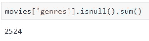
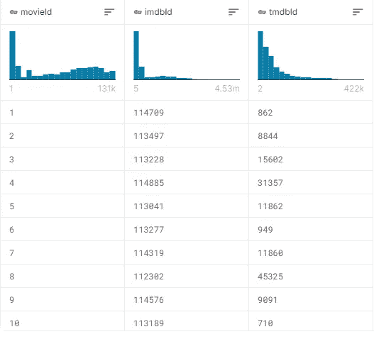
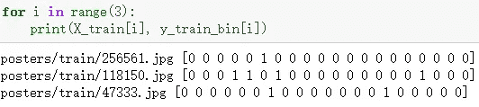
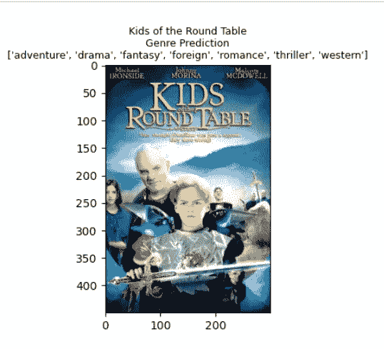

# 一个可以辨别电影类型的神经网络

> 原文：<https://pub.towardsai.net/a-neural-network-that-can-tell-the-genres-of-a-movie-6c218061e422?source=collection_archive---------3----------------------->

## [深度学习](https://towardsai.net/p/category/machine-learning/deep-learning)、[网页抓取](https://towardsai.net/p/category/web-scraping)

## 向任何推荐系统介绍新电影的方法


照片由 [Charles Deluvio](https://unsplash.com/@charlesdeluvio?utm_source=unsplash&utm_medium=referral&utm_content=creditCopyText) 在 [Unsplash](https://unsplash.com/s/photos/movie?utm_source=unsplash&utm_medium=referral&utm_content=creditCopyText) 上拍摄

***免责声明:*** *本文仅出于教育目的。我们不鼓励任何人抓取网站，尤其是那些可能有条款和条件反对此类行为的网站。*

[之前](https://towardsdatascience.com/movie-recommendation-system-based-on-movielens-ef0df580cd0e)，我用自然语言处理开发了一个电影推荐系统。它可以向这个平台的任何用户提供建议，而一个已建立的系统预计会不断地包括新电影。在本文中，我将介绍一种方法，当电影制作公司不提供电影类型信息时，该方法可以帮助推荐系统将新电影包含在数据集中。这种方法将利用计算机视觉(CV)来识别电影类型的任何信息。

# 数据收集

首先，让我们来看看 [MovieLens](https://www.kaggle.com/grouplens/movielens-20m-dataset) 数据集。我假设其列“*流派*为空的条目代表还没有被记录在推荐系统中的新出现的条目。相比之下，那些“*流派*”栏不为空的代表记录的流派。在这种情况下，我将尝试使用录制的电影作为训练集，其中将有一个模型被训练，而新来的电影作为测试集。



成千上万的电影还没有类型标签，我把它们看作是新上映的还没有标签的电影。(图片由作者提供)

下一步是相应地收集海报。在下图中，我们可以看到[themoviedb.org](https://www.themoviedb.org/)上的每一个电影 ID 都在[这个表格](https://www.kaggle.com/grouplens/movielens-20m-dataset?select=link.csv)中提供，因此可以根据它找到海报。



MovieLens 上的链接表截图(图片由作者提供)

现在，当你打开任何一页关于 themoviedb.org 的电影，我肯定你会首先注意到海报，这也是我下一步要做的。


这就是 themoviedb.org 上一部电影的主页(图片由作者提供)

这里是我们需要收集海报的东西: **scrapy** 。因此，请确保将其安装在您的虚拟环境中(如果有):

```
pip install scrapy
```

然后你需要的是创建一个新的 scrapy 项目和一个网络蜘蛛

```
scrapy startproject first_project
cd first_project
scrapy genspider movielens themoviedb.org
```

给你！现在，您应该会在工作目录中看到一个具有以下结构的文件夹:

```
first_project/
├── scrapy.cfg 
├── first_project
    ├── spiders   
        ├── __init__.py
        └── movielens.py  
    ├── __init__.py 
    ├── items.py
    ├── middlewares.py
    ├── pipelines.py
    └── settings.py
```

我们接下来要做的是让你的蜘蛛在网上抓取猎物。我把这个过程分成两步:

1.  获取海报图像的源 URLs
2.  从 URL 下载图像到本地机器。

在这种情况下，需要两个蜘蛛，因此首先，我们应该生成另一个蜘蛛应用程序:

```
scrapy genspider downloader themoviedb.org
```

然后您应该会在“spiders”目录下看到一个名为 downloader.py 的新文件。此外，两者对应的项目字段应明确定义:

```
import scrapyclass MovielensItem(scrapy.Item):
    # define the fields for your item here like:
    # name = scrapy.Field()
    id = scrapy.Field()
    poster = scrapy.Field()class DownloaderItem(scrapy.Item):
    image_urls = scrapy.Field()
    images = scrapy.Field()
```

最后，我们只需要解析网站的 DOM 树并下载它们:

*movielens.py* :

```
import scrapy
import pandas as pd
from first_project.items import First_projectItemclass MovielensSpider(scrapy.Spider):
    name = 'movielens'
    allowed_domains = ['themoviedb.org']
    start_urls = ['[https://www.themoviedb.org/movie/'](https://www.themoviedb.org/movie/')]
    movie_codes = pd.read_csv('data/movie_code.csv')['id']def start_requests(self):
        for code in self.movie_codes:
            yield scrapy.Request(url=self.start_urls[0] + str(int(code)), callback=self.parse, dont_filter=True, meta={'id': code})def parse(self, response):
        item = MovielensItem()
        item['id'] = response.meta['id']
        link = response.xpath('//div[[@class](http://twitter.com/class)="image_content backdrop"]/img/@data-src').extract_first(default='')
        item['poster'] = link
        yield item
```

在你的终端中运行***scrapy crawl movie lens-o movie-link . CSV***。这个命令将从网站获取海报图像的所有源 URL 到指定的 CSV 文件:movie-link.csv。

*downloader.py* :

```
import scrapy
import pandas as pd
from movieLens.items import DownloaderItemclass DownloaderSpider(scrapy.Spider):
    name = 'downloader'
    allowed_domains = ['themoviedb.org']
    start_urls = ['[http://themoviedb.org/'](http://themoviedb.org/')]
    posters = pd.read_csv('data/posters.csv')
    posters = posters[posters['poster'].notna()]
    movie_code = pd.read_csv('data/movie_code.csv') train_set = movie_code[movie_code['genres'].notna()]
    train_set = pd.merge(posters, train_set, left_on='id', right_on='id')
    train_set = train_set.drop(columns=['title', 'genres']) test_set = movie_code[movie_code['genres'].isna()]
    test_set = pd.merge(posters, test_set, left_on='id', right_on='id')
    test_set = test_set.drop(columns=['title', 'genres'])def parse(self, response):
        item = DownloaderItem()
        images = [] # test
        for i in range(self.test_set.shape[0]):
            img_url = self.test_set['poster'].iloc[i]
            image_name = str(self.test_set['id'].iloc[i])
            images.append({'url': img_url, 'name': image_name, 'type': 'test'}) # train
        for i in range(self.train_set.shape[0]):
            img_url = self.train_set['poster'].iloc[i]
            image_name = str(self.train_set['id'].iloc[i])
            images.append({'url': img_url, 'name': image_name, 'type': 'train'}) item['image_urls'] = images
        yield item
```

为了确保所有图像都可以下载，需要一个定义图像存储位置和方式的定制管道:

*items.py* :

```
from scrapy.pipelines.images import ImagesPipeline
import scrapy
from scrapy.exceptions import DropItemclass CustomedImagesPipeline(ImagesPipeline):
    def get_media_requests(self, item, info):
        for image in item['image_urls']:
            yield scrapy.Request(image['url'], meta={'image_name': image['name'], 'type': image['type']}) def file_path(self, request, response=None, info=None):
        if request.meta['type'] == 'test':
            return "/test/%s.jpg" % request.meta['image_name']
        else:
            return "/train/%s.jpg" % request.meta['image_name']
```

*settings.py* :

```
ITEM_PIPELINES = {'movieLens.pipelines.CustomedImagesPipeline': 1}
# storage repository
IMAGES_STORE = 'data'
```

运行 ***scrapy 爬虫下载器*** ，查看你的数据文件夹！

# 模特培训

数据清理包括两个方面:重新配置输出列和归一化图像。这个项目的输出是流派的集群，它们最初被收集在一个列表中。我将对它们进行一次性编码，从而将这个问题转化为一个多分类问题。

```
**from** **sklearn.preprocessing** **import** MultiLabelBinarizer
**import** **pandas** **as** **pd**movies = pd.read_csv('movies.csv', engine='python')
movies = movies[['id', 'title', 'genres']]

*# genre is empty, for prediction*
predict_set = movies[movies['genres'].isna()]
movies = movies[movies['genres'].notna()]movies['genres'] = movies['genres'].apply(**lambda** s: [l **for** l **in** str(s).split(', ')])
X_train, X_val, y_train, y_val = train_test_split(movies['id'], movies['genres'], test_size=0.2, random_state=42)y_train = list(y_train) 
y_val = list(y_val)mlb = MultiLabelBinarizer()
mlb.fit(y_train)y_train_bin = mlb.transform(y_train) y_val_bin = mlb.transform(y_val)
```



编码后的结果(图片由作者提供)

至于图像标准化，重点是我们必须从图像中提取特征，这可以通过解码和调整大小来实现:

```
**import** **tensorflow** **as** **tf**IMG_SIZE = 224 *# Specify height and width of image to match the input format of the model*
CHANNELS = 3 *# Keep RGB color channels to match the input format of the model***def** parse_function(filename, label):
    *"""Function that returns a tuple of normalized image array and labels array.*
 *Args:*
 *filename: string representing path to image*
 *label: 0/1 one-dimensional array of size N_LABELS*
 *"""*
    *# Read an image from a file*
    image_string = tf.io.read_file(filename)
    *# Decode it into a dense vector*
    image_decoded = tf.image.decode_jpeg(image_string, channels=CHANNELS)
    *# Resize it to fixed shape*
    image_resized = tf.image.resize(image_decoded, [IMG_SIZE, IMG_SIZE])
    *# Normalize it from [0, 255] to [0.0, 1.0]*
    image_normalized = image_resized / 255.0
    **return** image_normalized, label
```

到目前为止，我们已经准备好了最重要的阶段:模型配置。基本上我的策略就是把一个已经建立的特征提取器(*移动网*)转移到这个问题上。

```
**import** **tensorflow_hub** **as** **hub**feature_extractor_url = "https://tfhub.dev/google/imagenet/mobilenet_v2_100_224/feature_vector/4"
feature_extractor_layer = hub.KerasLayer(feature_extractor_url,
                                         input_shape=(IMG_SIZE,IMG_SIZE,CHANNELS))
model = tf.keras.Sequential([
    feature_extractor_layer,
    layers.Dense(1024, activation='relu', name='hidden_layer'),
    layers.Dense(N_LABELS, activation='sigmoid', name='output')
])
```

根据 [Ashref Maiza](https://github.com/ashrefm) 的[笔记本](https://github.com/ashrefm/multi-label-soft-f1/blob/master/Multi-Label%20Image%20Classification%20in%20TensorFlow%202.0.ipynb)，他自己开发的*宏 soft-F1* 是比内置的*二元交叉熵*更好的损失函数选择，因为它学会了更少的“犹豫”，因此当在中间范围之间改变阈值时，系统的性能不会改变太多，这最终能够导致准确的预测。

```
**def** macro_f1(y, y_hat, thresh=0.5):
    *"""Compute the macro F1-score on a batch of observations (average F1 across labels)*

 *Args:*
 *y (int32 Tensor): labels array of shape (BATCH_SIZE, N_LABELS)*
 *y_hat (float32 Tensor): probability matrix from forward propagation of shape (BATCH_SIZE, N_LABELS)*
 *thresh: probability value above which we predict positive*

 *Returns:*
 *macro_f1 (scalar Tensor): value of macro F1 for the batch*
 *"""*
    y_pred = tf.cast(tf.greater(y_hat, thresh), tf.float32)
    tp = tf.cast(tf.math.count_nonzero(y_pred * y, axis=0), tf.float32)
    fp = tf.cast(tf.math.count_nonzero(y_pred * (1 - y), axis=0), tf.float32)
    fn = tf.cast(tf.math.count_nonzero((1 - y_pred) * y, axis=0), tf.float32)
    f1 = 2*tp / (2*tp + fn + fp + 1e-16)
    macro_f1 = tf.reduce_mean(f1)
    **return** macro_f1**def** macro_soft_f1(y, y_hat):
    *"""Compute the macro soft F1-score as a cost (average 1 - soft-F1 across all labels).*
 *Use probability values instead of binary predictions.*

 *Args:*
 *y (int32 Tensor): targets array of shape (BATCH_SIZE, N_LABELS)*
 *y_hat (float32 Tensor): probability matrix from forward propagation of shape (BATCH_SIZE, N_LABELS)*

 *Returns:*
 *cost (scalar Tensor): value of the cost function for the batch*
 *"""*
    y = tf.cast(y, tf.float32)
    y_hat = tf.cast(y_hat, tf.float32)
    tp = tf.reduce_sum(y_hat * y, axis=0)
    fp = tf.reduce_sum(y_hat * (1 - y), axis=0)
    fn = tf.reduce_sum((1 - y_hat) * y, axis=0)
    soft_f1 = 2*tp / (2*tp + fn + fp + 1e-16)
    cost = 1 - soft_f1 *# reduce 1 - soft-f1 in order to increase soft-f1*
    macro_cost = tf.reduce_mean(cost) *# average on all labels*
    **return** macro_cost
```

因此，模型拟合过程将类似于:

```
model.compile(   optimizer=tf.keras.optimizers.Adam(learning_rate=LR),   loss=macro_soft_f1, metrics=[macro_f1])**with** tf.device('/device:GPU:0'):
    history = model.fit(train_ds, epochs=EPOCHS, steps_per_epoch=70,
              validation_data=create_dataset(X_val, y_val_bin),
              validation_steps=70)
```

最后但同样重要的是，我们只需要多一个预测功能来“猜测”一部电影应该包括哪些类型:

```
**def** show_prediction(index, movies_df, model):

    *# Get movie info*
    imdbId = movies_df['id'].iloc[index]
    img_path = os.path.join('posters/test/', str(imdbId)+'.jpg')

    *# Read and prepare image*
    img = image.load_img(img_path, target_size=(IMG_SIZE,IMG_SIZE,CHANNELS))
    img = image.img_to_array(img)
    img = img/255
    img = np.expand_dims(img, axis=0)

    *# Generate prediction*
    prediction = (model.predict(img) > 0.6).astype('int')
    prediction = pd.Series(prediction[0])
    prediction.index = mlb.classes_
    prediction = prediction[prediction==1].index.values

    *# Dispaly image with prediction*
    style.use('default')
    plt.figure(figsize=(8,4))
    plt.imshow(Image.open(img_path))
    plt.title('**\n{}\n**Genre Prediction**\n{}**'.format(movies_df['title'].iloc[index], list(prediction)), fontsize=9)
    plt.show()
```



类型预测示例(作者图片)

万岁！到目前为止，你已经能够训练一个神经网络来帮助你“猜测”一部电影应该有什么类型。这个模型是可扩展的，你可以开发一个更复杂的模型来提高精确度。有了这种预测，您还可以扩展您的电影推荐集，并让它们以流媒体方式播放！

如果你对我的项目感兴趣，请查看我的回购:

[](https://github.com/MemphisMeng/Brilliant-Recommendation-System/blob/master/notebooks/poster_detection.ipynb) [## MemphisMeng/精彩推荐系统

### 用 ML Summer 2020 保温箱做的。通过创建……为 MemphisMeng/Brilliant-推荐信系统的开发做出贡献

github.com](https://github.com/MemphisMeng/Brilliant-Recommendation-System/blob/master/notebooks/poster_detection.ipynb)