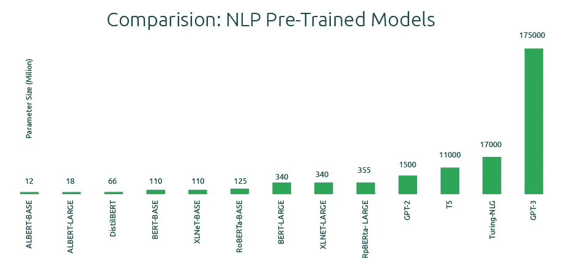

# AI 新绽放？为什么布鲁姆模式可以改变游戏规则

> 原文：<https://pub.towardsai.net/a-new-bloom-in-ai-why-the-bloom-model-can-be-a-gamechanger-380a15b1fba7?source=collection_archive---------1----------------------->

## 我们现在已经习惯了大型语言模型，为什么这个如此特别呢？

图片由作者使用 OpenAI [DALL-E 2](https://openai.com/dall-e-2/) 模型生成

**越来越大**

当 [BERT](https://en.wikipedia.org/wiki/BERT_(language_model)) 问世时，业界为自然语言处理领域的未来选择的道路已经非常清楚了。伯特是第一个真正得到关注的变形金刚，但不是最后一个(可悲的是，我们可以说电影系列也是如此)。

伯特开启了[巴特](https://arxiv.org/abs/1910.13461)、[罗伯塔](https://arxiv.org/abs/1907.11692)等大型变形金刚模型。它表明，自我关注层和更多参数的堆栈对于许多任务(命名实体识别、翻译、问题回答等)来说是惊人的好。然后到了 2020 年 [OpenAI](https://openai.com/) 强势进入与 [GPT-3](https://openai.com/api/) (约 1750 亿参数的巨型模型)的竞争。它令人印象深刻，但它在宝座上停留了一段时间，谷歌和其他几家公司发布了一系列更大的模型。我们看到了[Gopher](https://www.deepmind.com/blog/language-modelling-at-scale-gopher-ethical-considerations-and-retrieval)(2800 亿)[PALM](https://ai.googleblog.com/2022/04/pathways-language-model-palm-scaling-to.html)(540 b)[LaMDA](https://blog.google/technology/ai/lamda/)(137 b)。除了龙猫(700 亿，反正不是很小)之外，原则是一样的，收集更多的数据，增加参数的数量。

语言模型的参数数量呈指数增长。图片来源:[此处](https://lastweekin.ai/p/gpt-3-is-no-longer-the-only-game)

这是一场参与者很少的比赛。事实是，伯特向世界表明，只有技术蓝筹公司才能在这场游戏中竞争。如果我们只考虑电费(想象一下购买所有用于培训的 GPU 需要多少钱)，GPT3 估计只需要花费[1000-2000 万美元来培训](https://lastweekin.ai/p/gpt-3-is-no-longer-the-only-game)。

**科技痘:困扰科技公司的开源过敏症。**

每个人都兴奋地尝试 GPT-3、 [GATO](https://www.deepmind.com/publications/a-generalist-agent) 、[火烈鸟](https://www.deepmind.com/blog/tackling-multiple-tasks-with-a-single-visual-language-model)、[达尔-E](https://openai.com/blog/dall-e/) 和 [Imagen](https://imagen.research.google/) ，然而，在最好的情况下也有限制(以及这么长的等待名单)。OpenAI、Meta、Google 和微软开源了他们的一些模型(例子有 [OPT](https://arxiv.org/abs/2205.01068) 、 [VPT](https://openai.com/blog/vpt/) 和 [Switch Transformers](https://arxiv.org/abs/2101.03961) )，但是他们对此并不满意。事实是，如果你有班上最好的，你想留给自己。谷歌很容易地使用 BERT 和 following 模型来改进谷歌搜索，但失去对它的独家报道是另一回事。

我们都知道开源的重要性(如果你忘了，还有 Linus Torvalds 记得)。我们每天都在使用它，程序中的任何人都知道使用开源组件有多重要。然而，开源正在成为一个只想赚钱的搭便车的公司。

平心而论， [EleutherAI](https://www.eleuther.ai/) ， [BigScience](https://bigscience.huggingface.co/) ，[抱脸](https://huggingface.co/)试图打破垄断，开源很多很棒的模型。亚当·斯密(Adam Smith)说过类似“市场调节自我购买”的话，所以你看，现在我们有公司会开源，我们会解决这个问题。当然，我们有两个世纪的经验证明亚当·斯密说的不是真的。因此，在这一点上，我们有一个问题，机构在哪里？

**好的、坏的和偏见**

训练这些庞大的模型并不环保。不同的文章指出了人工智能对环境的影响(甚至[福布斯都注意到了](https://www.forbes.com/sites/glenngow/2020/08/21/environmental-sustainability-and-ai/?sh=68775f0e7db3)，所以你可以想象)。根据马萨诸塞大学的一项研究，训练一个大型 [NLP 模型](https://datascientest.com/introduction-au-nlp-natural-language-processing)的碳足迹令人印象深刻。此外，我们还必须处理生产硬件(所有 GPU)所需的成本和稀有元素。

此外，自从 2013 年 [word2vec](https://www.tensorflow.org/tutorials/text/word2vec) 发表以来，有人注意到有些奇怪的事情，语言模型可能是种族主义者和厌恶女性者。为什么？因为带着收集尽可能多的数据的目的，他们经常收集充满[刻板印象](https://venturebeat.com/2020/08/07/researchers-quantify-bias-in-reddit-content-sometimes-used-to-train-ai/)的数据。例如， [Reddit](https://www.reddit.com/) 是收集数据最常用的来源之一，国王学院的研究人员发表了一篇[文章](https://arxiv.org/pdf/2008.02754.pdf)显示了 Reddit 社区中性别和宗教偏见的证据。这引发了批评，OpenAI 声称已经减轻了 GPT 3 号的偏见。我们知道公司控制自己是不够的(还记得脸书对假新闻的承诺吗？).事实上，如果这些模型将停止生产，我们需要尽可能地消除伤害。

**什么是 BLOOM？！为什么我应该关心另一个基于变压器的模型？**

BigScience 标志。图片来源:[此处](https://twitter.com/BigscienceW)

[BLOOM](https://bigscience.notion.site/BLOOM-BigScience-176B-Model-ad073ca07cdf479398d5f95d88e218c4)(big science Language Open-science Open-access Multilingual)拥有 1760 亿个参数，并在 1.5 万亿字节的文本上进行了训练。在引擎盖下看，该网站报道它有 70 层，并使用了[多头注意力](https://paperswithcode.com/method/multi-head-attention)。好了，技术术语说够了，它是什么意思？这是另一个变压器。为什么这么特别？

首先，布鲁姆背后有一个大约 1000 人的国际团队，主要是学术志愿者(来自 50 多个国家，使用 20 多种语言)。该项目涵盖了从法国到加拿大的机构，但也包括像拥抱脸这样的公司。

此外，他们发布了一个[道德宪章](https://bigscience.huggingface.co/blog/bigscience-ethical-charter)，描述了激励这个项目的核心价值。他们决定区分两类内在和外在价值。值得花一点时间来简要描述激发这个项目的价值观。

**内在价值:**

*   包容性。该项目旨在避免任何歧视。
*   多样性。大科学项目被定义为一种多样性的手段，涵盖了来自不同国家和背景的许多研究人员。
*   再现性。作为核心价值观，他们决定开放科学
*   开放性。他们进一步细分为一个关注过程的和一个与结果相关的
*   责任。他们称之为个人和集体的责任，也是社会和环境的责任。

**外在价值:**

*   可达性。它们被描述为与公开性相关联，但扩展的目的是向更广泛的公众开放和解释。
*   透明度。与开放性相关，大科学鼓励项目的泄露和扩散
*   跨学科。重点是从一开始就将不同的学科(计算机科学、语言学、社会学、哲学等等)联系起来。
*   多语制。与不同的价值观相联系，自项目构思以来，他们的目标是涵盖不同的语言，作为一种包容性的手段

让我们从这个事实开始，这个宪章不是一个模糊的承诺。首先，该模型在由核能(一种低碳能源)驱动的 Jean Zay 公共超级计算机上进行训练。此外，他们还将硬件产生的热量用于吃掉校园内的建筑。

意识到过去的教训，他们试图限制种族主义或性别歧视协会的危害。怎么会？包括学者(包括伦理学家、法律学者和哲学家)，甚至包括脸书或谷歌的雇主。此外，他们不只是浏览网页，而是选择 500 个来源(在研讨会上讨论，包括社区团体，如 [Masakhane](https://www.masakhane.io/) 、 [LatinX in AI](https://www.latinxinai.org/) 和[机器学习东京](https://machinelearningtokyo.com/))。研究人员告诉《自然》( Nature)杂志，即使有这些警告，这个模型也不可能没有偏差。但由于代码和数据集是开放的，他们可以了解有害行为的根源并加以改进。

该模型将免费使用，并将很快通过 HuggingFace 推出(他们还计划推出一个更小、硬件更少的版本以及一个服务器分布式版本)。

**结论**

NLP 模型可能会改变世界，人工智能将会渗透到我们未来生活的方方面面。然而，我们知道当有突破性技术时垄断是一个问题([还记得电话](https://www.cablefax.com/technology/how-at-amp-t-became-a-monopoly-2)？没有打破垄断的互联网将会完全不同)。迄今为止，语言模型一直是富裕科技公司的一个小俱乐部的爱好。BLOOM 是第一个让所有人都能从 AI 中受益的努力。在未来，我们可能到处都有聊天机器人，我们需要为公众提供大型模型。

**附加资源**

*   好奇想知道更多关于技术部分的内容，看一下这里的[和这里的](https://bigscience.huggingface.co/blog/what-language-model-to-train-if-you-have-two-million-gpu-hours)和[和](https://github.com/bigscience-workshop/bigscience/tree/master/train/tr11-176B-ml)
*   你想知道更多他们的方法吗？[此处](https://montrealethics.ai/category/columns/social-context-in-llm-research/)

# 如果你觉得有趣:

你可以寻找我的其他文章，你也可以 [**订阅**](https://salvatore-raieli.medium.com/subscribe) 在我发表文章时得到通知，你也可以在**[**LinkedIn**](https://www.linkedin.com/in/salvatore-raieli/)**上连接或联系我。**感谢您的支持！**

**这里是我的 Github 资源库的链接，我计划在那里收集代码，以及许多与机器学习、人工智能等相关的资源。**

** [## GitHub - SalvatoreRa/tutorial:关于机器学习、人工智能、数据科学的教程…

### 关于机器学习、人工智能、数据科学的教程，包括数学解释和可重复使用的代码(python…

github.com](https://github.com/SalvatoreRa/tutorial)**