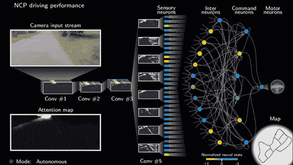
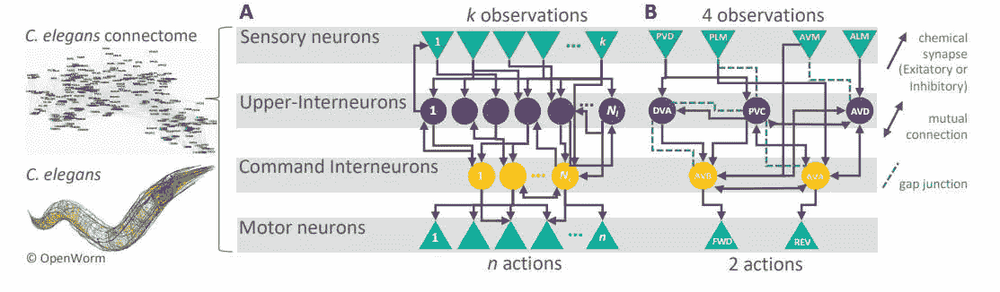
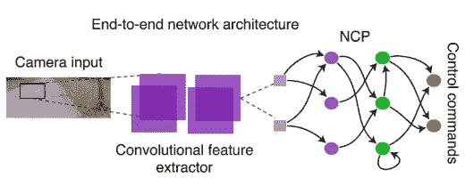
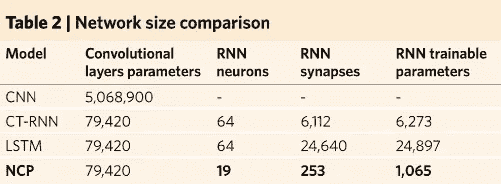
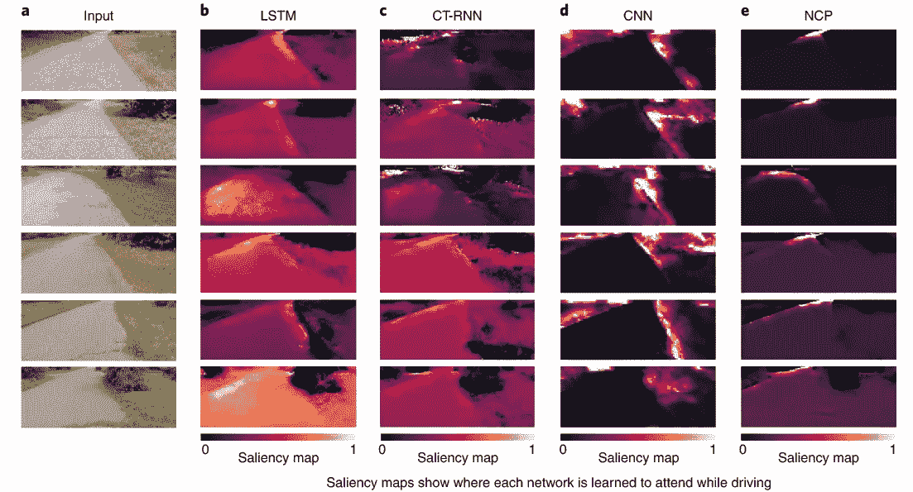
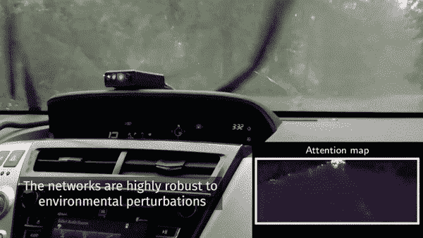

# 一个新的大脑启发的智能系统只用 19 个控制神经元来驾驶汽车！

> 原文：<https://pub.towardsai.net/a-new-brain-inspired-intelligent-system-drives-a-car-using-only-19-control-neurons-1ed127107db9?source=collection_archive---------1----------------------->

## [自动驾驶汽车](https://towardsai.net/p/category/self-driving-cars)、[新闻](https://towardsai.net/p/category/news)、[研究](https://towardsai.net/p/category/research)

## 这种新的智能系统模仿线虫的神经系统来有效地处理信息，比当前具有数百万参数的深度神经网络架构更强大，更具解释性，训练速度更快。

> 故事最初发布在 [**我的博客**](https://www.louisbouchard.ai/mit-biologically-inspired-neural-networks-for-self-driving-cars/)

用于自动驾驶汽车的受生物启发的神经网络——图片来自[论文](https://www.youtube.com/watch?v=8KBOf7NJh4Y&feature=emb_title&ab_channel=MITCSAIL)

*观看更多视频*

## 深度神经网络和其他方法

研究人员一直在寻找建立智能模型的新方法。我们都知道，当我们有足够的数据来训练它们时，真正深度监督的模型工作得很好，但最难做的事情之一是很好地概括并有效地做它。我们总是可以更深入，但是它有很高的计算成本。因此，你可能已经在想，一定有另一种方法让机器变得智能，需要更少的数据或至少在我们的网络中更少的层。

机器学习研究人员和工程师目前正在进行的最复杂的任务之一是自动驾驶汽车。这是一项需要涵盖所有选项并且完全稳定的任务，以便能够在我们的道路上部署它。这种训练自动驾驶汽车的过程通常需要来自真实人类的许多训练样本，以及能够理解这些数据并在任何情况下重现人类行为的真正深度神经网络。

自动驾驶算法的端到端表示—图片来自[论文](https://www.nature.com/articles/s42256-020-00237-3.epdf?sharing_token=xHsXBg2SoR9l8XdbXeGSqtRgN0jAjWel9jnR3ZoTv0PbS_e49wmlSXvnXIRQ7wyir5MOFK7XBfQ8sxCtVjc7zD1lWeQB5kHoRr4BAmDEU0_1-UN5qHD5nXYVQyq5BrRV_tFa3_FZjs4LBHt-yebsG4eQcOnNsG4BenK3CmBRFLk%3D)

来自澳大利亚 IST 大学和麻省理工学院的研究人员已经成功地使用一种新的人工智能系统训练了一辆自动驾驶汽车，该系统基于微小动物的大脑，如蛲虫[1]。与流行的深度神经网络(如 Inceptions、Resnets 或 VGG)所需的数百万个神经元相比，他们只需要几个神经元就能控制自动驾驶汽车。他们的网络能够只用 75 000 个参数完全控制一辆汽车，由 19 个控制神经元组成，而不是数百万个！

## 大脑启发的智能系统

因为它很小，所以它不必像深度模型那样是一个“黑匣子”,在深度模型中，我们不能完全理解网络的每个阶段都发生了什么。的确，它能被人类理解。正如研究小组负责人 Radu Grosu 教授所说:“例如，线虫 C. elegans 的神经元数量惊人地少，但仍显示出有趣的行为模式。

线虫的神经系统——图片来自[线虫停车](https://www.i-programmer.info/news/105-artificial-intelligence/12243-nematode-worm-parks-a-car.html)

这是因为线虫的神经系统处理信息的方式高效而和谐”。线虫的神经系统证明了深度学习模型还有改进的空间。如果线虫在进化到这种接近最佳的神经系统结构后，能够在拥有极少量神经元的同时表现出有趣的行为，我们肯定也可以在机器上复制这种行为。这个神经系统允许线虫进行移动、运动控制和导航，这正是我们在自动驾驶等应用中的目标。

按照这个神经系统，他们“开发了神经元和突触的新数学模型”，称为“液体时间常数”或 LTC 神经元，正如托马斯·亨辛格教授所说。

简化网络的一个方法是使它变得稀疏。这意味着不是每个细胞都与其他细胞相连。当一个单元被激活时，其他单元没有被激活，这减少了计算时间，因为所有被去激活的单元将不发送任何输出(或者 0 输出，这是计算速度极快的)。他们还改变了每个细胞的工作方式。正如 Ramin Hasani 博士所说，“单个细胞内的信号处理遵循不同于之前深度学习模型的数学原理”。

## IST 和麻省理工学院的新智能系统——NCPs

现在让我们更深入地了解一下这个新系统是如何工作的。
它由两部分组成。首先，有一个紧凑的卷积神经网络，用于从输入图像的像素中提取结构特征。使用这样的信息，网络决定图像的哪一部分是重要的或令人感兴趣的，并且仅将图像的这一部分传递给第二系统。

架构的端到端表示—图片来自[论文](https://www.nature.com/articles/s42256-020-00237-3.epdf?sharing_token=xHsXBg2SoR9l8XdbXeGSqtRgN0jAjWel9jnR3ZoTv0PbS_e49wmlSXvnXIRQ7wyir5MOFK7XBfQ8sxCtVjc7zD1lWeQB5kHoRr4BAmDEU0_1-UN5qHD5nXYVQyq5BrRV_tFa3_FZjs4LBHt-yebsG4eQcOnNsG4BenK3CmBRFLk%3D)

他们称之为“控制系统”,利用一组受生物启发的神经元做出的决定来驾驶车辆。这个控制部分也被称为神经回路策略，或 NCP。基本上，它将来自紧凑卷积模型输出的数据翻译成 RNN 结构中的 19 个神经元，这是由线虫的神经系统控制车辆并允许它留在车道上启发的。遵循上面所示的体系结构。你可以在他们的论文或者他们在[GitHub](https://github.com/mlech26l/keras-ncp)【2】上制作的清晰指南中找到更多关于这些 NCPs 网络实现的细节。

这是参数减少最多的地方。Mathias Lechner 解释说，“NCP 比以前的最先进模型小 3 个数量级”，如下表 2 所示。这两个系统同时接受训练，共同创造了这辆自动驾驶汽车。

网络规模对比——图片来自[的论文](https://www.nature.com/articles/s42256-020-00237-3.epdf?sharing_token=xHsXBg2SoR9l8XdbXeGSqtRgN0jAjWel9jnR3ZoTv0PbS_e49wmlSXvnXIRQ7wyir5MOFK7XBfQ8sxCtVjc7zD1lWeQB5kHoRr4BAmDEU0_1-UN5qHD5nXYVQyq5BrRV_tFa3_FZjs4LBHt-yebsG4eQcOnNsG4BenK3CmBRFLk%3D)

由于体积很小，他们能够看到系统将注意力集中在图像上的什么地方。他们发现，让这样一个小网络提取图片中最重要的部分，使得少数决策神经元只关注路边和地平线。这在人工智能系统中是一种独特的行为，这些系统目前正在分析图像的每一个细节，使用了过多的信息。

全球网络动态——图片来自[论文](https://www.nature.com/articles/s42256-020-00237-3.epdf?sharing_token=xHsXBg2SoR9l8XdbXeGSqtRgN0jAjWel9jnR3ZoTv0PbS_e49wmlSXvnXIRQ7wyir5MOFK7XBfQ8sxCtVjc7zD1lWeQB5kHoRr4BAmDEU0_1-UN5qHD5nXYVQyq5BrRV_tFa3_FZjs4LBHt-yebsG4eQcOnNsG4BenK3CmBRFLk%3D)

请花一点时间来看看，与其他类型的网络相比，发送到 NCP 网络的信息是多么少。只要看看这张图片，我们就可以看到，它显然比目前的方法更有效，计算速度更快。

此外，虽然噪声是当前方法的一个大问题，例如车道保持应用中的雨或雪，但他们的 NCP 系统对输入伪像表现出很强的抵抗力，因为其架构和新颖的神经模型使他们的注意力保持在道路地平线上，即使输入摄像头有噪声，如您在下面的短视频中所见。

在嘈杂环境中展示的稳健性—图片来自[论文](https://www.youtube.com/watch?v=8KBOf7NJh4Y&feature=emb_title&ab_channel=MITCSAIL)

## 结论

他们的新方法更强大，由于其体积小，训练速度更快，并且更容易解释，因为它能够清晰地可视化神经网络内部的活动。这是新一代的深度模型，是人工智能领域的一个巨大进步，通过跟踪生物神经系统带来了新的视角。

由于这还不够令人印象深刻，他们还公开了代码。他们甚至创建了完整的[教程](https://github.com/mlech26l/keras-ncp)，讲述如何使用 LTC 神经元创建/导入新的 NCP 网络【3】，以及如何将 NCP 与其他类型的层进行堆叠【4】。一切都可以通过他们的 [GitHub](https://github.com/mlech26l/keras-ncp) 获得。

当然，这只是这篇新论文的一个简单概述。我强烈建议**阅读下面链接的论文**以获取更多信息。

感谢您的阅读！

如果你喜欢我的工作，并想了解人工智能的最新动态，你绝对应该关注我的其他社交媒体账户( [LinkedIn](https://www.linkedin.com/in/whats-ai/) ， [Twitter](https://twitter.com/Whats_AI) )，并订阅我的每周人工智能 [**简讯**](http://eepurl.com/huGLT5) ！

## 支持我:

*   支持我的最好方式是成为这个网站的成员，或者如果你喜欢视频格式，在[**YouTube**](https://www.youtube.com/channel/UCUzGQrN-lyyc0BWTYoJM_Sg)**上订阅我的频道。**
*   **在经济上支持我在 [**Patreon**](https://www.patreon.com/whatsai) 的工作**
*   **跟着我上 [**中**](https://whats-ai.medium.com/)**
*   **想进入 AI 或者提升技能，[看这个](https://www.louisbouchard.ai/learnai/)！**
*   **一起学习 AI，加入我们的 [**Discord 社区**](https://discord.gg/SVse4Sr) ，*分享你的项目、论文、最佳课程，寻找 Kaggle 队友，等等！***

## **参考**

**[1] M. Lechner，R. Hasani，A. Amini，T. A. Henzinger，D. Rus 和 R. Grosu，[实现可审计自主性的神经回路策略](https://www.nature.com/articles/s42256-020-00237-3.epdf?sharing_token=xHsXBg2SoR9l8XdbXeGSqtRgN0jAjWel9jnR3ZoTv0PbS_e49wmlSXvnXIRQ7wyir5MOFK7XBfQ8sxCtVjc7zD1lWeQB5kHoRr4BAmDEU0_1-UN5qHD5nXYVQyq5BrRV_tFa3_FZjs4LBHt-yebsG4eQcOnNsG4BenK3CmBRFLk%3D)，(2020)，自然机器学习**

**[2] M. Lechner 和 R. Hasani，[启用可审计自主性的神经回路策略代码](https://github.com/mlech26l/keras-ncp)， [GitHub](https://github.com/mlech26l/keras-ncp)**

**[3] M. Lechner 和 R. Hasani， [Google Colab:基本用法](https://colab.research.google.com/drive/1IvVXVSC7zZPo5w-PfL3mk1MC3PIPw7Vs?usp=sharing)，(2020)，Google Colab**

**[4] M. Lechner 和 R. Hasani， [Google Colab:将 NCP 与其他层堆叠在一起](https://colab.research.google.com/drive/1-mZunxqVkfZVBXNPG0kTSKUNQUSdZiBI?usp=sharing)，(2020)，Google Colab**