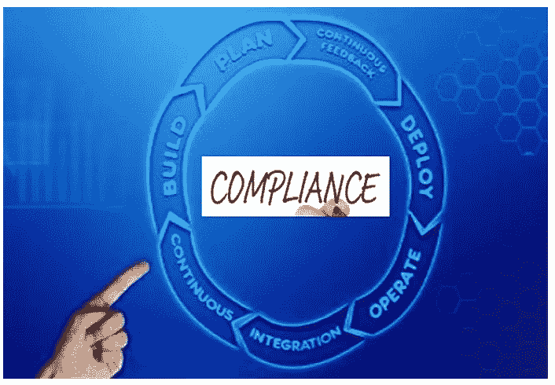
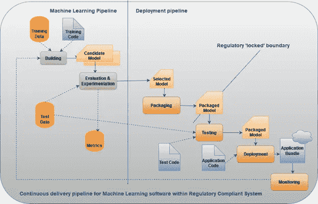
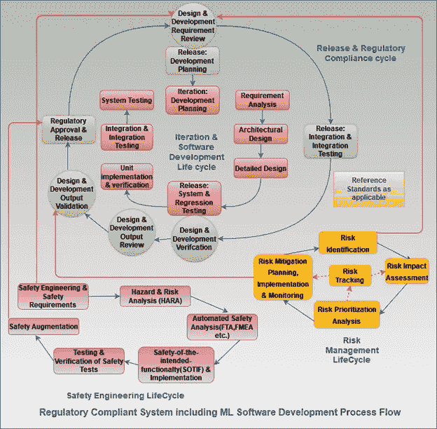
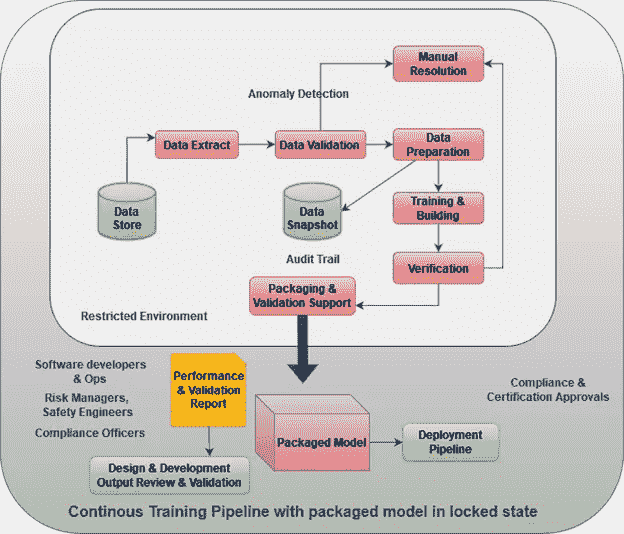

# MLOps 的新范式——建立合规体系

> 原文：<https://pub.towardsai.net/a-new-paradigm-in-mlops-building-regulatory-compliant-system-c7e77f2d1871?source=collection_archive---------1----------------------->

## [DevOps](https://towardsai.net/p/category/devops)

来源——来自 Unsplash 的图片

一个 ll 数据科学家，ML 工程师，开发者等。非常熟悉 MLOps 及其框架。在线平台上有大量关于这个框架的文章和教程可供阅读和理解。这个流行词在每个人工智能专家、研究者和实践者的心中。

而是下面提到的概念是否听起来耳熟。

1.内嵌 ML 软件的合规系统的 MLOps 是什么？

2.它的内含物有哪些？

3.框架是如何设计的？

让我们详细了解每一件作品。

# **MLOps —简介**

对于 AI 和 ML 软件，MLOps 从初始和实验开始，一直持续到部署和生产。但是它并没有就此停止。它与 CI/CD(持续集成/持续交付)管道一起，持续进行开发、部署、生产和监控的多个周期。在这两者之间，所有的事情都要处理好，例如数据转换、模型优化、模型验证、模型注册、版本控制、中央存储、访问控制、治理等等。，这个列表还不止这些。

MLOps 从一开始就包含了 ML 软件所有步骤的自动化、监控和治理。

这包括 3 个主要步骤。

1.识别和汇集数据，用于训练和开发模型。

2.尝试不同的模型，找出性能最佳的模型，以及

3.在生产中部署和使用最终模型。

它包含一个复杂的工作流程。

# **监管与合规概述**

当 MLS 必须被符合法规的系统和涉及 AI 和 ML 软件的领域采用和适应时，它变得更加具有挑战性。这些领域的几个例子是医疗保健、医疗设备、航空航天、国防、汽车等。除了已经存在的活动之外，还需要在周期中包含额外的活动，并且消耗大量的精力、时间和成本。

> 之所以称之为采用和调整，是因为 MLOps 框架被借用于此类领域以增加价值，但同时需要对已经缝合/固定的实践和流程进行一些重大修改，以满足法规遵从性和认证的要求。

这些以监管和认证为中心的系统需要更多的计划驱动的方法，以避免对环境和人类的危害，并减轻过程中的风险。

监管机构经常需要时间来证明事情，而软件开发是关于连续交付和实践的，并且需要快速的迭代和增量。

> 尤其是 ML 和 AI 驱动的系统需要在应用程序代码、用于预测的模型和用于开发模型的数据方面不断变化，这给验证和确认活动带来了一系列不同的挑战，进一步使法规遵从性和认证批准流程复杂化。

因此，正确的方法是在计划驱动和敏捷驱动的开发方法之间取得平衡。这确保了对风险管理和安全工程等实践以及其他实践给予足够的关注。

监管机构处理影响公共利益的要求，如健康、安全、环境等。他们不关注技术解决方案，而只关注结果和危险。因此，组织总是面临证明一致性的挑战。

对于大多数组织来说，开发符合法规的产品意味着从一开始就清楚地了解相关的适用法规要求并相应地确定策略。该策略是通过选择一个适当的 ML 模型来实现的，该模型以“锁定”状态部署到生产中。“锁定”状态将在文章中进一步阐述。这种策略很容易实现最终产品的验证和确认。

在这方面，首要的活动是找出当前 MLOps 实践中的差距。这些差距揭示了需要关注和修改的特定领域，以便符合监管要求。

一旦发现这些差距，就要采取行动，在监管框架下将现有管道提升到适当的成熟度水平。

最有可能的差距区域可能与模型及其版本化、用于训练模型及其版本化的多个数据集以及监控模型的输出以检测偏差和其他问题有关。

该框架的基本部分包括风险管理和安全工程以及这些现有的修改领域。

所有这些都必须添加到一个框架下，以创建符合监管要求的 ML 系统。

> 由于 ML 和 AI 系统能够在生产过程中通过学习数据进行改进，这就提出了 ML 系统自主运行的真实性问题，该问题与合规领域的安全性和性能有关。因此，已经采取了“锁定”算法的方法，其中系统在开发阶段被训练，但是当在现实世界使用/生产时，改进的能力被禁用。虽然通用管道保持活跃，能够在整个应用程序生命周期中以连续的方式交付经过重新训练的模型，但是一旦模型被选择用于部署，它就会在打包状态之后被“锁定”，监控阶段仅限于验证锁定的模型，直到满足法规遵从性。

来源——改编自 https://doi.org/10.1007/s42979-021-00726-1 的[图 2](https://doi.org/10.1007/s42979-021-00726-1)

如果模型中存在需要进一步考虑部署和生产的变化，那么这些重新训练的打包模型将被再次“锁定”,以进行法规遵从性验证和认证批准。该过程一直持续到整个系统证明符合认证批准的参考标准和规定。

# **合规 ML 和 AI 系统开发工作流程**

来源——改编自 https://doi.org/10.1007/s42979-021-00726-1[图 4](https://doi.org/10.1007/s42979-021-00726-1)

该流程包括两个嵌套的开发任务周期。

第一个是内部循环，由更短迭代的日常开发任务组成。第二个是外部周期，包括软件发布的最终符合性和批准所需的正式任务和活动。根据不同人员的角色和能力，将不同级别的任务分配给不同的人员，并根据需要异步完成任务。

设计要求在发布级别进行审查。一旦这些被接受，架构设计活动就在开发周期阶段进行。根据要求验证架构设计，并进一步考虑准备概要设计和详细的单元设计/概要设计。一旦详细的单元设计得到验证和接受，开发活动以及单元测试、集成测试和系统测试开始，以验证系统/产品。

当所有的需求、设计评审和测试活动都成功地完成了所需数量的开发迭代时，工作就转移到了发布周期。在发布周期中，软件发布将经历最终级别的集成和回归测试，以及最终的评审、验证和确认阶段，以获得最终的法规批准。

发布决定意味着风险管理活动和安全工程活动的完整性，因此，通常会涉及风险经理、安全官员和合规官员。

> 风险管理和安全工程活动被视为伞式活动，并包含在整个开发过程中(内循环和外循环)。两者都从需求和设计启动阶段开始，一直持续到结束(获得法规遵从性和认证)。

与此同时，对生产中“锁定”模型性能的主动质量监控不断发生。

来源——改编自 https://doi.org/10.1007/s42979-021-00726-1[的图 5](https://doi.org/10.1007/s42979-021-00726-1)

此外，自动化连续训练管道在受控环境中运行，并从数据源获取新数据。输入数据都得到了很好的验证。在数据验证期间发现数据不一致的情况下，流水线的执行被停止，并且使用人工干预来解决异常。这有助于保持开发团队的访问仅限于持续培训管道的安装和维护环境，而不影响锁定的模型及其后续的合规性和认证活动。

# **结论**

尽管随着机器学习系统的指导方针变得越来越严格，该 MLOps 框架有助于确保法规遵从性，但是该过程和框架似乎仍在发展。因此，这里考虑的框架不是最终的框架，将根据要求保留在适应循环中。但是监测和治理非常重要。有了强有力的治理和监控，就有可能实现目标，并使事情走上正轨。

# **参考文献—**

1.Granlund，Stirbu，v .和 Mikkonen，t.《迈向符合法规的 MLOps: Oravizio 从机器学习实验到部署认证医疗产品之旅》。SN 计算机。SCI。2, 342 (2021).【https://doi.org/10.1007/s42979-021-00726-1 

[2。https://www . enterprise times . co . uk/2020/02/06/why-governance-comes-first-in-mlops/](https://www.enterprisetimes.co.uk/2020/02/06/why-governance-comes-first-in-mlops/)