# 一种构建机器学习管道的新方法

> 原文：<https://pub.towardsai.net/a-new-way-of-building-machine-learning-pipelines-54700ed1aded?source=collection_archive---------1----------------------->

## [机器学习](https://towardsai.net/p/category/machine-learning)

使用 Orchest 用几行代码设计你的第一个机器学习管道。你将学习预处理数据，训练机器学习模型，并评估结果。


图片作者|元素作者 [Vecteezy](https://www.vecteezy.com/vector-art/2927244-smart-industry-4-0-internet-of-things-technology-vector-illustration)

在本文中，我们将经历构建 ML(机器学习)管道所需的所有步骤。我们将使用 Kaggle 二元分类数据[新冠肺炎/SARS B 细胞表位](https://www.kaggle.com/futurecorporation/epitope-prediction)来分析、预处理、训练和评估我们的模型。我们不会深入研究代码以及这些模型是如何工作的，因为你可以从我之前发表在 Deepnote 上的[项目](https://deepnote.com/@abid/Epitope-prediction-used-in-vaccine-development-neKzykHlQFqsIQL5lPaZlw)中找到详细的解释。

我们将利用 *SARS-CoV* 和 *B-cell* 数据集将肽分为两类，具有诱导特性的抗体标记为**阳性(1)** ，不具有诱导特性的抗体标记为阴性( **0)** 。要了解有关数据集的更多信息，请阅读研究论文。

# 奥尔切斯特

Orchest 是一个构建数据管道的工具，它不需要 Dag 和框架。该环境易于导航，您可以使用数据科学家最喜欢的工具 **Jupyter notebook** 编写 *Python、R 和 Julia* 代码。

Orchest 中的管道包含称为步骤的。这些步骤是在隔离环境中执行的可执行文件，连接定义了数据流的方式。我们可以通过监控每一步来可视化我们的进度，或者我们可以安排运行我们的管道，以在仪表板上接收完整的报告。


按作者列出的 ML 管道

## 附加服务

Orchest 还提供其他服务，例如在 **TensorBoard** 上可视化您的性能指标，或者在 **VSCode** 中编写代码，因为这些服务无缝集成在同一环境中。

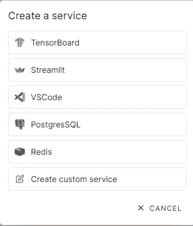

作者图片

## 调度管道

就像[气流](https://airflow.apache.org/)，你可以安排运行你的管道，在一天中特定的分钟和小时。这个过程不需要您编码，甚至不需要您监控管道。

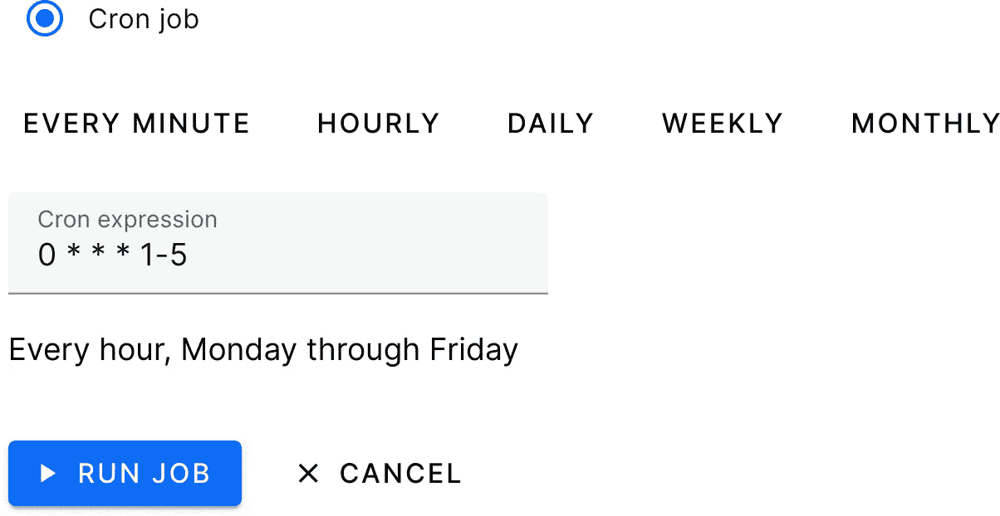

[概述(orchest.readthedocs.io)](https://orchest.readthedocs.io/en/latest/getting_started/overview.html)

# 装置

对于 Linux 用户来说，安装本地服务器很容易，但是对于 windows，您可以通过安装额外的应用程序获得类似的体验。

## Windows 操作系统

确保你已经安装了下面提到的所有东西

*   Docker [引擎最新](https://docs.docker.com/engine/install/)版本:运行`docker version`检查。
*   Docker 必须配置为使用 [WSL 2](https://docs.microsoft.com/en-us/windows/wsl/install-win10) 。
*   [Windows 版 Ubuntu 20.04 LTS](https://www.microsoft.com/en-us/p/ubuntu-2004-lts/9n6svws3rx71?activetab=pivot:overviewtab) 。
*   在 Ubuntu 环境中运行下面的脚本。

## Linux 操作系统

对于 Linux，您只需要最新的 docker 引擎，然后运行下面的脚本来下载并安装所有依赖项。

```
git clone https://github.com/orchest/orchest.git && cd orchest
./orchest install

# Verify the installation.
./orchest version --ext

# Start Orchest.
./orchest start
```

# 第一个项目

是时候启动我们的本地服务器了。在 Ubuntu 环境中键入下面的脚本，因为我们将在 windows 上运行 Linux 虚拟环境。确保**对接引擎**正常工作。

成功运行脚本后，您将收到一个本地网址，您可以将其复制并粘贴到您的浏览器中。

```
cd orchest./orchest start
```

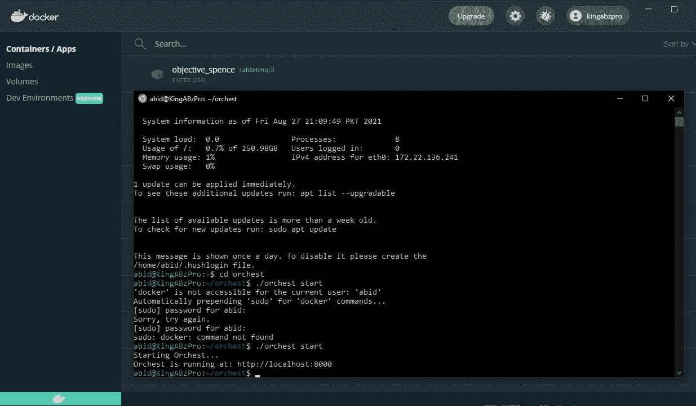

通过 Auhor 启动本地服务器|映像

在登陆页面会看到这个惊人的用户界面。最后，我们可以通过点击**创建项目**按钮来创建一个新项目了。

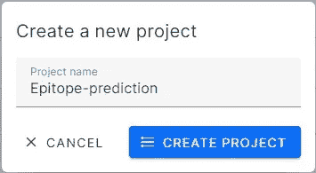

按作者创建项目|图像

一个项目包含许多管道，所以现在是时候创建我们的*疫苗 ML* **管道**了。通过创建一个管道，将把`vaccine.orchest`文件添加到你的目录中，该目录包含关于每一步的元数据。

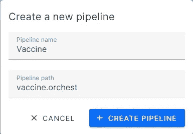

按作者创建管道|图像

对于**代码**，我们将使用我们以前的项目，并专注于建立一个有效的管道。

[](https://deepnote.com/@abid/Epitope-prediction-used-in-vaccine-development-neKzykHlQFqsIQL5lPaZlw) [## 用于疫苗开发的表位预测

### 面向数据科学家和研究人员的托管笔记本电脑。

deepnote.com](https://deepnote.com/@abid/Epitope-prediction-used-in-vaccine-development-neKzykHlQFqsIQL5lPaZlw) 

# ML 管道

机器学习管道是独立可执行的代码，用于运行在已处理数据上准备和训练模型所涉及的多个任务 [Azure 机器学习。下图解释了每个机器学习项目中使用的通用机器学习模型。箭头表示从一个独立任务到另一个完成机器学习生命周期的数据流。](https://docs.microsoft.com/en-us/azure/machine-learning/concept-ml-pipelines)

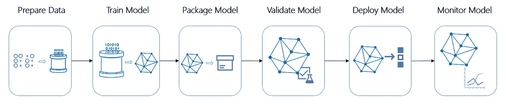

图片来源:[微软](https://docs.microsoft.com/en-us/azure/machine-learning/service/concept-ml-pipelines)

## 创建步骤

让我们把理论留到以后在实践中学习，让我们在实践中学习。

首先，您需要通过点击**新步骤**按钮来创建步骤。我们需要添加一个步骤，如果我们没有 python 文件或*。ipynb* 按照我们的方向，我们可以通过下面所示的一个简单步骤创建一个新文件。

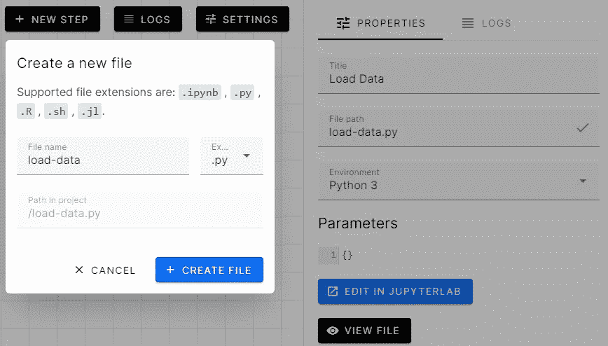

第一步|作者图片

**瞧,**我们已经成功创建了第一步，现在我们需要再创建几个并尝试连接节点。

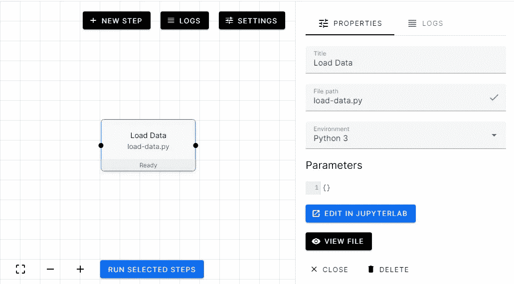

加载数据步骤|按作者分类的图像

我们增加了 **EDA** (探索性数据分析)和**预处理**步骤。然后将它们与**加载数据**步骤连接起来，这样每个步骤都可以访问提取的数据。

稍后，我们将更详细地讨论如何对这些步骤进行编码。

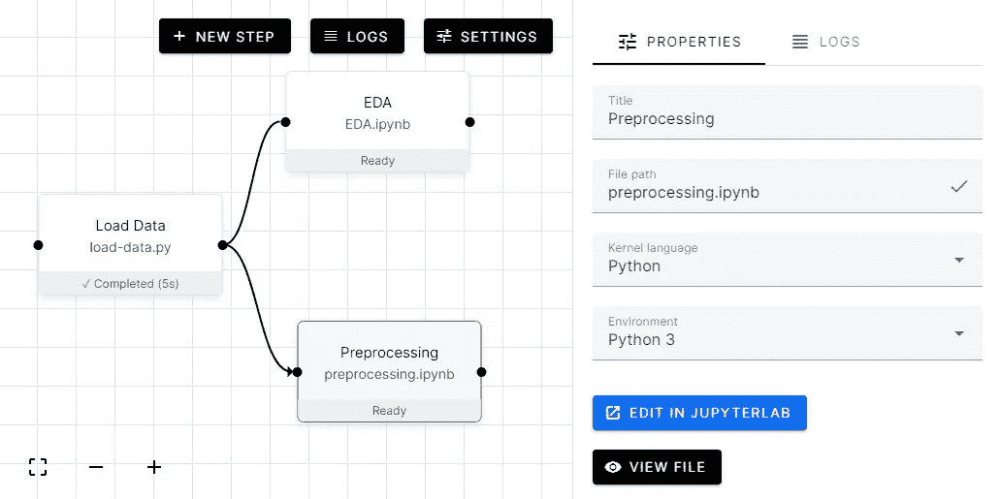

创建附加步骤|按作者分类的图像

要对步骤进行编码，点击 JupyterLab 中的**编辑按钮**，这将把我们带到 Jupyter 笔记本，在这里您可以开始编码。

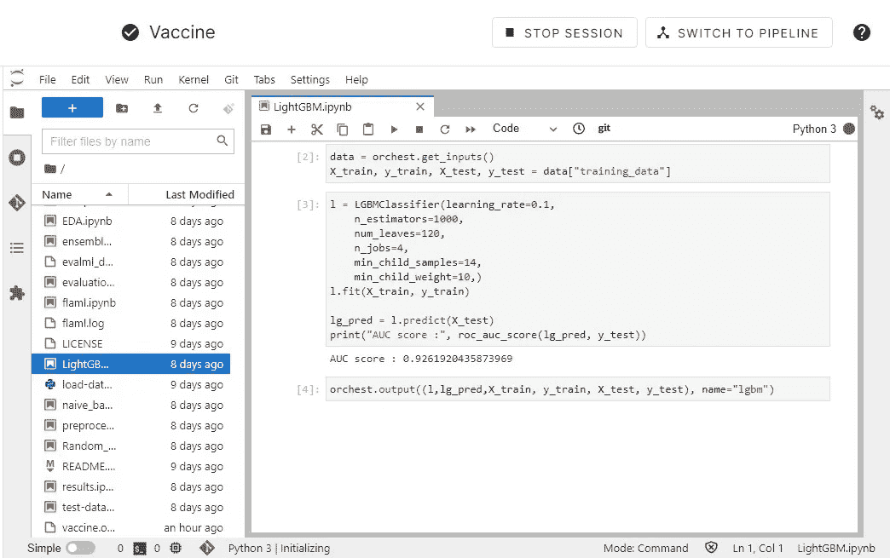

在 Jupyter 笔记本中编辑|作者图片

要运行所有步骤，使用鼠标选择所有步骤，然后点击左下角名为**运行所选步骤的蓝色按钮。这将一个接一个地运行所有步骤。**

我们可以点击每一步并查看日志，或者我们可以直接去笔记本查看进度。

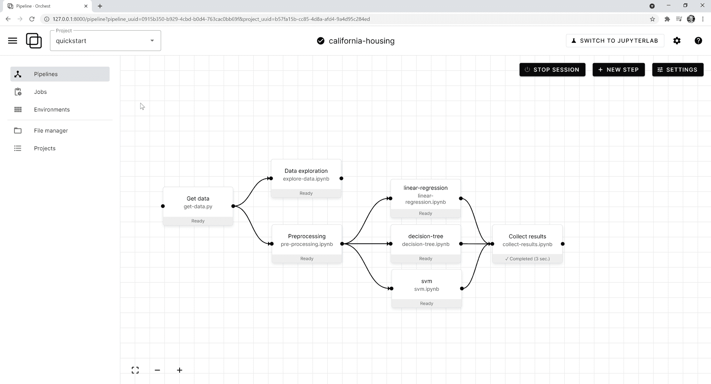

奥彻斯特/奥彻斯特(github.com)

## 输出

连接节点后，让我们对代码做一些修改。

*   我们需要导入`orchest`
*   使用熊猫`read_csv`加载数据
*   连接`bcell`和`sars`数据帧。
*   使用`orchest.output`输出下一步的数据(使用命名输出)。

Orchest 输出接受单个或多个变量，并创建**数据流**，我们可以在下面的步骤中使用。在我们的例子中`bcell, covid, sars, bcell_sars`被存储在**数据流**中，变量称为***‘数据’***。

```
import orchestimport pandas as pd# Convert the data into a DataFrame.INPUT_DIR = “Data”bcell = pd.read_csv(f”{INPUT_DIR}/input_bcell.csv”)covid = pd.read_csv(f”{INPUT_DIR}/input_covid.csv”)sars = pd.read_csv(f”{INPUT_DIR}/input_sars.csv”)bcell_sars = pd.concat([bcell, sars], axis=0, ignore_index=True)# Output the Vaccine data.print(“Outputting converted Vaccine data…”)orchest.output((bcell, covid, sars, bcell_sars), name=”data”)print(bcell_sars.shape)print(“Success!”) **Outputting converted Vaccine data…
(14907, 14)
Success!**
```

## 投入

现在我们来看看输入步骤。它利用所有四个变量来探索和分析数据。我只添加了几个 Jupyter 笔记本单元来演示节点之间的数据流。要查看完整的分析，请检查 [EDA | Deepnote](https://deepnote.com/viewer/github/kingabzpro/Covid19-Vaccine-ML-Pipeline/blob/main/EDA.ipynb) 。

让我们导入所需的库，包括 Orchest。

使用`orchest.get_inputs`函数创建一个对象，然后添加数据管道变量的名称(‘data’)以提取上一步中的变量。

正如我们所看到的，我们已经成功地加载了上一个任务中的数据。

使用来自 sklearn 的 [**PCA**](https://scikit-learn.org/stable/modules/generated/sklearn.decomposition.PCA.html) 将维度减少到 2，并使用散点图来可视化目标分布。

## 输入和输出

让我们使用输入和输出函数来提取训练数据，然后用它来训练我们的 [**随机森林分类器**](https://scikit-learn.org/stable/modules/generated/sklearn.ensemble.RandomForestClassifier.html) 。训练后，我们将导出我们的数据进行评估。

使用' *training_data'* 作为数据流的名称，从预处理的步骤中分离出输入训练测试。

使用 **400 估算器**并拟合我们的训练数据集。正如我们可以看到的，我们的 [**AUC**](https://developers.google.com/machine-learning/crash-course/classification/roc-and-auc) 分数对于没有超参数调整的模型来说相当不错。

让我们输出我们的模型和预测进行评估。

## 最终管道

1.  加载数据
2.  探索性数据分析
3.  使用 Alteryx [EvalML](https://evalml.alteryx.com/en/stable/index.html) 和 Microsoft [FLAML](https://github.com/microsoft/FLAML/tree/main/flaml) 进行预处理，训练多个模式，然后评估结果
4.  为培训处理数据
5.  训练朴素贝叶斯、随机森林、CatBoost 和 LightGBM。
6.  评估结果。
7.  组装
8.  比较准确度分数。

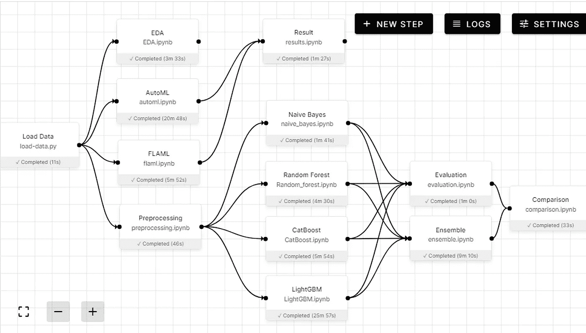

作者图片

## 结果

**AutoML 结果**

每个模型和集合的最终结果，具有 AUC 和准确度分数。

## 项目

如果你想探索每个步骤，你可以在 GitHub 上找到这个项目。您也可以使用我的 GitHub repo 并将其加载到 Orchest 本地服务器中，它将从一开始就运行，并产生类似的结果。

[](https://github.com/kingabzpro/Covid19-Vaccine-ML-Pipeline) [## GitHub-kingabzpro/covid 19-Vaccine-ML-Pipeline:设计您的第一个机器学习管道…

### 使用 Orchest，通过几行代码和简单的拖放，设计您的第一个机器学习管道。在这个…

github.com](https://github.com/kingabzpro/Covid19-Vaccine-ML-Pipeline) 

# 逆风云

T2 云 T3 还处于封闭测试阶段，但是你可以申请，几周之内你就可以进入了。老实说，can 服务是没有麻烦的，因为它很容易直接加载 GitHub 项目，运行流畅。

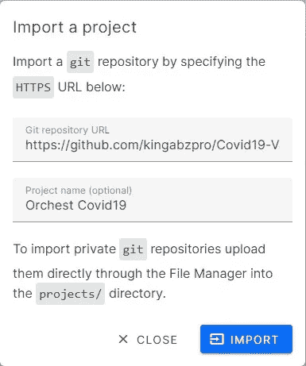

按作者云导入

# 结论

[亚尼克·佩雷内特](https://www.linkedin.com/in/yannickperrenet/)和[里克·拉默斯](https://www.linkedin.com/in/lamersrick/)都是了不起的家伙，他们在整个学习过程中帮助了我。如果我有任何问题或发现任何错误，他们会迅速做出反应，并在更新当前工作流程的同时提出替代解决方案。起初，我在安装和加载某些库时遇到了很多问题，但是这些问题很快就被 Orchest [Slack](https://join.slack.com/t/orchest/shared_invite/zt-g6wooj3r-6XI8TCWJrXvUnXKdIKU_8w) 社区解决了。总的来说，我使用 Orchest 的体验相当惊人，我认为这将是数据科学的未来。

> 云 IDE 需要采用 ML 管道来保持竞争力。

我们已经开发了一个完整的机器学习管道，从数据摄取到模型训练和评估。我们还了解了创建步骤和使用一次单击连接节点是多么简单。我希望我的文章让你的生活更简单，对于初学者来说，这是一座金矿，因为你可以从单个平台学习、训练和部署你的机器学习模型。

> 你可以在 [LinkedIn](https://www.linkedin.com/in/1abidaliawan/) 和 [Polywork](https://www.polywork.com/kingabzpro) 上关注我，我在那里发布了关于数据科学和机器学习的惊人文章。

[](http://ko-fi.com/kingabzpro)