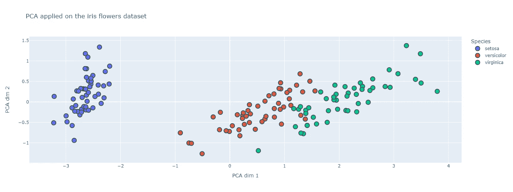
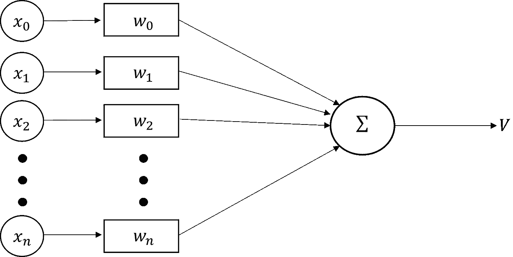
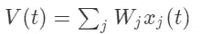
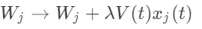
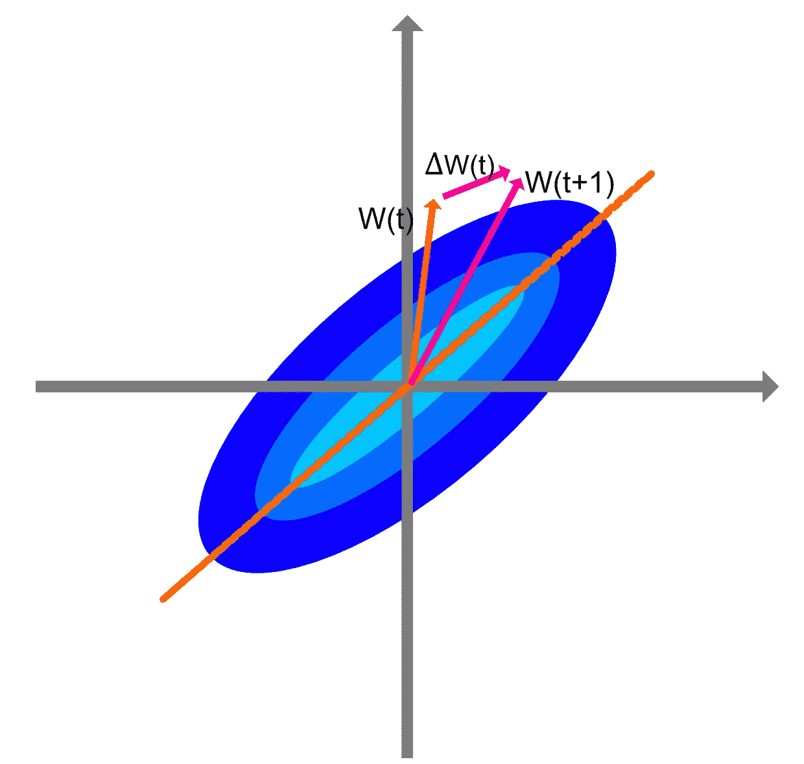
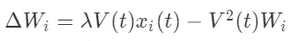
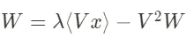
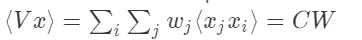
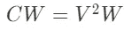
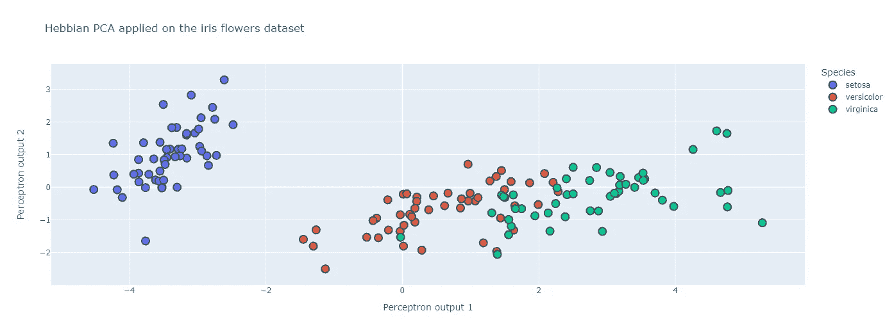

# 大脑如何进行主成分分析的高峰。

> 原文：<https://pub.towardsai.net/a-peak-at-how-the-brain-can-perform-principal-component-analysis-241e83225e5?source=collection_archive---------3----------------------->

大脑和现代世界有一个共同点:输出来自对巨大信息数据集的分析。最广为人知的数据分析方法之一叫做*主成分分析*或 *PCA* 。该方法的目标是将输入转换成新的表示，其中变量是成对去相关的。换句话说，该方法删除了数据集中的冗余。

上图代表了在开源 iris flower 数据集上应用的 PCA 方法([https://sci kit-learn . org/stable/auto _ examples/datasets/plot _ iris _ dataset . html](https://scikit-learn.org/stable/auto_examples/datasets/plot_iris_dataset.html))。这个数据集将是本文中使用的一个例子。尽管它很简单，但它可以很好地解释不同的方法。

可以看出，在主成分分析空间中，不同的物种是可以清楚识别的。PCA 是分析数据结构的有用工具，但它也有一些局限性。我要说的一个主要问题是，构成 PCA 空间基础的 PCA 向量必须是正交的。然而，没有理由认为它适用于所有数据集。尽管如此，PCA 仍然是更高级的数据分析技术的基本模块之一。

近年来，大量工作表明，视觉系统早期阶段的神经元响应特性类似于自然图像的冗余减少技术。大脑中的神经元不是独立的，而是相互连接的。这些神经元连接不是静态的，它们的动力学被称为突触可塑性。虽然突触可塑性是神经科学中一个活跃的研究课题，但这种神经生物学现象已由 Donald Hebb 于 1949 年开始描述:

**让我们假设回响活动(或“迹线”)的持续或重复往往会诱导持久的细胞变化，从而增加其稳定性……当细胞 A 的轴突足够接近以激发细胞 B 并重复或持续地参与激发它时，在一个或两个细胞中会发生一些生长过程或代谢变化，从而增加 A 作为激发 B 的细胞之一的效率。**

虽然这个规则看起来很罗嗦，但事实上它可以被简化为以下内容:**连接在一起的细胞，一起触发**。或者换句话说，当神经元一起活动时，它们的突触连接会增加。

神经科学中的 Hebb 规则可以归为无监督学习规则。事实上，它描述了神经可塑性的基本机制，其中由于突触前神经元引起的重复刺激增加了与突触后神经元的连接。我将使用一个简单的神经元模型，由 Oja 于 1982 年提出，该模型是线性的，神经元的输出实际上是接收到的输出的线性组合。

因此，神经元的活动 **V** 由下式描述:

另外，我们可以注意到，神经元的输出 **V(t)** 实际上是一个权重向量 **W** 和一个输入向量 **x** 的标量积。

现在，如果在每个时间步，神经元接收从概率分布 **P** 中提取的特定刺激，权重向量将根据(Hebb 规则)进行修改:

λ是一个称为学习率的量。该学习规则对应于 Hebb 规则，因为如果输入 **I** 和输出 **V** 同时为高，则权重将增加。

# 几何解释

为了深入了解这些修改在数据分布 **P** 中捕捉到了什么，让我们看一个二维示例。

分布 **P** 由蓝色区域表示。由于 **P** 的强方向性，输入呈现后学习规则的每次迭代都将根据红色和粉色箭头修改权重 **W** 。突触权重向量的最终方向将是分布 **P** 的最大方差的方向，或者换句话说，是 **P** 最宽的方向。然而，这个学习规则有一个问题。 **W** 的范数是无界的，因为它总是沿着输入协方差矩阵的特征向量的方向增加。

# 抑制增长:Oja 的规则

这个规则的想法是通过增加一个减的第二项来修改 Hebb 规则，这个减的第二项将限制 **W** 的增长。

为什么这个约束规则如此有趣？一旦无监督学习完成，权重遵循以下等式:

其中 **W** 和 **x** 为多维向量。该等式的第一项可以改写如下:

用 **C** 输入协方差矩阵。因此，我们得到:

我们的权重向量 **W** 是均衡时输入协方差矩阵 **C** 的特征向量。此外，该特征向量的范数为 1，并且它对应于具有最大特征值的特征向量。该神经网络的权重沿着捕获输入分布中的最大变化量的方向移动，这是第一主成分的属性。

要得到一个以上的组件，有必要考虑扩展**桑德法则**。首先，感知器网络将有多个输出(每个组件一个)。下一步是实现渐进 Oja 规则，但是以渐进的方式减去每个输出的预测输入。因此，每个权重向量从不同的输入集合中学习，当它们是输出时，减去更多的结构。这种广义 Hebbian 算法的 Python 实现如下:

函数 **update_data** 使用 Sander 规则计算网络权重的 Hebbian 学习规则。该功能针对 2 个输出进行校准(在 2 个维度上减少)。

下图显示了这个 2 输出感知器网络的输出确实充当了 PCA。数据集在权重向量上的投影结构非常类似于 PCA 的前两个分量，并且三个物种的聚类是可清楚区分的。

关于这种神经网络的下一个问题是:这些网络能否执行更高级的方法，如聚类和独立成分分析？因为我们的网络可以学习的统计取决于感知器输出的形状。学习不同的结构需要查看非线性输出函数，从而查看非线性 Hebbian 算法。