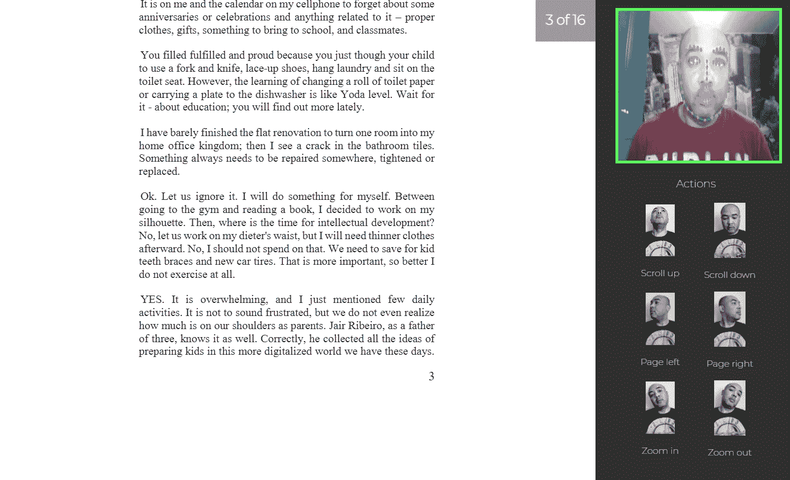
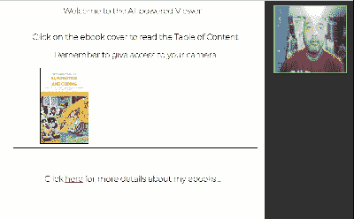
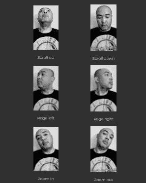

# 辅助人工智能的一个实例:计算机视觉 PDFReader

> 原文：<https://pub.towardsai.net/a-practical-example-of-assistive-a-i-the-computer-vision-pdfreader-b77b0f6f9bfb?source=collection_archive---------6----------------------->

## [计算机视觉](https://towardsai.net/p/category/computer-vision)

几周前，我和我的女儿们一起看了电影《万物理论》，这部电影讲述了物理学家斯蒂芬·霍金的一生，他对时间的发现，他与第一任妻子简·韦德的爱情，以及他的退化性运动疾病的进展。

一天，他收到了一个装有“智能”系统的轮椅，该系统支持他完成几项任务，包括写作。

通过这个系统，霍金教授能够使用一个独特的界面来控制他平板电脑的所有功能，当霍金移动脸颊时，他可以扫描屏幕键盘上的每个字母，一次一个。

后来，当他的病情逐渐恶化时，他的打字速度下降了，但英特尔的科学家使用算法进行了补偿，该算法准确预测了他接下来想要使用的单词。

这部电影的这一方面触动了我，让我去调查技术如何帮助有障碍的人完成他们的日常任务。这也是包容和公平的问题。

这部电影的这一方面触动了我，让我去调查[科技如何帮助有障碍的人](https://jairribeiro.medium.com/how-a-i-can-empower-assistive-technology-and-raise-inclusiveness-abf616e78377)完成他们的日常任务。这也是包容和公平的问题。

今天，人工智能和移动技术的民主化是改善全球融合的一种方式，为残疾人带来了更多的选择和生活质量。

# 实际例子

带着这个目标，我开始开发一个应用程序，帮助用户仅通过头部运动来控制 PDF 阅读器。

在我的研究过程中，我发现了一个由 [Fabrizio Di Guardo](https://medium.com/u/1215a1073da7?source=post_page-----b77b0f6f9bfb--------------------------------) 开发的非常棒的开源项目，它给了我充分的灵感，让我在继续完成辅助技术研究的同时开始构建一些东西。

从 Fabrizio 提供的代码开始(谢谢，dav Vero compensui per l ' iniziativa！)我正在开发一个版本，它将很快集成除计算机视觉、文本到语音转换和其他人工智能技术之外的其他技术。

此刻，使用人工智能，在特定的计算机视觉中，用 *Javascript* 编写的网络应用使用 [**face-api.js**](https://justadudewhohacks.github.io/face-api.js) 作为面部标志预测器来检测面部特征，以识别关键的兴趣点和面部图像。

有了这些信息，web 应用程序可以做出控制 pdf 阅读的决定，如放大和缩小、改变页面和上下滚动，使用 [**pdfjs**](https://github.com/mozilla/pdf.js) 进行 PDF 文档渲染。

市场上的许多应用程序使用摄像头来监控鼠标和键盘；我在这里的目的是提高对人工智能如何增强辅助技术的认识，让身体残疾的人能够完成日常任务。

# 一种网页人脸检测器

寻找面部的独特面部特征需要形状预测器来搜索图像上的兴趣点。

任何项目的大小都成比例地减小。在我们寻找图片中的精细信息之前，我们必须首先扫描一些视觉标记，以尽量减少误报。在这种情况下，我们首先要找到面部标志。

最准确的人脸检测系统之一是基于 [MobileNet](https://github.com/tensorflow/tfjs-models/tree/master/mobilenet) 的 SSD 模型，它可以一次性计算每个人脸的边界坐标和一个潜在向量中的人脸概率。

检测部分由 [face-api.js](https://github.com/liberoliber/CV_pdfviewer/blob/main/js/face-api.js) 促成，考虑加载模型，然后检测人脸和地标。注意，face-api.js 方法是异步的，所以它们返回一个 javascript [promise 对象](https://www.w3schools.com/js/js_promise.asp)。

输入图像由 [Web API](https://developer.mozilla.org/en-US/docs/Web/API) 的 ***mediaDevice*** 模块的 *getUserMedia* 方法实时提供，该方法提供对连接的媒体输入设备(如相机和麦克风)和屏幕共享的访问。本质上，它允许您访问任何媒体数据的硬件来源。

当涉及到 [face-api.js](https://github.com/liberoliber/CV_pdfviewer/blob/main/js/face-api.js) 检测到的人脸标志点时，是使用模型*face _ landmark _ 68 _ model-shard 1、*沿人脸映射 68 个关键点得到的。

型号的内存为 350kb，而小型型号的内存为 80kb。这两种模型都采用深度方向卷积，以及密集块。这些模型已经在具有 68 个面部标志的 35，000 幅图像的数据集上进行训练，这使得它非常适合实时应用程序，因为它非常轻量级，快速而准确。

# 识别头部姿势

该 web 应用程序提供了六种可能的动作来实时识别用户头部的三种运动:

1.  当用户向上看时，向上滚动
2.  当用户向下看时向下滚动。
3.  前一页，当用户向左看时。
4.  下一页，当用户向右看时。
5.  当用户向左倾斜头部时放大
6.  当用户向右倾斜头部时缩小

移动检测基于以下条件:

1.  当用户向上/向下看时，鼻子的长度相对于中间位置变化。当用户向上或向下看时，鼻子的长度会发生变化。当用户向下看时，它变大，当用户向上看时，它变小。因此，这个想法是实时测量绘制鼻子的点之间的距离，将其放在缓冲区中，并观察它们何时改变它们的值。考虑到与颧骨相关的点之间的距离，距离值被归一化，使得值*与网络摄像头的距离*无关。
2.  当用户左/右看时，左/右颌会离嘴很近，直到消失；同时，相应的点将远离另一边。当用户向左/向右看时，嘴和下巴会发生变化。系统控制 x 轴上的距离，使其适合任何不同的头部倾斜度。
3.  当用户向左/右倾斜头部时，y 方向上的距离增加。当头部倾斜时，y 方向的两眼距离增加。这个想法是观察眼睛的 y 坐标:通常情况下，眼睛之间在 y 方向的距离几乎为零。当头部倾斜时，两眼之间的距离增加。当距离大于某个阈值时，我们可以利用每只眼睛的 y 坐标较高的事实来了解头部倾斜的方向。

[facedetector.js](https://github.com/liberoliber/CV_pdfviewer/blob/main/js/FaceDetector.js) 使用特定数量的阈值来了解用户何时移动头部。这些值是根据经验得出的，所以我仍然在尝试不同的组合来调整它们，以改变系统的灵敏度或延迟。

例如，减少 buffer_len 将加快系统对用户的反应速度。尽管如此，仍然存在最小移动也被考虑在内的风险，使得文档垂直移动太多；如果您面临太多的误报，增加 buffer_thresh 会很有帮助。

# 模型实现

对于预训练的人脸检测模型，face-api.js 中有四种不同的模型权重:

*   *ssd_mobilenetv1_model* (人脸检测标准)
*   *tiny _ face _ detector _ model*(tiny 用于人脸检测)
*   *face_landmark_68_model* (地标检测标准)
*   *face _ landmark _ 68 _ tiny _ model*(tiny 用于地标检测)

你可以想象，小的比标准的小，但是没有标准的精确。

这个项目默认使用标准模型，这消耗了大量的 CPU 能力和内存。为了调解这个问题，可以降低分析场景的频率(现在系统每秒钟寻找三次运动变化)。但是仍然有大量的 CPU 消耗。我将很快尝试理解在我的 Nvidia Jetson Nano 或云上运行这个 web 应用程序的可能性。

如果你想试试我的演示，这里有链接:[https://ai-pdf-viewer.herokuapp.com/](https://ai-pdf-viewer.herokuapp.com/)

# 结论

该项目还处于最早期阶段，但我非常积极地继续研究，尽可能多地了解技术如何支持残疾人。

人工智能应该被构建和应用来减少不平等，并与建设一个更具包容性的世界合作，在这个世界上，技术可以让人们更高效、更舒适地执行日常任务。

同样，我期待人工智能给每个人越来越公平的条件。

# 参考资料:

*   演示:人工智能 Pdf 浏览器—[https://ai-pdf-viewer.herokuapp.com/](https://ai-pdf-viewer.herokuapp.com/)
*   GitHub 源代码:[https://github.com/liberoliber/CV_pdfviewer](https://github.com/liberoliber/CV_pdfviewer)
*   face PDF viewer-一个可通过头部运动使用面部标志检测进行控制的 PDF 查看器-[https://towardsdatascience . com/face PDF viewer-A-PDF-viewer-可通过头部运动进行控制-使用面部标志检测-ed7a91073bd1](https://towardsdatascience.com/facepdfviewer-a-pdf-viewer-controllable-by-head-movements-using-facial-landmark-detection-ed7a91073bd1)
*   MobileNet—[https://github . com/tensor flow/tfjs-models/tree/master/MobileNet](https://github.com/tensorflow/tfjs-models/tree/master/mobilenet)
*   斯蒂芬·霍金的轮椅是如何工作的—[https://www . howitworksdaily . com/how-Stephen-hawkings-轮椅-works/](https://www.howitworksdaily.com/how-stephen-hawkings-wheelchair-works/)
*   face-api.js 文档—[https://github . com/justadudewhohacks/face-API . js/blob/master/readme . MD # 68-point-face-landmark-detection-models](https://github.com/justadudewhohacks/face-api.js/blob/master/README.md#68-point-face-landmark-detection-models)
*   关于史蒂芬·霍金的 17 个有趣事实| OhFact！。[https://ohfact.com/interesting-facts-about-stephen-hawking/](https://ohfact.com/interesting-facts-about-stephen-hawking/)