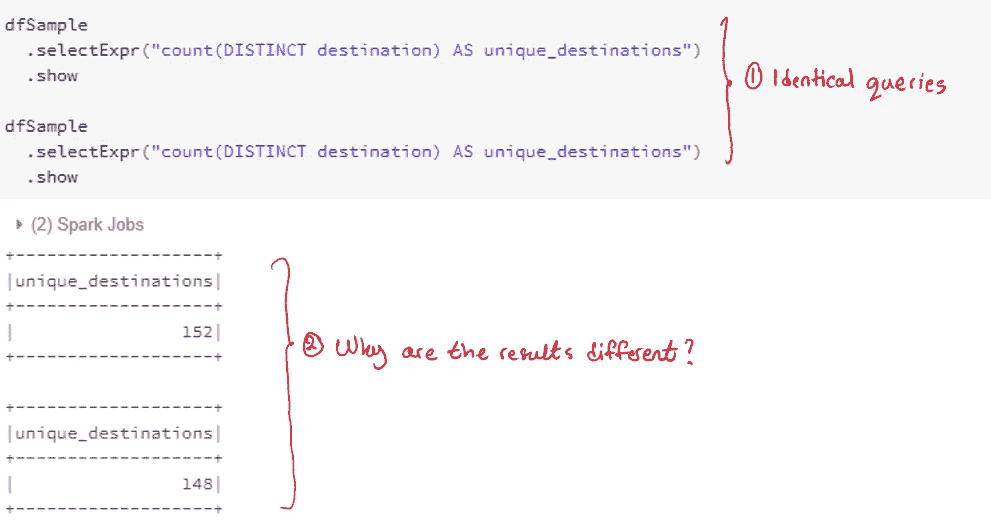
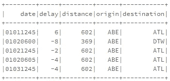
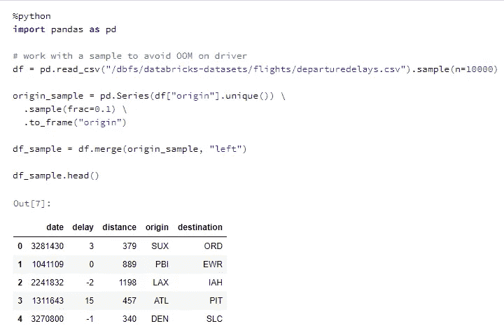
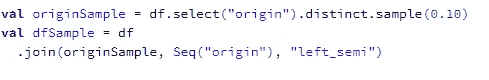
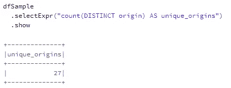
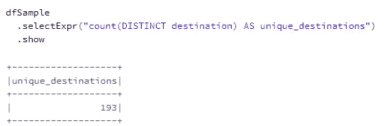
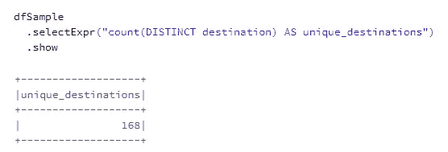
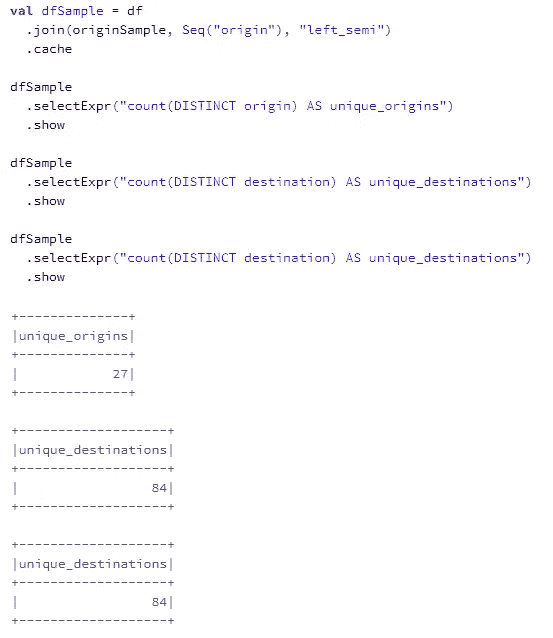

# 在 Spark 上处理随机样本时的实用技巧

> 原文：<https://pub.towardsai.net/a-practical-tip-when-working-with-random-samples-on-spark-23f6dbbe722b?source=collection_archive---------0----------------------->

# 介绍

在本文中，我将分享使用 Spark 分析数据帧的随机样本时的一个重要技巧。重现结果的代码可以在[这里](https://gist.github.com/hsm207/ebf98586fe21fc59f31143160de80698)找到。这是一个 HTML 版本的 Databricks 笔记本，所以你所要做的就是下载它的原始格式，然后在网络浏览器中显示下载的文件。

# 问题陈述

假设我们正在处理一个大型数据集。出于本文的目的，我们将假设所讨论的数据集是航班起飞延误数据集，如下所示:

图 1:航班起飞延误数据集的摘录。来源:Databricks 的数据集

由于这是一个大型数据集，我们决定从它的一个子集开始分析。很多人说我们可以对这个数据集进行采样，所以让我们假设我们决定随机样本`origin`的所有延迟都适用于我们希望我们的分析回答的任何业务问题。

下面是我们如何使用 Pandas 获得所需子集的方法:

图 2:使用 Pandas 获得所需的子集

在图 2 中，我们从将数据集读入`df`开始。然后，我们构建另一个包含随机样本`origin`的数据帧，我们将使用它来过滤`df`，并将过滤后的数据帧保存到`df_sample`。`df_sample`将成为所有进一步分析的起点。

我们如何使用 Spark 构建相同的子集？

# 解决办法

构建子集的一个自然方法是用 Spark 可以理解的术语重写 Python 代码。下面是在 Scala 中使用 Spark 的 Dataframe API 的一种方法:

图 3:使用 Spark 的 Dataframe API 获得所需的子集

# 陷阱

下面就来对`dfSample`做一些分析。以下是唯一原始值的计数:

图 4:随机样本中唯一来源的计数

以下是唯一目标值的计数:

图 5:随机样本中唯一目的地的计数

这里有一个值得思考的问题:用来计算唯一目的地计数的`dfSample`和用来计算唯一起点计数的是同一个吗？

让我们再次尝试执行图 5 中的代码来找出答案:

图 6:重新执行图 5 中的代码

很显然，`dfSample`每次调用都会改变！这意味着我们基于对`dfSample`的分析得出的任何结论都是无效的，因为每次计算都会产生一个新的样本。

# 实际解决方案

我们应该这样定义`dfSample`:

图 7:构建 dfSample 的正确方法

请注意，计算目的地唯一数量的两个调用在两种情况下产生相同的结果。

以前的解决方案不起作用的原因是，按照设计，每次需要结果时，Spark 都会从头重新执行整个转换。这意味着对于如图 5 所示的代码，除了计算`dfSample`中目的地的唯一数量，Spark 还将重新计算`dfSample`，这需要重新执行图 4 中定义了产生`dfSample`的转换的代码。因此，每次执行图 5 中的代码时，原因`dfSample`都会改变。

解决这个问题的方法是缓存`dfSample`的结果，如图 7 所示。其效果是显示唯一原点计数结果的调用将触发计算`dfSample`的调用，因为结果取决于`dfSample`。然后，任何依赖于`dfSample`的后续结果都将重用缓存的版本。

# 结论

本文的重点是展示在进行进一步分析之前缓存随机采样数据帧的结果的重要性。这是值得强调的一点，因为它是 Spark 独有的，这是由于它的惰性评估性质，这对于其他数据分析工具(如 Pandas 或 dplyr)的用户来说可能不明显。