# Node.js 入门

> 原文：<https://pub.towardsai.net/a-primer-on-node-js-ff518b78d330?source=collection_archive---------0----------------------->

## [编程](https://towardsai.net/p/category/programming)

## 这篇文章足以让您创建和使用基于节点的 web 服务器，进行 CRUD 操作，等等。


来源——【https://en.wikipedia.org/wiki/Node.js 

# 目录:

## 1.[入门](#ff8a)

*   [什么是节点](#a1fa)
*   [节点架构](#0969)
*   [节点如何工作](#3cf5)
*   [安装节点](#d092)
*   [第一个节点程序](#114d)

## 2.[节点模块系统](#576e)

*   [全局对象](#cd43)
*   [模块](#c412)
*   [创建模块](#a80a)
*   [装载一个模块](#35af)
*   [模块包装函数](#05bc)
*   [路径模块](#e22c)
*   [操作系统模块](#2320)
*   [事件模块](#dfb8)
*   [事件论据](#ff17)
*   [文件系统模块](#bd04)
*   [HTTP 模块](#5d20)

## 3.[节点包管理器](#9b4f)

*   [package.json](#c0b2)
*   [安装一个节点包](#bd96)
*   [使用一个包](#c901)
*   [包依赖关系](#fd8a)
*   [NPM 软件包和源代码管理](#d2c2)
*   [语义版本](#21ac)
*   [列出所有已安装的软件包](#14d0)
*   [查看软件包的注册表信息](#adee)
*   [安装特定版本的软件包](#886a)
*   [更新本地包](#e406)
*   [DevDependencies](#5d24)
*   [卸载软件包](#56df)
*   [使用全局包](#fb24)
*   [发布一个包](#2ece)
*   [更新已发布的包](#ef69)

## 4.[使用 Express 构建 RESTful APIs】](#8810)

*   [RESTful 服务](#e717)
*   [介绍快递](#1d00)
*   [构建您的第一个 Web 服务器](#d810)
*   [节点门](#6aef)
*   [环境变量](#ab3d)
*   [路线参数](#854f)
*   [处理 HTTP GET 请求](#c6b5)
*   [处理 HTTP POST 请求](#d6c5)
*   [使用 Postman 或 Thunder 客户端调用端点](#f37a)
*   [输入验证](#2ee0)
*   [处理 HTTP 上传请求](#48e2)
*   [处理 HTTP 删除请求](#e98b)

## 5.[表达高级话题](#d465)

*   [中间件](#cc8d)
*   [创建定制中间件](#ffdf)
*   [内置中间件](#835e)
*   [第三方中间件](#7841)
*   [环境变量](#0f52)
*   [配置](#3aad)
*   [调试](#2cb1)
*   [模板引擎](#70a5)
*   [构建代码](#cb39)

## 6.[异步 JavaScript](#f86b)

*   [异步与同步代码](#f8dd)
*   [处理异步代码的模式](#6bee)
*   [回调](#3819)
*   [承诺](#3150)
*   [用承诺代替回调](#da60)
*   [办理并联承诺](#1d39)
*   [异步&等待](#9f51)

## 7.用猫鼬进行 CRUD 操作

*   [简介](https://towardsdatascience.com/crud-create-read-update-delete-operations-on-nosql-database-mongodb-using-node-js-3979573b9b24#94cb)
*   [设置 MongoDB (NoSQL)](https://towardsdatascience.com/crud-create-read-update-delete-operations-on-nosql-database-mongodb-using-node-js-3979573b9b24#0e3d)
*   [同步与异步执行](https://towardsdatascience.com/crud-create-read-update-delete-operations-on-nosql-database-mongodb-using-node-js-3979573b9b24#bf3b)
*   [创建模式、模型、对象](https://towardsdatascience.com/crud-create-read-update-delete-operations-on-nosql-database-mongodb-using-node-js-3979573b9b24#1141)
*   [创建(同步)](https://towardsdatascience.com/crud-create-read-update-delete-operations-on-nosql-database-mongodb-using-node-js-3979573b9b24#dc7d)
*   [创建(异步)](https://towardsdatascience.com/crud-create-read-update-delete-operations-on-nosql-database-mongodb-using-node-js-3979573b9b24#1018)
*   [改为(同步)](https://towardsdatascience.com/crud-create-read-update-delete-operations-on-nosql-database-mongodb-using-node-js-3979573b9b24#fae5)
*   [读取(异步)](https://towardsdatascience.com/crud-create-read-update-delete-operations-on-nosql-database-mongodb-using-node-js-3979573b9b24#8677)
*   [更新(同步)](https://towardsdatascience.com/crud-create-read-update-delete-operations-on-nosql-database-mongodb-using-node-js-3979573b9b24#fbf2)
*   [更新(异步)](https://towardsdatascience.com/crud-create-read-update-delete-operations-on-nosql-database-mongodb-using-node-js-3979573b9b24#42ca)
*   [删除(同步)](https://towardsdatascience.com/crud-create-read-update-delete-operations-on-nosql-database-mongodb-using-node-js-3979573b9b24#d25a)
*   [更新(异步)](https://towardsdatascience.com/crud-create-read-update-delete-operations-on-nosql-database-mongodb-using-node-js-3979573b9b24#d4a6)
*   [资源&引用](https://towardsdatascience.com/crud-create-read-update-delete-operations-on-nosql-database-mongodb-using-node-js-3979573b9b24#fb6b)

## 8. [Mongo 数据验证](#7e55)

*   [验证](#9a52)
*   [内置验证器](#832b)
*   [自定义验证器](#e933)
*   [异步验证器](#4a91)
*   [验证错误](#3c0b)
*   [模式类型选项](#94bb)

## 9.[认证&授权](#a699)

*   [简介](#be5f)
*   [创建用户模型模式](#f42c)
*   [注册用户](#1b10)
*   [使用 Lodash](#1867)
*   [哈希密码](#97ed)
*   [认证用户](#af03)
*   [JSON Web 令牌(JWT)](#8539)
*   [生成认证令牌](#275e)
*   [设置响应头](#5d2d)
*   [授权中间件](#ecb4)
*   [获取当前用户](#60a8)

## 10.[处理和记录错误](#9abd)

*   [拒绝承诺的处理](#4064)
*   [快递错误中间件](#411c)
*   [使用快速异步错误](#23a6)
*   [记录错误](#d412)
*   [记录到 MongoDB](#0932)
*   [处理未捕获的异常](#6274)
*   [未处理的承诺拒绝](#d03a)
*   [代码重构](#539c)

## [参考文献&资源](#fc01)

包含所有与本文相关的代码和依赖项，可以在这里找到:[https://github.com/bala-codes/A-Primer-on-Node.js](https://github.com/bala-codes/A-Primer-on-Node.js)

大多数部分都包含后续工作所需的代码块，如果您想在执行过程中也执行这些代码，可以克隆 repo。

软件包列表存在于相应目录下的 package.json 文件中，并使用`npm install`进行安装

# 一.开始

## 1.什么是节点

节点是一个在浏览器外执行 JavaScript 代码的运行时环境。它通常用于构建后端服务，如支持 Web 应用程序、移动应用程序等的 API。在生产环境中，它也是超快的和高度可伸缩的。除此之外，它还可以快速构建，与其他后端服务相比需要更少的代码行，更少的文件，可以处理更多的请求，并提供更快的响应时间。

## 2.节点架构

每一个 javascript 代码都需要一个 javascript 引擎将其转换成机器代码，以供机器理解和代码执行。浏览器提供了运行时环境。

Node 使用 Google 构建的一个名为 V8 engine +其他模块的 javascript 引擎来处理 node.js 程序。

同样，node 不是一个框架，它只是一个用于执行 javascript 代码的运行时环境。

## 3.节点如何工作

Node 是高度可扩展的、数据密集型的，并且可以创建实时应用。这是因为非阻塞(异步)的操作形式。

这意味着单个线程异步地服务/处理多个请求。请求可以是从数据库获取一段数据或执行任何 HTTP 动词，因为它们不等待任何请求完成，所以是高效的。

你可能会问，线程先前发起的请求的响应发生了什么，这些响应被送入一个叫做事件队列的东西，节点不断地监视事件队列，当它在事件队列中发现任何消息时，它就处理它。
Node 是 I/O 密集型应用的理想选择，而不是需要更多时间来执行计算的 CPU 密集型操作。

## 4.安装节点

从[这里](https://nodejs.org/en/)下载最新的节点版本。

现在运行安装程序，通过运行`node --version`打开 CMD 来检查版本。

## 5.第一节点程序

创建一个新文件 app.js .显然是一个 Hello World

```
function greet(){
     console.log('Hello World');
}greet()
```

在 CMD 中运行程序，`node app.js`

# 二。节点模块系统

## 1.全局对象

在 node anywhere 中可以访问一些对象和函数。其中一些是

```
console.log() (or) global.console.log()setTimeout()
clearTimeout()setInterval()
clearInterval()
```

它们被称为全局对象。

## 2.模块

有一个冲突，在不同的 node.js 程序中声明了两个具有相同函数名的函数，它们会产生全局冲突。

因此，为了解决这个问题并使代码更简洁，我们使用了模块，我们可以在这些模块中定义相同的变量或函数，并相应地调用它们。

节点应用程序中的每个文件都被视为一个模块。文件中定义的变量或函数是作用域。默认情况下，它们在文件之外是不可见的，我们需要显式导出它们。

## 3.创建模块

让我们创建一个简单的模块来发送 HTTP 请求。

```
```
first_module.js 
```var url = 'https://google.com'function get(message){
     // Send a HTTP request
     { ... }
     console.log(message)
}// Make get function available outside the programmodule.exports = get;
```

## 4.加载模块

现在，让我们加载上一步中导出的模块。确保上述文件和当前文件在同一个文件夹中。

```
```
app.js
```const get_method = require('./first_module')console.log(get_method('Some message')) 
```

## 5.模块包装函数

一般来说，节点不直接执行我们的代码，而是将代码封装在一个函数中，如下所示，然后再导出。

```
(function (exports, require, module, __filename, __dirname){
   '''
      your codes goes here
   '''
})
```

这就是 node 如何包装我们在任何 node js 程序中编写的函数，并使其在其他地方可用。

## 6.路径模块

有一些非常简单的模块已经内置到节点中，我们可以直接使用它们。所以让我们看看其中的一些。

你可以在这里找到所有内置模块[。](https://nodejs.org/dist/latest-v16.x/docs/api/)

现在让我们来解决路径模块的一些功能。你可以找到所有包含在路径模块中的功能，在这里可以找到[。](https://nodejs.org/dist/latest-v16.x/docs/api/path.html)

```
'''
   app.js
'''// Look modules inside core of Node
const path = require('path')var pathObj = path.parse(__filename);
console.log('pathObj',pathObj)// The output will be the properties of the current js file.
```

此外，我们还会看到节点中的其他一些模块。

## 7.操作系统模块

操作系统模块揭示了一些与我们正在运行的这个节点应用程序的操作系统相关的属性。

```
'''
   app.js
'''// Look modules inside core of Node
const os = require('os')var totalMemory = os.totalmem();
var freeMemory = os.freemem();console.log('Total Memory', totalMemory);
console.log(`Free Memory: ${freeMemory}`); // ECMAScript 6
```

更多操作系统内部可用的功能可以在[这里](https://nodejs.org/dist/latest-v16.x/docs/api/os.html)找到。

## 8.事件模块

事件是表明某事已经发生的信号。

有很多可用的函数，所以我们研究其中的一些。这里我们简单地创建/注册一个监听器，一旦它被调用，我们就发出消息。

```
'''
   app.js
'''// Look modules inside core of Node
const EventEmitter = require('events'); // CLASS --> EventEmitter// Since EventEmitter is a Class, let's create a instance of the class to access the methods inside it. const emitter = new EventEmitter(); // OBJECT --> emitter// Register a listener
emitter.on('messageReceived', function() {
   console.log('Received');
});// Raise an event 
emitter.emit('messageReceived');
```

事件中可用的更多功能可以在[这里](https://nodejs.org/dist/latest-v16.x/docs/api/events.html)找到。

## 9.事件参数

事件是表明某事已经发生的信号。现在将一些事件参数与箭头函数结合起来

```
'''
   app.js
'''// Look modules inside core of Node
const EventEmitter = require('events'); // CLASS --> EventEmitter// Since EventEmitter is a Class, let's create a instance of the class to access the methods inside it.const emitter = new EventEmitter(); // OBJECT --> emitter// Register a listener
emitter.on('messageReceived', (arg) => {
   console.log('Received', arg);
});// Raise an event with arguments
emitter.emit('messageReceived', {id:1 , token:'1234'});
```

## 10.文件系统模块

如何使用 node.js 程序处理文件。

使用 fs 模块，在它下面定义的每个操作都有同步和异步两种执行形式。

```
'''
   app.js
'''// Look modules inside core of Node
const fs = require('fs');const files = fs.readdirSync('./') // Synchronous
console.log('Files present under the directory', files)// Asynchronous Function - provides a callback
fs.readdir('./', function(err, files){
   if (err) console.log('Error', err)
   else console.log('Result', files)
});
```

文件系统中更多可用的函数可以在[这里](https://nodejs.org/dist/latest-v16.x/docs/api/fs.html)找到。

## 11.HTTP 模块

HTTP 模块是 web 应用程序的主干。，在这里我们可以创建一个 web 服务器并用一个端点来托管它。在这里，我们创建一个运行在本地主机上的小型 web 服务器。

```
'''
   app.js
'''// Look modules inside core of Node
const http = require('http');const server = http.createServer((req, res) => {
   if (req.url == '/'){
      res.write('Hellow World')
      res.end();
   }
});// Event Listener
server.on('connection', (socket) => {
   console.log('New connection')
});server.listen(3000); // PORT Numberconsole.log('Listening on port 3000...');
```

HTTP 中可用的更多函数可以在这里找到。

# 三。节点程序包管理器

用于安装第三方软件包的注册表。此外，如果你有任何想法发布自己的模块，那么这是你的地方。

检查您的 npm 版本`npm -v`

更多关于那个[这里](https://www.npmjs.com/)。

## 1.package.json

它基本上是一个 JSON 文件，包含关于应用程序的基本信息，如名称、版本、描述、依赖关系和其他元数据。

要启动一个新的应用程序/项目，并通过输入元数据自动创建 package.json，请运行命令`npm init`。

每当我们创建一个新项目时，建议运行上面的命令。

稍后，如果您想要在您的项目目录中安装软件包，或者如果有人与您共享了该项目，并且您想要安装依赖项，只需运行命令`npm install`

## 2.安装节点包

你可以在这里找到所有的包。

要安装一个节点包，转到相应的项目文件夹并运行 CMD 中的命令，`npm i <package name>`。

现在，当我们安装这个包时，这个新包会自动添加到 package.json 中，并且这个包保存在 *node_modules* 目录中。

## 3.使用包

通常是为了导入库/模块。

```
'''
   index.js
'''// Looks for the modules inside Node Modules Folder
var _ = require('underscore')var result = _.contains([1,2,3], 3);
console.log('Found match', result)
```

## 4.包依赖关系

当我们安装一个特定的包时，这个特定的包可以在 node_modules 目录中找到，而且大多数时候，您可能还会看到正在安装的另一个包。

所以它们是您的实际包可以依赖的附加包。这些被称为依赖。

## 5.NPM 软件包和源代码管理

当我们实际实时构建一个 web 应用程序时，可能需要很多包才能无缝运行。

但是当包含更多的包时，它们被添加到 node_modules 文件夹中，并且它在 MBs 中的权重更大。

因此，在转移到另一个开发人员或 Github 等源代码控制应用程序时。，我们不能包含此文件。

但幸运的是，我们的 package.json 文件包含依赖项，可以随时随地构建。

## 6.语义版本控制

在语义版本控制中，一个节点包有 3 个组件，像^1.10.4.

这些是主要的。小补丁

补丁——通常用于修复任何错误。

minor——它通常用于在不破坏现有 API 的情况下添加一些功能。

major——它通常用于添加一些可能会破坏现有 API 的功能。

最后，包中的^字符是一个指示符，当实际的包有一些更新时，它应该不会影响我们的代码，节点可以在将来的次要版本和补丁版本中查找相同的主要版本和可能的修改。

## 7.列出所有已安装的软件包

运行代码来查看所有的包及其依赖项，`node list`。

运行代码只查看你的包，忽略它们的依赖`npm list --depth=0`。

## 8.查看软件包的注册表信息

运行代码`npm view <package_name>`，查找特定包的元数据。

运行代码，只查看特定包的依赖项。

运行代码来查看特定包的版本，`npm view <package_name> versions`。

## 9.安装软件包的特定版本

运行代码`npm i <package_name>@<Major>.<Minor>.<Patch>`

## 10.更新本地包

为了将我们实际的本地包与该包的当前版本进行比较，运行代码`npm outdated`。

要更新软件包，运行命令`npm update`，它只更新任何软件包的次要版本和补丁版本。

在更新主要版本之前必须采取预防措施，因为它可能会破坏我们的代码。运行`npm-check-updates`、`npm-check-updates -u`，升级主版本，稍后安装`npm i`以反映在我们的包中。

## 11.开发依赖性

在开发阶段，我们可能包括单元测试、集成测试等。，我们可能会使用一些包来测试它，这些包不应该移动，而应用程序在生产中。

所以要安装一些开发包，运行命令`npm i <pkg_name> --save-dev`。因为它们保存在 package.json 文件中的“devDependencies”下，node 会处理剩下的工作。

## 12.卸载软件包

要卸载软件包，运行命令`npm un <pkg_name>`

## 13.使用全局包

npm 是全局包的一个例子，在全局包中，所有节点应用程序都可以通用地运行。

要升级这样的全局包，运行命令`npm i -g npm`，这里它更新 npm。

在此查找全局包的所有更新，`npm -g outdated`

## 14.发布包

尝试下面的顺序，从头开始创建一个包，直到发布，出于我们的考虑，让我们假设我们的包名是 *icecream*

1.  `mkdir icecream`
2.  `cd icecream`
3.  `npm init --yes`
4.  添加一个新文件 *index.js* ，它是我们包的入口点。在这里你可以添加你的功能和其他等等。,
5.  通过`npm adduser`在 npm 中创建一个帐户，否则，使用`npm login`登录。提供用户名、密码和电子邮件。
6.  要发布包，运行`npm publish`
7.  要在另一个项目中使用新创建的包，运行`npm i icecream`
8.  恭喜你出版了你自己的第一个包。

## 15.更新已发布的包

现在，如果我们想添加更多的功能，并创建一个新版本的包。

运行`npm version <major/minor/patch>` & `npm publish`。

# 四。使用 Express 构建 RESTful APIs

HTTP 包对于创建 web 服务器很有用，它确实是一种方法，但是在复杂的应用程序中，我们不能依赖 HTTP。但幸运的是，我们有一个 express 包，它是一个构建在 HTTP 包之上的快速而轻量的框架，可以用较少的硬编码来处理复杂的工作流。

## 1.RESTful 服务

REST—**Re**presentation**S**state**T**transfer 在 web 服务器中建立 HTTP 动词(GET、POST、PUT、DELETE)。

## 2.Express 简介

用新的 express 包替换旧的 HTTP 包。如果你注意到了，我们在 HTTP 方法中有很多 if 块来暴露我们的端点。

运行命令来启动我们的新 express 项目。

1.  `mkdir express-demo`
2.  `cd express-demo`
3.  `npm init --yes`
4.  `npm i express`

点击了解更多关于 express [的信息。](https://www.npmjs.com/package/express)

## 3.构建您的第一台 Web 服务器

创建一个新文件 index.js，在这里我们构建我们的 web 服务器。

现在为了更容易理解，让我们记录电影列表，并使用 HTTP 动词操作它们。

```
const express = require('express')
const app = express() // Contains the HTTP Verbs// GET METHOD
app.get('/', (req, res) => {
  res.send('Hello World');
});app.get('/api/movies', (req, res) => {
  res.send([1,2,3,4,5])
})// Listen PORT
app.listen(3000, () => console.log('Listening on port 3000'));
```

现在运行 cmd 中的代码，`node index.js`并点击带有端点 localhost:3000 和 localhost:3000/api/movies 的浏览器，您一定会看到类似如下的消息。

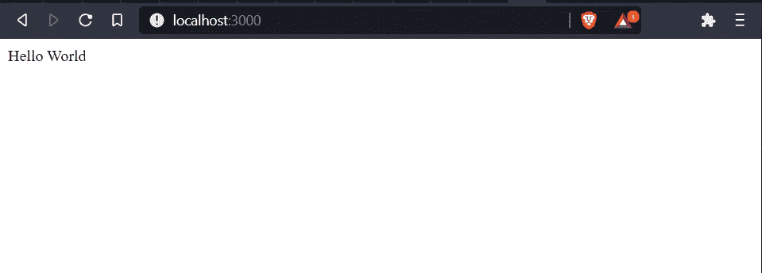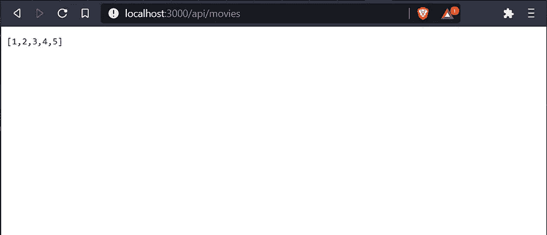

locah host:3000 & localhost:3000/API/movies

更多关于 express API [的信息，请点击](https://expressjs.com/en/4x/api.html)。

## 4.Nodemon

因此，对于我们所做的每一个更改，我们都应该停止服务器并重新启动。我知道这很繁琐，所以我们将使用一个名为 nodemon(节点监视器)的包，如果代码有任何变化，它将自动重启服务器。

运行命令安装 nodemon，`npm i nodemon`。

现在通过运行`nodemon index.js`启动 web 服务器。

## 5.环境变量

环境变量基本上是变量的一部分，流程在其中运行，它在我们的应用程序之外运行。比如我们这里的端口号。

首先在 windows 上使用 set PORT=5000 设置端口值，或者在 MAC 上使用 export PORT=5000 设置端口值

```
const express = require('express')
const app = express() // Contains the HTTP Verbs// GET METHOD
app.get('/', (req, res) => {
  res.send('Hello World');
});app.get('/api/movies', (req, res) => {
  res.send([1,2,3,4,5])
})
// PORT
const port = process.env.PORT || 3000;// Listen PORT
app.listen(port, () => console.log(`Listening on port ${port}`));
```

## 6.路线参数

现在让我们向电影数据库添加新的路线并获取它们。

现在在路由中，我们可以通过添加:id 值来索引它们，并通过添加？queryparameters。

```
const express = require('express')
const app = express() // Contains the HTTP Verbs// GET METHOD
app.get('/', (req, res) => {
  res.send('Hello World');
});**app.get('/api/movies', (req, res) => {
  res.send([1,2,3,4,5])
})****app.get('/api/movies/:id', (req, res) => {
  // res.send(req.params)
  res.send(req.query)
})**// PORT
const port = process.env.PORT || 3000;// Listen PORT
app.listen(port, () => console.log(`Listening on port ${port}`));
```

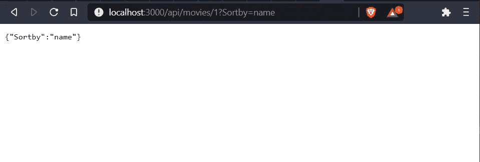

按 id(左)和按查询(右)路由参数

## 7.处理 HTTP GET 请求

现在让我们开始接收 GET 请求，并根据用户提供的 id 提供电影。因此，我们编写了一个小函数来获取基于 id 的电影。

```
const express = require('express')
const app = express() // Contains the HTTP Verbsconst movies = [{ id:1, name: 'Tenet'},{ id:2, name: 'Quantum of Solace'},{ id:3, name: 'Inception'}]// GET METHOD
app.get('/', (req, res) => {
  res.send('Hello World');
});app.get('/api/movies', (req, res) => {
  res.send(movies)
})**app.get('/api/movies/:id', (req, res) => {
const movie = movies.find(m => m.id === parseInt(req.params.id));
if (!movie) res.status(404).send('No movie found for the given id') res.send(movie)
});**// PORT
const port = process.env.PORT || 3000;// Listen PORT
app.listen(port, () => console.log(`Listening on port ${port}`));
```

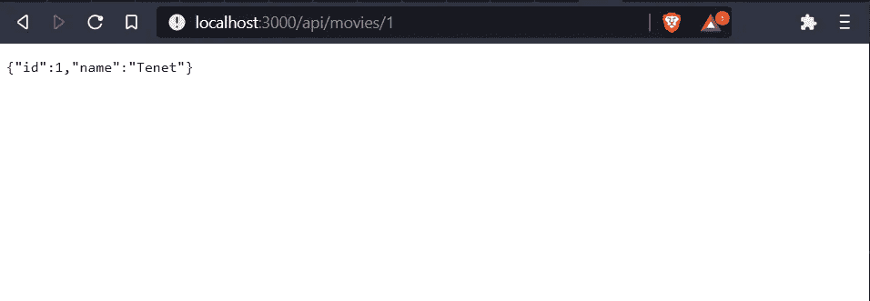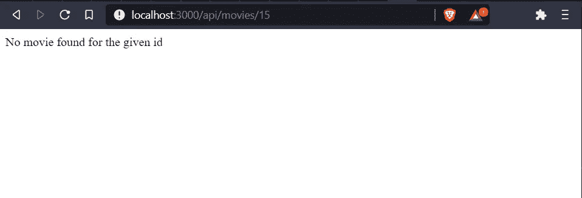

[http://localhost:3000/API/movies/1](http://localhost:3000/api/movies/15)T10[http://localhost:3000/API/movies/15](http://localhost:3000/api/movies/15)

## 8.处理 HTTP POST 请求

现在我们可以使用 POST 方法根据用户的请求在电影数据库中创建一个新的课程。

```
const express = require('express')
const app = express() // Contains the HTTP Verbsapp.use(express.json());const movies = [{ id:1, name: 'Tenet'},{ id:2, name: 'Quantum of Solace'},{ id:3, name: 'Inception'}]// GET METHOD
app.get('/', (req, res) => {
  res.send('Hello World');
});app.get('/api/movies', (req, res) => {
  res.send(movies)
})app.get('/api/movies/:id', (req, res) => {
const movie = movies.find(m => m.id === parseInt(req.params.id));
if (!movie) res.status(404).send('No movie found for the given id') res.send(movie)
});**app.post('/api/movies/', (req, res) => {
  const movie = {id: movies.length + 1,name: req.body.name};
  movies.push(movie);
  res.send(movie)
});**// PORT
const port = process.env.PORT || 3000;// Listen PORT
app.listen(port, () => console.log(`Listening on port ${port}`));
```

## 9.使用 Postman 或 Thunder 客户端调用端点

为了检查上述 POST 请求是否成功，我们需要根据您的选择通过 postman 或 thunder 提供的服务进行检查。

显然，浏览器只能在这些端点上发送 GET 请求，因为它们是为这样做而设计的。

现在我们看到，我们得到了成功 200 的回应。


## 10.输入验证

我们必须始终验证输入的内容，并执行一些基本的检查，以确保它们是正确的。所以在这里，我们保证他们正在插入的电影名称不是空的，并说它必须至少有 3 个字符。

我们可以用 if(！req . body . name | | req . body . name . length< 3), but as our project gets complex, we can use an input validation package called Joi, more on that [此处](https://www.npmjs.com/package/joi)。

Joi — API 和文档[此处](https://joi.dev/api/?v=17.4.0#introduction)。

```
const express = require('express')
const app = express() // Contains the HTTP Verbs
const Joi = require('joi');
app.use(express.json());const movies = [{ id:1, name: 'Tenet'},{ id:2, name: 'Quantum of Solace'},{ id:3, name: 'Inception'}]// GET METHOD
app.get('/', (req, res) => {
  res.send('Hello World');
});app.get('/api/movies', (req, res) => {
  res.send(movies)
})app.get('/api/movies/:id', (req, res) => {
const movie = movies.find(m => m.id === parseInt(req.params.id));
if (!movie) res.status(404).send('No movie found for the given id') res.send(movie)
});**app.post('/api/movies/', (req, res) => {
  const schema = Joi.object({name: Joi.string().min(3).required()
});
  const result = schema.validate(req.body)
  console.log('result', result)

  if (result.error){
    res.status(400).send(result.error.details[0].message)
    return; // Don't execute the rest of the program
}** **const movie = {id: movies.length + 1,name: req.body.name};
  movies.push(movie);
  res.send(movie)
});**// PORT
const port = process.env.PORT || 3000;// Listen PORT
app.listen(port, () => console.log(`Listening on port ${port}`));
```

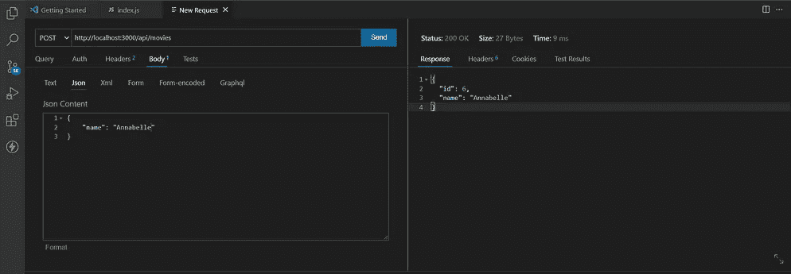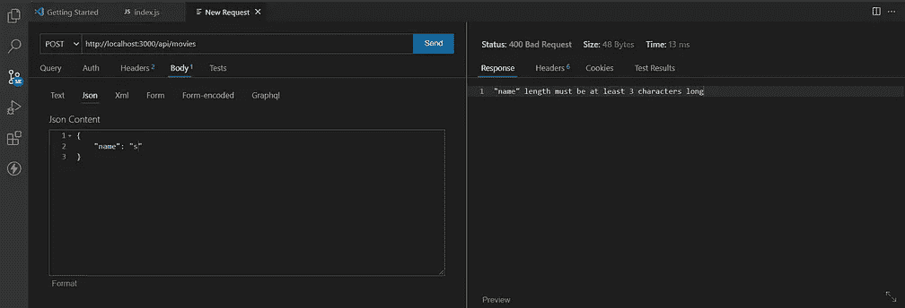

成功(200)和失败(404)

## 11.处理 HTTP PUT 请求

现在让我们根据用户提供的 id 更新一个电影名。

```
const express = require('express')
const app = express() // Contains the HTTP Verbs
const Joi = require('joi');
app.use(express.json());const movies = [{ id:1, name: 'Tenet'},{ id:2, name: 'Quantum of Solace'},{ id:3, name: 'Inception'}]// GET METHOD
app.get('/', (req, res) => {
  res.send('Hello World');
});app.get('/api/movies', (req, res) => {
  res.send(movies)
})app.get('/api/movies/:id', (req, res) => {
const movie = movies.find(m => m.id === parseInt(req.params.id));
if (!movie) res.status(404).send('No movie found for the given id') res.send(movie)
});app.post('/api/movies/', (req, res) => {
  const schema = Joi.object({name: Joi.string().min(3).required()
});
  const result = schema.validate(req.body)
  console.log('result', result)

  if (result.error){
    res.status(400).send(result.error.details[0].message)
    return; // Don't execute the rest of the program
}const movie = {id: movies.length + 1,name: req.body.name};
  movies.push(movie);
  res.send(movie)
}); **app.put('/api/movies/:id', (req, res) => {
  // Look up the movie
  // If not existing, return 404** **const movie = movies.find(m => m.id === parseInt(req.params.id));
  if (!movie) res.status(404).send('No movie found for the given id') // 404

  const { error } = validateMovies(req.body); // Equivalent to result.error
  if (error){
    res.status(400).send(error.details[0].message)
    return; // Don't execute the rest of the program
  }** **// Update movie
  // Return the updated movie

  movie.name  = req.body.name
  res.send(movie)
 })****function validateMovies(movie){
  // Validate
  // If invalid, return 400 - Bad request

  const schema = Joi.object({
    name: Joi.string().min(3).required() });** **return schema.validate(movie);
};**// PORT
const port = process.env.PORT || 3000;// Listen PORT
app.listen(port, () => console.log(`Listening on port ${port}`));
```

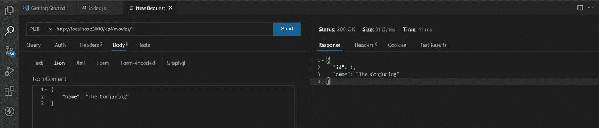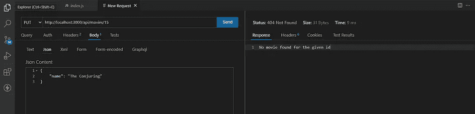

成功(200)和失败(404)

## 12.处理 HTTP 删除请求

现在让我们根据用户提供的 id 删除一个电影名。

```
**app.delete('/api/movies/:id', (req, res) => {
  // Look up the course
  // Not Existing, return 404** **const movie = movies.find(m => m.id === parseInt(req.params.id));
  if (!movie) res.status(404).send('No movie found for the given 
      id') // 404** **// Delete
  const index = movies.indexOf(movie);
  movies.splice(index, 1)

  // Return the same movie
  res.send(movie)****})**
```

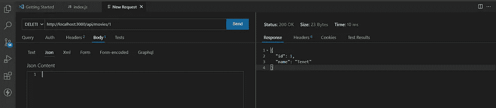

成功(200)和失败(404)

# 动词 （verb 的缩写）表达高级主题

## 1.中间件

中间件是接受请求对象并向客户端返回响应的东西。

请求处理有时可能会通过一个流程管道，每个流程都包含一个中间件功能。在下面的过程中，JSON 和 route 操作是中间件。

`app.use(express.json())`

喜欢请求→ json() → route() →响应

## 2.创建定制中间件

为此，让我们为收到的每个请求创建一个认证中间件，然后将控制权交给项目中的下一个中间件。更简单地说，如果不将它传递给其他中间件，它将会卡在自己内部。

```
// Middleware - 1
app.use(express.json());// Middleware - 2
app.use(function(req, res, next){
  console.log('Logging request...');
  next(); // Pass control to the next middleware; otherwise stuck
})// Middleware - 2
app.use(authentication);function authentication(req, res, next){
  console.log('Authentication Starts...');
  next();
}
```

现在看看控制台，我们可以看到，对于每个命中的请求，它每次都经过我们的定制中间件。

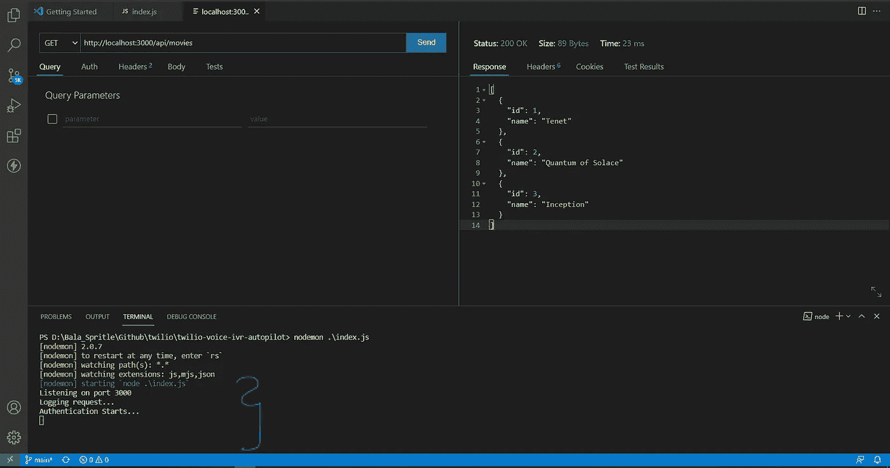

中间件被记录

## 3.内置中间件

我们可以利用许多内置的中间件。比如`app.use(express.json());`，它自动解析 req.body 中的任何 JSON 对象，并以 JSON 格式提供给我们使用。

app . use(express . urlencoded({ extended:true }))；

app . use(express . static(' public '))；

`app.use(express.urlencoded({extended: true}));` —接收请求中的表单数据。

`app.use(express.static('public'));` —为 web 服务器中的静态文件提供服务，因此如果我们创建一个公共文件夹并使用一些静态文件，就可以从 web 上访问它。

## 4.第三方中间件

所以我们用头盔中间件来演示一下。

1.  头盔— [链接](https://github.com/helmetjs/helmet)，帮助保护带有各种 HTTP 头的 Express 应用。
2.  morgan — [link](https://expressjs.com/en/resources/middleware/morgan.html) ，node.js 的 HTTP 请求记录器中间件。

```
const express = require('express');
const helmet = require('helmet')
const morgan = require('morgan')
const app = express() // Contains the HTTP Verbsapp.use(express.json());
app.use(helmet());
app.use(morgan('tiny'));
```

现在，如果我们试图访问 node.js 程序的端点，它将被记录如下。

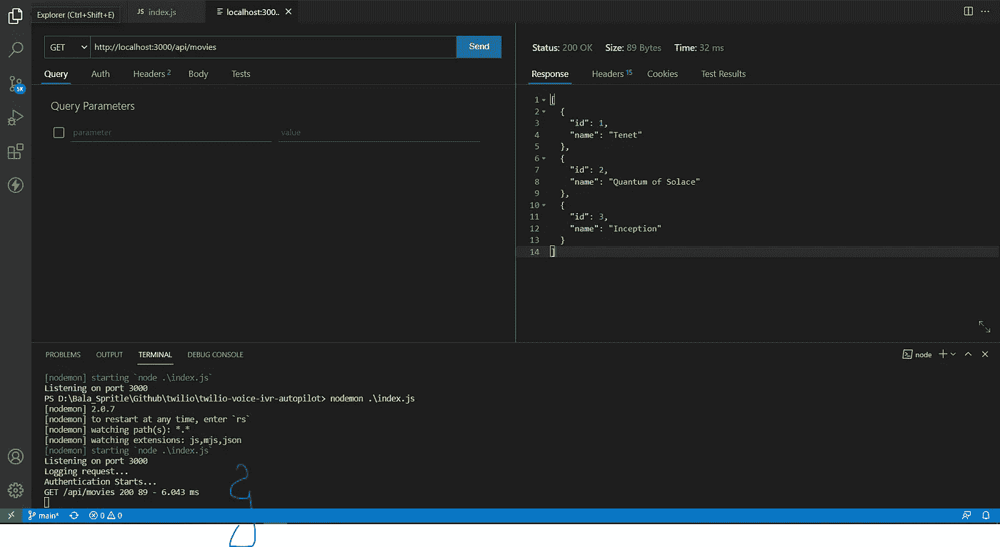

摩根记录者

更多关于那个[这里](https://expressjs.com/en/resources/middleware.html)。

## 5.环境变量

有时，我们需要存储环境变量，如端口、生产/开发环境、API 密钥等。，所以我们可以使用命令`set NODE_ENV=production`导出或设置它们，并通过访问它在代码中使用它们。一个简单的用例如下:

```
console.log(`Node Environment : ${process.env.NODE_ENV}`)if (app.get('env') == 'development'){
  app.use(morgan('tiny'));
  console.log('Morgan Enabled')
};
```

因此，只有在开发服务器上，我们才记录传入的请求。

## 6.配置

## 7.排除故障

有时在开发过程中，我们可能希望看到大多数函数或路径的日志，后来我们通常会删除它们或注释掉它们，将来，如果我们进行任何更新，我们可能会插入调试代码或取消注释。这是一个繁琐耗时的过程。

因此，我们应该寻找一个软件包，以便更有效地完成这个过程。

安装调试包，`npm i debug`，

```
const debug = require('debug')('app:debug') 
// export DEBUG=app:debug in CMDconsole.log(`Node Environment : ${process.env.NODE_ENV}`)if (app.get('env') == 'development'){
  app.use(morgan('tiny'));
  debug('Morgan Enabled')
};
```

因此，如果我们将变量 DEBUG 设置为 app: debug in cmd，然后执行代码，那么您将看到语句' Morgan Enabled '，否则它不会打印所有内容。

## 8.模板引擎

有时我们需要为客户机发送 HTML 标记，而不是 HTTP 动词上的原始 JSON 响应。所以我们要利用一个叫做 pug 的包，来安装它运行`npm i pug`。

稍后在代码中设置引擎类型，并创建一个新文件夹“views”和一个包含 HTML 元素的文件名 index.pug

```
'''
index.pug
'''html
   head
      title=title
   body
      h1=messgae '''
index.js
'''app.set('views', './views');
app.set('view engine', 'pug');app.get('/', (req, res) => { res.render('index', {'title':'My Express Movie App', message:      'Welcome to Movie Database'})});
```

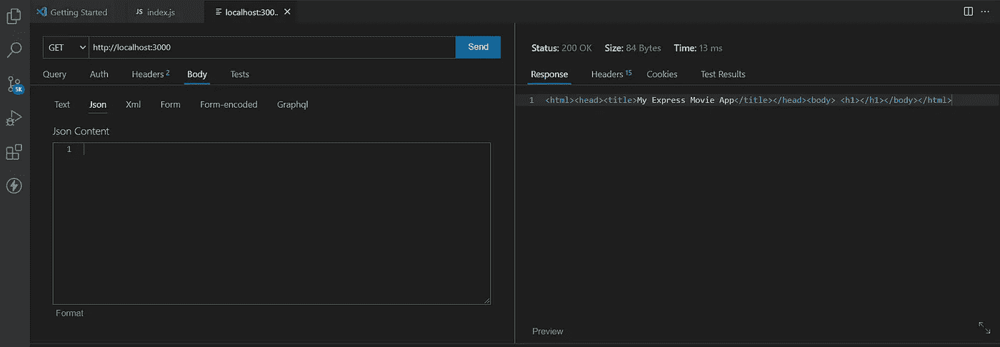

PUG 生成的 HTML 页面

## 9.构建代码

您可以检查我们到目前为止所做的实现，所有这些都是在同一个 index.js 中完成的，还可以检查嵌入的要点，以确保我们在同一页上。

此外，我同意，这不是一个有效的方法，所以我们需要整齐地组织整个代码。

有组织的代码被分成多个文件和文件夹，并在本文的底部添加了 GitHub repo 链接。

# 不及物动词异步 JavaScript

## 1.异步与同步代码

正如我们已经阐明的，Node Js 执行异步或非阻塞执行，这意味着它不会等待函数完成，而是逐行执行。

所以我们举个简单的例子。

```
console.log('Before')setTimeout(() => {
console.log('Simulating a database operation')
}, 2000);console.log('After')OUTPUTS : 
Before
After
Simulating a database operation
```

现在，从输出中我们可以看到，在执行我们插入的超时函数时，它没有等待 2 秒钟，而是启动了函数，并移动到下一段代码。稍后在事件队列中，线程被告知输出准备好了，它收集并显示它。

所以我们看到函数输出在最后而不是第二。

## 2.处理异步代码的模式

假设我们想从一个异步函数中返回一个变量，以便进一步处理。所以如果我们运行下面这段代码，

```
console.log('Before')const movie = getMovies(1)console.log(movie)console.log('After')function getMovies(id){
  setTimeout(() => {
    console.log('Simulating a movie fetching operation')
    return {id:id, Name:'Tenet'};
  }, 2000);
}OUTPUT:
Before
undefined
After
Simulating a movie fetching operation
```

我们看到变量 movie 是未定义的，这是因为，在那个时刻，变量还不可用。

因此，在编写异步程序时，有 3 种模式需要注意。

1.  **回调**
2.  **承诺**
3.  **异步/等待**

我将研究它们中的每一个，使我们的异步代码更加清晰。

## 3.复试

以前变量 movie 是未定义的，现在我们将使用

回调选项来填充变量。

> ***回调是我们调用的一个函数，当异步操作的结果准备好时。***

如下面的代码片段所示，我们创建了一个带有两个参数 id &callback 的函数 getMovies，它需要自己的时间来提供输出。所以一旦输出准备好了，回调就会收集它。

在函数调用时，我们使用一个 arrow functions / anonymous 函数来收集收到的回调，并将其显示在 console.log 上。

## 4.承诺

> 承诺持有异步操作的最终结果。

所以异步函数一旦完成，要么返回一个响应，要么返回一个错误。

所以承诺有三种状态，

1.  挂起—正在进行的异步操作
2.  解决—已完成并收到回复
3.  拒绝—错误

因此，让我们看看如何在简单的异步操作中使用承诺。

```
const p = new Promise((resolve, reject) => {
  // Do some async work
  setTimeout(() => {
    resolve(1); // Return Output - 1
    // reject(new Error('Some error')) // Return Error
}, 2000);
});p
  .then(result => console.log(`Result : ${result}`))
  .catch(err => console.log(`Error : ${err.message}`))
```

因此，promise 需要两个参数来解析和拒绝，解析携带输出，拒绝携带错误消息(如果有的话)。

当我们将承诺存储在变量 p 中时，我们可以使用像。然后得到结果或者。捕捉以显示输出。

## 5.用承诺代替回访

正如我们在回调示例(第 3 节)中创建了电影获取及其导演获取函数一样，让我们用第 4 节中描述的承诺来替换它们。

也看看如何消耗那些来自承诺的决心和拒绝。

## 6.并行处理承诺

有时，我们会为两个不同的函数或 API 调用创建两个承诺，然后在这两个承诺完成后执行一些操作。

因此，为了处理这样的场景，我们在 Promise 中有一个可以派上用场的静态方法。

1.  `promise.all[(p1, p2)]` —解析两个承诺，然后解析输出，或者如果捕捉到错误，则拒绝来自这些承诺中任何一个的任何解析。
2.  `promise.race[(p1, p2)]` —解析先完成的承诺，然后解析输出，如果捕捉到错误，则执行其他操作。不要等待其他正在进行的承诺，继续前进。

## 7.异步和等待

Async & Await 是 Node.js 的新方法，我们将重写我们的电影和导演获取异步方法。

它们实际上写在承诺之上，但给人一种同步编程的感觉。

但是在函数级别上需要做一些改变，因为我们需要用 async 关键字来修饰函数。

因此，我们创建了一个新的异步函数来执行我们所有的承诺，我们还将它们封装到一个 try & catch 块中，以显示错误。

# 七。用猫鼬进行 CRUD 操作

CRUD 是创建、读取、更新、删除的缩写，我们将在 Mongoose 这样的 NoSQL 数据库上执行 CRUD。

> 需要注意的是，由于这是一个更广泛的话题，我决定将它单独写出来，作为一篇独立的文章发表。
> 
> **你可以在这里找到文章**[](https://towardsdatascience.com/crud-create-read-update-delete-operations-on-nosql-database-mongodb-using-node-js-3979573b9b24?source=your_stories_page-------------------------------------)****。****

**但是不用担心，这又是建立在我们的电影数据库的例子上。**

# **八。Mongo 数据验证**

## **1.确认**

**在我们的电影数据库中，如果我们试图根据我们定义的模式保存一个包含所有必需字段的新文档，它将接受它。但是，如果我们试图在不提供任何字段的情况下保存它，它将再次保存它，因为我们没有提到特定条目是否有效。这种情况有时很重要，因为我们不能听天由命。**

**因此，让我们修改我们的模式以适应数据验证。**

```
const movieSchema = new mongoose.Schema({**movieName : {type: String, required: true}, // Validation Check**director: String,imdbRating: Number,cast: [String],releaseDate: Date,genre: String,sequel: Boolean});
```

**稍后，我们还需要处理拒绝，以防用户没有传递所需的参数，否则，我们的代码将导致错误，无法通过。所以我们将使用一个简单的 try-catch 块来处理承诺拒绝(如果有的话)。**

```
async function insertMovie(name_, director_, rating_, cast_, date_, genre_, sequel_){const movieObject = new movieClass({movieName : name_,director: director_,imdbRating: rating_,cast: cast_,releaseDate: date_,genre: genre_,sequel: sequel_});// Handling rejected promises here.
**try{
   result = await movieObject.save()
   return result
}catch (ex){
   console.log('Error in Promises', ex.message)
}**
}
```

## **2.内置验证器**

**我们之前使用了一个内置的字符串验证器，required: true。**

**我们可以添加更多的字符串和数字进行验证，而不需要第三方库。此外，还有一个条件验证器，它只有在满足条件时才会通过。**

**然后，让我们看看字符串和数字验证器，它们中的大多数都是不言自明的。**

```
// String ValidatorsmovieName : { type: String, required: true, ** minlength: 2,** **maxlength: 255,** **// match: /pattern/ // Some Regex Pattern**},genre: { type: String, required: true, enum: ['horror', 'Action', 'science-fiction', 'supernatural-   horror', 'comedy', 'romance', 'adventure']
// Input must be one of them enumerated above.},// Number ValidatorsreleaseDate: Date,imdbRating: { type: Number, **min: 0,** **max: 10,** **required: function() { return this.releaseDate(); } 
   // Conditionally make the property required**}
```

**因此，在顶部的 imdbRating 中，我们没有将必填字段传递为 true 或 false，而是传递了一个条件，即只有当 releaseDate 存在时，我们才希望填充评级。这被称为条件验证，属性`this.`指的是在函数调用过程中创建的类对象。**

## **3.自定义验证程序**

**有时我们需要设置一个内置验证器中没有的条件。**

**以这个例子为例，在我们的电影数据库中创建条目时，我们的电影数据库中的演员字段必须指定至少两个演员，但是我们不能简单地将 required 设置为 true，因为即使只有一个演员条目也需要这样做。**

**因此，我们将使用自定义验证来修改模式，如果失败，还将指定一条自定义消息。**

```
cast: { type: Array, validate: { **validator: function(v){** **return v && v.length > 2; 
      // Should not be a null and should have atleast two cast****},message: 'The Cast must contain atleast two character names'
}**
}
```

## **4.异步验证器**

**有时，我们的验证器逻辑需要从数据库中读取一些东西或者执行一个 HTTP 调用，等等。，来验证逻辑，所以在那些情况下，我们使用异步验证器。**

**因此，我们使用回调逻辑，如前几节所述。**

```
cast: { type: Array, validate: { **isAsync: true,** **validator: function(v, callback){** **// Do some async work or here I simulated timeout** **setTimeout(()=>{** **const result = v && v.length > 2; 
      callback(result)
  }, 5000);
},
message: 'The Cast must contain atleast two character names,
}**
}
```

## **5.验证错误**

**因此，目前在我们的设计中，只有在承诺拒绝的情况下，我们才会收到错误消息，所以很难知道我们的数据库中是否有任何这样的字段有任何错误。因此，我们将通过遍历可用的字段来显示错误消息(如果有的话)。**

```
async function insertMovie(name_, director_, rating_, cast_, date_, genre_, sequel_){const movieObject = new movieClass({ movieName : name_,
   director: director_,
   imdbRating: rating_,
   cast: cast_,
   releaseDate: date_,
   genre: genre_,
   sequel: sequel_}); try{
      result = await movieObject.save()
      return result
   }catch (ex){
      // Iterate throught the fields for error message **console.log('movieName Error', ex.errors.movieName)
      for (field in ex.errors){
         console.log(`${field} - Errors ${ex.errors[field]}`)**
}}}
```

## **6.架构类型选项**

**我们已经看到了一些模式类型。因此，我们将增加两个字符串和数字。**

```
// Type - Stringgenre: { type: String, required: true, enum: ['horror', 'Action', 'science-fiction', 'supernatural- horror', 'comedy', 'romance', 'adventure'], **lowercase: true, // Converts the entry to lower case** **uppercase: true, // Converts the entry to lower case** **trim: true // Removes padding or extra spaces**},// Type - Number
imdbRating: { type: Number, min: 0, max: 10, **get: v => Math.round(v), // Rounds the value during fetching.** **set: v => Math.round(v), // Rounds the value during saving.** required: function() { return this.releaseDate; } 
   // Conditionally make the property required}
```

# **XI。认证和授权**

## **1.介绍**

> **身份验证是识别用户身份的过程。**
> 
> **授权是确定用户是否有权执行给定的操作。**

**因此，我们应该升级我们的电影数据库，以实现这种授权和认证。**

**因此，我们将在应用程序中创建新的端点，用户可以使用 REST APIs 注册和登录。**

## **2.创建用户模型模式**

**因此，让我们创建一个用户数据库和一个模式来启用名称、电子邮件、密码等字段。**

```
// MongoDb Schemaconst userSchema = new mongoose.Schema({username : { type: String, required: true, minlength: 2, maxlength: 50,},email: { type: String, required: true, unique: true, minlength: 2, maxlength: 255,},password: { type: String, required: true, minlength: 2, maxlength: 1024,},});const userClass = mongoose.model('userClass', userSchema); function validateUser(user){
   const schema = Joi.object({
   name: Joi.string().min(3).max(50).required(),
   email: Joi.string().min(3).max(255).required().email(),
   password: Joi.string().min(3).max(255).required()
}); return schema.validate(user);
}
```

## **3.注册用户**

**因此，一旦我们创建了用户模式，接下来我们就可以添加路由，最好包含添加用户的 POST 请求，以及对姓名、电子邮件、密码条件和是否已注册等的检查。,**

```
router.post('/', async (req, res) => {
  const { error } = validateUser(req.body)
  if (error) return res.status(400).send(error.details[0].message); let user = await userClass.findOne({email: req.body.email})
  if (user) return res.status(400).send('User Already Registered.'); ** user = new userClass({
    name: req.body.name,
    email: req.body.email,
    password: req.body.password
});****try{
  await user.save()
  res.send(user)**
}catch (ex){
  console.log('Error in Promises', ex.message)
  res.status(400).send( ex.message)
}
})
```

## **4.使用 Lodash**

**通过手动索引每个元素，每次实际读取路由中的 req.body 都很麻烦。因此，我们将使用一个名为 lodash 的实用程序库来简化我们的工作并节省时间。**

**Lodash 通过消除处理数组、数字、对象、字符串等的麻烦，使 JavaScript 变得更加简单。**

**所以我用 lodash 实用程序库替换了上面用户注册中的一些代码。尤其是。从 lodash 库中选取，以从 req.body 中自动选取元素**

```
router.post('/', async (req, res) => {
  const { error } = validateUser(req.body)
  if (error) return res.status(400).send(error.details[0].message); let user = await userClass.findOne({email: req.body.email})
  if (user) return res.status(400).send('User Already Registered.'); **user = new userClass(_.pick(req.body, ['name', 'email', 
                                         'password']));**
  try{
    await user.save()
    **res.send(_.pick(user, ['_id', 'name', 'email']))**
  }catch (ex){
    console.log('Error in Promises', ex.message)
    res.status(400).send( ex.message)
}
})
```

**更多关于那个[这里](https://lodash.com/)。**

## **5.哈希密码**

**我们不能存储密码，因为当黑客入侵数据库时，所有用户的账户和密码都是可见的。**

**所以我们使用一个叫做 bcrypt 的流行库来散列他们的密码。**

**我们需要理解 SALT 的概念，它在 bcrypt 库中用于加密和解密密码。**

> **SALT 在密码之前或之后添加的随机字符串。**

**如前所述，它在密码中添加了一个随机字符串，以防止模式被黑客猜到。**

**因此，在保存密码之前，我们只需对密码进行哈希运算，并将其保存在数据库中。**

```
**const salt = await bcrypt.genSalt(10);****user.password = await bcrypt.hash(user.password, salt);**
```

**更多信息请点击。**

## **6.认证用户**

**现在，我们已经成功地将用户存储在我们的数据库中，现在我们必须接收用户登录，并需要通过在我们的数据库中检查他们来验证他们。**

**所以我为这次行动增加了新的路线。**

```
router.post('/', async (req, res) => {
  const { error } = validateUser(req.body)
  if (error) return res.status(400).send(error.details[0].message); let user = await userClass.findOne({email: req.body.email})
  if (!user) return res.status(400).send('Invalid Email.'); **const validPassword = await bcrypt.compare(req.body.password, 
                                             user.password)
  if (!validPassword) return res.status(400).send('Invalid 
                                                   Password.');

  try{
    res.send(true) // Sending True**
  }catch (ex){
  console.log('Error in Promises', ex.message)
  res.status(400).send( ex.message)
}
})
```

**到目前为止，如果我们成功地验证了用户，我们只需发送一个真实的响应。但是我们需要发送一些更优雅的东西，以便用户可以继续做一些 API 操作等。,**

## **7.JSON Web 令牌(JWT)**

> **JSON Web 令牌 JWT 是一个标识用户的长字符串。**

**请点击下面的链接，看看它是什么样子的。**

**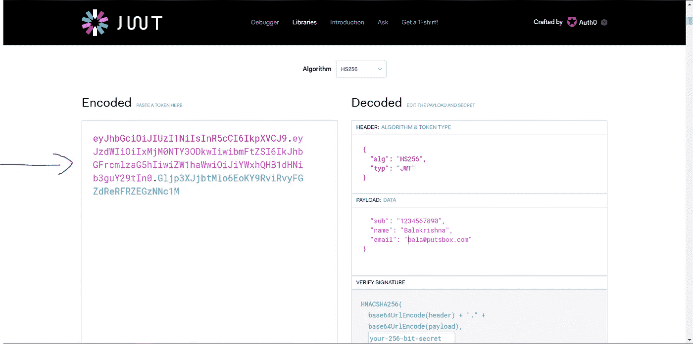**

**JWT 一代**

**在左边，我们有 JWT 代币，有红、紫、蓝三种颜色。**

**在右侧，我们有其相应的颜色属性，红色表示报头，即指定的算法，紫色表示有效载荷部分，即包含用户相关数据的部分，蓝色表示数字签名属性，即基于有效载荷主体的内容以及仅在服务器上可用的密钥创建的属性。**

**所以黑客无法生成这个数字签名，因为它存储在网络服务器上**

**更多关于[这里](https://jwt.io/)。**

## **8.生成认证令牌**

**现在，我们将生成一个 JWT 令牌来对用户进行身份验证，并在稍后从 jwt.io 站点进行验证，以检查我们的令牌是否正常工作，而不是在身份验证时向客户端发送一个简单的 true 响应。**

```
router.post('/', async (req, res) => {
   const { error } = validateUser(req.body)
   if (error) return res.status(400).send(error.details[0].message);
   let user = await userClass.findOne({email: req.body.email}) if (!user) return res.status(400).send('Invalid Email.');
   const validPassword = await bcrypt.compare(req.body.password, 
                                              user.password)

   if (!validPassword) return res.status(400).send('Invalid 
       Password.');
   try{
      **const token = jwt.sign({ _id: user._id, email: user.email },       'jwtPrivateKey') // Payload + Private Key
   res.send(token)**
   }catch (ex){
      console.log('Error in Promises', ex.message)
      res.status(400).send( ex.message)
      }
})
```

**让我向您展示我们如何点击 API，然后验证我们收到的 JWT 令牌。**

**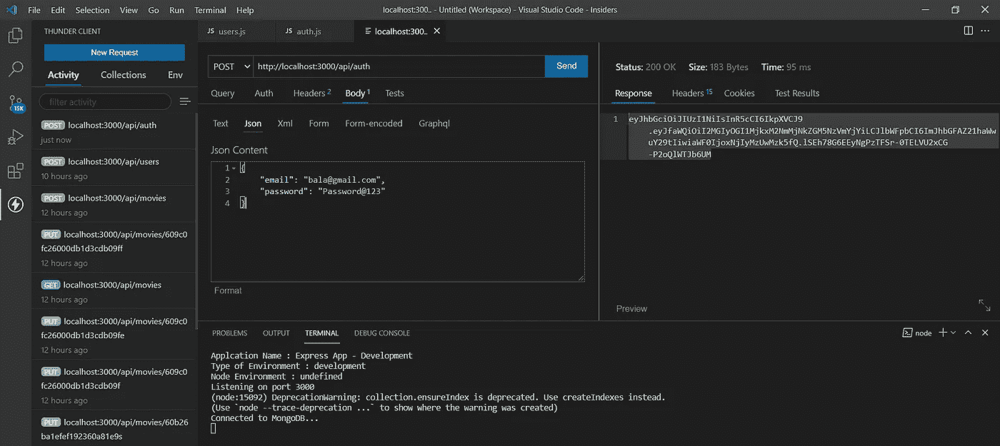**

**JWT·托肯在左边**

**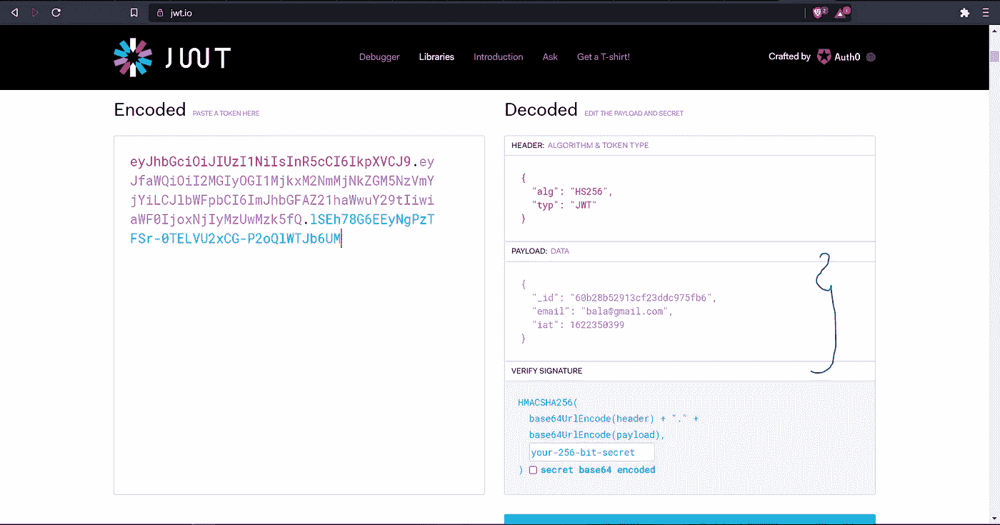**

**收到的 JWT 令牌左边的有效负载**

**现在，当我们将通过 POST 请求收到的 JWT 令牌粘贴到这里时，我们可以看到相应的有效负载就是我们之前发送的用于生成 JWT 的内容。**

## **9.设置响应标题**

**因此，以前当我们创建一个新用户时，我们只在正文中发送名称、电子邮件。现在我们也可以发送 JWT 令牌，但是将 JWT 令牌存储在接收到的 POST 请求的头响应中更合适。**

**这样浏览器可以将 JWT 令牌存储在头变量中，我们可以直接对其进行身份验证。**

**因此，让我们对新用户创建进行一些修改，并用 x-auth-jwtoken 变量将令牌发送到返回头。**

```
router.post('/', async (req, res) => {
  const { error } = validateUser(req.body)
  if (error) return res.status(400).send(error.details[0].message); let user = await userClass.findOne({email: req.body.email})
  if (user) return res.status(400).send('User Already Registered.'); user = new userClass(_.pick(req.body, ['name', 'email', 
'password']));
  const salt = await bcrypt.genSalt(10);
  user.password = await bcrypt.hash(user.password, salt); try{ await user.save()
    **const token = jwt.sign({ _id: user._id, email: user.email }, 'MySecurePrivateKey')
    res.header('x-auth-jwtoken', token).send(_.pick(user, ['_id', 'name', 'email']))**
  }catch (ex){
    console.log('Error in Promises', ex.message)
    res.status(400).send( ex.message)
  }
})
```

**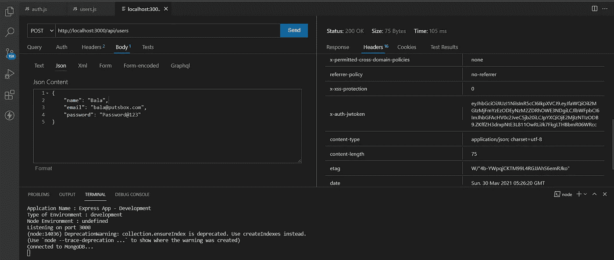**

**所以在 headers 部分，我们看到了新的变量。x-auth-jwtoken**

## **10.授权中间件**

**现在，我们有了一个独立的用户群，我们在创建帐户时将 JWT 令牌的识别密钥直接发送到他们的浏览器标题。现在，当这些用户在我们的电影数据库上执行任何操作时，比如 Get 或 POST——创建一个新条目，我们需要根据他们头中的 JWT 令牌对他们进行授权**

**因此，如果您还记得上一节中的中间件功能，我们使用了一个中间件，它验证了几乎所有的请求，而无需在所有代码中明确指定它们。**

**所以将在中间件文件夹中创建一个新函数用于授权。**

```
// CUSTOM FUNCTIONS - For Authfunction auth(req, res, next){
   console.log('Authentication Starts...');
   **const token = req.header('x-auth-token');

   if (!token) return res.status(401).send('Access Denied. No Token Provided')** **try{
     const decoded = jwt.verify(token, 'MyPrivateKeyJWT');
     req.user = decoded;  
     next();**
   }catch(ex){
     res.status(400).send('Invalid Token')
   }
}
```

**现在我们不想在每个地方都授权用户，所以假设只有当用户在电影数据库附近执行任何操作时，我们才添加要执行的认证。**

**因此，在电影路由处理器中，我们将添加代码。**

```
const auth  = require('../middleware/auth')// Route, middleware, function
router.get('/', **auth**, async (req, res) => {
  const allMovies  = await movieClass.find().sort('movieName')
  res.send(allMovies)
})
```

**现在，如果我们试图点击 GET API，我们肯定会得到一个错误。因为我们还没有在头中发送 auth 令牌。**

**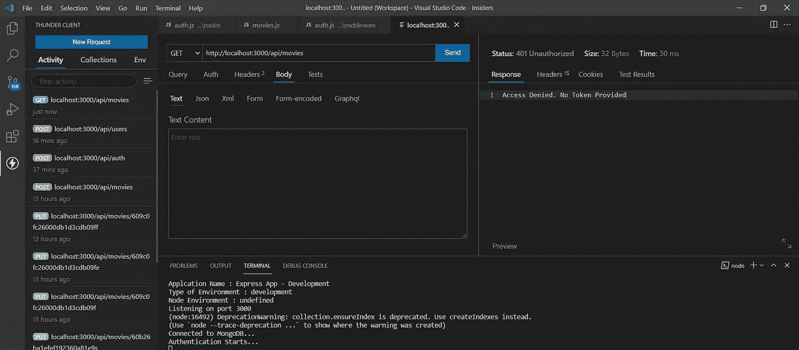**

**没有任何令牌的响应**

**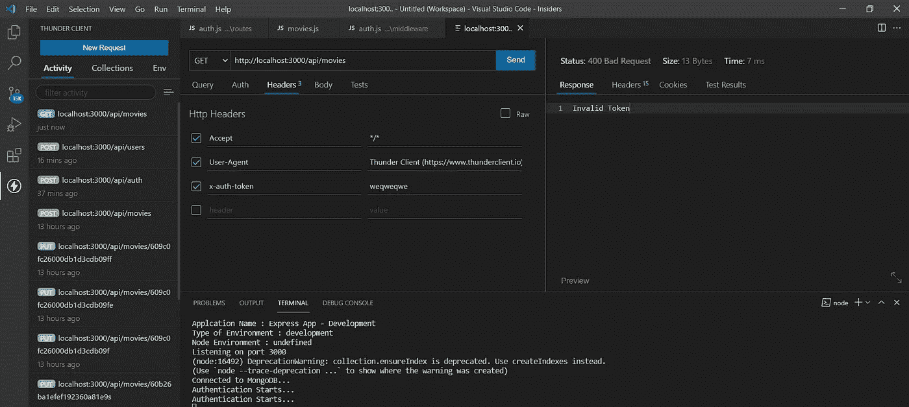**

**无效令牌的响应**

**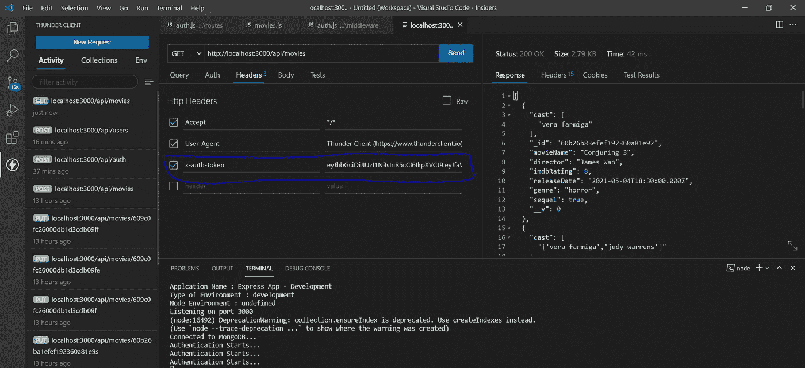**

**为用户传递正确的身份验证令牌**

**同样，您可以保护大多数需要保护的路线。**

## **11.获取当前用户**

**有时，我们需要记录谁在执行哪个 API 请求，因此在路由处理程序中，我们希望知道用户的详细信息。因此，让我们在路由中启用用户标识。**

```
const auth  = require('../middleware/auth')
const {userClass, validateUser} = require('../models/users')router.get('/me', auth, async(req, res) => {
   **const user = await userClass.findById(req.user._id).select('-
password')
   res.send(user);**
});
```

**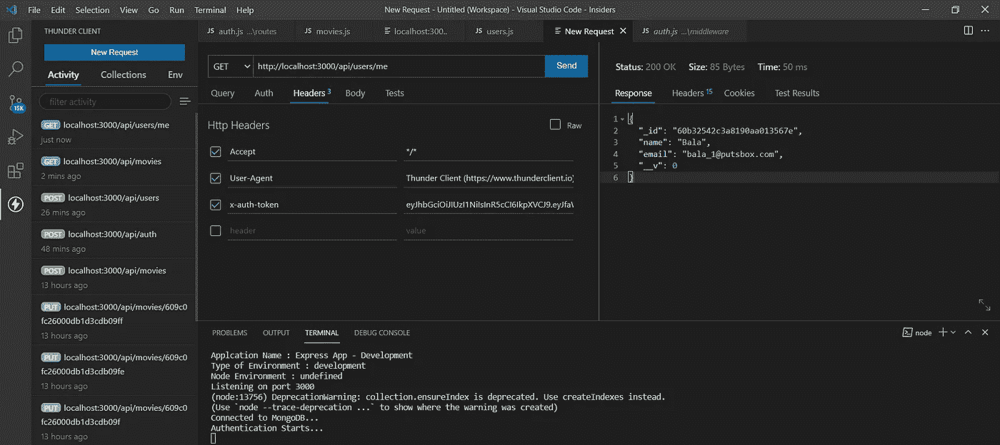**

# **X.处理和记录错误**

**有时在现实世界中，我们可能会遇到问题。因此，我们不能向用户发送我们有问题，相反，我们可以向用户发送友好的错误消息，并记录错误，以便我们可以检查它并尽早解决它。因此，在接下来的部分中，我们可能会学习如何处理和记录错误。**

## **1.处理拒绝的承诺**

**当我们处理承诺的时候，我们需要或者放一个。catch 块来处理这些承诺。**

**但是如果我们使用 async 和 await 功能，那么我们必须使用 try、catch 块来处理被拒绝的承诺，否则，进程将被终止。**

**因此，当获得电影的操作，如果数据库没有准备好，我们将发送一个友好的错误，说明我们没有准备好不服务。**

```
// Route, mware, functionrouter.get('/', auth, async (req, res) => {
 **try{
    const allMovies  = await movieClass.find().sort('movieName')
    res.send(allMovies)
  }catch (ex){
  // Log the error
  res.status(500).send('Something failed. Please try again')
}})**
```

## **2.快速错误中间件**

**我们可能已经开发了一千个带有自定义错误消息和 try-catch 块的路由，我们不能单独修改它们中的每一个，所以我们需要找到一种方法在一个地方处理它们，特别是在中间件中。**

**所以这个实现将会很棘手，所以我更希望您能看到本文附件中的 GitHub 库，以便更加清晰。**

**我们创建了一个错误处理函数，这样我们就可以在任何地方使用它。**

```
// Error handling**function errorHandling(err, req, res, next){** **// Log the Exception** **res.status(500).send('Something failed. Please try again')****}**module.exports = errorHandling
```

**并将其作为中间件，在 index.js 文件中调用，`app.use(errorHandling)`。**

**此外，我们在几乎每个路由中都使用了大量的 try-catch 块，因此我们定义了一个通用函数来处理它，并将参数传递给我们的路由。**

```
function asyncMiddleware(handler){
 **return async (req,res, next) => { 
  // Standard express route handler
  try{
    await handler(req, res);
  }catch(ex){
    next(ex)**
}}}module.exports = asyncMiddleware
```

**然后包装我们的路由，并将处理程序传递给函数。**

```
router.get('/', auth, **asyncMiddleware(async (req, res) => {** **const allMovies  = await movieClass.find().sort('movieName')** **res.send(allMovies)**}));
```

## **3.使用快速异步错误**

**当我们在 asyncMiddleware 函数中包装我们所有的路由时，这又是一件麻烦的事情，幸运的是，在为我们做这项工作时有一个 package express-async-errors。**

**安装它并像`require('express-asunc-errors')`一样在 index.js 中调用它，它会处理所有的路由，所以您可以从路由中删除 asyncMiddleware 包装。**

## **4.记录错误**

**为了记录错误，我们可以使用一个名为 Winston 的包。**

**它有像 console、HTTP、file 这样的传输方法，或者只显示错误，或者将错误发送到 HTTP 地址，或者保存到文件中。**

```
winston.add(new winston.transports.File({ filename: 'combined.log' }))
```

**此外，它有扩展插件存储在 MongoDB，Redis 等。,**

**因此，我们修改错误处理程序，将消息记录在一个文件中。**

```
function errorHandling(err, req, res, next){ **// Log the Exception** **winston.log('error', err.message, err) 
   // Logging level - error,    warning, info, verbose, debug, silly** **res.status(500).send('Something failed. Please try again')**}module.exports = errorHandling
```

**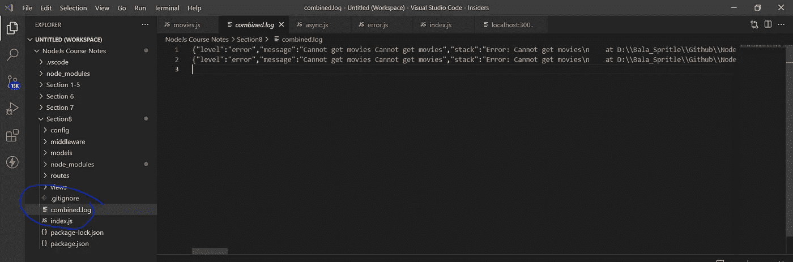**

**combined.log**

**更多关于那个[这里](https://www.npmjs.com/package/winston)。**

## **5.记录到 MongoDB**

**要将日志直接存储在 MongoDB 中，而不需要手动创建 CRUD 操作，我们可以使用 Winston 的另一个库。**

```
// npm install winston-mongodb@3.0.0**winston.add(new winston.transports.MongoDB({
  db: 'mongodb://localhost/movies',
  level: 'error' 
}))**
```

**就是这样，如果我们遇到任何错误，它会将错误直接记录到 MongoDB 中。**

**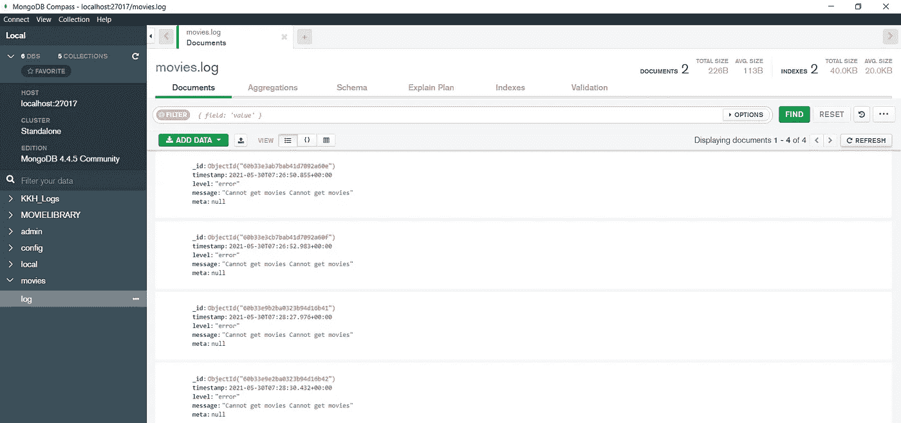**

**MongoDB 中的错误**

## **6.处理未捕获的异常**

**并非所有的错误都发生在路由内部。有时我们可能会在外部得到错误，而当前的实现无法找到它们，所以我们需要给 Winston 添加一个新方法来记录这些错误。**

```
**process.on('uncaughtException', (ex) => {
  console.log('Some uncaught Excpetion')
  winston.error(ex.message, ex)
})**// throw new Error('Something went down')
```

## **7.未处理的承诺拒绝**

**这里我们处理未处理的异常和未处理的承诺拒绝。注意:它将停止节点服务器。**

```
**winston.handleExceptions(
new winston.transports.File({filename: 'uncaughtExceptions.log'})
)****process.on('unhandledRejection', (ex) => {
  throw ex;
})**// Error simulation
const p = Promise.reject(new Error('Promise failure'))
p.then( () => console.log('Done'))
```

## **8.代码重构**

**启动文件 index.js 不应该包含我们在项目中使用的所有参数，所以我们必须将路由、日志、数据库等分开。，放在不同的文件中以便于调试。**

**所以我已经这样做了，并把新代码放到了 Github 的仓库里，你可以在那里下载并播放。**

**祝贺你到达终点。**

## **参考和存储库**

**包含所有与本文相关的代码和依赖项，可以在这里找到:[https://github.com/bala-codes/A-Primer-on-Node.js](https://github.com/bala-codes/A-Primer-on-Node.js)**

**在那之前，下次见。**

****文章作者:****

****BALAKRISHNAKUMAR V****