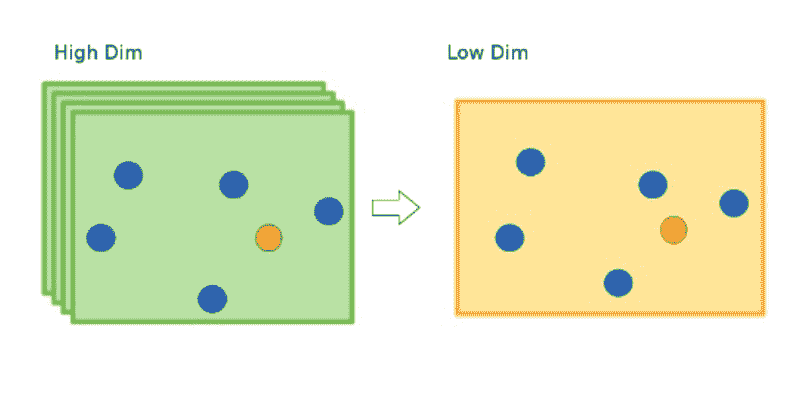
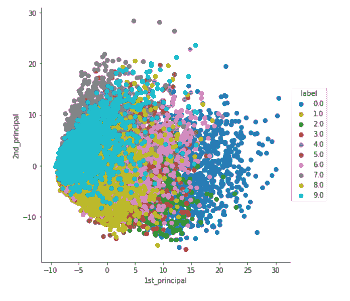
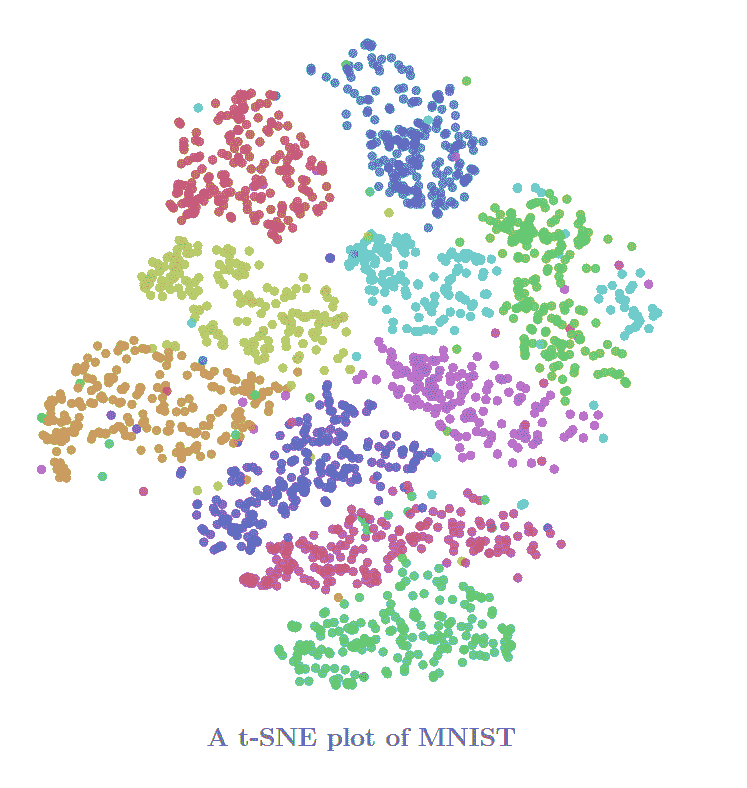
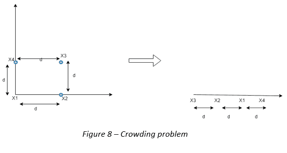
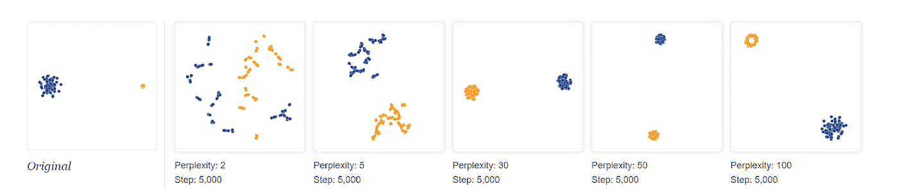
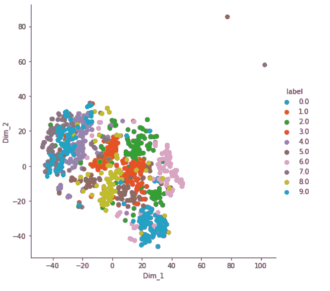
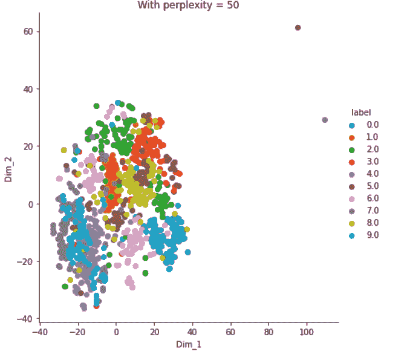
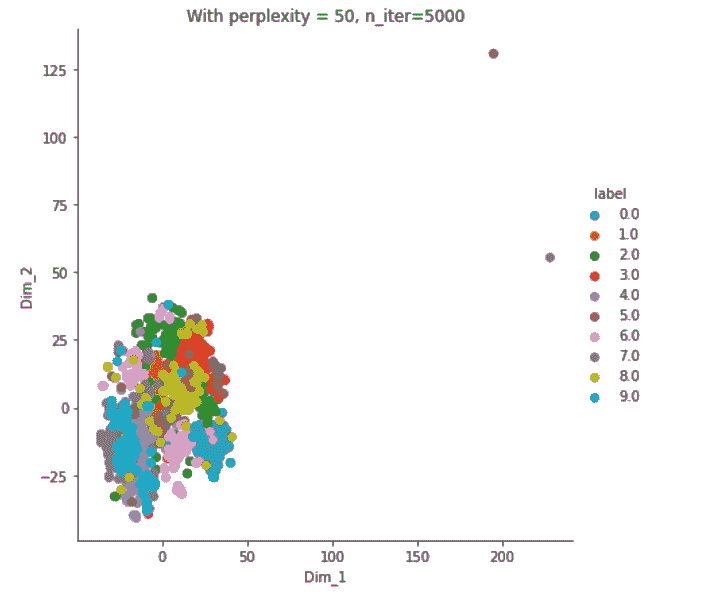
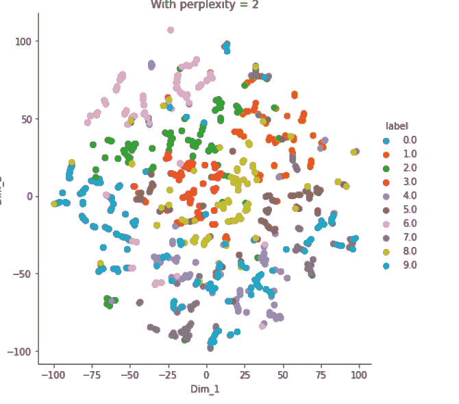

# 一种概率降维算法:t-分布式随机邻居嵌入(t-SNE)

> 原文：<https://pub.towardsai.net/a-probabilistic-algorithm-to-reduce-dimensions-t-distributed-stochastic-neighbor-embedding-23ff457fbc8a?source=collection_archive---------1----------------------->

## [数据可视化](https://towardsai.net/p/category/data-visualization)

## 基于概率得分降低维度和可视化数据的最佳技术之一。

来源:[媒体](https://medium.com/@jwu2/improving-collaborative-filtering-with-dimensionality-reduction-a99d08585dab)

数据可视化在实时机器学习应用中起着至关重要的作用。在许多情况下，可视化数据使了解、解释和分类数据变得更加容易和方便。有一些技术可以帮助可视化数据并降低数据集的维度。

在我之前的[文章](https://medium.com/@rajviishah/dimensionality-reduction-using-principal-component-analysis-pca-41e364615766)中，我给出了主成分分析(PCA)的概述，并解释了如何实现它。主成分分析是降低维数和绘制数据的基本技术。使用主成分分析有一些局限性，它不能将相似的类组合在一起，而只是一种将点转化为线性表示的方法，使人们更容易理解数据。而 t-SNE 旨在克服这一挑战，以便它能够**将相似的对象分组在一起**，即使在**缺乏线性**的情况下。

本文分为以下几个部分:

1.  什么是 SNE 霸王龙？
2.  t-SNE 的需求/优势
3.  SNE 霸王龙的缺点
4.  SNE 霸王龙的应用——什么时候用，什么时候不用？
5.  使用 Python 实现 t-SNE 到 MNIST 数据集
6.  结论

# **什么是 SNE 霸王龙？**

这是一种尝试**保持数据点的局部结构**的技术，从而降低维度。

让我们从名称(t-分布式随机邻居嵌入)来理解这个概念:想象一下，所有的数据点被绘制在 d 维(高)空间中，并且一个数据点被相同类别的其他数据点包围，另一个数据点被相同类别的相似数据点包围，并且对于所有类别都是如此。现在，如果我们取任意一个数据点(x ),那么周围的数据点(y，z，等等)。)被称为该数据点的邻域，计算任何数据点(x)的邻域，使得它与该邻域数据点(y 或 z)在几何上**接近**，即通过计算两个数据点之间的距离。因此，基本上，x 的邻域包含更接近 x 的点。该技术仅尝试**保持邻域的距离**。

**什么是嵌入？**在 d 维中绘制的数据点被嵌入到 2D 中，使得所有数据点的邻域都试图保持在 d 维中。基本上，对于高维空间中的每一个点，在低维空间中都有一个对应的点，具有 t-SNE 的邻域概念。

t-SNE 使用高斯分布创建了一个**概率分布**，定义了高维空间中各点之间的关系。

它是随机的，因为在**中，每次运行其输出都会改变**，也就是说，它不是确定性的。

参考:[幻灯片](https://pt.slideshare.net/ssuserb667a8/visualization-data-using-tsne)

# 我们为什么需要 SNE 霸王龙？

*   **处理非线性:**说到降维，PCA 因其易于使用和直观理解而被广泛使用。它试图通过保持数据点的分布(方差)来保持数据集的线性。PCA 是一种线性算法。它创建的主成分是现有特征的线性组合。因此，它不能解释特征之间复杂的多项式关系。所以，如果变量之间的关系是非线性的，它表现很差。另一方面，t-SNE 在非线性数据上工作得很好。t-SNE 的主要目标是保持数据点的非线性，这有助于克服 PCA 在某些应用中的挑战。
*   **保留局部和全局结构:** t-SNE 能够保留数据的局部和全局结构。粗略地说，这意味着高维数据集中彼此接近的点在低维中将倾向于彼此接近。另一方面，主成分分析发现了解释数据中大部分差异的新维度。所以，它不像 SNE 霸王龙那样关心附近的邻居。

上图显示了实施 PCA 后 MNIST 数据集的最终输出。

参考: [Colah](http://colah.github.io/posts/2014-10-Visualizing-MNIST/)

上图描绘了实施 t-SNE 后 MNIST 数据集的最终输出。

# **t-SNE 的弊端**

*   **拥挤问题:**让我们假设一个由点 a、b、c 和 d 组成的正方形，长度为 x，表示在 2D，现在应用 t-SNE，一个人想把维数减少到 1D，首先 a 表示在一条线上，现在点 b 表示在点 a 的左边 x 距离处，点 c 绘制在点的右边 x 距离处。这里，a 的邻域保持不变，但不能保持 b 点和 c 点之间的距离。

参考:[培养基](https://medium.com/@ranasinghiitkgp/t-sne-visualization-of-high-dimension-mnist-dataset-48fb23d1bafd)

*   **计算复杂:** t-SNE 涉及大量的计算和运算，因为它为每个数据点计算成对的条件概率，并试图最小化更高维度和更低维度上的概率差之和。
*   **超参数的选择:**困惑和步骤(将在本文后面介绍)
*   **集群大小:** t-SNE 不考虑任何类的集群大小。

参考:[distilt-pub](https://distill.pub/2016/misread-tsne/)

# **t-SNE 的应用**

t-SNE 可以用于高维数据，然后这些维度的输出成为其他分类模型的输入。同样，t-SNE 可以用于**调查**、**学习**或**评估分割**。人们经常在建模之前选择分段的数量**或者在结果之后迭代**。SNE 霸王龙经常在数据中显示出明显的分离。这可以在使用您的分段模型选择聚类数之前使用，或者在评估您的分段实际上是否成立之后使用。然而，t-SNE 不是一种聚类方法，因为它不像 PCA 那样保留输入，并且值可能经常在运行之间改变，所以它纯粹是为了探索。它用于解释深度神经网络输出，在[tensor flow Embedding Projector](https://ai.googleblog.com/2016/12/open-sourcing-embedding-projector-tool.html)和 [TensorBoard](https://www.tensorflow.org/versions/r1.2/get_started/embedding_viz) 等工具中，tSNE 的一个强大功能是揭示不同尺度的高维数据点集群，同时只需要对其参数进行最小的调整。广泛用于**深度学习应用**。

# **使用 Python 实现 t-SNE 到 MNIST 数据集**

从[数据](https://www.kaggle.com/c/digit-recognizer/data?select=train.csv)下载 MNIST 数据集。首先，我们将加载以及**理解**列和数据点。此外，将标签列从 CSV 文件中分离出来，并将其存储在另一个数据帧中。

现在，作为数据预处理的一部分，我们将**标准化**数据如下:

下一步是使用 Sk-learn 实现 t-SNE。

这里，我们将使用 SNE 霸王龙的前 1000 个标准化数据点。并使用一些默认参数从 sklearn 模块中准备一个 SNE 霸王龙模型。建议应用不同的困惑度、学习率来以更好的方式分类标签。此外，我们将拟合和转换 t-SNE 模型，并使用 seaborn 绘制如下图:

输出:

困惑地尝试= 50；

输出:这个看起来和上面困惑= 30 的剧情很像。

用 5000 次迭代而不是 1000 次迭代来尝试 t-SNE；

输出:

现在，困惑= 2

输出:所有信息丢失，所有数据点随机分布如下:

# 结论

为了找到最佳解决方案，我们需要尝试不同的困惑值和迭代次数。尝试用所有数据点实现 t-SNE(这将需要一些时间来执行)。

你可以从 [Github](https://github.com/rajviishah/t-SNE) 中找到源代码

如果你对这个库的任何函数/类有任何疑惑，那么我请求你查看文档。

如果有任何更正和改进的范围，或者如果您有任何疑问，请通过[邮件](mailto:rajvishah2309@gmail.com) / [LinkedIn](https://www.linkedin.com/in/rajviishah/) 告诉我。

要详细了解缺点，请查看:[https://distill.pub/2016/misread-tsne/](https://distill.pub/2016/misread-tsne/)

关于 t-SNE 的应用，请查看:[https://ai . Google blog . com/2018/06/real time-tsne-visualizations-with . html](https://ai.googleblog.com/2018/06/realtime-tsne-visualizations-with.html)

## **参考文献:**

*   [https://ml explained . com/2018/09/14/paper-parsed-visualizing-data-using-t-SNE-explained/#:~:text = It % 20 uses % 20 local % 20 relationships，points % 20 in % 20 high % 2d dimensional % 20 space](https://mlexplained.com/2018/09/14/paper-dissected-visualizing-data-using-t-sne-explained/#:~:text=It%20uses%20the%20local%20relationships,points%20in%20high%2Ddimensional%20space)。
*   [http://the professionals point . blogspot . com/2019/03/advantages-and-lessons-of-t-SNE . html](http://theprofessionalspoint.blogspot.com/2019/03/advantages-and-disadvantages-of-t-sne.html)
*   [https://towards data science . com/an-introduction-to-t-SNE-with-python-example-5a3a 293108 D1](https://towardsdatascience.com/an-introduction-to-t-sne-with-python-example-5a3a293108d1)
*   [https://sci kit-learn . org/stable/modules/generated/sk learn . manifold . tsne . html](https://scikit-learn.org/stable/modules/generated/sklearn.manifold.TSNE.html)
*   [https://www . applied ai course . com/lecture/11/applied-machine-learning-online-course/2900/geometric-intuition-of-t-SNE/2/module-2-data-science-explorative-data-analysis-and-data-visualization](https://www.appliedaicourse.com/lecture/11/applied-machine-learning-online-course/2900/geometric-intuition-of-t-sne/2/module-2-data-science-exploratory-data-analysis-and-data-visualization)