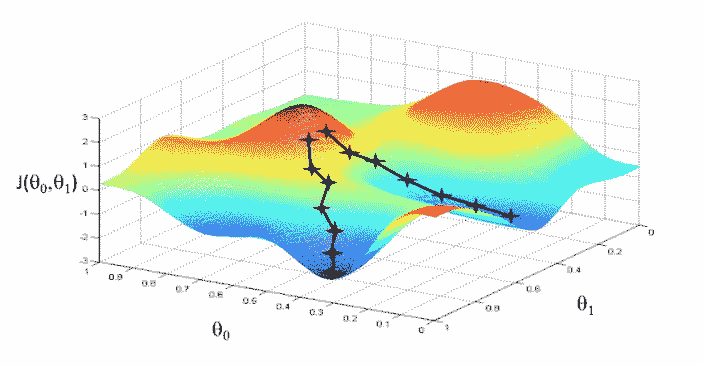
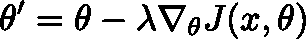
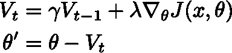
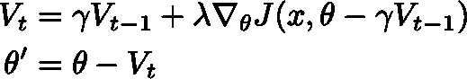
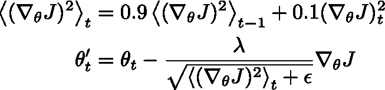

# 梯度下降及其变体快速指南

> 原文：<https://pub.towardsai.net/a-quick-guide-to-gradient-descent-and-its-variants-afa181d5b97b?source=collection_archive---------0----------------------->

## 朝向 AI 的梯度下降及其变体|

## 如果你不知道从哪里开始，优化学习速度

在机器学习中，人们处理一些数学模型 *z* = *F* ( *x，θ* )，它是一些输入变量 x 和一组参数 *θ* 的函数。该模型可以是例如人工的并且可能是深度的神经网络。游戏的名字是从某个定义好的输入 *x* ，*即*开始，寻找使预测某些目标 *y* (或分类问题中的标签)的误差最小的参数集，以尽可能减少数量 *F* ( *x，θ* )- *y* 。借用 [*最优化理论*](http://mathworld.wolfram.com/OptimizationTheory.html) 中的行话和一些思路，如果模型 *F* ( *x* ， *θ* )是一个可微函数，*即*它对其定义域中的每一点都有导数，原则上只要遵循它的梯度∇ *F* ( *x* ，)这相当于到达了物理学中某个能量函数的地平面，或者走下坡路，直到我们最终到达一个山谷。问题是，复杂的模型通常有许多"*假"*极小值:如果我们继续寻找，最终我们可能会找到*真*或*全局*极小值。

梯度下降是一种在 *N* 维中寻找函数最小值的算法。然而，一些函数是复杂的，并显示多个最小值。

## 基本梯度下降算法

在最基本的形式中，GD 被应用于所有训练示例，因此它被称为 ***批次*梯度下降**。关键要素是学习率参数λ，它表示当我们从参数空间中的一个点转到另一个点时，更新参数 *θ* 所采取的步长:

批量梯度下降保证对于凸函数(想象抛物线)收敛到全局最小值，对于非凸函数收敛到局部最小值。但是，我们如何跳到全局最小值呢？此外，如果数据集非常大，此过程可能会非常慢，或者根本不适合内存。

***随机*梯度下降** ( **SGD** )前来救援:对每个训练样本进行参数更新。SGD 是嘈杂的，但最初看起来是一个问题的东西实际上是它成功的关键:它允许从最小值“跳出来”,并继续探索参数空间。实践经验表明，如果我们缓慢地降低学习速率，在某一点上，SGD 收敛到一个最小值比原始的批量 GD 更有效。但现在我们有了另一个问题:我们如何找出λ的最佳值，或者当我们向最小值下降时，我们应该如何改变这个参数？

## 优化的梯度下降算法

众所周知，SGD 在某些区域梯度快速变化的情况下表现不佳，尤其是在某些维度上(因此得名*峡谷*)。一个聪明的想法是从冶金学借鉴来的，在冶金学中，一系列的加热和冷却被用来模拟某些属性。在最优化理论中，这被称为 ***动量*** :它通过阻尼振荡在相关方向上加速 SGD。动量参数γ(通常设置为 0.9)类似于在保守力场中穿过粘性介质的牛顿粒子的质量。

所有这些看起来都很聪明，但是如果我们到达谷底并继续加速会发生什么呢？我们会在别的地方结束，也许那不是我们想要的。所以我们应该更好地改变动量的值，来考虑我们离最小值有多远。这是用**内斯特罗夫加速梯度** ( **NAG** )获得的，它在下降方向更新之前“向前看”:

## 自适应算法

最终的智能水平是能够根据参数 *θ* 微调学习速率λ。例如，我们可能希望在梯度变化不大的地方使用较小的λ，而在梯度变化较频繁的地方使用较大的λ。 [**Adagrad**](https://medium.com/konvergen/an-introduction-to-adagrad-f130ae871827) 算法更新为每个参数分配一个学习率。学习率被自适应地更新，*，即*相对于在每个维度的每次迭代中累积的平方梯度进行缩放。 **Adadelta** 通过将过去的梯度累积到固定的历史深度来改进算法。 **RMSprop** 将学习率除以梯度平方的指数衰减平均值:

最后， **Adam** (自适应矩估计)跟踪平均平方梯度(如在 RMSprop 中)以及梯度，*，即梯度分布的一阶(均值)和二阶(方差)矩的*。最近，Adam 的进一步改进版本被提出，称为 [**AdaBound**](https://openreview.net/pdf?id=Bkg3g2R9FX) ，声称能够训练出“和 Adam 一样快，和 SGD 一样好”的模型。它采用动态上限和下限的学习率。

## 用什么？

答案，不言而喻，取决于问题。毫不奇怪，实践经验暗示了使用 RMSprop 和 Adam 等自适应算法的优势。有趣的是，有些人声称，当训练一个生成-对抗网络时，SGD 会更好。如果您不知道从哪里开始，请使用 Adam 并记住:如果您没有太多时间，并且您只能优化一个超参数，请关注学习率。