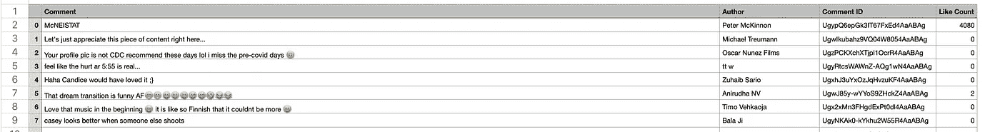
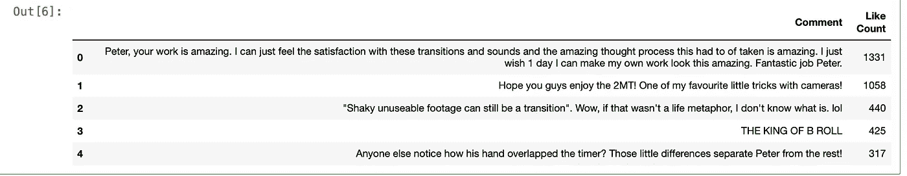

# 大文本语义聚类快速介绍

> 原文：<https://pub.towardsai.net/a-quick-introduction-to-semantic-clustering-for-large-texts-3660a77b9611?source=collection_archive---------1----------------------->

## [数据科学](https://towardsai.net/p/category/data-science)

## 在大型语料库中轻松地将具有相似含义的文档分组在一起。


照片由[梅丽莎·艾斯丘](https://unsplash.com/@melissaaskew?utm_source=medium&utm_medium=referral)在 [Unsplash](https://unsplash.com?utm_source=medium&utm_medium=referral) 上拍摄

很多时候，一个简单的自然语言处理任务，比如将大量的句子组合在一起，看起来会令人望而生畏。这些数据可能会遇到多种障碍和多种技术障碍。

> 我们本地机器的 GPU 可能无法满足我们运行传统聚类算法所需的处理能力。类似地，我们可能会在对大量数据(例如 100k+句子)进行编码时耗尽内存。
> 
> 目前也有许多先进的模型，当用于新任务的迁移学习而不是通过从头开始训练建立新的模型时，这些模型表现得更好。

在这篇文章中，我记录了一个免费的、开源的 NLP 库是如何帮助我以最小的努力完成所有这些任务的，以及它是如何在内存使用和性能方面如此高效，并产生最先进的结果。

让我们开始吧！

## 了解数据！

之前，在本教程的[中，我已经谈过用你最喜欢的创作者的 YouTube 视频的评论来制作你自己的文本数据集。我使用 YouTube Python 数据 API 构建了一个脚本来收集评论。很有趣！](https://medium.com/this-code/how-to-make-a-youtube-video-comments-dataset-with-the-googles-python-api-34cf32a14d16)

**在本文中，我们将在收集的评论中寻找一些*最常被谈论的话题*。**

如果你还没有亲自经历和实现这个过程，我强烈建议你这么做，因为在我看来，建立你自己的数据集是一次很好的学习经历。我知道这一点，因为我已经建立了两个。我怎么强调都不为过。

不管怎样，如果你想跳过这一部分——下面是我从评论的 *CSV 文件*中收集的数据:



评论数据预览

**有四列:**

1.  注释的文本
2.  评论的作者
3.  comment ID(在聚类算法中不使用它，但无论如何都要保留它，因为它可以用于以后的一些应用程序)最后，
4.  每个评论对应的赞。

我收集的数据包括从 YouTube 上一个创作者的不同视频中收集的 37k 条评论。你可以继续自己的实验，通过摆弄 API 和脚本，从而尝试构建一个包含更多不同视频的综合数据集。

> 这完全取决于您稍后将对该数据执行的任务类型，所以请记住这一点。

现在我们知道了我们在这里处理的是什么数据，让我们继续，看看我们在语义聚类中到底要做什么。

## 群集任务的用例

根据收集到的意见，我们希望首先确定两件关键的事情:

*   我们认为什么样的话题是相同的，以及
*   在这些话题应该如何分组的问题上，*的喜欢数*有发言权吗

下一步是安装[句子 Bert 变形金刚库](https://sbert.net)。这是他们的官方文档，你可以用它来更熟悉这个库本身。不过，为了继续，让我们先构建一个新的虚拟环境。

> 建立一个干净的环境对于任何 Python 项目来说都是非常重要的。我还在本文末尾提供了一个参考资料，供您了解更多信息。

在终端中，**在您的项目目录中创建**和 **cd** ，并输入:

```
pipenv shell
```

这将创建并激活环境。让我们也安装 jupyter 笔记本。如果您已经这样做了，请跳过这一步。

```
pipenv install jupyter
```

最后，你可以运行它，

```
pipenv run jupyter notebook
```

这将启动您的笔记本环境。在新的单元格中，继续运行这行代码来安装 **sbert** :

```
!pipenv install sentence-transformers
```

完成后，我们将开始将数据导入笔记本。

> **Pro 提示:**确保注释掉那行代码，以便将来使用，因为您不想多次安装该库！

## 建立评论列表

首先导入**熊猫**并读取 csv 文件。

```
import pandas as pddf1 = pd.read_csv('data/MAKE YOUR OWN CAMERA TRANSITIONS!!.csv', usecols = [1, 4]).sort_values(by = ['Like Count'], ascending = False).reset_index(drop = True)df1.head()
```

我已经把我的数据放入**数据**文件夹，根据你的需要更改它。我还做了另外三件事:

1.  评论将按喜欢数降序排列，因此我们将获得整个视频中最有影响力的评论(如果我们认为喜欢决定了评论获得的参与度)。您也可以定义另一个度量来决定这一点。
2.  我已经重置了索引，并确保不包含任何索引列。
3.  我已经确保只包括文本和类似的计数在这个项目中进一步使用。**评论 ID** 和**作者**列也有它们的用处，但是在这里，为了基于主题对评论进行聚类，我们并不真的需要它们。

现在，我们得到这样的数据帧:



**df1** 数据帧的前 5 行

现在对于句子转换器，我们需要给它一个注释列表，以便它从中计算它们的嵌入。在本教程的最后，如果你想了解更多，我有一个很好的资源供你参考。

```
comments_list_1 = df1.Comment.tolist()
```

一旦我们从所有文件中得到最终的注释列表，我们就可以开始对它们进行编码了！

## 试用编码器

```
from sentence_transformers import SentenceTransformer, util
import numpy as npmodel = SentenceTransformer('distilbert-base-nli-stsb-quora-ranking')
```

distilbert 变压器只是你可以使用的模型之一，还有许多其他的你可以尝试。

编码只需一个简单的步骤:

```
embeddings = model.encode(comments_list, show_progress_bar=True, convert_to_numpy=True)
```

其中，**评论 _ 列表**是我们根据所有评论制作的列表。

> 这是需要很多时间才能完成的步骤。因此，我建议你在你的本地机器上**腌制**，这样你就只需要计算*一次*。

现在我们已经完成了，剩下的唯一一步就是执行集群。

## 制作聚类函数

这是我们项目的主要部分，也是我们一直热切期待的部分！

为工作定义一个新的功能。

```
def detect_clusters(embeddings, threshold=0.90, min_community_size=20):
```

这里有两个主要参数需要理解，所以让我们来看一下:

*   **阈值** —每个评论相对于其他评论的语义相似度的余弦值。
*   **min_community_size** —这是为了将一个集群定义为单独的集群而必须堆积到该集群中的最小评论数量。

```
# Compute cosine similarity scores
cos_scores = util.pytorch_cos_sim(embeddings, embeddings)
```

接下来，我们确保根据我们之前指定的最小社区规模过滤这些分数。

```
# Minimum size for a community
    top_k_values, _ = cos_scores.topk(k=min_community_size, largest=True)
```

然后，我们过滤我们的阈值。您肯定需要调整这两个值，以便为您正在使用的数据集获得所需的适当聚类。

```
# Filter for rows >= min_threshold
    extracted_communities = []
    for i in range(len(top_k_values)):
        if top_k_values[i][-1] >= threshold:
            new_cluster = []
```

最后，我们继续用提取的社区构建我们的集群。只有获得的**前 k 个最相似分数**将被用于附加到聚类中。

```
# Only check top k most similar entries
            top_val_large, top_idx_large = cos_scores[i].topk(k=init_max_size, largest=True)
            top_idx_large = top_idx_large.tolist()
            top_val_large = top_val_large.tolist()if top_val_large[-1] < threshold:
            for idx, val in zip(top_idx_large, top_val_large):
                  if val < threshold:
                       breaknew_cluster.append(idx)
         else:
             # Iterate over all entries (slow)
             for idx, val in enumerate(cos_scores[i].tolist()):
                  if val >= threshold:
                       new_cluster.append(idx)extracted_communities.append(new_cluster)
```

最后，我们不希望集群中有任何共同的、重复的社区。我们也把它们去掉吧。

```
unique_communities = []
extracted_ids = set()for community in extracted_communities:
        add_cluster = True
        for idx in community:
            if idx in extracted_ids:
                add_cluster = False
                break if add_cluster:
            unique_communities.append(community)
            for idx in community:
                extracted_ids.add(idx)return unique_communities
```

瞧，我们的功能完成了。

## 获得结果！

```
clusters = detect_clusters(embeddings, min_community_size=15, threshold=0.95)
```

让我们看看我们的函数产生的一些结果！

```
Cluster 8, #22 Elements 
	 Your video was really helpful, I will try these tips for  my new contents. Thank you.
	 Very, very useful tool.  Thanks your best Video.
	 Very good video.  Can be an inspiration for me.  thank you
	 I really love your video. Hoping see you in real life. Respcect!!
	 Man your videos be awesome this is a awesome channel I learned a lot from you just...
```

**这个集群有人感谢创作者非常有用的视频。**

看一个不同的集群:这里**人们在谈论视频的伟大 thumnail**

```
Cluster 4, #45 Elements
         The thumbnail though. Great hacks!
	 That thumbnail though.
	 Wow that thumbnail 🔥
	 The thumbnail scared me...
	 That thumbnail is the scariest thing I've seen all day
	 this is the best thumbnail ive ever seen
```

或者在**中带有评论的集群，人们只说一件特定的事情。**

例如:

```
Cluster 17, #29 Elements Such a great great work sir you nailed it ❤️ love form india
	 mindblowing bro,love from India
	 Dude!!You are inspiration!! Great work Peter!! Love from India!! ❤️❤️
	 Man u r such an inspiring 
         Love and respect from India
	 Love from India!
	 learnt so much from you today. love from India.
```

或者甚至:

```
Cluster 19, #15 Elements now i'm craving coffee..i don't even like coffee.
	 I don't even like coffee.
	 You are right lol I dont like coffee at all.
	 Yep, I don't drink coffee anymore, and I never really liked it too much. Still enjoy the coffee parts.
	 Don’t like coffee?! Ha! 😂
	 I don't even like coffee, but it's so aesthetically pleasing!
```

诸如此类！这只是一个例子，说明了这种算法有多么强大，它可以在您选择构建的任何现实世界项目中提供多么棒的应用程序！

在我的下一篇文章中，我将探索更多分析这些聚类的方法，以及利用我们的另一个专栏的一些技术——也就是**喜欢计数**。

**结束…以下是我谈到的资源:**

1.  [NLP 嵌入深度探讨](https://medium.com/@b.terryjack/nlp-everything-about-word-embeddings-9ea21f51ccfe) —从这篇精彩的文章中了解如何从文本中生成嵌入。
2.  [为数据科学/深度学习建立一个全新的 Python 环境。](https://medium.com/this-code/5-step-guide-to-setting-up-a-new-python-environment-for-data-science-fcae3c3951c7?source=your_stories_page-------------------------------------) —帮助您快速启动并运行的指南。

快乐学习！😁

感谢您的阅读！

另外，请点击此处查看我所有数据科学文章的代码库:

[](https://github.com/yashprakash13/data-another-day) [## yashprakash 13/data-另一天

### 我在我的…上学习和撰写的所有数据科学项目、概念、工具和资源的主存储库

github.com](https://github.com/yashprakash13/data-another-day) 

联系我的 [LinkedIn](https://www.linkedin.com/in/yashprakash13/) 和 [Twitter](https://twitter.com/csandyash) ！