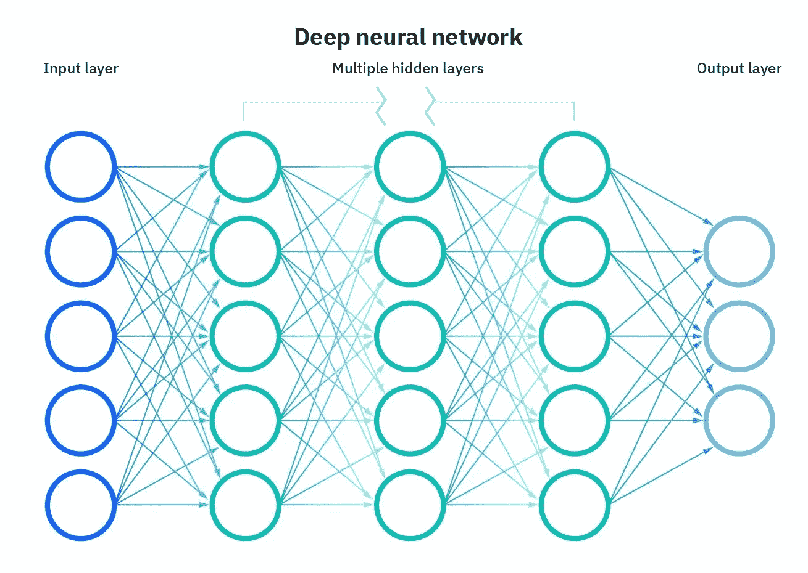
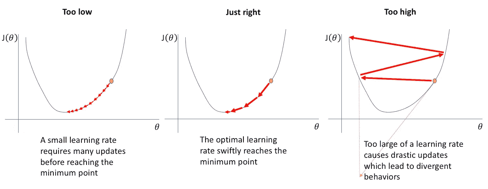
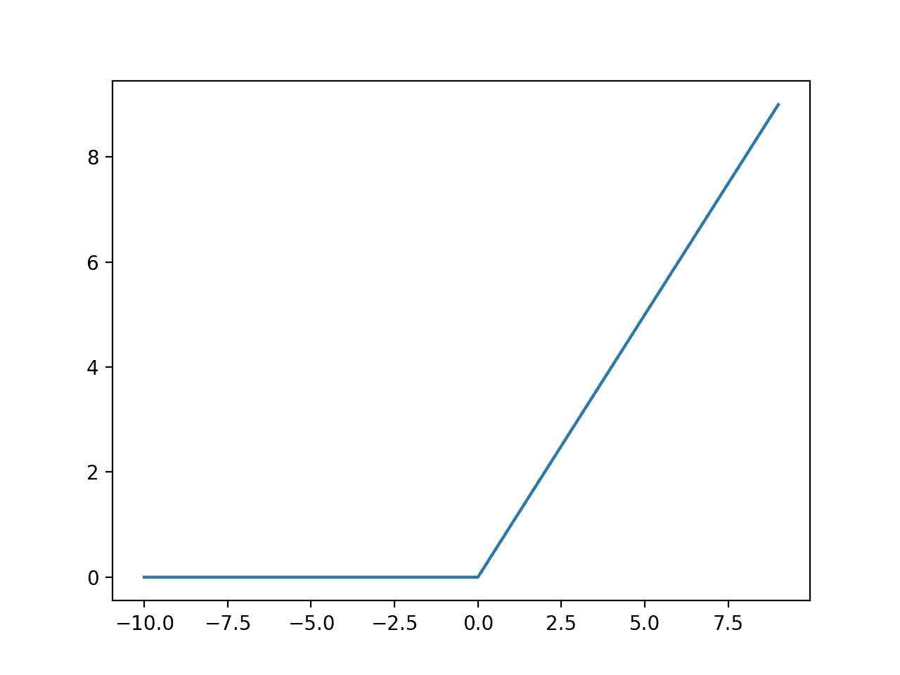

# 快速设置神经网络超参数以获得最佳结果

> 原文：<https://pub.towardsai.net/a-quick-setup-for-neural-networks-hyperparameters-for-best-results-3a5a446abb3a?source=collection_archive---------1----------------------->

找到最佳的超参数设置并自己测试不同的设置是不容易的，直到在神经网络中获得好的结果。一般来说，你必须花很多时间来调整这些超参数设置，以获得更好的模型。但是，最重要的是不要贪多，以免适得其反。以下是如何在短时间内设置这些超参数以获得良好结果的快速设置。

黛安·皮凯蒂诺在 [Unsplash](https://unsplash.com?utm_source=medium&utm_medium=referral) 上拍摄的照片

## 目录:

1.  隐藏层数
2.  每个隐藏层的神经元数量
3.  学习率
4.  激活功能
5.  批量
6.  优化者
7.  损失函数
8.  时代数

**如果你想免费学习数据科学和机器学习，看看这些资源:**

*   免费互动路线图，自学数据科学和机器学习。从这里开始:[https://aigents.co/learn/roadmaps/intro](https://aigents.co/learn/roadmaps/intro)
*   数据科学学习资源搜索引擎(免费)。将你最喜欢的资源加入书签，将文章标记为完整，并添加学习笔记。[https://aigents.co/learn](https://aigents.co/learn)
*   想要在导师和学习社区的支持下从头开始学习数据科学吗？免费加入这个学习圈:[https://community.aigents.co/spaces/9010170/](https://community.aigents.co/spaces/9010170/)

如果你想在数据科学&人工智能领域开始职业生涯，但你不知道如何开始。我提供数据科学指导课程和长期职业指导:

*   长期指导:[https://lnkd.in/dtdUYBrM](https://lnkd.in/dtdUYBrM)
*   辅导课程:[https://lnkd.in/dXeg3KPW](https://lnkd.in/dXeg3KPW)

***加入*** [***中等会员***](https://youssefraafat57.medium.com/membership) ***计划，只需 5 美元，继续无限制学习。如果你使用下面的链接，我会收到一小部分会员费，不需要你额外付费。***

 [## 加入我的介绍链接媒体-优素福胡斯尼

### 阅读 Youssef Hosni(以及媒体上成千上万的其他作家)的每一个故事。您的会员费直接支持…

youssefraafat57.medium.com](https://youssefraafat57.medium.com/membership) 

# 1.隐藏层数

神经网络中的第一个超参数是隐藏层数。对于许多问题，你可以只从一个隐层开始，并得到合理的结果，因为理论上，如果有足够的神经元，一个具有一个隐层的神经网络可以模拟大多数复杂的函数。然而，对于更复杂的认知功能，深度神经网络将比浅层神经网络高效得多。

由于在深度神经网络中，较低的隐藏层模拟低级结构(例如，各种形状和方向的线段)，中间隐藏层组合这些低级结构来模拟中级结构(例如，正方形、圆形)，并且最高的隐藏层和输出层将这些中级结构组合成高级模型结构(例如，面部)。

这种分层架构不仅有助于 dnn 更快地收敛到一个好的解决方案，而且还提高了它们推广到新数据集的能力。例如，如果您已经训练了一个模型来识别图片中的人脸，现在您希望训练一个新的神经网络来识别发型，您可以通过重用第一个网络的较低层来启动训练。您可以将它们初始化为第一个网络的较低层的权重和偏差值，而不是随机初始化新神经网络的前几层的权重和偏差。这样，网络将不必从零开始学习大多数图片中出现的所有低级结构；它将只需要学习更高级的结构(例如，发型)。这就是所谓的迁移学习。

综上所述，对于许多问题，您可以从一两个隐藏层开始，神经网络将会工作得很好。例如，在 MNIST 数据集上，仅使用一个具有数百个神经元的隐藏层，您就可以轻松达到 97%以上的准确率；使用两个具有相同神经元总数的隐藏层，在大致相同的训练时间内，您可以达到 98%以上的准确率。

对于更复杂的问题，您可以增加隐藏层的数量，直到您开始过度适应训练集。非常复杂的任务，如大型图像分类或语音识别，通常需要几十层甚至几百层的网络，但不是完全连接的网络，并且需要大量的训练数据。您很少需要从头开始训练这样的网络:更常见的是重用预先训练好的最先进的网络来执行类似的任务。训练将会快得多，需要的数据也少得多。

# 2.每个隐藏层的神经元数量

输入和输出层中神经元的数量由任务所需的输入和输出类型决定。例如，MNIST 任务需要 28×28 = 784 个输入神经元和 10 个输出神经元，因为它有 10 个类。如果任务是回归或者二元分类，那么输出神经元的数量就只是一个。

至于隐藏层，过去常见的是将它们的大小形成金字塔，每层的神经元越来越少——基本原理是许多低级特征可以合并成更少的高级特征。典型的 MNIST 神经网络可能有 3 个隐藏层，第一层有 300 个神经元，第二层有 200 个，第三层有 100 个。然而，这种实践已经基本上被放弃了，因为似乎在所有隐藏层中使用相同数量的神经元在大多数情况下表现得一样好，甚至更好；另外，只有一个超参数需要优化，而不是每层一个。

也就是说，根据数据集的不同，有时使第一个隐藏层比其他层更大会有所帮助。就像层的数量一样，你可以尝试逐渐增加神经元的数量，直到网络开始过度拟合。但是在实践中，选择一个比你实际需要更多的层和神经元的模型，然后使用**提前停止**和其他正则化技术来防止它过度拟合，这通常更简单和更有效。

谷歌的科学家文森特·范霍克(Vincent Vanhoucke)称之为“弹力裤”方法:与其浪费时间去寻找完全符合你尺寸的裤子，不如使用能收缩到合适尺寸的大号弹力裤。使用这种方法，您可以避免可能破坏您的模型的瓶颈层。另一方面，如果一个层的神经元太少，它将没有足够的表示能力来保存来自输入的所有有用信息(例如，具有两个神经元的层只能输出 21 个数据，因此如果它处理 3D 数据，一些信息将会丢失)。无论网络的其余部分有多么庞大和强大，这些信息都将永远无法恢复。**一般来说，增加层数会得到更好的结果，而不是每层神经元的数量。**

# 3.学习率

学习率被认为是神经网络模型中可以优化的最重要的超参数之一。

找到好的学习率的一种方法是训练模型几百次迭代，从非常低的学习率(例如，10^-5)开始，逐渐增加到非常大的值(例如，10)。这是通过在每次迭代中将学习速率乘以常数因子(例如，乘以 exp(log(10⁶)/500)来完成的，以在 500 次迭代中从 10^-5 到 10。

如果你将损失绘制成学习速率的函数(使用学习速率的对数标度),你应该首先看到它下降。但是过一段时间，学习率会过大，所以亏损会迅速回升:**最优学习率会比亏损开始攀升的点低一点(一般比转折点低 10 倍左右)**。然后，您可以重新初始化模型，并使用这个良好的学习率对其进行正常训练。

最后，记住最佳学习率取决于其他超参数，尤其是批量，这一点很重要，因此如果您修改了任何超参数，请记住也要更新学习率。

# 4.激活功能

神经网络中的激活函数定义了如何将输入的加权和转换成网络层中一个或多个节点的输出。激活函数的选择对神经网络的能力和性能有很大的影响，并且不同的激活函数可以用于模型的不同部分。

一个非常好的起点是从 **Relu** 开始作为隐藏层的激活函数，如下图所示。

Relu 激活功能

输出层的激活功能将主要取决于任务。对于回归任务，您可以使用线性激活函数，因为您希望从完全连接的图层中输出而不进行任何更改。

如果你的问题是一个分类问题，那么有三种主要的分类问题，每一种可能使用不同的激活函数。

*   如果有两个互斥的类(二进制分类)，那么你的输出层将有一个节点，应该使用一个 **sigmoid 激活**函数。
*   如果有两个以上互斥的类(多类分类)，那么你的输出层每个类将有一个节点，并且应该使用一个 **softmax 激活**。
*   如果有两个或更多相互包含的类(多标签分类)，则输出图层将为每个类提供一个结点，并使用 **sigmoid 激活**函数。

总结一下:

*   **回归:**线性激活的一个节点。
*   **二元分类**:一个节点，乙状结肠激活。
*   **多类分类**:每类一个节点，softmax 激活。
*   **多标签分类**:每类一个节点，sigmoid 激活。

# 5.批量

批量大小会对模型的性能和训练时间产生重大影响。你可以选择一个小批量，如 32 或 64，或者你可以使用最大批量，将适合你的记忆如何决定选择哪个，或者有任何其他选择？

使用大批量的主要好处是，硬件加速器(如 GPU)可以有效地处理它们，并且算法每秒将看到更多实例，这将提高其性能。因此，许多研究人员和实践者建议使用 GPU RAM 中可以容纳的最大批量。然而，在实践中，发现大批量通常导致训练不稳定，尤其是在训练开始时，并且所得模型可能不如用小批量训练的模型一般化。

另一方面，Yann LeCun 在 2018 年发推文称，“**朋友不让朋友使用大于 32** 的迷你批量”，引用了 Dominic Masters 和 Carlo Luschi 在 2018 年发表的论文 [**重新审视深度神经网络**](https://arxiv.org/abs/1804.07612?fbclid=IwAR0S4Kob7aKrXAVBgcoZ6tmrJchRGQdqCilEiW_C3jQZG6gIfX2C-z7uLn4) 的小批量训练，该论文得出结论，使用小批量(从 2 到 32)是更可取的，因为小批量可以在更短的训练时间内产生更好的模型。

然而，其他论文指向相反的方向，例如 Elad Hoffer 等人的 2017 年论文 [**训练更长，推广更好:缩小神经网络**](https://arxiv.org/abs/1705.08741?fbclid=IwAR0R4YiqU--sEIESziW8HQP0BWIFoUwIJFIV7yYDaone7RRSmG3jrEB5j28) 的大批量训练中的推广差距和 Priya Goyal 等人的论文 [**准确，大批量 SGD:在 1 小时内训练 ImageNet**](https://arxiv.org/abs/1706.02677)**表明，可以使用各种技术使用非常大的批量(高达 8，192)这将导致非常短的训练时间，没有任何推广差距。**

**因此，总之，一个好的开始策略是根据您的硬件尝试使用大批量，如果训练不稳定或最终表现令人失望，则使用学习率热身，然后尝试使用小批量。**

# **6.优化者**

**优化器是修改神经网络属性(如权重和学习速率)的函数或算法。因此，它有助于降低总损耗和提高精度。为模型选择正确的权重是一项艰巨的任务，因为深度学习模型通常由数百万个参数组成。这就需要为您的应用选择合适的优化算法。**

**你可以使用不同的优化器来改变你的体重和学习速度。然而，选择最佳的优化器取决于应用程序。一个可能的解决方案是尝试所有的可能性，并选择一个显示最佳结果的方案。如果您的数据很小，这可能是一个很好的解决方案，但是当处理数百千兆字节的数据时，即使一个历元也会花费相当多的时间。**

**然而，如果你想选择一个优化器，你应该选择 **adam optimizer** 。adam 优化器有几个好处，因此被广泛使用。它被改编为深度学习论文的基准，并被推荐为默认优化算法。此外，该算法易于实现，具有更快的运行时间，较低的内存需求，并且比任何其他优化算法需要更少的调整。**

# **7.损失函数**

**损失函数的目的是计算模型在训练过程中应该寻求最小化的数量。重要的是，损失函数的选择直接关系到你的神经网络输出层使用的**激活函数**以及期望输出和学习任务。这些元素是相互联系的。**

**当我们有稀疏标签时，我们使用𝐬𝐩𝐚𝐫𝐬𝐞_𝐜𝐚𝐭𝐞𝐠𝐨𝐫𝐢𝐜𝐚𝐥_𝐜𝐫𝐨𝐬𝐬𝐞𝐧𝐭𝐫𝐨𝐩𝐲损失(当对于每个实例，我们得到一个类索引时，例如，如果我们有三个类，那么标签将是 0，1，2)。当每个类实例有一个目标概率时，我们使用𝐜𝐚𝐭𝐞𝐠𝐨𝐫𝐢𝐜𝐚𝐥_𝐜𝐫𝐨𝐬𝐬𝐞𝐧𝐭𝐫𝐨𝐩𝐲损失，例如类 3 的[0，0，1]。我们将𝐛𝐢𝐧𝐚𝐫𝐲_𝐜𝐫𝐨𝐬𝐬𝐞𝐧𝐭𝐫𝐨𝐩𝐲损失用于二元分类任务。**

**对于回归，我们可以使用**均方误差**或**均方误差**函数。**

# **8.时代数**

**在大多数情况下，不需要优化历元或迭代的数量。当模型的性能没有任何改善时，您可以使用早期停止来停止。**

*****喜爱文章？成为*** [***中等会员***](https://youssefraafat57.medium.com/membership) ***继续无限制学习。如果你免费使用下面的链接，我会收到一小部分会员费。*****

** [## 加入我的介绍链接媒体-优素福胡斯尼

### 阅读 Youssef Hosni(以及媒体上成千上万的其他作家)的每一个故事。您的会员费直接支持…

youssefraafat57.medium.com](https://youssefraafat57.medium.com/membership) 

***感谢阅读！如果喜欢文章，一定要鼓掌(最多 50！)并在***[***LinkedIn***](https://www.linkedin.com/in/youssef-hosni-b2960b135/)***上与我联系，并在*** [***上关注我的【中型】***](https://youssefraafat57.medium.com/) ***以保持更新我的新文章*****