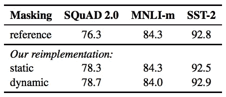
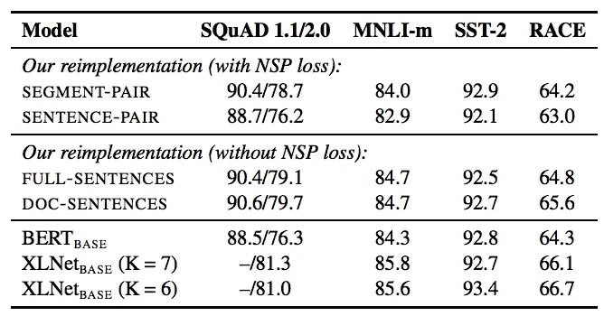
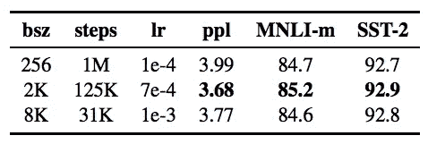

# 一种鲁棒优化的 BERT 预训练方法

> 原文：<https://pub.towardsai.net/a-robustly-optimized-bert-pretraining-approach-f6b6e537e6a6?source=collection_archive---------0----------------------->

## 用 RoBERTa | [向 AI](https://towardsai.net) 优化 BERT

## 伯特是什么？

> BERT (Devlin et al .，2018)是一种预先训练语言表示的方法，意味着我们在大型文本语料库(如维基百科)上训练一个通用的“语言理解”模型，然后将该模型用于我们关心的下游 NLP 任务(如问答)。BERT 优于以前的方法，因为它是第一个用于预训练 NLP 的*无监督*、*深度双向*系统。

由 [Sara Bakhshi](https://unsplash.com/@sarabakhshi?utm_source=medium&utm_medium=referral) 在 [Unsplash](https://unsplash.com?utm_source=medium&utm_medium=referral) 上拍摄的照片

刘等人研究了 BERT 的许多关键超参数和训练数据大小的影响。他们发现 BERT 明显训练不足，可以匹配或超过在它之后发布的每个模型的性能。`RoBERTa`(**Ro**busly optimized**BERT**aapproach)推出，性能达到或超过原 BERT。

# BERT 培训目标

伯特使用`Masked Language Models (MLM)`和`Next Sentence Prediction (NSP)`来学习文本表示。`MLM`是一种屏蔽一些记号并使用其余记号来预测被屏蔽记号的方法。`NSP`是预测一对句子是否连续。如果你想更多地了解伯特，你可以访问这个[故事](https://towardsdatascience.com/how-bert-leverage-attention-mechanism-and-transformer-to-learn-word-contextual-relations-5bbee1b6dbdb)。

# 模型设置

由于 RoBERTa 是基于 BERT 开发的，所以它们共享许多配置。RoBERTa 和 BERT 在以下项目上有所不同:

*   保留标记:BERT 使用`[CLS]`和`[SEP]`分别作为起始标记和分隔符标记，而 RoBERTa 使用`<s>`和`</s>`转换句子。
*   子词的大小:BERT 有大约 30k 的子词，而 RoBERTa 有大约 50k 的子词。

# 修正

通过应用以下调整，RoBERTa 的表现优于 BERT:

1.  更大的训练数据(16G 对 161G)
2.  使用动态屏蔽模式(BERT 使用静态屏蔽模式)
3.  替换下一句预测训练目标
4.  较长序列的训练

## 更大的训练数据

RoBERTa 使用 BookCorpus (16G)、CC-NEWS (76G)、OpenWebText (38G)和 Stories (31G)数据，而 BERT 仅使用 BookCorpus 作为训练数据。

## 静态屏蔽与动态屏蔽

BERT 为 MLM 物镜屏蔽了一次训练数据，而 RoBERTa 复制了 10 次训练数据，并以不同方式屏蔽了这些数据。在以下实验中，您会注意到动态屏蔽的性能优于静态屏蔽和参考(BERT)。

掩蔽方法的比较(Lie 等人，2019 年)

## 不同的培养目标

李提出了以下评价`NSP`目标无用性的方法。没有`NSP`培训适用于完整句子和文档句子方法

*   带 NSP 的段对:一对段，每个段可以包含多个自然句。这与最初的 BERT 培训目标相同。令牌数量少于 512。
*   带有 NSP 的句子对:一对自然句子，或者从一个文档的连续部分取样，或者从单独的文档取样。它与最初的 BERT 方法略有不同。令牌数量明显少于 512。
*   没有 NSP 的完整句子:输入内容是从一个或多个文档中抽取的句子。当训练数据到达文档末尾时，将对其他文档中的句子进行采样。令牌的数量最多为 512。
*   没有 NSP 的文档句子:与完整句子相同，但数据不跨越文档。

从下面的实验中，我们注意到，不用`NSP`训练的方法也能取得更好的结果。

培养目标对比(Lie et al .，2019)

## 较长序列的训练

BERT-BASE (Devlin 等人，2018 年)通过 1M 步训练，批量大小为 256 个序列。而 Lie 等人训练的是 125k 步，2k 序列和 31k 步，8k 序列。下面的实验显示了具有 2k 个序列的 125k 个步骤实现了更好的结果。

超参数比较(Lie 等人，2019 年)

# 拿走

*   RoBERTa 仅通过增加数据大小和超参数来进一步优化 BERT。

# 喜欢学习？

我是湾区的数据科学家。专注于数据科学、人工智能，尤其是 NLP 和平台相关领域的最新发展。在 [LinkedIn](https://www.linkedin.com/in/edwardma1026) 或 [Github](https://github.com/makcedward) 上随时与 [me](https://makcedward.github.io/) 联系。

# 延伸阅读

*   [伯特](https://towardsdatascience.com/how-bert-leverage-attention-mechanism-and-transformer-to-learn-word-contextual-relations-5bbee1b6dbdb)简介
*   脸书的原始实现(PyTorch)
*   [抱紧脸](https://github.com/huggingface/pytorch-transformers/tree/master/pytorch_transformers)实现(PyTorch)

# 参考

*   J.Devlin，M. W. Chang，K. Lee 和 K. Toutanova。[伯特:语言理解深度双向转换器的预训练](https://arxiv.org/pdf/1810.04805.pdf)。2018
*   Y.刘、m .奥特、n .戈亚尔、j .杜、m .乔希、d .陈、o .利维、m .刘易斯、L. Zettlemoyer 和 V. Stoyanov。 [RoBERTa:一种稳健优化的 BERT 预训练方法](https://arxiv.org/pdf/1907.11692.pdf)。2019.