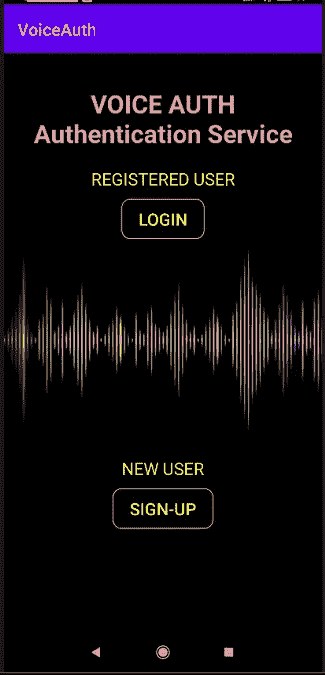
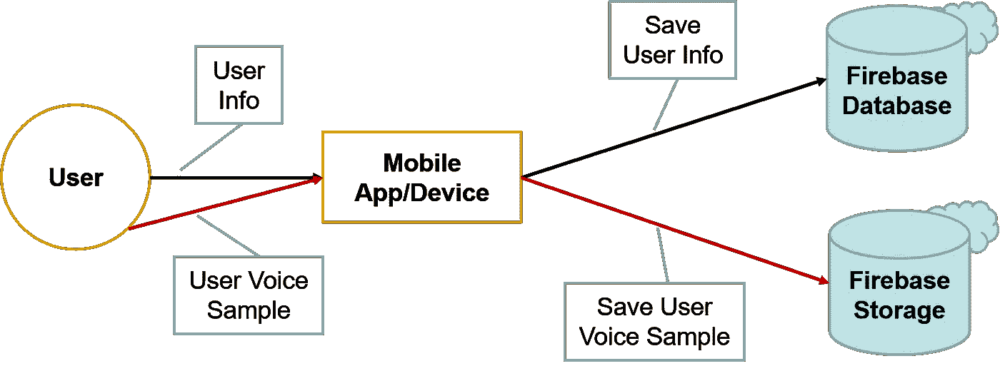
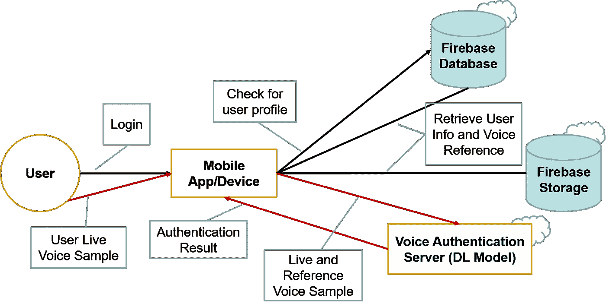

# 具有移动部署的基本语音认证系统

> 原文：<https://pub.towardsai.net/a-rudimentary-voice-authentication-system-with-mobile-deployment-1d41f5baa319?source=collection_archive---------3----------------------->

## [机器学习](https://towardsai.net/p/category/machine-learning)，[编程](https://towardsai.net/p/category/programming)

## 说话人验证、Android 部署、深度学习、Web 服务

我们的 Android 应用

对于我在大学的 Android 开发课程的小组项目组件，我们的团队构建并部署了一个身份验证系统，该系统通过说话者的语音档案进行身份验证。

随着口罩在这个新冠肺炎季节成为常态，依靠个人声音档案的认证系统可能比依靠面部识别的系统更有用。

通过遮住半张脸来克服面部识别系统(照片由[阿里萨·查塔萨](https://unsplash.com/@golfarisa?utm_source=medium&utm_medium=referral)在 [Unsplash](https://unsplash.com?utm_source=medium&utm_medium=referral) 上拍摄)

在这篇短文中，我将描述语音认证系统的不同部分，以及我们在这个过程中做出的一些设计选择。

下面是这篇文章的概述:

*   语音认证服务概述
*   用户注册概述
*   用户验证概述
*   挑战和设计决策
*   演示视频

大部分细节都是关于高层架构和移动应用部署的。

关于深度学习模型的细节可以在我的另一篇文章中找到([用对比学习训练基本的说话人确认模型](https://medium.com/@ongkoonhan.lovefad/training-a-rudimentary-speaker-verification-model-with-contrastive-learning-186408a752ce))。

# 语音认证服务概述

语音认证系统由几个主要组件组成:

**手机应用/客户端** —提供认证服务的手机应用。可以将这种认证服务想象成类似于 Android 手机上的“密码锁”或“模式锁”服务，只是解锁是通过对着手机的麦克风说话来完成的。这在理论上可以被修改以用于任何其他需要认证功能的移动应用之上。

**语音认证服务器** —提供基于语音的认证的 web 服务器。web 服务器托管深度学习(DL)模型，该模型赋予系统语音验证能力。DL 模型通过确定两个输入语音记录是否来自同一个人来工作。

**语音认证深度学习模型** —与当今许多其他分类问题一样，复杂输入(如语音音频信号)的大多数问题都可以通过深度学习来解决。深度学习(DL)模型是离线训练的，然后部署到 web 服务器上，这意味着它可以随时在 web 服务器上重新训练和更新。DL 模型的更多细节可以在[我的另一篇文章](https://medium.com/@ongkoonhan.lovefad/training-a-rudimentary-speaker-verification-model-with-contrastive-learning-186408a752ce)中找到。

# 用户注册概述

与所有认证服务一样，给定用户的“密码”需要首先在系统中注册。

对于我们的系统，用户首先注册一个配置文件，然后提供一个语音样本，作为以后认证时的参考。

1.  **用户资料注册(黑色)**
2.  **用户语音参考捕获(红色)**

用户在 Android 应用程序上注册一个新的个人资料，提供一些基本的个人信息(用户名等。)并将配置文件保存到 Firebase 数据库中。然后，Android 应用程序会提示用户提交一个语音样本(参考样本)，该样本会保存到 Firebase 存储中(Firebase 上的文件存储)。

# **用户认证概述**

与所有认证服务一样，在认证期间提供“密码”，并且该服务检查给定的密码是否与用户先前设置的存储的参考密码相匹配。

对于我们的系统，用户“登录”到他注册的个人资料，并提供一个现场语音样本进行认证。系统将该现场语音样本与先前提供的参考语音样本进行比较，并确定这两个语音样本是否来自同一个人。

1.  **用户档案和语音参考检索(黑色)**
2.  **用户现场语音采集和认证(红色)**

用户通过在 Android 应用程序上提供用户名来“登录”他的注册资料，应用程序检查 Firebase 数据库上是否存在该用户。然后，从 Firebase 存储中下载该配置文件的参考语音样本，并提示用户提供一个现场语音样本。然后，Android 应用程序将参考语音样本和现场语音样本都传递到 web 服务器，在 web 服务器上，DL 模型会比较这两个语音样本，并确定它们是否来自同一个人。来自 DL 模型的肯定或否定结果然后被返回给 Android 应用程序。

# 挑战和设计决策

没有一个软件工程项目是免于挑战的，为了平衡不同的目标，总要做出妥协。

# **py torch 优于 TensorFlow Lite 的选择**

在项目的初始阶段，我实际上开始在 Keras (TensorFlow)中构建 DL 模型。我们很快发现了在 Android 环境中部署 TensorFlow Lite 模型的困难。我们在网上看到的所有教程似乎都使用了谷歌提供的预训练 TensorFlow Lite 模型，我们没有看到任何教程部署定制模型。我还担心由于操作码不可用而卡住的可怕情况。

另一方面，PyTorch 在其网站上展示了如何立即追踪给定的模型。尽管跟踪有一些限制，但是当模型中的数据流很简单(从没有控制流的意义上来说)并且您坚持使用 PyTorch 张量和模块时，它将会工作。

我专注于概念化我的 DL 模型的高层架构，并快速训练一个在 Android 环境中测试它。基本模型在 Android 环境中工作的事实给了我继续投入更多时间和精力来改进模型性能的信心(同时坚持高层架构)。

只要经过训练的模型可以在 Android 上运行，我就可以关注以下内容，因为这对 PyTorch 脚本编写过程的影响很小(或者根本没有影响):

*   玩弄学习率
*   在分类器中堆叠更多层
*   玩激活功能
*   调整数据采样方法
*   对我的编码器使用不同的基本模型(迁移学习)
*   等等。

# 为什么是 Web 服务？

在我们最初的设计中，团队希望构建一个完全原生的 Android 应用程序来执行语音认证。

**Android 缺乏音频信号设施** — Android 可以处理、读取和播放大量媒体文件和文件格式。Android 也可以将手机上的媒体输入存储成各种文件格式。

我需要的一个关键的东西是将音频文件转换成音频信号或字节流，这是 Android 没有提供的。Android Java 子集中没有 Javax Sound 音频处理库，这也没有帮助。

在浏览了无数关于如何解析的网站后？wav 文件以及如何管理采样率，随着项目截止日期的临近，我们认为这不值得我们浪费时间。

**缺乏 Java 中的信号处理库**——在为 DL 模型构建数据预处理管道时，我非常依赖 Python LibROSA (Librosa)库。Librosa 自动处理许多音频处理任务，如自动向下采样或向上采样到目标频率(这是 DL 模型分析音频频谱图的关键)，以及创建 melfilterbanks 和 melspectrograms。

我们希望使用 Chaquopy 库来自动将使用 Librosa 的 Python 代码转换成 Java 兼容的格式，但是 Librosa 库没有得到 Chaquopy 的正确支持(Numpy 是支持的，但是我认为 SciPy 没有得到完全支持)。

虽然我们确实发现 Github 库已经在纯 Java 中手动重新创建了“类似 Librosa”的函数，但 Java 中缺乏良好的信号处理库仍然迫使我们手动处理信号处理步骤。

Python 中的 Web 服务——最终，我们放弃了在 Android 环境中部署我们的模型的计划。

相反，我们决定改变我们的方法，将 DL 模型托管在一个由 Flask 支持的 web 服务器上。因为我们可以在 Python 环境中工作，所以将 DL 模型包装成 web 服务非常简单，我们专注于用这个 web 服务制作我们的 Android 手机界面。管理 Firebase 存储和本地 Android 文件存储上的文件本身是另一个挑战，但这是一个更容易管理的挑战。

由于这些挑战，我们被迫分离我们的语音认证服务和我们的 Android 认证应用，从而形成了这种架构。

# 模型尺寸限制

DL 模型是在我的本地机器上训练和托管的，这台机器有一个带 3GB VRAM 的 GPU。虽然这足以让模型为预测而训练和托管，但我可以使用的基本模型的大小是有限的。

假设我们最初想在移动电话上部署语音认证 DL 模型，我们从最紧凑的图像模型 MobileNetV2 开始，这是由 Google 创建的模型，旨在用于资源有限的环境。

当我们决定将 DL 模型作为 web 服务托管时，我将基本模型更改为 DenseNet121，这是我的(小)GPU 可以容纳的最大模型。更强大的基本模型显著提高了语音认证 DL 模型的分类性能，但我最终受到了 GPU VRAM 大小的限制。遗憾的是，即使是像 ResNet 或 ResNeXt 这样的大型模型也无法使用。

# 演示视频

这是我们录制的现场演示(原谅我们的新加坡口音😄).尽情享受吧！

感谢我的团队，他们付出了难以置信的努力，把看似不可能的事情变成了可能:吴清辉、沈伟明、何以成